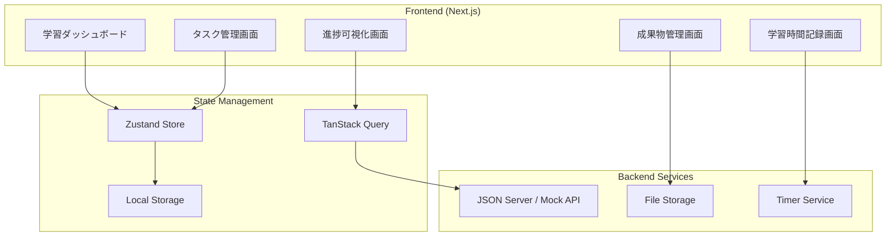
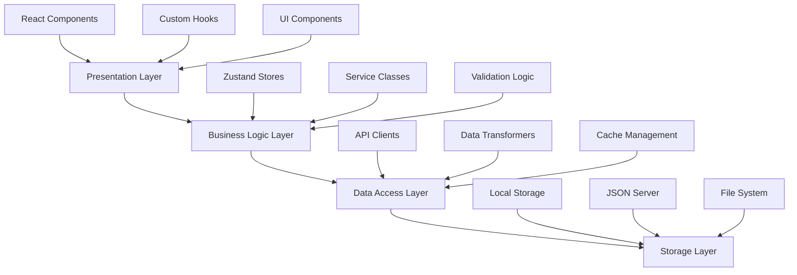

# 設計書

## 概要

学習進捗管理システムは、2025年フロントエンドエンジニア育成プランの学習者が効率的に進捗を管理し、目標達成をサポートするWebアプリケーションです。TypeScript + React + Next.jsを使用したモダンなSPAとして設計し、リアルタイムな進捗追跡と包括的な学習体験を提供します。

## アーキテクチャ

### システム全体構成



### レイヤー構成



## コンポーネントとインターフェース

### 主要コンポーネント構成

#### 1. ダッシュボードコンポーネント

```typescript
interface DashboardProps {
  userId: string;
}

interface DashboardData {
  currentPhase: Phase;
  overallProgress: number;
  recentActivities: Activity[];
  upcomingDeadlines: Task[];
  learningStreak: number;
}

const Dashboard: React.FC<DashboardProps> = ({ userId }) => {
  // 実装
};
```

#### 2. タスク管理コンポーネント

```typescript
interface TaskManagerProps {
  phaseId: string;
  onTaskUpdate: (taskId: string, status: TaskStatus) => void;
}

interface TaskListProps {
  tasks: Task[];
  onStatusChange: (taskId: string, status: TaskStatus) => void;
  onTaskClick: (task: Task) => void;
}

const TaskManager: React.FC<TaskManagerProps> = ({ phaseId, onTaskUpdate }) => {
  // 実装
};
```

#### 3. 進捗可視化コンポーネント

```typescript
interface ProgressVisualizationProps {
  data: ProgressData;
  timeRange: 'week' | 'month' | 'phase' | 'all';
  chartType: 'line' | 'bar' | 'pie';
}

interface ProgressChartProps {
  data: ChartData[];
  type: ChartType;
  height?: number;
  showLegend?: boolean;
}

const ProgressVisualization: React.FC<ProgressVisualizationProps> = (props) => {
  // 実装
};
```

### カスタムHooks設計

#### 1. 学習進捗管理Hook

```typescript
interface UseProgressOptions {
  userId: string;
  phaseId?: string;
  autoSave?: boolean;
}

interface UseProgressReturn {
  progress: ProgressData;
  updateTaskStatus: (taskId: string, status: TaskStatus) => void;
  calculatePhaseProgress: (phaseId: string) => number;
  getOverallProgress: () => number;
  loading: boolean;
  error: Error | null;
}

function useProgress(options: UseProgressOptions): UseProgressReturn {
  // 実装
}
```

#### 2. 学習時間記録Hook

```typescript
interface UseTimerOptions {
  taskId?: string;
  autoSave?: boolean;
  onSessionComplete?: (session: StudySession) => void;
}

interface UseTimerReturn {
  isRunning: boolean;
  elapsedTime: number;
  currentSession: StudySession | null;
  startTimer: (taskId?: string) => void;
  pauseTimer: () => void;
  stopTimer: () => void;
  resetTimer: () => void;
}

function useTimer(options: UseTimerOptions): UseTimerReturn {
  // 実装
}
```

#### 3. 成果物管理Hook

```typescript
interface UseArtifactsOptions {
  phaseId?: string;
  taskId?: string;
}

interface UseArtifactsReturn {
  artifacts: Artifact[];
  uploadArtifact: (file: File, metadata: ArtifactMetadata) => Promise<void>;
  deleteArtifact: (artifactId: string) => Promise<void>;
  updateArtifact: (artifactId: string, updates: Partial<Artifact>) => Promise<void>;
  generatePortfolio: () => Promise<PortfolioData>;
  loading: boolean;
  error: Error | null;
}

function useArtifacts(options: UseArtifactsOptions): UseArtifactsReturn {
  // 実装
}
```

## データモデル

### 主要エンティティ

#### 1. Phase（学習フェーズ）

```typescript
interface Phase {
  id: string;
  name: string;
  description: string;
  duration: number; // 週数
  order: number;
  prerequisites: string[]; // 前提フェーズID
  learningObjectives: string[];
  tasks: Task[];
  resources: Resource[];
  createdAt: Date;
  updatedAt: Date;
}
```

#### 2. Task（学習タスク）

```typescript
interface Task {
  id: string;
  phaseId: string;
  title: string;
  description: string;
  type: 'theory' | 'practice' | 'project' | 'assessment';
  status: 'not_started' | 'in_progress' | 'completed';
  priority: 'low' | 'medium' | 'high';
  estimatedHours: number;
  actualHours?: number;
  dueDate?: Date;
  dependencies: string[]; // 依存タスクID
  requirements: string[];
  artifacts: string[]; // 成果物ID
  createdAt: Date;
  updatedAt: Date;
}
```

#### 3. StudySession（学習セッション）

```typescript
interface StudySession {
  id: string;
  userId: string;
  taskId?: string;
  phaseId: string;
  startTime: Date;
  endTime?: Date;
  duration: number; // 分
  notes?: string;
  productivity: 1 | 2 | 3 | 4 | 5; // 集中度評価
  createdAt: Date;
}
```

#### 4. Artifact（成果物）

```typescript
interface Artifact {
  id: string;
  userId: string;
  taskId: string;
  phaseId: string;
  title: string;
  description?: string;
  type: 'code' | 'document' | 'design' | 'video' | 'other';
  fileUrl?: string;
  externalUrl?: string;
  tags: string[];
  isPublic: boolean;
  metadata: ArtifactMetadata;
  createdAt: Date;
  updatedAt: Date;
}

interface ArtifactMetadata {
  fileSize?: number;
  mimeType?: string;
  language?: string; // プログラミング言語
  framework?: string;
  difficulty: 'beginner' | 'intermediate' | 'advanced';
}
```

#### 5. Progress（進捗データ）

```typescript
interface Progress {
  id: string;
  userId: string;
  phaseId: string;
  taskId?: string;
  completedTasks: number;
  totalTasks: number;
  completionRate: number;
  totalStudyTime: number; // 分
  lastActivityAt: Date;
  streak: number; // 連続学習日数
  createdAt: Date;
  updatedAt: Date;
}
```

### 状態管理設計

#### Zustand Store構成

```typescript
// メインの学習進捗ストア
interface LearningStore {
  // State
  currentUser: User | null;
  phases: Phase[];
  currentPhase: Phase | null;
  tasks: Task[];
  progress: Progress[];
  studySessions: StudySession[];
  
  // Actions
  setCurrentUser: (user: User) => void;
  loadPhases: () => Promise<void>;
  setCurrentPhase: (phaseId: string) => void;
  updateTaskStatus: (taskId: string, status: TaskStatus) => void;
  addStudySession: (session: Omit<StudySession, 'id' | 'createdAt'>) => void;
  
  // Computed
  getCurrentPhaseProgress: () => number;
  getOverallProgress: () => number;
  getTotalStudyTime: () => number;
  getStreak: () => number;
}

// UI状態管理ストア
interface UIStore {
  // State
  sidebarOpen: boolean;
  currentView: 'dashboard' | 'tasks' | 'progress' | 'artifacts' | 'settings';
  theme: 'light' | 'dark';
  notifications: Notification[];
  
  // Actions
  toggleSidebar: () => void;
  setCurrentView: (view: UIStore['currentView']) => void;
  toggleTheme: () => void;
  addNotification: (notification: Omit<Notification, 'id' | 'timestamp'>) => void;
  removeNotification: (id: string) => void;
}

// タイマー専用ストア
interface TimerStore {
  // State
  isRunning: boolean;
  startTime: Date | null;
  elapsedTime: number;
  currentTaskId: string | null;
  sessions: StudySession[];
  
  // Actions
  startTimer: (taskId?: string) => void;
  pauseTimer: () => void;
  stopTimer: () => void;
  resetTimer: () => void;
  
  // Computed
  getFormattedTime: () => string;
  getTodaysTotalTime: () => number;
}
```

## エラーハンドリング

### エラー分類と処理戦略

#### 1. ネットワークエラー

```typescript
interface NetworkError extends Error {
  type: 'network';
  status?: number;
  retryable: boolean;
}

class ErrorHandler {
  static handleNetworkError(error: NetworkError): void {
    if (error.retryable) {
      // 自動リトライ機能
      this.scheduleRetry(error);
    } else {
      // ユーザーに通知
      this.showErrorNotification(error);
    }
  }
  
  static scheduleRetry(error: NetworkError, attempt = 1): void {
    const delay = Math.min(1000 * Math.pow(2, attempt), 30000);
    setTimeout(() => {
      // リトライ実行
    }, delay);
  }
}
```

#### 2. バリデーションエラー

```typescript
interface ValidationError extends Error {
  type: 'validation';
  field: string;
  value: any;
  constraint: string;
}

interface FormErrors {
  [field: string]: string[];
}

class ValidationHandler {
  static handleValidationErrors(errors: ValidationError[]): FormErrors {
    return errors.reduce((acc, error) => {
      if (!acc[error.field]) {
        acc[error.field] = [];
      }
      acc[error.field].push(error.message);
      return acc;
    }, {} as FormErrors);
  }
}
```

#### 3. アプリケーションエラー

```typescript
interface AppError extends Error {
  type: 'application';
  code: string;
  severity: 'low' | 'medium' | 'high' | 'critical';
  context?: Record<string, any>;
}

class AppErrorHandler {
  static handleError(error: AppError): void {
    // ログ記録
    this.logError(error);
    
    // 重要度に応じた処理
    switch (error.severity) {
      case 'critical':
        this.handleCriticalError(error);
        break;
      case 'high':
        this.handleHighSeverityError(error);
        break;
      default:
        this.handleLowSeverityError(error);
    }
  }
}
```

### エラーバウンダリ設計

```typescript
interface ErrorBoundaryState {
  hasError: boolean;
  error: Error | null;
  errorInfo: ErrorInfo | null;
}

class AppErrorBoundary extends React.Component<
  React.PropsWithChildren<{}>,
  ErrorBoundaryState
> {
  constructor(props: React.PropsWithChildren<{}>) {
    super(props);
    this.state = {
      hasError: false,
      error: null,
      errorInfo: null,
    };
  }

  static getDerivedStateFromError(error: Error): Partial<ErrorBoundaryState> {
    return {
      hasError: true,
      error,
    };
  }

  componentDidCatch(error: Error, errorInfo: ErrorInfo) {
    this.setState({
      errorInfo,
    });
    
    // エラー報告
    this.reportError(error, errorInfo);
  }

  render() {
    if (this.state.hasError) {
      return <ErrorFallback error={this.state.error} />;
    }

    return this.props.children;
  }
}
```

## テスト戦略

### テスト構成

#### 1. 単体テスト（Unit Tests）

```typescript
// Custom Hooks のテスト例
describe('useProgress', () => {
  it('should calculate phase progress correctly', () => {
    const { result } = renderHook(() => useProgress({ userId: 'test-user' }));
    
    act(() => {
      result.current.updateTaskStatus('task-1', 'completed');
    });
    
    expect(result.current.calculatePhaseProgress('phase-1')).toBe(25);
  });
  
  it('should handle error states', async () => {
    // エラーケースのテスト
  });
});

// コンポーネントのテスト例
describe('TaskManager', () => {
  it('should render tasks correctly', () => {
    render(<TaskManager phaseId="phase-1" onTaskUpdate={jest.fn()} />);
    
    expect(screen.getByText('Task 1')).toBeInTheDocument();
    expect(screen.getByText('Task 2')).toBeInTheDocument();
  });
  
  it('should handle task status updates', () => {
    const onTaskUpdate = jest.fn();
    render(<TaskManager phaseId="phase-1" onTaskUpdate={onTaskUpdate} />);
    
    fireEvent.click(screen.getByText('Complete'));
    
    expect(onTaskUpdate).toHaveBeenCalledWith('task-1', 'completed');
  });
});
```

#### 2. 統合テスト（Integration Tests）

```typescript
describe('Learning Progress Integration', () => {
  it('should update progress when task is completed', async () => {
    // 統合テストの実装
    const user = userEvent.setup();
    
    render(<App />);
    
    // タスクを完了
    await user.click(screen.getByTestId('task-1-complete'));
    
    // 進捗が更新されることを確認
    await waitFor(() => {
      expect(screen.getByTestId('progress-bar')).toHaveAttribute('aria-valuenow', '25');
    });
  });
});
```

#### 3. E2Eテスト（End-to-End Tests）

```typescript
// Playwright を使用したE2Eテスト例
test('complete learning workflow', async ({ page }) => {
  await page.goto('/dashboard');
  
  // フェーズを選択
  await page.click('[data-testid="phase-1"]');
  
  // タスクを開始
  await page.click('[data-testid="start-task-1"]');
  
  // タイマーを開始
  await page.click('[data-testid="start-timer"]');
  
  // タスクを完了
  await page.click('[data-testid="complete-task"]');
  
  // 進捗が更新されることを確認
  await expect(page.locator('[data-testid="progress-percentage"]')).toContainText('25%');
});
```

### テストデータ管理

```typescript
// テスト用のモックデータ
export const mockPhases: Phase[] = [
  {
    id: 'phase-1',
    name: 'TypeScript完全習得',
    description: 'TypeScript基礎から上級まで',
    duration: 12,
    order: 1,
    prerequisites: [],
    learningObjectives: ['型システムの理解', 'ジェネリクスの活用'],
    tasks: mockTasks,
    resources: mockResources,
    createdAt: new Date('2025-01-01'),
    updatedAt: new Date('2025-01-01'),
  },
];

export const mockTasks: Task[] = [
  {
    id: 'task-1',
    phaseId: 'phase-1',
    title: '型エラーの理解',
    description: 'TypeScriptの型エラーを理解し解決する',
    type: 'theory',
    status: 'not_started',
    priority: 'high',
    estimatedHours: 4,
    dueDate: new Date('2025-01-07'),
    dependencies: [],
    requirements: ['TypeScript基礎知識'],
    artifacts: [],
    createdAt: new Date('2025-01-01'),
    updatedAt: new Date('2025-01-01'),
  },
];
```

## パフォーマンス最適化

### 1. コンポーネント最適化

```typescript
// React.memo を使用した最適化
const TaskItem = React.memo<TaskItemProps>(({ task, onStatusChange }) => {
  const handleStatusChange = useCallback((status: TaskStatus) => {
    onStatusChange(task.id, status);
  }, [task.id, onStatusChange]);

  return (
    <div className="task-item">
      {/* コンポーネント内容 */}
    </div>
  );
});

// useMemo を使用した計算結果のキャッシュ
const ProgressChart: React.FC<ProgressChartProps> = ({ data, timeRange }) => {
  const chartData = useMemo(() => {
    return processChartData(data, timeRange);
  }, [data, timeRange]);

  const chartOptions = useMemo(() => {
    return generateChartOptions(chartData);
  }, [chartData]);

  return <Chart data={chartData} options={chartOptions} />;
};
```

### 2. データフェッチング最適化

```typescript
// TanStack Query を使用したキャッシュ戦略
const usePhaseData = (phaseId: string) => {
  return useQuery({
    queryKey: ['phase', phaseId],
    queryFn: () => fetchPhaseData(phaseId),
    staleTime: 5 * 60 * 1000, // 5分間キャッシュ
    cacheTime: 10 * 60 * 1000, // 10分間保持
    refetchOnWindowFocus: false,
  });
};

// 無限スクロールの実装
const useInfiniteArtifacts = (phaseId: string) => {
  return useInfiniteQuery({
    queryKey: ['artifacts', phaseId],
    queryFn: ({ pageParam = 0 }) => fetchArtifacts(phaseId, pageParam),
    getNextPageParam: (lastPage, pages) => {
      return lastPage.hasMore ? pages.length : undefined;
    },
  });
};
```

### 3. バンドルサイズ最適化

```typescript
// 動的インポートによるコード分割
const ProgressVisualization = lazy(() => import('./ProgressVisualization'));
const ArtifactManager = lazy(() => import('./ArtifactManager'));

// 条件付きインポート
const AdminPanel = lazy(() => 
  import('./AdminPanel').then(module => ({ default: module.AdminPanel }))
);

// Tree shaking の最適化
export { Dashboard } from './Dashboard';
export { TaskManager } from './TaskManager';
export type { DashboardProps, TaskManagerProps } from './types';
```

この設計書に基づいて、型安全で保守性の高い学習進捗管理システムを構築することができます。Next.js + TypeScript + Zustand + TanStack Queryの組み合わせにより、モダンで効率的なWebアプリケーションを実現します。