# 2025年フロントエンドエンジニア育成プラン
## フルスタック経験者向け包括的学習ガイド

---

## 📋 対象者プロフィール

- **経験レベル**: フルスタックエンジニア（2年経験）
- **目標**: フロントエンド特化スペシャリスト
- **重点領域**: React/Next.js、TypeScript、UI/UX、パフォーマンス最適化
- **学習アプローチ**: 理論と実践のバランス重視
- **育成期間**: 12ヶ月（順次進行型）

---

## 🎯 年間学習戦略

```mermaid
gantt
    title 2025年フロントエンドエンジニア育成プラン
    dateFormat  X
    axisFormat %d月

    section Phase 1: TypeScript完全習得
    TypeScript基礎固め           :1, 2
    状態管理ライブラリ統合       :2, 3
    
    section Phase 2: React生態系マスター
    React基礎・コンポーネント設計 :3, 4
    高度なReactパターン          :4, 5
    
    section Phase 3: Next.js実践開発
    Next.js基礎・App Router     :5, 6
    フルスタック開発            :6, 7
    
    section Phase 4: UI/UX・デザインシステム
    デザインシステム基礎        :7, 8
    高度なUI実装               :8, 9
    
    section Phase 5: パフォーマンス最適化
    パフォーマンス測定・分析    :9, 10
    高度な最適化・監視          :10, 11
    
    section Phase 6: 品質保証・運用
    テスト・CI/CD              :11, 12
    セキュリティ・ポートフォリオ :12, 13
```



---

## 📚 Phase 1: TypeScript完全習得（1-2ヶ月）

### 1ヶ月目: TypeScript基礎固め

**学習目標:**
- TypeScript型システムの完全理解
- 実践的なエラー解決能力の習得
- 最適な開発環境の構築

**主要学習項目:**
- [ ] 基本型システムと型注釈
- [ ] インターフェースとオブジェクト型
- [ ] ユニオン型と型ガード
- [ ] ジェネリクスの基礎と応用
- [ ] ユーティリティ型の活用
- [ ] tsconfig.json最適化
- [ ] 型エラーの読み方と解決方法

### 2ヶ月目: TypeScript + 状態管理ライブラリ

**学習目標:**
- Zustand、Redux Toolkitの型安全な実装
- 状態管理パターンの理解
- 実践的なアプリケーション開発

**主要学習項目:**
- [ ] Zustand + TypeScript統合
- [ ] Redux Toolkit + TypeScript統合
- [ ] 型安全な状態設計パターン
- [ ] ミドルウェアの型定義
- [ ] 非同期処理の型安全性
- [ ] 状態の正規化と型設計

**Phase 1 成果物:**
- [ ] 型エラー解決パターン集（20パターン以上）
- [ ] TypeScript設定テンプレート
- [ ] Zustand + TypeScript実装例集
- [ ] Redux Toolkit + TypeScript実装例集

---

## 📚 Phase 2: React生態系マスター（3-4ヶ月）

### 3ヶ月目: React基礎強化

**学習目標:**
- 型安全なReactコンポーネント設計
- カスタムHooksの開発
- Context APIの効果的な活用

**主要学習項目:**
- [ ] 型安全なコンポーネント設計パターン
- [ ] Props型定義のベストプラクティス
- [ ] Generic Componentsの実装
- [ ] カスタムHooks開発
- [ ] Context APIの型安全な実装
- [ ] React 19の新機能活用

### 4ヶ月目: 高度なReactパターン

**学習目標:**
- 高度なReactデザインパターンの習得
- エコシステムライブラリの統合
- 実践的なアプリケーション開発

**主要学習項目:**
- [ ] Compound Components パターン
- [ ] Render Props パターン
- [ ] Higher-Order Components (HOC)
- [ ] React Query/SWR統合
- [ ] React Hook Form + Zod
- [ ] エラーバウンダリ実装

**Phase 2 成果物:**
- [ ] 型安全Reactコンポーネントライブラリ（30コンポーネント）
- [ ] カスタムHooks集（25個）
- [ ] 高度なReactパターン実装集

---

## 📚 Phase 3: Next.js実践開発（5-6ヶ月）

### 5ヶ月目: Next.js基礎・App Router

**学習目標:**
- Next.js 15の完全理解
- App Routerの効果的な活用
- Server/Client Componentsの使い分け

**主要学習項目:**
- [ ] Next.js 15セットアップと設定
- [ ] App Routerの理解と実装
- [ ] Server Components vs Client Components
- [ ] ルーティングとレイアウト設計
- [ ] ミドルウェアの活用
- [ ] 環境変数とセキュリティ

### 6ヶ月目: フルスタック開発

**学習目標:**
- API Routesの設計と実装
- データベース統合
- 認証システムの構築

**主要学習項目:**
- [ ] API Routes設計
- [ ] データベース統合（Prisma/Drizzle）
- [ ] 認証システム（NextAuth.js）
- [ ] SSG/SSR/ISRの実装
- [ ] SEO最適化基礎
- [ ] デプロイメント（Vercel）

**Phase 3 成果物:**
- [ ] Next.js設定テンプレート集
- [ ] フルスタックブログプラットフォーム
- [ ] 認証システム実装例
- [ ] SSG/SSR/ISR実装パターン集

---

## 📚 Phase 4: UI/UX・デザインシステム（7-8ヶ月）

### 7ヶ月目: デザインシステム基礎

**学習目標:**
- Design Tokensの理解と実装
- Atomic Designによるコンポーネント設計
- Storybookの構築

**主要学習項目:**
- [ ] Design Tokens設計
- [ ] カラーシステムとタイポグラフィ
- [ ] Atomic Design実装
- [ ] Storybook構築
- [ ] アクセシビリティ基礎
- [ ] レスポンシブデザイン

### 8ヶ月目: 高度なUI実装

**学習目標:**
- アニメーションの実装
- 高度なレスポンシブデザイン
- Figma連携ワークフロー

**主要学習項目:**
- [ ] Framer Motionアニメーション
- [ ] CSS Grid/Flexbox高度活用
- [ ] モバイルファーストデザイン
- [ ] Figma連携ワークフロー
- [ ] デザインハンドオフ
- [ ] パフォーマンス考慮したUI

**Phase 4 成果物:**
- [ ] 包括的デザインシステム
- [ ] Storybookコンポーネントカタログ
- [ ] アニメーションライブラリ
- [ ] レスポンシブUIコンポーネント集

---

## 📚 Phase 5: パフォーマンス最適化（9-10ヶ月）

### 9ヶ月目: パフォーマンス測定・分析

**学習目標:**
- Core Web Vitalsの理解と最適化
- パフォーマンス測定ツールの活用
- Bundle Size分析と最適化

**主要学習項目:**
- [ ] Core Web Vitals（LCP, FID, CLS）
- [ ] Lighthouse活用
- [ ] Bundle Analyzer使用
- [ ] 画像最適化（Next.js Image）
- [ ] フォント最適化
- [ ] メモリリーク対策

### 10ヶ月目: 高度な最適化・監視

**学習目標:**
- レンダリング最適化
- コード分割戦略
- パフォーマンス監視システム

**主要学習項目:**
- [ ] React.memo、useMemo、useCallback
- [ ] 仮想化（react-window）
- [ ] コード分割（dynamic import）
- [ ] Service Worker活用
- [ ] パフォーマンス監視ダッシュボード
- [ ] 自動最適化ツール

**Phase 5 成果物:**
- [ ] パフォーマンス監視ダッシュボード
- [ ] 最適化チェックリスト
- [ ] パフォーマンス改善事例集

---

## 📚 Phase 6: 品質保証・運用（11-12ヶ月）

### 11ヶ月目: テスト・CI/CD

**学習目標:**
- テスト駆動開発の実践
- 包括的なテスト戦略
- CI/CDパイプラインの構築

**主要学習項目:**
- [ ] Jest/Vitest + Testing Library
- [ ] Playwright E2Eテスト
- [ ] ビジュアルリグレッションテスト
- [ ] GitHub Actions CI/CD
- [ ] 自動デプロイメント
- [ ] 品質ゲート設定

### 12ヶ月目: セキュリティ・ポートフォリオ完成

**学習目標:**
- セキュリティベストプラクティス
- アクセシビリティ完全対応
- 最終プロジェクト完成

**主要学習項目:**
- [ ] セキュリティベストプラクティス
- [ ] WCAG 2.1準拠
- [ ] 脆弱性対策
- [ ] 最終プロジェクト「ModernDash」完成
- [ ] プロフェッショナルポートフォリオ構築

**Phase 6 成果物:**
- [ ] 包括的テストスイート
- [ ] CI/CDパイプライン
- [ ] セキュリティ監査ツール
- [ ] 最終プロジェクト「ModernDash」
- [ ] プロフェッショナルポートフォリオ

---

## 🎯 月次評価指標

### 技術スキル評価（各月末）
- **理論理解度**: 概念の理解と説明能力（25%）
- **実装能力**: コードの品質と効率性（35%）
- **問題解決力**: エラー解決と最適化能力（25%）
- **応用力**: 学習内容の実践的活用（15%）

### 成果物品質評価
- **コード品質**: 可読性、保守性、型安全性
- **設計品質**: アーキテクチャ、拡張性、再利用性
- **ドキュメント**: README、コメント、設計書
- **テスト品質**: カバレッジ、テスト設計

---

## 🛠️ 推奨技術スタック

### コア技術
- **言語**: TypeScript 5.x
- **フレームワーク**: React 19, Next.js 15
- **スタイリング**: Tailwind CSS, CSS Modules
- **状態管理**: Zustand, React Query

### 開発ツール
- **エディタ**: VS Code + TypeScript拡張
- **バンドラー**: Vite, Next.js built-in
- **テスト**: Jest/Vitest, Playwright
- **CI/CD**: GitHub Actions
- **デプロイ**: Vercel, Netlify

### デザイン・UI
- **デザインシステム**: Radix UI, Headless UI
- **アニメーション**: Framer Motion
- **アイコン**: Lucide React, Heroicons
- **フォント**: Inter, Fira Code

---

## 📈 最終到達目標（12ヶ月後）

### 技術スキルレベル
- **TypeScript**: Expert（型レベルプログラミング、実践的活用）
- **React**: Specialist（高度なパターン、パフォーマンス最適化）
- **Next.js**: Professional（フルスタック開発、本番運用）
- **UI/UX**: Advanced（デザインシステム、アクセシビリティ）
- **Performance**: Expert（Core Web Vitals、最適化戦略）
- **Testing**: Professional（TDD、E2E、品質保証）

### キャリア目標
- フロントエンド技術リーダー
- UI/UXエンジニア
- パフォーマンスエンジニア
- フルスタック開発者（フロントエンド特化）

### 最終成果物
- **ModernDash**: 次世代SaaSダッシュボードアプリケーション
- **デザインシステム**: 再利用可能なコンポーネントライブラリ
- **技術ブログ**: 学習過程と知見の共有
- **OSS貢献**: オープンソースプロジェクトへの貢献

---

## 🎓 学習サポート体制

### 週次レビュー
- 学習進捗の確認
- 技術的な質問・相談
- 次週の目標設定
- コードレビュー

### 月次評価
- 成果物の品質評価
- スキルレベルの測定
- 学習計画の調整
- キャリア相談

### コミュニティ活用
- TypeScript/React コミュニティ参加
- 技術勉強会・もくもく会
- オンライン学習グループ
- メンター制度

---

## 🚀 学習開始準備

### 開発環境セットアップ
```bash
# Node.js 18+ のインストール
# VS Code + 必要な拡張機能
# Git設定
# GitHub アカウント設定
```

### 必要なアカウント
- GitHub（コード管理・ポートフォリオ）
- Vercel（デプロイメント）
- Figma（デザイン連携）
- Discord/Slack（コミュニティ参加）

### 学習時間配分
- **平日**: 2-3時間/日（理論学習・実装）
- **週末**: 4-6時間/日（プロジェクト開発・復習）
- **月間**: 60-80時間（目安）

---

## 📝 学習記録テンプレート

### 週次振り返り
```markdown
## Week X 振り返り

### 学習内容
- [ ] 完了した項目
- [ ] 進行中の項目
- [ ] 次週の予定

### 技術的な学び
- 新しく理解した概念
- 解決した問題
- 残っている課題

### 成果物
- 作成したコード・プロジェクト
- 学習ノート・記事

### 次週の目標
- 具体的な学習目標
- 作成予定の成果物
```

---

**🌟 2025年フロントエンドエンジニア育成プランで、理論と実践のバランスを保ちながら、現代的なフロントエンド開発スキルを体系的に習得しましょう！**

このプランを通じて、フルスタック経験を活かしながら、フロントエンド特化のスペシャリストとして成長できます。各Phaseで段階的にスキルを積み上げ、最終的には業界をリードする技術力を身につけることができます。