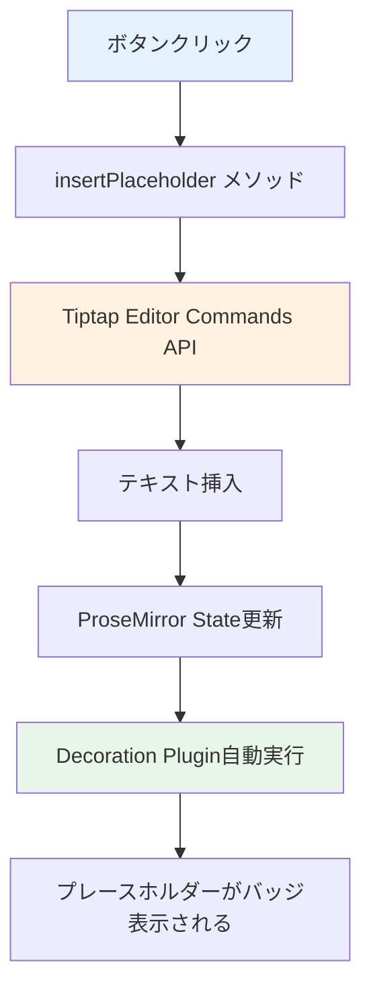

# プレースホルダー挿入ボタン機能 実装計画

## 📋 概要

現在の Tiptap エディタ実装を維持しつつ、エディタ外のボタンからプレースホルダーをカーソル位置に挿入する機能を追加します。

## 🎯 要件

- エディタ外にボタンを配置
- ボタンクリックで`#{sample}`や`#select{option1|option2}`をカーソル位置に挿入
- 挿入後、自動的に Decoration が適用される（既存の機能）
- 既存の ProseMirror Decoration の実装は変更しない

## 🏗️ アーキテクチャ



## 📝 実装詳細

### 1. コンポーネントの変更

#### ファイル: `template-creator.component.ts`

**追加するメソッド:**

```typescript
/**
 * プレースホルダーをカーソル位置に挿入
 * @param placeholderText 挿入するプレースホルダーテキスト（例: "#{sample}" または "#select{option1|option2}"）
 */
insertPlaceholder(placeholderText: string): void {
  if (!this.editor) return;

  // Tiptapのコマンドを使用してテキストを挿入
  this.editor
    .chain()
    .focus() // エディタにフォーカス
    .insertContent(placeholderText) // カーソル位置にテキスト挿入
    .run();
}

/**
 * テキスト型プレースホルダーを挿入
 */
insertTextPlaceholder(): void {
  this.insertPlaceholder('#{sample}');
}

/**
 * 選択型プレースホルダーを挿入
 */
insertSelectPlaceholder(): void {
  this.insertPlaceholder('#select{option1|option2|option3}');
}
```

**動作の流れ:**

1. ボタンクリック → `insertTextPlaceholder()` または `insertSelectPlaceholder()` 呼び出し
2. `insertPlaceholder()` メソッドが実行
3. `editor.chain().focus()` でエディタにフォーカス
4. `insertContent()` でカーソル位置にテキスト挿入
5. ProseMirror の state 更新により、Decoration プラグインが自動実行
6. 正規表現マッチングでプレースホルダーが検出され、バッジ表示

### 2. テンプレートの変更

#### ファイル: `template-creator.component.html`

**追加するボタン:**

```html
<div class="form-group">
  <label for="templateContent" class="form-label">
    テンプレート本文（リアルタイムプレビュー）
  </label>

  <!-- 挿入ボタン群 -->
  <div class="placeholder-buttons">
    <button
      type="button"
      class="btn btn-sm btn-outline-primary"
      (click)="insertTextPlaceholder()"
      title="テキスト型プレースホルダーを挿入"
    >
      <span class="icon">📝</span> テキスト型を挿入
    </button>
    <button
      type="button"
      class="btn btn-sm btn-outline-success"
      (click)="insertSelectPlaceholder()"
      title="選択型プレースホルダーを挿入"
    >
      <span class="icon">📋</span> 選択型を挿入
    </button>
  </div>

  <tiptap-editor [editor]="editor" class="tiptap-editor"></tiptap-editor>

  <div class="help-text">
    テキスト入力型: <code>#&#123;プレースホルダー名&#125;</code><br />
    選択型: <code>#select&#123;選択肢1|選択肢2|選択肢3&#125;</code>
  </div>
</div>
```

### 3. スタイルの追加

#### ファイル: `template-creator.component.css`

```css
/* プレースホルダー挿入ボタン群 */
.placeholder-buttons {
  display: flex;
  gap: 0.5rem;
  margin-bottom: 0.5rem;
}

.btn-sm {
  padding: 0.375rem 0.75rem;
  font-size: 0.875rem;
}

.btn-outline-primary {
  color: var(--primary);
  border: 1px solid var(--primary);
  background-color: transparent;
}

.btn-outline-primary:hover {
  color: white;
  background-color: var(--primary);
}

.btn-outline-success {
  color: var(--secondary);
  border: 1px solid var(--secondary);
  background-color: transparent;
}

.btn-outline-success:hover {
  color: white;
  background-color: var(--secondary);
}

.placeholder-buttons .icon {
  margin-right: 0.25rem;
}
```

## 🔧 技術的な詳細

### Tiptap Commands API

Tiptap は強力なコマンドチェーン API を提供しています：

```typescript
editor
  .chain() // コマンドチェーン開始
  .focus() // エディタにフォーカス（カーソル位置を保持）
  .insertContent() // コンテンツ挿入
  .run(); // コマンド実行
```

**主要なメソッド:**

- `focus()`: エディタにフォーカスし、最後のカーソル位置を復元
- `insertContent(content)`: カーソル位置にコンテンツを挿入
- `run()`: チェーンされたコマンドを実行

### 自動 Decoration 適用の仕組み

1. `insertContent()` でテキストが挿入される
2. ProseMirror のドキュメント state が更新される
3. 既存の Decoration プラグインの`decorations(state)`が自動的に呼ばれる
4. 正規表現で新しく挿入されたプレースホルダーを検出
5. Decoration を適用してバッジ表示

**重要:** 既存のプラグインコードは一切変更不要！

## 📊 実装の影響範囲

### 変更が必要なファイル

1. ✏️ `template-creator.component.ts` - メソッド追加
2. ✏️ `template-creator.component.html` - ボタン追加
3. ✏️ `template-creator.component.css` - スタイル追加

### 変更不要なファイル

- ✅ `placeholder-input-handler.extension.ts` - そのまま使用
- ✅ その他のサービスやモデル

## 🎨 UI/UX 設計

### ボタン配置

```
┌─────────────────────────────────────────┐
│ テンプレート本文（リアルタイムプレビュー）│
├─────────────────────────────────────────┤
│ [📝 テキスト型を挿入] [📋 選択型を挿入]  │
├─────────────────────────────────────────┤
│                                         │
│  こんにちは、#{sample}さん              │
│                                         │
│  ▌← カーソル                            │
│                                         │
└─────────────────────────────────────────┘
```

### ユーザーフロー

1. ユーザーがエディタ内でカーソルを配置
2. 「テキスト型を挿入」ボタンをクリック
3. カーソル位置に`#{sample}`が挿入される
4. 即座に青いバッジとして表示される
5. ユーザーは`sample`部分を編集可能

## 🧪 テストシナリオ

### 基本機能テスト

1. **空のエディタに挿入**

   - 操作: 空のエディタで「テキスト型を挿入」クリック
   - 期待: `#{sample}`が挿入され、青いバッジ表示

2. **テキスト中間に挿入**

   - 操作: "こんにちは、" の後にカーソルを置いて挿入
   - 期待: "こんにちは、#{sample}" となり、バッジ表示

3. **複数挿入**

   - 操作: テキスト型と選択型を連続で挿入
   - 期待: 両方が正しくバッジ表示される

4. **選択型の挿入**
   - 操作: 「選択型を挿入」クリック
   - 期待: `#select{option1|option2|option3}`が緑のバッジ表示

### エッジケーステスト

1. **エディタ未フォーカス時**

   - 操作: エディタ外をクリック後、ボタンクリック
   - 期待: エディタにフォーカスし、最後のカーソル位置に挿入

2. **テキスト選択中**

   - 操作: テキストを選択した状態でボタンクリック
   - 期待: 選択範囲が置き換えられる

3. **連続クリック**
   - 操作: ボタンを素早く複数回クリック
   - 期待: クリック回数分のプレースホルダーが挿入される

## 🚀 実装手順

### Step 1: コンポーネントメソッド追加

- [ ] `insertPlaceholder()` メソッドを実装
- [ ] `insertTextPlaceholder()` メソッドを実装
- [ ] `insertSelectPlaceholder()` メソッドを実装

### Step 2: テンプレート更新

- [ ] ボタン群の HTML を追加
- [ ] イベントハンドラーをバインド

### Step 3: スタイリング

- [ ] ボタンのスタイルを追加
- [ ] レスポンシブ対応を確認

### Step 4: テスト

- [ ] 基本機能テストを実施
- [ ] エッジケーステストを実施
- [ ] ブラウザ互換性確認

## 📚 参考資料

### Tiptap Commands API

- [公式ドキュメント](https://tiptap.dev/api/commands)
- `insertContent()`: テキスト挿入
- `focus()`: エディタフォーカス
- `chain()`: コマンドチェーン

### ProseMirror Concepts

- Decoration は自動的に再計算される
- State 更新時にプラグインが再実行される
- カーソル位置は`Selection`オブジェクトで管理

## 💡 将来的な拡張案

### 優先度: 中

- [ ] カスタムプレースホルダー名の入力ダイアログ
- [ ] よく使うプレースホルダーのテンプレート
- [ ] キーボードショートカット対応

### 優先度: 低

- [ ] ドラッグ&ドロップでプレースホルダー挿入
- [ ] プレースホルダーのプレビューポップアップ
- [ ] 挿入履歴の記録

## ✅ 完了条件

- [x] 要件定義完了
- [ ] コード実装完了
- [ ] テスト完了
- [ ] ドキュメント更新完了

---

**作成日**: 2025-12-01  
**最終更新**: 2025-12-01
