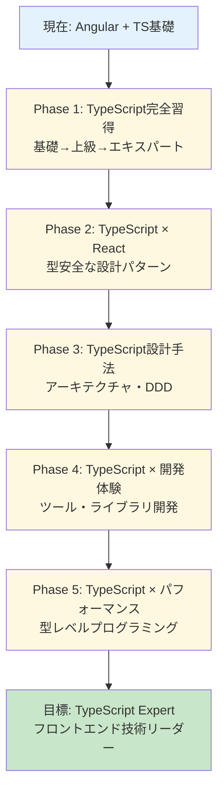
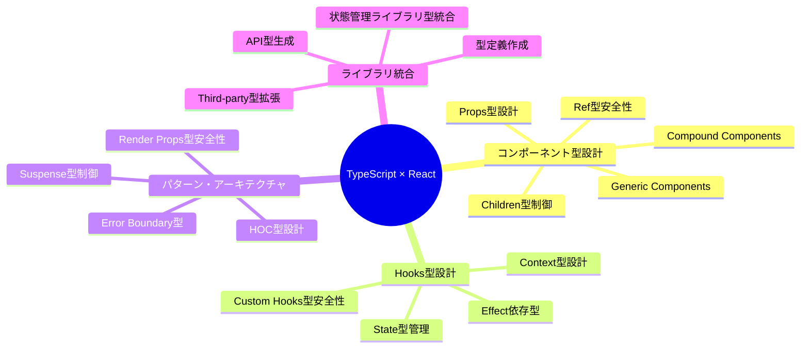

# 2025 年フロントエンドエンジニア育成プラン（TypeScript 重点版）

## 📋 対象者プロフィール

- **基盤経験**: JavaScript(ES6+) + jQuery + Slim PHP (2 年)
- **現在スキル**: Angular + TypeScript 基礎 (3 ヶ月)
- **目標レベル**: TypeScript/React 特化の中堅フロントエンドエンジニア
- **育成期間**: 12 ヶ月（学習中心）
- **重点領域**: TypeScript expert レベル、React 生態系、UI/UX、パフォーマンス最適化

## 🎯 育成戦略概要



## 📚 Phase 1: TypeScript 完全習得（1-3 ヶ月）

### 🎯 目標

Angular 経験の TypeScript 基礎から、エキスパートレベルまでの体系的学習

### 📅 学習スケジュール

```mermaid
gantt
    title Phase 1: TypeScript完全習得スケジュール
    dateFormat  X
    axisFormat %d週

    section 基礎固め（既存資料活用）
    型エラーの完全理解         :1, 3
    thisキーワード詳細理解     :2, 4
    Enumベストプラクティス     :3, 5

    section 中級TypeScript
    ジェネリクス完全理解       :4, 6
    ユーティリティ型活用       :5, 7
    条件付き型・マップ型       :6, 8

    section 上級TypeScript
    テンプレートリテラル型     :7, 9
    型レベルプログラミング     :8, 10
    TypeScript Compiler API   :9, 11

    section 実践応用
    ライブラリ型定義作成       :10, 12
    型パズル解決               :11, 12
```



### 📖 詳細学習内容

#### 1.1 基礎固め（既存資料の深掘り活用）

**活用する既存資料**:

- `typescript/type errorの見方.md`
- `typescript/thisについて.md`
- `typescript/Enumのペストプラクティス.md`

```typescript
// 既存の「型エラーの見方」を活用した実践的学習
// 複雑なエラーの分析・解決パターン習得

// 「thisについて」の高度な活用
interface Calculator {
  value: number;
  add(this: Calculator, x: number): Calculator;
  multiply(this: Calculator, x: number): Calculator;
}

// 「Enumベストプラクティス」の実装パターン
const UserRole = {
  ADMIN: "ADMIN",
  EDITOR: "EDITOR",
  VIEWER: "VIEWER",
} as const;

type UserRole = (typeof UserRole)[keyof typeof UserRole];
```

#### 1.2 中級 TypeScript（実践的な型システム）

```typescript
// ジェネリクス完全理解
interface ApiResponse<T> {
  data: T;
  meta: {
    total: number;
    page: number;
    hasNext: boolean;
  };
  errors?: string[];
}

function fetchApi<T>(url: string): Promise<ApiResponse<T>> {
  // 型安全なAPI関数
}

// ユーティリティ型の組み合わせ
type CreateUserRequest = Pick<User, "name" | "email" | "role">;
type UpdateUserRequest = Partial<Pick<User, "name" | "email">> &
  Required<Pick<User, "id">>;

// 条件付き型の実践
type NonNullable<T> = T extends null | undefined ? never : T;
type FunctionPropertyNames<T> = {
  [K in keyof T]: T[K] extends Function ? K : never;
}[keyof T];

// マップ型の活用
type Readonly<T> = {
  readonly [P in keyof T]: T[P];
};

type Optional<T, K extends keyof T> = Omit<T, K> & Partial<Pick<T, K>>;
```

#### 1.3 上級 TypeScript（型レベルプログラミング）

```typescript
// テンプレートリテラル型
type EventName<T extends string> = `on${Capitalize<T>}`;
type MouseEvents = "click" | "hover" | "focus";
type MouseEventHandlers = EventName<MouseEvents>;
// Result: "onClick" | "onHover" | "onFocus"

type CSSProperty = `--${string}`;
type ThemeProperty = `theme-${string}`;

// 再帰的な型定義
type DeepReadonly<T> = {
  readonly [P in keyof T]: T[P] extends object ? DeepReadonly<T[P]> : T[P];
};

type DeepPartial<T> = {
  [P in keyof T]?: T[P] extends object ? DeepPartial<T[P]> : T[P];
};

// 高度な条件付き型
type ReturnTypeOfPromise<T> = T extends Promise<infer U> ? U : T;
type ArrayElementType<T> = T extends (infer U)[] ? U : never;

// 型パズル・チャレンジ
// type-challenges の上級問題
type Reverse<T extends any[]> = T extends [...infer Rest, infer Last]
  ? [Last, ...Reverse<Rest>]
  : [];

type Length<T extends readonly any[]> = T["length"];
```

#### 1.4 TypeScript Compiler API & ツール開発

```typescript
// ESLintルール作成例
import { ESLintUtils } from "@typescript-eslint/utils";

const createRule = ESLintUtils.RuleCreator(
  (name) => `https://example.com/rule/${name}`
);

export const noImplicitAnyRule = createRule({
  name: "no-implicit-any",
  meta: {
    type: "problem",
    docs: {
      description: "Disallow implicit any types",
    },
    messages: {
      implicitAny: "Implicit any type detected",
    },
    schema: [],
  },
  defaultOptions: [],
  create(context) {
    // ルール実装
  },
});

// TypeScript Transformer作成
import * as ts from "typescript";

export function transformerFactory(context: ts.TransformationContext) {
  return (rootNode: ts.SourceFile) => {
    function visit(node: ts.Node): ts.Node {
      // AST変換ロジック
      return ts.visitEachChild(node, visit, context);
    }
    return ts.visitNode(rootNode, visit);
  };
}
```

### 🎯 Phase 1 成果物

- [ ] 型エラー解決パターン集（20 パターン以上）
- [ ] TypeScript 設定ベストプラクティス集
- [ ] 型パズル 50 問完全解決
- [ ] ESLint カスタムルール 3 個以上作成
- [ ] TypeScript 変換ツール作成

---

## ⚛️ Phase 2: TypeScript × React（2-4 ヶ月）

### 🎯 目標

TypeScript と React を組み合わせた型安全な開発手法の習得

### 🗺️ 学習マップ



### 📖 詳細学習内容

#### 2.1 React Component の型設計パターン

```typescript
// Generic Component Pattern
interface TableProps<T extends Record<string, any>> {
  data: T[];
  columns: Array<{
    key: keyof T;
    title: string;
    width?: number;
    render?: (value: T[keyof T], record: T, index: number) => React.ReactNode;
    sorter?: (a: T[keyof T], b: T[keyof T]) => number;
  }>;
  onRowClick?: (record: T, index: number) => void;
  loading?: boolean;
}

function Table<T extends Record<string, any>>({
  data,
  columns,
  onRowClick,
  loading = false,
}: TableProps<T>): JSX.Element {
  // 型安全なテーブルコンポーネント
  return (
    <table>
      <thead>
        {columns.map((column) => (
          <th key={String(column.key)}>{column.title}</th>
        ))}
      </thead>
      <tbody>
        {data.map((record, index) => (
          <tr key={index} onClick={() => onRowClick?.(record, index)}>
            {columns.map((column) => (
              <td key={String(column.key)}>
                {column.render
                  ? column.render(record[column.key], record, index)
                  : String(record[column.key])}
              </td>
            ))}
          </tr>
        ))}
      </tbody>
    </table>
  );
}

// 使用例（型推論が効く）
const users: User[] = [
  /* ... */
];
<Table
  data={users}
  columns={[
    { key: "name", title: "Name" },
    { key: "email", title: "Email" },
    {
      key: "role",
      title: "Role",
      render: (role) => <Badge variant={role}>{role}</Badge>, // roleの型が推論される
    },
  ]}
  onRowClick={(user) => console.log(user.id)} // userの型が推論される
/>;

// Compound Component Pattern
interface SelectContextValue<T> {
  value: T | null;
  onChange: (value: T) => void;
  isOpen: boolean;
  toggle: () => void;
}

function createSelectContext<T>() {
  return React.createContext<SelectContextValue<T> | null>(null);
}

interface SelectProps<T> {
  value: T | null;
  onChange: (value: T) => void;
  children: React.ReactNode;
}

function Select<T>({ value, onChange, children }: SelectProps<T>) {
  const [isOpen, setIsOpen] = React.useState(false);
  const Context = React.useMemo(() => createSelectContext<T>(), []);

  const contextValue: SelectContextValue<T> = {
    value,
    onChange,
    isOpen,
    toggle: () => setIsOpen((prev) => !prev),
  };

  return (
    <Context.Provider value={contextValue}>
      <div className="select">{children}</div>
    </Context.Provider>
  );
}

// 型安全なRef転送
interface ButtonProps extends React.ButtonHTMLAttributes<HTMLButtonElement> {
  variant?: "primary" | "secondary" | "danger";
  size?: "sm" | "md" | "lg";
}

const Button = React.forwardRef<HTMLButtonElement, ButtonProps>(
  ({ variant = "primary", size = "md", className, ...props }, ref) => {
    return (
      <button
        ref={ref}
        className={`btn btn-${variant} btn-${size} ${className || ""}`}
        {...props}
      />
    );
  }
);

Button.displayName = "Button";
```

#### 2.2 Custom Hooks の型設計

```typescript
// Generic Custom Hook
interface UseApiResult<T> {
  data: T | null;
  loading: boolean;
  error: Error | null;
  refetch: () => Promise<void>;
}

function useApi<T>(
  fetcher: () => Promise<T>,
  deps: React.DependencyList = []
): UseApiResult<T> {
  const [data, setData] = React.useState<T | null>(null);
  const [loading, setLoading] = React.useState(true);
  const [error, setError] = React.useState<Error | null>(null);

  const fetchData = React.useCallback(async () => {
    try {
      setLoading(true);
      setError(null);
      const result = await fetcher();
      setData(result);
    } catch (err) {
      setError(err instanceof Error ? err : new Error(String(err)));
    } finally {
      setLoading(false);
    }
  }, deps);

  React.useEffect(() => {
    fetchData();
  }, [fetchData]);

  return { data, loading, error, refetch: fetchData };
}

// Overloaded Hook Pattern
function useLocalStorage<T>(key: string): [T | null, (value: T) => void];
function useLocalStorage<T>(
  key: string,
  defaultValue: T
): [T, (value: T) => void];
function useLocalStorage<T>(key: string, defaultValue?: T) {
  const [storedValue, setStoredValue] = React.useState<T | null>(() => {
    try {
      const item = window.localStorage.getItem(key);
      return item ? JSON.parse(item) : defaultValue ?? null;
    } catch (error) {
      console.error(`Error reading localStorage key "${key}":`, error);
      return defaultValue ?? null;
    }
  });

  const setValue = React.useCallback(
    (value: T) => {
      try {
        setStoredValue(value);
        window.localStorage.setItem(key, JSON.stringify(value));
      } catch (error) {
        console.error(`Error setting localStorage key "${key}":`, error);
      }
    },
    [key]
  );

  return [storedValue, setValue] as const;
}

// 型安全なContext Hook
interface ThemeContextValue {
  theme: "light" | "dark";
  toggleTheme: () => void;
  colors: Record<string, string>;
}

const ThemeContext = React.createContext<ThemeContextValue | null>(null);

function useTheme(): ThemeContextValue {
  const context = React.useContext(ThemeContext);
  if (!context) {
    throw new Error("useTheme must be used within ThemeProvider");
  }
  return context;
}

// イベントハンドラーの型安全性
function useEventListener<K extends keyof WindowEventMap>(
  eventName: K,
  handler: (event: WindowEventMap[K]) => void,
  element: Window | null = window
): void;
function useEventListener<K extends keyof DocumentEventMap>(
  eventName: K,
  handler: (event: DocumentEventMap[K]) => void,
  element: Document
): void;
function useEventListener<K extends keyof HTMLElementEventMap>(
  eventName: K,
  handler: (event: HTMLElementEventMap[K]) => void,
  element: HTMLElement | null
): void;
function useEventListener(
  eventName: string,
  handler: (event: Event) => void,
  element: Window | Document | HTMLElement | null = window
) {
  const savedHandler = React.useRef(handler);

  React.useEffect(() => {
    savedHandler.current = handler;
  }, [handler]);

  React.useEffect(() => {
    if (!element?.addEventListener) return;

    const eventListener = (event: Event) => savedHandler.current(event);
    element.addEventListener(eventName, eventListener);

    return () => {
      element.removeEventListener(eventName, eventListener);
    };
  }, [eventName, element]);
}
```

#### 2.3 状態管理との型統合

```typescript
// Zustand + TypeScript
interface UserStore {
  users: User[];
  selectedUser: User | null;
  loading: boolean;
  error: string | null;

  // Actions
  fetchUsers: () => Promise<void>;
  addUser: (user: Omit<User, "id" | "createdAt">) => Promise<void>;
  updateUser: (id: string, updates: Partial<User>) => Promise<void>;
  deleteUser: (id: string) => Promise<void>;
  selectUser: (user: User | null) => void;
  clearError: () => void;
}

const useUserStore = create<UserStore>((set, get) => ({
  users: [],
  selectedUser: null,
  loading: false,
  error: null,

  fetchUsers: async () => {
    set({ loading: true, error: null });
    try {
      const users = await userApi.fetchUsers();
      set({ users, loading: false });
    } catch (error) {
      set({
        error: error instanceof Error ? error.message : "Unknown error",
        loading: false,
      });
    }
  },

  addUser: async (userData) => {
    set({ loading: true, error: null });
    try {
      const newUser = await userApi.createUser(userData);
      set((state) => ({
        users: [...state.users, newUser],
        loading: false,
      }));
    } catch (error) {
      set({
        error: error instanceof Error ? error.message : "Failed to add user",
        loading: false,
      });
    }
  },

  updateUser: async (id, updates) => {
    set({ loading: true, error: null });
    try {
      const updatedUser = await userApi.updateUser(id, updates);
      set((state) => ({
        users: state.users.map((user) => (user.id === id ? updatedUser : user)),
        selectedUser:
          state.selectedUser?.id === id ? updatedUser : state.selectedUser,
        loading: false,
      }));
    } catch (error) {
      set({
        error: error instanceof Error ? error.message : "Failed to update user",
        loading: false,
      });
    }
  },

  deleteUser: async (id) => {
    set({ loading: true, error: null });
    try {
      await userApi.deleteUser(id);
      set((state) => ({
        users: state.users.filter((user) => user.id !== id),
        selectedUser: state.selectedUser?.id === id ? null : state.selectedUser,
        loading: false,
      }));
    } catch (error) {
      set({
        error: error instanceof Error ? error.message : "Failed to delete user",
        loading: false,
      });
    }
  },

  selectUser: (user) => set({ selectedUser: user }),
  clearError: () => set({ error: null }),
}));

// TanStack Query + TypeScript
interface UseUsersQueryOptions {
  enabled?: boolean;
  refetchInterval?: number;
}

function useUsersQuery(options: UseUsersQueryOptions = {}) {
  return useQuery({
    queryKey: ["users"] as const,
    queryFn: (): Promise<User[]> => userApi.fetchUsers(),
    ...options,
  });
}

function useUserQuery(id: string) {
  return useQuery({
    queryKey: ["user", id] as const,
    queryFn: (): Promise<User> => userApi.fetchUser(id),
    enabled: !!id,
  });
}

function useCreateUserMutation() {
  const queryClient = useQueryClient();

  return useMutation({
    mutationFn: (userData: Omit<User, "id" | "createdAt">) =>
      userApi.createUser(userData),
    onSuccess: (newUser) => {
      // キャッシュ更新
      queryClient.setQueryData(["users"], (oldUsers: User[] | undefined) =>
        oldUsers ? [...oldUsers, newUser] : [newUser]
      );

      // 個別ユーザーキャッシュに追加
      queryClient.setQueryData(["user", newUser.id], newUser);
    },
    onError: (error) => {
      console.error("Failed to create user:", error);
    },
  });
}

// React Hook Form + Zod
const userSchema = z.object({
  name: z.string().min(1, "Name is required").max(100),
  email: z.string().email("Invalid email format"),
  role: z.enum(["admin", "editor", "viewer"]),
  profile: z
    .object({
      bio: z.string().optional(),
      avatar: z.string().url().optional(),
    })
    .optional(),
});

type UserFormData = z.infer<typeof userSchema>;

function UserForm({
  initialData,
  onSubmit,
}: {
  initialData?: Partial<UserFormData>;
  onSubmit: (data: UserFormData) => Promise<void>;
}) {
  const {
    register,
    handleSubmit,
    formState: { errors, isSubmitting },
    setError,
    reset,
  } = useForm<UserFormData>({
    resolver: zodResolver(userSchema),
    defaultValues: initialData,
  });

  const onSubmitHandler = async (data: UserFormData) => {
    try {
      await onSubmit(data);
      reset();
    } catch (error) {
      if (error instanceof Error) {
        setError("root", { message: error.message });
      }
    }
  };

  return (
    <form onSubmit={handleSubmit(onSubmitHandler)}>
      <input
        {...register("name")}
        placeholder="Name"
        aria-invalid={errors.name ? "true" : "false"}
      />
      {errors.name && <span role="alert">{errors.name.message}</span>}

      <input
        {...register("email")}
        type="email"
        placeholder="Email"
        aria-invalid={errors.email ? "true" : "false"}
      />
      {errors.email && <span role="alert">{errors.email.message}</span>}

      <select {...register("role")}>
        <option value="viewer">Viewer</option>
        <option value="editor">Editor</option>
        <option value="admin">Admin</option>
      </select>
      {errors.role && <span role="alert">{errors.role.message}</span>}

      <button type="submit" disabled={isSubmitting}>
        {isSubmitting ? "Submitting..." : "Submit"}
      </button>

      {errors.root && (
        <div role="alert" className="error">
          {errors.root.message}
        </div>
      )}
    </form>
  );
}
```

### 🎯 Phase 2 成果物

- [ ] 型安全な React コンポーネントライブラリ（20 コンポーネント以上）
- [ ] カスタム Hooks 集（15 個以上）
- [ ] 状態管理パターン実装集
- [ ] フォームバリデーション型安全システム
- [ ] Angular→React 移行ガイド

---

## 🏗️ Phase 3: TypeScript 設計手法（3-5 ヶ月）

### 🎯 目標

アーキテクチャレベルでの TypeScript 活用と Domain Driven Design 実装

### 📖 詳細学習内容

#### 3.1 Domain Driven Design + TypeScript

```typescript
// Value Object Pattern
abstract class ValueObject<T> {
  protected readonly _value: T;

  constructor(value: T) {
    this._value = Object.freeze(value);
  }

  public equals(other: ValueObject<T>): boolean {
    return JSON.stringify(this._value) === JSON.stringify(other._value);
  }

  public get value(): T {
    return this._value;
  }
}

// Email Value Object
class Email extends ValueObject<string> {
  private constructor(value: string) {
    super(value);
  }

  static create(value: string): Result<Email, EmailError> {
    if (!value) {
      return Err(new EmailError("Email cannot be empty"));
    }

    const emailRegex = /^[^\s@]+@[^\s@]+\.[^\s@]+$/;
    if (!emailRegex.test(value)) {
      return Err(new EmailError("Invalid email format"));
    }

    return Ok(new Email(value));
  }

  public getDomain(): string {
    return this._value.split("@")[1];
  }
}

class EmailError extends Error {
  constructor(message: string) {
    super(message);
    this.name = "EmailError";
  }
}

// Entity Pattern with TypeScript
abstract class Entity<T> {
  protected readonly _id: T;

  constructor(id: T) {
    this._id = id;
  }

  public get id(): T {
    return this._id;
  }

  public equals(other: Entity<T>): boolean {
    return this._id === other._id;
  }
}

// User Entity
interface UserProps {
  email: Email;
  name: string;
  role: UserRole;
  profile?: UserProfile;
  createdAt: Date;
  updatedAt: Date;
}

class User extends Entity<UserId> {
  private constructor(id: UserId, private props: UserProps) {
    super(id);
  }

  static create(
    props: Omit<UserProps, "createdAt" | "updatedAt">
  ): Result<User, UserError> {
    const now = new Date();
    const userProps: UserProps = {
      ...props,
      createdAt: now,
      updatedAt: now,
    };

    return Ok(new User(UserId.generate(), userProps));
  }

  static fromPersistence(id: UserId, props: UserProps): User {
    return new User(id, props);
  }

  public updateEmail(email: Email): Result<void, UserError> {
    if (this.props.email.equals(email)) {
      return Err(new UserError("Email is already set to this value"));
    }

    this.props.email = email;
    this.props.updatedAt = new Date();
    return Ok(undefined);
  }

  public updateProfile(profile: UserProfile): void {
    this.props.profile = profile;
    this.props.updatedAt = new Date();
  }

  // Getters
  public get email(): Email {
    return this.props.email;
  }

  public get name(): string {
    return this.props.name;
  }

  public get role(): UserRole {
    return this.props.role;
  }

  public get profile(): UserProfile | undefined {
    return this.props.profile;
  }

  public get createdAt(): Date {
    return this.props.createdAt;
  }

  public get updatedAt(): Date {
    return this.props.updatedAt;
  }

  // Domain Methods
  public canEdit(resource: Resource): boolean {
    return this.props.role === "admin" || resource.ownerId.equals(this._id);
  }

  public hasPermission(permission: Permission): boolean {
    const rolePermissions = {
      admin: ["read", "write", "delete"],
      editor: ["read", "write"],
      viewer: ["read"],
    };

    return rolePermissions[this.props.role].includes(permission);
  }
}
```

#### 3.2 Clean Architecture + TypeScript

```typescript
// Repository Pattern
interface UserRepository {
  findById(id: UserId): Promise<Option<User>>;
  findByEmail(email: Email): Promise<Option<User>>;
  save(user: User): Promise<Result<void, SaveError>>;
  delete(id: UserId): Promise<Result<void, DeleteError>>;
  findAll(criteria?: UserSearchCriteria): Promise<User[]>;
}

// Use Case Pattern
interface CreateUserRequest {
  name: string;
  email: string;
  role: UserRole;
  profile?: {
    bio?: string;
    avatar?: string;
  };
}

interface CreateUserResponse {
  user: User;
}

class CreateUserUseCase {
  constructor(
    private userRepository: UserRepository,
    private emailService: EmailService,
    private logger: Logger
  ) {}

  async execute(
    request: CreateUserRequest
  ): Promise<Result<CreateUserResponse, CreateUserError>> {
    try {
      // 1. バリデーション
      const emailResult = Email.create(request.email);
      if (emailResult.isErr()) {
        return Err(
          new CreateUserError(`Invalid email: ${emailResult.error.message}`)
        );
      }

      // 2. ビジネスルールチェック
      const existingUser = await this.userRepository.findByEmail(
        emailResult.value
      );
      if (existingUser.isSome()) {
        return Err(new CreateUserError("User with this email already exists"));
      }

      // 3. ドメインオブジェクト作成
      const userResult = User.create({
        email: emailResult.value,
        name: request.name,
        role: request.role,
        profile: request.profile
          ? UserProfile.create(request.profile)
          : undefined,
      });

      if (userResult.isErr()) {
        return Err(
          new CreateUserError(
            `Failed to create user: ${userResult.error.message}`
          )
        );
      }

      // 4. 永続化
      const saveResult = await this.userRepository.save(userResult.value);
      if (saveResult.isErr()) {
        return Err(
          new CreateUserError(
            `Failed to save user: ${saveResult.error.message}`
          )
        );
      }

      // 5. サイドエフェクト
      await this.emailService.sendWelcomeEmail(userResult.value.email);
      this.logger.info(`User created: ${userResult.value.id.value}`);

      return Ok({ user: userResult.value });
    } catch (error) {
      this.logger.error("Unexpected error in CreateUserUseCase", error);
      return Err(new CreateUserError("An unexpected error occurred"));
    }
  }
}

// Application Service (Facade)
class UserApplicationService {
  constructor(
    private createUserUseCase: CreateUserUseCase,
    private updateUserUseCase: UpdateUserUseCase,
    private deleteUserUseCase: DeleteUserUseCase,
    private getUserUseCase: GetUserUseCase
  ) {}

  async createUser(
    request: CreateUserRequest
  ): Promise<Result<CreateUserResponse, CreateUserError>> {
    return this.createUserUseCase.execute(request);
  }

  async updateUser(
    id: string,
    request: UpdateUserRequest
  ): Promise<Result<UpdateUserResponse, UpdateUserError>> {
    const userIdResult = UserId.create(id);
    if (userIdResult.isErr()) {
      return Err(new UpdateUserError("Invalid user ID"));
    }

    return this.updateUserUseCase.execute({
      id: userIdResult.value,
      ...request,
    });
  }

  async getUser(id: string): Promise<Result<GetUserResponse, GetUserError>> {
    const userIdResult = UserId.create(id);
    if (userIdResult.isErr()) {
      return Err(new GetUserError("Invalid user ID"));
    }

    return this.getUserUseCase.execute({ id: userIdResult.value });
  }

  async deleteUser(id: string): Promise<Result<void, DeleteUserError>> {
    const userIdResult = UserId.create(id);
    if (userIdResult.isErr()) {
      return Err(new DeleteUserError("Invalid user ID"));
    }

    return this.deleteUserUseCase.execute({ id: userIdResult.value });
  }
}
```

#### 3.3 Functional Programming + TypeScript

```typescript
// Option/Maybe Type Implementation
abstract class Option<T> {
  abstract isSome(): this is Some<T>;
  abstract isNone(): this is None<T>;

  abstract map<U>(f: (value: T) => U): Option<U>;
  abstract flatMap<U>(f: (value: T) => Option<U>): Option<U>;
  abstract filter(predicate: (value: T) => boolean): Option<T>;
  abstract getOrElse(defaultValue: T): T;
  abstract getOrElseThunk(defaultValue: () => T): T;

  static some<T>(value: T): Option<T> {
    return new Some(value);
  }

  static none<T>(): Option<T> {
    return new None<T>();
  }

  static fromNullable<T>(value: T | null | undefined): Option<T> {
    return value != null ? Option.some(value) : Option.none();
  }
}

class Some<T> extends Option<T> {
  constructor(private readonly value: T) {
    super();
  }

  isSome(): this is Some<T> {
    return true;
  }

  isNone(): this is None<T> {
    return false;
  }

  map<U>(f: (value: T) => U): Option<U> {
    return Option.some(f(this.value));
  }

  flatMap<U>(f: (value: T) => Option<U>): Option<U> {
    return f(this.value);
  }

  filter(predicate: (value: T) => boolean): Option<T> {
    return predicate(this.value) ? this : Option.none();
  }

  getOrElse(_defaultValue: T): T {
    return this.value;
  }

  getOrElseThunk(_defaultValue: () => T): T {
    return this.value;
  }

  get(): T {
    return this.value;
  }
}

class None<T> extends Option<T> {
  isSome(): this is Some<T> {
    return false;
  }

  isNone(): this is None<T> {
    return true;
  }

  map<U>(_f: (value: T) => U): Option<U> {
    return Option.none();
  }

  flatMap<U>(_f: (value: T) => Option<U>): Option<U> {
    return Option.none();
  }

  filter(_predicate: (value: T) => boolean): Option<T> {
    return this;
  }

  getOrElse(defaultValue: T): T {
    return defaultValue;
  }

  getOrElseThunk(defaultValue: () => T): T {
    return defaultValue();
  }
}

// Result Type for Error Handling
abstract class Result<T, E> {
  abstract isOk(): this is Ok<T, E>;
  abstract isErr(): this is Err<T, E>;

  abstract map<U>(f: (value: T) => U): Result<U, E>;
  abstract mapError<F>(f: (error: E) => F): Result<T, F>;
  abstract flatMap<U>(f: (value: T) => Result<U, E>): Result<U, E>;
  abstract getOrElse(defaultValue: T): T;

  static ok<T, E>(value: T): Result<T, E> {
    return new Ok(value);
  }

  static err<T, E>(error: E): Result<T, E> {
    return new Err(error);
  }
}

class Ok<T, E> extends Result<T, E> {
  constructor(private readonly value: T) {
    super();
  }

  isOk(): this is Ok<T, E> {
    return true;
  }

  isErr(): this is Err<T, E> {
    return false;
  }

  map<U>(f: (value: T) => U): Result<U, E> {
    return Result.ok(f(this.value));
  }

  mapError<F>(_f: (error: E) => F): Result<T, F> {
    return Result.ok(this.value);
  }

  flatMap<U>(f: (value: T) => Result<U, E>): Result<U, E> {
    return f(this.value);
  }

  getOrElse(_defaultValue: T): T {
    return this.value;
  }

  get(): T {
    return this.value;
  }
}

class Err<T, E> extends Result<T, E> {
  constructor(private readonly error: E) {
    super();
  }

  isOk(): this is Ok<T, E> {
    return false;
  }

  isErr(): this is Err<T, E> {
    return true;
  }

  map<U>(_f: (value: T) => U): Result<U, E> {
    return Result.err(this.error);
  }

  mapError<F>(f: (error: E) => F): Result<T, F> {
    return Result.err(f(this.error));
  }

  flatMap<U>(_f: (value: T) => Result<U, E>): Result<U, E> {
    return Result.err(this.error);
  }

  getOrElse(defaultValue: T): T {
    return defaultValue;
  }

  getError(): E {
    return this.error;
  }
}

// Pipeline Pattern
function pipe<T>(value: T): T;
function pipe<T, A>(value: T, fn1: (value: T) => A): A;
function pipe<T, A, B>(value: T, fn1: (value: T) => A, fn2: (value: A) => B): B;
function pipe<T, A, B, C>(
  value: T,
  fn1: (value: T) => A,
  fn2: (value: A) => B,
  fn3: (value: B) => C
): C;
function pipe<T, A, B, C, D>(
  value: T,
  fn1: (value: T) => A,
  fn2: (value: A) => B,
  fn3: (value: B) => C,
  fn4: (value: C) => D
): D;
function pipe(value: any, ...fns: Function[]): any {
  return fns.reduce((acc, fn) => fn(acc), value);
}

// 使用例
const processUser = (userData: unknown) =>
  pipe(
    userData,
    validateUserData,
    (result) => result.map(normalizeUser),
    (result) => result.flatMap(saveUser),
    (result) => result.mapError(handleUserError)
  );

function validateUserData(data: unknown): Result<UserData, ValidationError> {
  // バリデーションロジック
}

function normalizeUser(data: UserData): UserData {
  // 正規化ロジック
}

function saveUser(data: UserData): Result<User, SaveError> {
  // 保存ロジック
}

function handleUserError(error: ValidationError | SaveError): ProcessingError {
  // エラーハンドリング
}
```

### 🎯 Phase 3 成果物

- [ ] DDD + TypeScript 実装例（3 ドメイン以上）
- [ ] Clean Architecture テンプレート
- [ ] 関数型プログラミングライブラリ
- [ ] 型安全なエラーハンドリングシステム
- [ ] アーキテクチャ設計ガイドライン

---

## 🛠️ Phase 4: TypeScript × 開発体験（4-6 ヶ月）

### 🎯 目標

TypeScript を活用した開発ツール・ライブラリ作成による開発体験向上

### 📖 詳細学習内容

#### 4.1 TypeScript ESLint Plugin 開発

```typescript
// packages/eslint-plugin-custom/src/rules/no-unused-css-classes.ts
import { ESLintUtils, TSESTree } from "@typescript-eslint/utils";
import * as fs from "fs";
import * as path from "path";

const createRule = ESLintUtils.RuleCreator(
  (name) => `https://example.com/rule/${name}`
);

interface Options {
  cssFiles: string[];
  exclude?: string[];
}

export const noUnusedCssClasses = createRule<[Options], "unusedClass">({
  name: "no-unused-css-classes",
  meta: {
    type: "suggestion",
    docs: {
      description: "Disallow unused CSS classes",
    },
    fixable: "code",
    messages: {
      unusedClass: 'CSS class "{{className}}" is defined but never used',
    },
    schema: [
      {
        type: "object",
        properties: {
          cssFiles: {
            type: "array",
            items: { type: "string" },
          },
          exclude: {
            type: "array",
            items: { type: "string" },
          },
        },
        required: ["cssFiles"],
        additionalProperties: false,
      },
    ],
  },
  defaultOptions: [{ cssFiles: [] }],
  create(context, [options]) {
    const usedClasses = new Set<string>();
    const definedClasses = new Set<string>();

    // CSS ファイルからクラス定義を抽出
    for (const cssFile of options.cssFiles) {
      const fullPath = path.resolve(cssFile);
      if (fs.existsSync(fullPath)) {
        const content = fs.readFileSync(fullPath, "utf8");
        const classMatches = content.match(/\.([a-zA-Z][\w-]*)/g);
        if (classMatches) {
          classMatches.forEach((match) => {
            const className = match.slice(1); // '.' を除去
            definedClasses.add(className);
          });
        }
      }
    }

    return {
      // className prop を追跡
      JSXAttribute(node) {
        if (node.name.name === "className" && node.value) {
          if (
            node.value.type === "Literal" &&
            typeof node.value.value === "string"
          ) {
            const classes = node.value.value.split(/\s+/).filter(Boolean);
            classes.forEach((className) => usedClasses.add(className));
          }
        }
      },

      // テンプレートリテラル内のクラス名も追跡
      TemplateLiteral(node) {
        // 簡単な実装例
        node.quasis.forEach((quasi) => {
          if (quasi.value.raw) {
            const classes = quasi.value.raw.match(/\b[\w-]+\b/g) || [];
            classes.forEach((className) => {
              if (definedClasses.has(className)) {
                usedClasses.add(className);
              }
            });
          }
        });
      },

      "Program:exit"() {
        // 未使用のクラスを報告
        for (const definedClass of definedClasses) {
          if (
            !usedClasses.has(definedClass) &&
            !options.exclude?.includes(definedClass)
          ) {
            context.report({
              loc: { line: 1, column: 0 },
              messageId: "unusedClass",
              data: { className: definedClass },
            });
          }
        }
      },
    };
  },
});
```

#### 4.2 TypeScript Transformer 開発

```typescript
// packages/typescript-transformer/src/auto-import-transformer.ts
import * as ts from "typescript";

interface AutoImportOptions {
  imports: Record<string, string>; // { 'React': 'react', 'styled': 'styled-components' }
}

export function createAutoImportTransformer(
  options: AutoImportOptions
): ts.TransformerFactory<ts.SourceFile> {
  return (context: ts.TransformationContext) => {
    return (sourceFile: ts.SourceFile) => {
      const usedIdentifiers = new Set<string>();
      const existingImports = new Set<string>();

      // 既存のインポートを収集
      function collectExistingImports(node: ts.Node) {
        if (ts.isImportDeclaration(node) && node.importClause?.namedBindings) {
          if (ts.isNamedImports(node.importClause.namedBindings)) {
            node.importClause.namedBindings.elements.forEach((element) => {
              existingImports.add(element.name.text);
            });
          }
        }
        ts.forEachChild(node, collectExistingImports);
      }

      // 使用されている識別子を収集
      function collectUsedIdentifiers(node: ts.Node): ts.Node {
        if (ts.isIdentifier(node) && options.imports[node.text]) {
          usedIdentifiers.add(node.text);
        }
        return ts.visitEachChild(node, collectUsedIdentifiers, context);
      }

      collectExistingImports(sourceFile);
      const transformedSourceFile = ts.visitNode(
        sourceFile,
        collectUsedIdentifiers
      );

      // 必要なインポートを追加
      const newImports: ts.ImportDeclaration[] = [];
      for (const identifier of usedIdentifiers) {
        if (!existingImports.has(identifier)) {
          const moduleName = options.imports[identifier];
          const importDeclaration = ts.factory.createImportDeclaration(
            undefined,
            undefined,
            ts.factory.createImportClause(
              false,
              undefined,
              ts.factory.createNamedImports([
                ts.factory.createImportSpecifier(
                  false,
                  undefined,
                  ts.factory.createIdentifier(identifier)
                ),
              ])
            ),
            ts.factory.createStringLiteral(moduleName),
            undefined
          );
          newImports.push(importDeclaration);
        }
      }

      if (newImports.length > 0) {
        return ts.factory.updateSourceFile(
          transformedSourceFile,
          [...newImports, ...transformedSourceFile.statements],
          transformedSourceFile.isDeclarationFile,
          transformedSourceFile.referencedFiles,
          transformedSourceFile.typeReferenceDirectives,
          transformedSourceFile.hasNoDefaultLib,
          transformedSourceFile.libReferenceDirectives
        );
      }

      return transformedSourceFile;
    };
  };
}

// 使用例
const transformer = createAutoImportTransformer({
  imports: {
    React: "react",
    useState: "react",
    useEffect: "react",
    styled: "styled-components",
  },
});
```

#### 4.3 型安全な API クライアント生成ツール

```typescript
// packages/api-client-generator/src/generator.ts
import { OpenAPIV3 } from "openapi-types";

interface GeneratorOptions {
  schemaPath: string;
  outputDir: string;
  clientName: string;
}

class TypeScriptAPIGenerator {
  constructor(private options: GeneratorOptions) {}

  async generate(): Promise<void> {
    const schema = await this.loadSchema();
    const types = this.generateTypes(schema);
    const client = this.generateClient(schema);

    await this.writeFiles({ types, client });
  }

  private async loadSchema(): Promise<OpenAPIV3.Document> {
    // OpenAPI スキーマ読み込み
    const fs = await import("fs/promises");
    const content = await fs.readFile(this.options.schemaPath, "utf8");
    return JSON.parse(content);
  }

  private generateTypes(schema: OpenAPIV3.Document): string {
    let output = "// Generated types from OpenAPI schema\n\n";

    // レスポンス型の生成
    if (schema.components?.schemas) {
      for (const [name, schemaObj] of Object.entries(
        schema.components.schemas
      )) {
        if (typeof schemaObj === "object" && "type" in schemaObj) {
          output += this.generateInterface(name, schemaObj);
        }
      }
    }

    return output;
  }

  private generateInterface(
    name: string,
    schema: OpenAPIV3.SchemaObject
  ): string {
    let output = `export interface ${name} {\n`;

    if (schema.properties) {
      for (const [propName, propSchema] of Object.entries(schema.properties)) {
        const isRequired = schema.required?.includes(propName) ?? false;
        const propType = this.getTypeScriptType(propSchema);
        const optional = isRequired ? "" : "?";
        output += `  ${propName}${optional}: ${propType};\n`;
      }
    }

    output += "}\n\n";
    return output;
  }

  private getTypeScriptType(schema: any): string {
    if (typeof schema === "object" && schema.type) {
      switch (schema.type) {
        case "string":
          return schema.enum
            ? schema.enum.map((v: string) => `'${v}'`).join(" | ")
            : "string";
        case "number":
        case "integer":
          return "number";
        case "boolean":
          return "boolean";
        case "array":
          return `${this.getTypeScriptType(schema.items)}[]`;
        case "object":
          return "Record<string, any>"; // 簡単な実装
        default:
          return "unknown";
      }
    }
    return "unknown";
  }

  private generateClient(schema: OpenAPIV3.Document): string {
    let output = `// Generated API client\n\n`;
    output += `export class ${this.options.clientName} {\n`;
    output += `  constructor(private baseURL: string, private apiKey?: string) {}\n\n`;

    if (schema.paths) {
      for (const [path, pathItem] of Object.entries(schema.paths)) {
        if (pathItem && typeof pathItem === "object") {
          for (const [method, operation] of Object.entries(pathItem)) {
            if (
              operation &&
              typeof operation === "object" &&
              "operationId" in operation
            ) {
              output += this.generateMethod(path, method, operation);
            }
          }
        }
      }
    }

    output += "}\n";
    return output;
  }

  private generateMethod(path: string, method: string, operation: any): string {
    const methodName =
      operation.operationId || `${method}${path.replace(/[^a-zA-Z0-9]/g, "")}`;
    const returnType = this.getReturnType(operation);

    let params = "";
    if (operation.parameters) {
      params = operation.parameters
        .map(
          (param: any) =>
            `${param.name}: ${this.getTypeScriptType(param.schema)}`
        )
        .join(", ");
    }

    let output = `  async ${methodName}(${params}): Promise<${returnType}> {\n`;
    output += `    const response = await fetch(\`\${this.baseURL}${path}\`, {\n`;
    output += `      method: '${method.toUpperCase()}',\n`;
    output += `      headers: {\n`;
    output += `        'Content-Type': 'application/json',\n`;
    output += `        ...(this.apiKey && { 'Authorization': \`Bearer \${this.apiKey}\` })\n`;
    output += `      }\n`;
    output += `    });\n`;
    output += `    return response.json();\n`;
    output += `  }\n\n`;

    return output;
  }

  private getReturnType(operation: any): string {
    const response200 = operation.responses?.["200"];
    if (response200?.content?.["application/json"]?.schema) {
      return this.getTypeScriptType(
        response200.content["application/json"].schema
      );
    }
    return "any";
  }

  private async writeFiles(files: {
    types: string;
    client: string;
  }): Promise<void> {
    const fs = await import("fs/promises");
    const path = await import("path");

    await fs.mkdir(this.options.outputDir, { recursive: true });

    await fs.writeFile(
      path.join(this.options.outputDir, "types.ts"),
      files.types
    );

    await fs.writeFile(
      path.join(this.options.outputDir, "client.ts"),
      `import { } from './types';\n\n${files.client}`
    );
  }
}

// CLI インターフェース
export async function generateAPIClient(
  options: GeneratorOptions
): Promise<void> {
  const generator = new TypeScriptAPIGenerator(options);
  await generator.generate();
  console.log(`API client generated in ${options.outputDir}`);
}
```

### 🎯 Phase 4 成果物

- [ ] TypeScript ESLint Plugin（5 ルール以上）
- [ ] TypeScript Transformer（3 種類以上）
- [ ] API クライアント自動生成ツール
- [ ] コードジェネレータツール
- [ ] 型安全なスキーマバリデーター

---

## 🚀 Phase 5: TypeScript × パフォーマンス（5-7 ヶ月）

### 🎯 目標

型レベルでのパフォーマンス最適化とエキスパートレベルの技術習得

### 📖 詳細学習内容

#### 5.1 型レベルプログラミング最適化

```typescript
// 高速な型計算アルゴリズム
type Length<T extends readonly any[]> = T["length"];

// O(log n) の型計算
type Add<A extends number, B extends number> = Length<
  [...Tuple<A>, ...Tuple<B>]
>;

type Tuple<
  N extends number,
  Result extends any[] = []
> = Result["length"] extends N ? Result : Tuple<N, [...Result, any]>;

// 型レベルソート
type QuickSort<T extends readonly number[]> = T extends readonly [
  infer Head,
  ...infer Tail
]
  ? Head extends number
    ? Tail extends readonly number[]
      ? [
          ...QuickSort<Filter<Tail, Head, "less">>,
          Head,
          ...QuickSort<Filter<Tail, Head, "greater">>
        ]
      : never
    : never
  : [];

type Filter<
  T extends readonly number[],
  Pivot extends number,
  Mode extends "less" | "greater"
> = T extends readonly [infer Head, ...infer Tail]
  ? Head extends number
    ? Tail extends readonly number[]
      ? Mode extends "less"
        ? Head extends Pivot
          ? Filter<Tail, Pivot, Mode>
          : LessThan<Head, Pivot> extends true
          ? [Head, ...Filter<Tail, Pivot, Mode>]
          : Filter<Tail, Pivot, Mode>
        : Head extends Pivot
        ? Filter<Tail, Pivot, Mode>
        : LessThan<Head, Pivot> extends false
        ? [Head, ...Filter<Tail, Pivot, Mode>]
        : Filter<Tail, Pivot, Mode>
      : never
    : never
  : [];

// コンパイル時最適化パターン
type OptimizedPick<T, K extends keyof T> = {
  [P in K]: T[P];
};

// 大規模オブジェクト型の効率的な操作
type DeepMerge<T, U> = {
  [K in keyof T | keyof U]: K extends keyof U
    ? K extends keyof T
      ? T[K] extends object
        ? U[K] extends object
          ? DeepMerge<T[K], U[K]>
          : U[K]
        : U[K]
      : U[K]
    : K extends keyof T
    ? T[K]
    : never;
};
```

#### 5.2 Runtime Performance + TypeScript

```typescript
// 型安全な高性能データ構造
class TypedArray<T extends number> {
  private buffer: ArrayBuffer;
  private view: DataView;
  private _length: number;

  constructor(
    length: number,
    private itemSize: T extends 1 ? 1 : T extends 2 ? 2 : T extends 4 ? 4 : 8
  ) {
    this.buffer = new ArrayBuffer(length * itemSize);
    this.view = new DataView(this.buffer);
    this._length = length;
  }

  get(index: number): number {
    if (index >= this._length) throw new RangeError("Index out of bounds");

    switch (this.itemSize) {
      case 1:
        return this.view.getUint8(index);
      case 2:
        return this.view.getUint16(index * 2);
      case 4:
        return this.view.getUint32(index * 4);
      case 8:
        return this.view.getBigUint64(index * 8) as any;
      default:
        throw new Error("Invalid item size");
    }
  }

  set(index: number, value: number): void {
    if (index >= this._length) throw new RangeError("Index out of bounds");

    switch (this.itemSize) {
      case 1:
        this.view.setUint8(index, value);
        break;
      case 2:
        this.view.setUint16(index * 2, value);
        break;
      case 4:
        this.view.setUint32(index * 4, value);
        break;
      case 8:
        this.view.setBigUint64(index * 8, BigInt(value));
        break;
      default:
        throw new Error("Invalid item size");
    }
  }

  get length(): number {
    return this._length;
  }
}

// 型安全なオブジェクトプール
class ObjectPool<T> {
  private pool: T[] = [];
  private createFn: () => T;
  private resetFn: (obj: T) => void;

  constructor(
    createFn: () => T,
    resetFn: (obj: T) => void,
    initialSize: number = 10
  ) {
    this.createFn = createFn;
    this.resetFn = resetFn;

    for (let i = 0; i < initialSize; i++) {
      this.pool.push(createFn());
    }
  }

  acquire(): T {
    const obj = this.pool.pop();
    return obj ?? this.createFn();
  }

  release(obj: T): void {
    this.resetFn(obj);
    this.pool.push(obj);
  }

  get size(): number {
    return this.pool.length;
  }
}

// 型安全なメモ化
type MemoizeFunction<Args extends readonly any[], Return> = (
  ...args: Args
) => Return;

function memoize<Args extends readonly any[], Return>(
  fn: MemoizeFunction<Args, Return>,
  keyGenerator?: (...args: Args) => string
): MemoizeFunction<Args, Return> {
  const cache = new Map<string, Return>();

  return (...args: Args): Return => {
    const key = keyGenerator ? keyGenerator(...args) : JSON.stringify(args);

    if (cache.has(key)) {
      return cache.get(key)!;
    }

    const result = fn(...args);
    cache.set(key, result);
    return result;
  };
}

// 使用例
const fibonacci = memoize((n: number): number => {
  if (n <= 1) return n;
  return fibonacci(n - 1) + fibonacci(n - 2);
});
```

#### 5.3 Bundle Size Optimization

```typescript
// Tree-shaking 最適化された型定義
// packages/optimized-utils/src/index.ts

// 個別エクスポートで tree-shaking を最適化
export { debounce } from "./debounce";
export { throttle } from "./throttle";
export { deepClone } from "./deep-clone";
export type { DebounceOptions } from "./debounce";
export type { ThrottleOptions } from "./throttle";

// packages/optimized-utils/src/debounce.ts
export interface DebounceOptions {
  leading?: boolean;
  trailing?: boolean;
  maxWait?: number;
}

export function debounce<Args extends any[], Return>(
  func: (...args: Args) => Return,
  wait: number,
  options: DebounceOptions = {}
): (...args: Args) => Return | undefined {
  let timeoutId: ReturnType<typeof setTimeout> | undefined;
  let lastCallTime: number | undefined;
  let lastInvokeTime = 0;
  let leadingInvoked = false;
  let result: Return | undefined;

  const { leading = false, trailing = true, maxWait } = options;

  function invokeFunc(time: number): Return {
    const args = lastArgs!;
    lastArgs = undefined;
    lastInvokeTime = time;
    result = func(...args);
    return result;
  }

  // ... 実装詳細

  return debouncedFunc;
}

// 型のみのエクスポート（実行時コストゼロ）
// packages/types-only/src/index.ts
export type ApiResponse<T> = {
  data: T;
  status: number;
  message?: string;
};

export type PaginatedResponse<T> = ApiResponse<T[]> & {
  pagination: {
    page: number;
    limit: number;
    total: number;
    totalPages: number;
  };
};

// 条件付きインポートによる最適化
export type ImportMetaEnv = import("./env").Env;

// ./env.ts は開発時のみ存在
declare module "./env" {
  export interface Env {
    DEV: boolean;
    PROD: boolean;
    API_URL: string;
  }
}
```

### 🎯 Phase 5 成果物

- [ ] 高性能型計算ライブラリ
- [ ] TypeScript performance benchmark ツール
- [ ] Bundle size analyzer with TypeScript
- [ ] 大規模プロジェクト向け型最適化ガイド
- [ ] TypeScript コンパイラ最適化設定集

---

## 📊 実践プロジェクト計画

### 月次実装目標

| 月        | プロジェクト                         | 主要技術             | 成果物                     |
| --------- | ------------------------------------ | -------------------- | -------------------------- |
| 1 ヶ月目  | TypeScript 型パズル 50 問完全解決    | 高度な型システム     | 型パズル解法集             |
| 2 ヶ月目  | React 型安全コンポーネントライブラリ | React + TypeScript   | NPM パッケージ公開         |
| 3 ヶ月目  | TypeScript ESLint Plugin 開発        | AST 操作、ルール作成 | ESLint plugin 公開         |
| 4 ヶ月目  | API 型安全クライアント自動生成       | OpenAPI、コード生成  | CLI ツール                 |
| 5 ヶ月目  | TypeScript Compiler Plugin           | Compiler API         | 変換プラグイン             |
| 6 ヶ月目  | DDD + Clean Architecture 実装        | 設計パターン         | フルスタックアプリ         |
| 7 ヶ月目  | 高性能データ構造ライブラリ           | パフォーマンス最適化 | ベンチマーク付きライブラリ |
| 8 ヶ月目  | フロントエンド開発ツールチェーン     | 開発体験向上         | 統合開発環境               |
| 9 ヶ月目  | TypeScript 学習プラットフォーム      | 教育システム         | Web アプリケーション       |
| 10 ヶ月目 | 型安全なマイクロフロントエンド       | アーキテクチャ       | 分散システム               |
| 11 ヶ月目 | パフォーマンス監視ダッシュボード     | 監視・分析           | ダッシュボードアプリ       |
| 12 ヶ月目 | 総合ポートフォリオ統合               | 全技術統合           | 技術ブログ + デモ          |

---

## 📚 推奨学習リソース

### 必須教材

- **TypeScript Handbook** (公式ドキュメント)
- **TypeScript Deep Dive** (無料オンライン書籍)
- **type-challenges** (型パズル練習)
- **React TypeScript Cheatsheet** (React 型パターン集)

### 上級者向けリソース

- **TypeScript Compiler Internals**
- **Advanced TypeScript Programming**
- **TypeScript AST Explorer**
- **TypeScript Performance Monitoring**

### 実践的学習

- **GitHub TypeScript Projects** (OSS 貢献)
- **TypeScript Community Discord**
- **Frontend Masters TypeScript Courses**
- **Egghead.io TypeScript Series**

---

## 🎯 評価指標・マイルストーン

### スキル評価基準

#### TypeScript Expert Level

- [ ] 型エラー解決能力（100 パターン以上対応可能）
- [ ] 高度な型プログラミング（条件付き型、テンプレートリテラル型活用）
- [ ] TypeScript Compiler API 操作
- [ ] 大規模プロジェクトでの型設計リーダーシップ

#### React + TypeScript Mastery

- [ ] 型安全なコンポーネント設計（Generic、Compound Components）
- [ ] 状態管理ライブラリ型統合
- [ ] カスタム Hooks 型設計
- [ ] パフォーマンス最適化型テクニック

#### アーキテクチャ設計力

- [ ] DDD + TypeScript 実装
- [ ] Clean Architecture 適用
- [ ] 型安全な API 設計
- [ ] マイクロフロントエンド型統合

### 成果物評価

- **技術ブログ投稿**: 月 2 記事以上
- **OSS 貢献**: 月 1PR 以上
- **NPM パッケージ**: 累計 5 個以上公開
- **GitHub スター**: プロジェクト合計 100star 以上

---

## 🔄 継続学習・キャッチアップ計画

### 2025 年以降のトレンド対応

#### 新興技術統合

- **WebAssembly + TypeScript**
- **Edge Computing integration**
- **AI/ML + TypeScript** (TensorFlow.js、Vercel AI SDK)
- **Web3 + TypeScript** (ethers.js、wagmi)

#### パフォーマンス最適化

- **Rome/Biome** (高速ツールチェーン)
- **SWC + TypeScript** (Rust-based compiler)
- **Turbo\* ecosystem** (Turbopack、Turborepo)

#### 開発体験向上

- **TypeScript 5.x 新機能追跡**
- **Deno/Bun ecosystem**
- **モジュール解決最適化**

### コミュニティ参画計画

- **TypeScript Community**参加
- **React Community**貢献
- **技術カンファレンス**発表（年 2 回以上）
- **OSS Maintainer**を目指す

---

## 📈 キャリアパス展望

### 12 ヶ月後の到達レベル

1. **TypeScript Expert**

   - 社内 TypeScript 技術リーダー
   - 複雑な型問題の解決者
   - 型安全なアーキテクチャ設計者

2. **フロントエンド中堅エンジニア**

   - React 生態系の深い理解
   - パフォーマンス最適化の専門知識
   - UI/UX 実装の高い品質

3. **技術発信者**
   - 技術ブログの継続的執筆
   - コミュニティでの技術共有
   - OSS 貢献の実績

### 長期キャリア目標（1-3 年後）

- **Senior Frontend Engineer** / **Frontend Architect**
- **技術書執筆** / **技術講師**
- **スタートアップ Technical Co-founder**
- **大手企業 Tech Lead**

---

この TypeScript 重点版育成プランにより、1 年後には確実にフロントエンド分野での中堅エンジニアレベルに到達し、さらにその先のキャリア発展基盤を築くことができます。
