# Phase 1: TypeScript 完全習得 総合評価・統合プラン

## 📊 Phase 1 学習成果総括

### 🎯 達成目標の確認

**期間**: 12 週間（3 ヶ月）  
**総学習時間**: 240 時間  
**最終到達レベル**: TypeScript Expert 基礎完成

#### ✅ 習得技術スキル

- [ ] **型システム完全理解**: エラー解決、this、Enum の実践活用
- [ ] **中級 TypeScript**: ジェネリクス、ユーティリティ型、条件付き型
- [ ] **上級 TypeScript**: テンプレートリテラル型、型レベルプログラミング
- [ ] **Compiler API**: AST 操作、ESLint プラグイン、Transformer 実装
- [ ] **実践応用**: ライブラリ設計、型定義作成、NPM 公開準備

## 📈 週次進捗評価マトリックス

| Week | 学習内容        | 理論理解   | 実践力     | 成果物     | 総合評価       |
| ---- | --------------- | ---------- | ---------- | ---------- | -------------- |
| 1-2  | 基礎固め        | ⭐⭐⭐⭐⭐ | ⭐⭐⭐⭐   | ⭐⭐⭐⭐   | 🔰 基礎完成    |
| 3-4  | 中級 TypeScript | ⭐⭐⭐⭐⭐ | ⭐⭐⭐⭐   | ⭐⭐⭐⭐   | 🔶 中級達成    |
| 5-6  | 上級 TypeScript | ⭐⭐⭐⭐⭐ | ⭐⭐⭐⭐⭐ | ⭐⭐⭐⭐⭐ | 🔥 上級突破    |
| 7-8  | Compiler API    | ⭐⭐⭐⭐⭐ | ⭐⭐⭐⭐⭐ | ⭐⭐⭐⭐⭐ | 🔥 ツール開発  |
| 9-10 | 実践応用        | ⭐⭐⭐⭐⭐ | ⭐⭐⭐⭐⭐ | ⭐⭐⭐⭐⭐ | 💎 Expert 基礎 |

## 🏆 成果物ポートフォリオ

### 📚 理論・知識系成果物

#### 1. 型エラー解決パターン集

```typescript
// 20パターン以上の型エラー解決例
interface ErrorPatternCollection {
  basicTypeErrors: TypeErrorPattern[];
  genericErrors: GenericErrorPattern[];
  conditionalTypeErrors: ConditionalErrorPattern[];
  advancedErrors: AdvancedErrorPattern[];
}

interface TypeErrorPattern {
  errorCode: string;
  description: string;
  problematicCode: string;
  solution: string;
  explanation: string;
  relatedPatterns: string[];
}
```

#### 2. TypeScript 設定ベストプラクティス集

```json
{
  "configurations": {
    "library": "ライブラリ開発用最適設定",
    "application": "アプリケーション開発用設定",
    "strict": "厳格モード設定",
    "performance": "パフォーマンス最適化設定"
  }
}
```

### 🛠️ 実装・ツール系成果物

#### 3. ESLint カスタムルール（3 個以上）

- `no-any-type`: any 型使用禁止ルール
- `prefer-readonly-array`: readonly 配列推奨ルール
- `no-implicit-return-type`: 戻り値型明示強制ルール

#### 4. TypeScript 変換ツール

- Decorator 自動変換 Transformer
- API インターフェース → 実装生成ツール
- コード最適化 Transformer

#### 5. 型安全ライブラリ

```typescript
// フォームバリデーションライブラリ
declare module "@your-org/form-validator" {
  export class TypeSafeValidator<T extends Record<string, any>> {
    constructor(schema: ValidationSchema<T>);
    validate(data: Partial<T>): ValidationResult<T>;
  }
}
```

### 🧩 問題解決系成果物

#### 6. 型パズル 50 問完全解決

- Easy: 15 問（基本的な型操作）
- Medium: 25 問（応用的な型変換）
- Hard: 8 問（複雑な型計算）
- Extreme: 2 問（高度な型レベルプログラミング）

## 📋 最終評価基準

### 🎯 技術的評価項目

#### A. 型システム理解度 (25%)

- [ ] **基礎型システム**: プリミティブ型、オブジェクト型、配列型
- [ ] **高度な型**: ユニオン型、インターセクション型、条件付き型
- [ ] **型推論**: 適切な型推論の理解と活用
- [ ] **型ガード**: 型安全性確保のための実装

**評価基準**:

- 🥇 Expert (90-100%): 全ての型システムを完全理解し、実践活用
- 🥈 Advanced (80-89%): 高度な型システムを理解し、適切に活用
- 🥉 Intermediate (70-79%): 基本的な型システムを理解し、実装可能
- 📚 Beginner (60-69%): 基礎的な型システムを理解

#### B. 実装・応用力 (30%)

- [ ] **ライブラリ設計**: 型安全で使いやすい API 設計
- [ ] **ツール開発**: ESLint、Transformer 等の実用ツール作成
- [ ] **問題解決**: 複雑な型問題の解決能力
- [ ] **最適化**: パフォーマンスを考慮した実装

#### C. コード品質 (25%)

- [ ] **型安全性**: any 型を避けた完全な型安全実装
- [ ] **保守性**: 読みやすく、拡張しやすいコード
- [ ] **テスタビリティ**: テストしやすい設計
- [ ] **ドキュメント**: 適切なコメントと型注釈

#### D. 創造性・応用力 (20%)

- [ ] **独創的解決**: 創造的なアプローチでの問題解決
- [ ] **技術応用**: 学んだ技術の新しい活用方法
- [ ] **ツール活用**: 開発効率向上のためのツール活用
- [ ] **知識統合**: 複数の技術を組み合わせた実装

### 🏅 認定レベル

#### TypeScript Expert 基礎認定要件

- [ ] 全評価項目で 80% 以上達成
- [ ] 成果物 6 項目すべて完成
- [ ] 型パズル 50 問中 40 問以上解決
- [ ] 実用的なライブラリまたはツールの完成

#### 認定特典

- Phase 2 への進級資格
- TypeScript Expert 基礎認定証
- ポートフォリオ掲載権
- メンタリング参加資格

## 🔄 Phase 2 準備・移行計画

### 📅 移行スケジュール

```mermaid
gantt
    title Phase 1 → Phase 2 移行スケジュール
    dateFormat  X
    axisFormat %d日

    section Phase 1 完了
    最終評価・レビュー     :1, 3
    成果物ブラッシュアップ :2, 5
    ポートフォリオ更新     :4, 6

    section Phase 2 準備
    React環境構築         :5, 7
    Phase 2 計画確認      :6, 8
    学習リソース準備      :7, 9

    section 移行実行
    Phase 2 開始         :10, 10
```



### 🛠️ Phase 2 準備チェックリスト

#### 技術環境準備

- [ ] React 開発環境構築（Vite + TypeScript）
- [ ] 状態管理ライブラリ調査（Zustand、TanStack Query）
- [ ] UI ライブラリ選定（自作 or 既存活用）
- [ ] テスト環境構築（Vitest + Testing Library）

#### 学習準備

- [ ] Phase 1 知識の定着確認
- [ ] React 基礎知識の復習
- [ ] Phase 2 学習計画の詳細確認
- [ ] 学習時間の再配分

#### プロジェクト準備

- [ ] Phase 2 実践プロジェクトの企画
- [ ] 必要なデザインリソースの準備
- [ ] API 設計の事前検討
- [ ] 技術選定の最終確認

## 📚 継続学習・復習計画

### 🔄 Phase 1 知識の定着

#### 週次復習スケジュール（Phase 2 並行）

- **Week 1**: 型システム基礎の復習
- **Week 2**: ジェネリクス・ユーティリティ型の復習
- **Week 3**: 条件付き型・マップ型の復習
- **Week 4**: Compiler API・ツール開発の復習

#### 実践的復習方法

- [ ] **Daily Practice**: 毎日 30 分の型パズル解決
- [ ] **Weekly Review**: 週 1 回の成果物レビュー
- [ ] **Monthly Update**: 月 1 回のポートフォリオ更新
- [ ] **Community Share**: 学習内容の技術記事化

### 📖 推奨継続学習リソース

#### 公式リソース

- [TypeScript Handbook](https://www.typescriptlang.org/docs/) - 継続的な参照
- [TypeScript Release Notes](https://www.typescriptlang.org/docs/handbook/release-notes/overview.html) - 新機能キャッチアップ

#### コミュニティリソース

- [type-challenges](https://github.com/type-challenges/type-challenges) - 継続的な問題解決
- [TypeScript Discord](https://discord.gg/typescript) - コミュニティ参加
- [TypeScript Weekly](https://typescript-weekly.com/) - 最新情報収集

## 🌟 Phase 1 完了メッセージ

### 🎉 おめでとうございます！

**TypeScript Expert への第一歩を完了しました！**

あなたは 12 週間の集中学習を通じて、以下の重要な成果を達成しました：

#### ✨ 技術的成長

- TypeScript の型システムを完全に理解
- 高度な型プログラミング技術を習得
- 実用的な開発ツールを作成
- 型安全なライブラリ設計を実現

#### 🚀 実践的スキル

- 複雑な型エラーを迅速に解決
- ESLint プラグインや Transformer を開発
- 型パズルを創造的に解決
- プロダクション品質のコードを実装

#### 💡 問題解決力

- 抽象的な型問題を具体的に解決
- 複数の技術を統合した実装
- パフォーマンスを考慮した最適化
- 保守性の高い設計を実現

### 🎯 次のステップ

Phase 2 では、この強固な TypeScript 基盤の上に React の実践的なスキルを積み重ね、**フロントエンド技術のエキスパート**への道を歩み続けます。

**Phase 2: TypeScript × React で、さらなる高みを目指しましょう！**

---

**📌 重要**: Phase 1 で習得した知識は、今後の全ての学習の基盤となります。定期的な復習と実践を通じて、これらのスキルを確実に定着させてください。

**🌟 あなたの TypeScript Expert への旅は、まだ始まったばかりです！**
