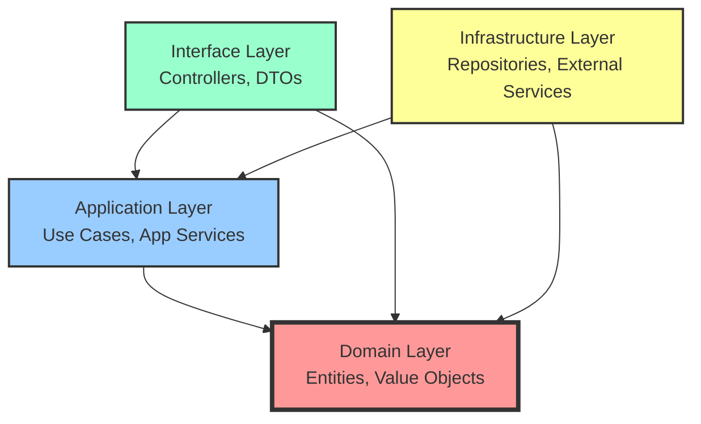

# Phase 3: Week 5-6 Clean Architecture・関数型プログラミング - アーキテクチャ設計と関数型パターン

## 📅 学習期間・目標

**期間**: Week 5-6（2週間）  
**総学習時間**: 40時間（週20時間）

### 🎯 Week 5-6 到達目標

- [ ] Clean Architecture の完全な層分離実装
- [ ] 依存性逆転原則（DIP）の実践的活用
- [ ] 関数型プログラミングパターンの習得
- [ ] Option・Result モナドの高度な使用法
- [ ] 不変性とイミュータブル設計の実装
- [ ] 関数合成とパイプライン設計

## 📖 理論学習内容

### Day 29-32: Clean Architecture 完全実装

#### 🏗️ Clean Architecture の4層構造

**層の責任と依存関係**



#### 📱 Interface Layer（プレゼンテーション層）

```typescript
// DTOs（Data Transfer Objects）
interface CreateProductRequestDto {
  name: string;
  description: string;
  price: {
    amount: number;
    currency: string;
  };
  category: string;
  initialStock: number;
}

interface ProductResponseDto {
  id: string;
  name: string;
  description: string;
  price: {
    amount: number;
    currency: string;
    formatted: string;
  };
  category: string;
  stockQuantity: number;
  isActive: boolean;
  createdAt: string;
  updatedAt: string;
}

// Controllers
class ProductController {
  constructor(
    private productApplicationService: ProductApplicationService,
    private mapper: ProductDtoMapper,
    private validator: RequestValidator,
    private logger: Logger
  ) {}

  async createProduct(req: Request, res: Response): Promise<void> {
    try {
      // 1. リクエスト検証
      const validationResult = await this.validator.validate(
        req.body,
        CreateProductRequestDto
      );
      
      if (validationResult.isErr()) {
        res.status(400).json({
          error: 'Validation failed',
          details: validationResult.error.details
        });
        return;
      }

      // 2. DTO → Domain への変換
      const createRequest = this.mapper.toDomainRequest(req.body);

      // 3. Application Service 実行
      const result = await this.productApplicationService.createProduct(createRequest);

      if (result.isErr()) {
        const statusCode = this.getStatusCodeFromError(result.error);
        res.status(statusCode).json({
          error: result.error.message,
          code: result.error.code
        });
        return;
      }

      // 4. Domain → DTO への変換
      const responseDto = this.mapper.toResponseDto(result.value);

      res.status(201).json({
        data: responseDto,
        message: 'Product created successfully'
      });

    } catch (error) {
      this.logger.error('Unexpected error in ProductController', error);
      res.status(500).json({
        error: 'Internal server error'
      });
    }
  }

  async getProducts(req: Request, res: Response): Promise<void> {
    try {
      const queryParams = req.query;
      const searchCriteria = this.mapper.toSearchCriteria(queryParams);

      const result = await this.productApplicationService.getProducts(searchCriteria);

      if (result.isErr()) {
        const statusCode = this.getStatusCodeFromError(result.error);
        res.status(statusCode).json({
          error: result.error.message
        });
        return;
      }

      const responseDto = this.mapper.toProductListDto(result.value);
      res.status(200).json(responseDto);

    } catch (error) {
      this.logger.error('Unexpected error in getProducts', error);
      res.status(500).json({
        error: 'Internal server error'
      });
    }
  }

  private getStatusCodeFromError(error: ApplicationError): number {
    switch (error.type) {
      case 'VALIDATION_ERROR':
        return 400;
      case 'NOT_FOUND':
        return 404;
      case 'BUSINESS_RULE_VIOLATION':
        return 422;
      case 'UNAUTHORIZED':
        return 401;
      case 'FORBIDDEN':
        return 403;
      default:
        return 500;
    }
  }
}

// DTO Mapper
class ProductDtoMapper {
  toDomainRequest(dto: CreateProductRequestDto): CreateProductRequest {
    return {
      name: dto.name,
      description: dto.description,
      price: dto.price,
      category: dto.category,
      initialStock: dto.initialStock
    };
  }

  toResponseDto(product: Product): ProductResponseDto {
    return {
      id: product.id.toString(),
      name: product.name,
      description: product.description,
      price: {
        amount: product.price.amount,
        currency: product.price.currency,
        formatted: product.price.format()
      },
      category: product.category,
      stockQuantity: product.stockQuantity,
      isActive: product.isActive,
      createdAt: product.createdAt.toISOString(),
      updatedAt: product.updatedAt.toISOString()
    };
  }

  toSearchCriteria(queryParams: any): ProductSearchCriteria {
    return {
      name: queryParams.name,
      category: queryParams.category,
      priceRange: queryParams.minPrice && queryParams.maxPrice ? {
        min: Money.create(parseFloat(queryParams.minPrice), queryParams.currency || 'USD').getValue(),
        max: Money.create(parseFloat(queryParams.maxPrice), queryParams.currency || 'USD').getValue()
      } : undefined,
      inStock: queryParams.inStock === 'true',
      isActive: queryParams.isActive !== 'false',
      limit: queryParams.limit ? parseInt(queryParams.limit) : 10,
      offset: queryParams.offset ? parseInt(queryParams.offset) : 0
    };
  }

  toProductListDto(result: ProductListResult): any {
    return {
      data: result.products.map(product => this.toResponseDto(product)),
      pagination: {
        total: result.totalCount,
        page: Math.floor(result.offset / result.limit) + 1,
        pageSize: result.limit,
        hasMore: result.hasMore
      }
    };
  }
}
```

#### 🔧 Application Layer（アプリケーション層）

```typescript
// Application Service
interface ProductApplicationService {
  createProduct(request: CreateProductRequest): Promise<Result<Product, ApplicationError>>;
  updateProduct(id: string, request: UpdateProductRequest): Promise<Result<Product, ApplicationError>>;
  getProduct(id: string): Promise<Result<Product, ApplicationError>>;
  getProducts(criteria: ProductSearchCriteria): Promise<Result<ProductListResult, ApplicationError>>;
  deleteProduct(id: string): Promise<Result<void, ApplicationError>>;
}

class ProductApplicationServiceImpl implements ProductApplicationService {
  constructor(
    private createProductUseCase: CreateProductUseCase,
    private updateProductUseCase: UpdateProductUseCase,
    private getProductUseCase: GetProductUseCase,
    private getProductsUseCase: GetProductsUseCase,
    private deleteProductUseCase: DeleteProductUseCase,
    private logger: Logger
  ) {}

  async createProduct(request: CreateProductRequest): Promise<Result<Product, ApplicationError>> {
    try {
      const result = await this.createProductUseCase.execute(request);
      
      return result.mapError(error => 
        new ApplicationError(
          error.message,
          this.mapErrorType(error),
          error
        )
      );
    } catch (error) {
      this.logger.error('Unexpected error in createProduct', error);
      return Result.err(new ApplicationError(
        'An unexpected error occurred',
        'INTERNAL_ERROR',
        error
      ));
    }
  }

  async getProducts(criteria: ProductSearchCriteria): Promise<Result<ProductListResult, ApplicationError>> {
    try {
      const result = await this.getProductsUseCase.execute(criteria);
      
      return result.mapError(error => 
        new ApplicationError(
          error.message,
          this.mapErrorType(error),
          error
        )
      );
    } catch (error) {
      this.logger.error('Unexpected error in getProducts', error);
      return Result.err(new ApplicationError(
        'An unexpected error occurred',
        'INTERNAL_ERROR',
        error
      ));
    }
  }

  private mapErrorType(error: any): ApplicationErrorType {
    if (error instanceof ValidationError) {
      return 'VALIDATION_ERROR';
    }
    if (error instanceof NotFoundError) {
      return 'NOT_FOUND';
    }
    if (error instanceof BusinessRuleViolationError) {
      return 'BUSINESS_RULE_VIOLATION';
    }
    return 'INTERNAL_ERROR';
  }
}

// Application Error
type ApplicationErrorType = 
  | 'VALIDATION_ERROR'
  | 'NOT_FOUND'
  | 'BUSINESS_RULE_VIOLATION'
  | 'UNAUTHORIZED'
  | 'FORBIDDEN'
  | 'INTERNAL_ERROR';

class ApplicationError extends Error {
  constructor(
    message: string,
    public readonly type: ApplicationErrorType,
    public readonly cause?: Error
  ) {
    super(message);
    this.name = 'ApplicationError';
  }

  get code(): string {
    return this.type;
  }
}
```

#### 🏛️ Infrastructure Layer（インフラ層）

```typescript
// 依存性注入コンテナ
interface Container {
  register<T>(token: string, factory: () => T): void;
  resolve<T>(token: string): T;
}

class DIContainer implements Container {
  private services = new Map<string, () => any>();

  register<T>(token: string, factory: () => T): void {
    this.services.set(token, factory);
  }

  resolve<T>(token: string): T {
    const factory = this.services.get(token);
    if (!factory) {
      throw new Error(`Service not found: ${token}`);
    }
    return factory();
  }
}

// 依存性の設定
class DependencyConfiguration {
  static configure(container: DIContainer): void {
    // Infrastructure Layer
    container.register('DatabaseConnection', () => 
      new PostgresConnection(process.env.DATABASE_URL!)
    );

    container.register('Logger', () => 
      new WinstonLogger()
    );

    // Repositories
    container.register('ProductRepository', () => 
      new PostgresProductRepository(
        container.resolve('DatabaseConnection'),
        new ProductMapper()
      )
    );

    container.register('CustomerRepository', () => 
      new PostgresCustomerRepository(
        container.resolve('DatabaseConnection'),
        new CustomerMapper()
      )
    );

    // Domain Services
    container.register('ProductDomainService', () => 
      new ProductDomainServiceImpl(
        container.resolve('ProductRepository'),
        container.resolve('MarketDataService')
      )
    );

    // Use Cases
    container.register('CreateProductUseCase', () => 
      new CreateProductUseCase(
        container.resolve('ProductRepository'),
        container.resolve('ProductDomainService'),
        container.resolve('EventBus'),
        container.resolve('Logger')
      )
    );

    // Application Services
    container.register('ProductApplicationService', () => 
      new ProductApplicationServiceImpl(
        container.resolve('CreateProductUseCase'),
        container.resolve('UpdateProductUseCase'),
        container.resolve('GetProductUseCase'),
        container.resolve('GetProductsUseCase'),
        container.resolve('DeleteProductUseCase'),
        container.resolve('Logger')
      )
    );

    // Controllers
    container.register('ProductController', () => 
      new ProductController(
        container.resolve('ProductApplicationService'),
        new ProductDtoMapper(),
        new RequestValidator(),
        container.resolve('Logger')
      )
    );
  }
}

// アプリケーション起動
class Application {
  private container: DIContainer;
  private server: Express;

  constructor() {
    this.container = new DIContainer();
    this.server = express();
    this.configure();
  }

  private configure(): void {
    // 依存性設定
    DependencyConfiguration.configure(this.container);

    // ミドルウェア設定
    this.server.use(express.json());
    this.server.use(cors());

    // ルート設定
    this.setupRoutes();

    // エラーハンドリング
    this.setupErrorHandling();
  }

  private setupRoutes(): void {
    const productController = this.container.resolve<ProductController>('ProductController');

    this.server.post('/api/products', (req, res) => 
      productController.createProduct(req, res)
    );
    this.server.get('/api/products', (req, res) => 
      productController.getProducts(req, res)
    );
    this.server.get('/api/products/:id', (req, res) => 
      productController.getProduct(req, res)
    );
    this.server.put('/api/products/:id', (req, res) => 
      productController.updateProduct(req, res)
    );
    this.server.delete('/api/products/:id', (req, res) => 
      productController.deleteProduct(req, res)
    );
  }

  private setupErrorHandling(): void {
    this.server.use((error: Error, req: Request, res: Response, next: NextFunction) => {
      const logger = this.container.resolve<Logger>('Logger');
      logger.error('Unhandled error', error);

      res.status(500).json({
        error: 'Internal server error',
        requestId: req.headers['x-request-id']
      });
    });
  }

  async start(port: number): Promise<void> {
    return new Promise((resolve) => {
      this.server.listen(port, () => {
        console.log(`Server started on port ${port}`);
        resolve();
      });
    });
  }
}
```

### Day 33-35: 関数型プログラミングパターン

#### 🔄 関数合成とパイプライン

```typescript
// 関数合成ユーティリティ
type Func<T, U> = (arg: T) => U;

const compose = <T, U, V>(f: Func<U, V>, g: Func<T, U>): Func<T, V> =>
  (x: T) => f(g(x));

const pipe = <T>(value: T) => ({
  to: <U>(fn: Func<T, U>) => pipe(fn(value))
});

// パイプライン演算子の模倣
const flow = <T extends readonly unknown[], U>(
  ...fns: PipeArgs<T, U>
): (arg: Head<T>) => U => (arg) => 
  (fns as any[]).reduce((acc, fn) => fn(acc), arg);

// 型安全なパイプライン
type PipeArgs<T extends readonly unknown[], U> = {
  readonly [K in keyof T]: (arg: K extends 0 ? T[0] : any) => any;
} & {
  readonly length: T['length'];
};

type Head<T extends readonly unknown[]> = T extends readonly [
  infer H,
  ...unknown[]
] ? H : never;

// 使用例
const processProductData = flow(
  (data: RawProductData) => validateProductData(data),
  (validated) => normalizeProductData(validated),
  (normalized) => enrichProductData(normalized),
  (enriched) => createProduct(enriched)
);

// カリー化
const curry = <T, U, V>(fn: (a: T, b: U) => V) =>
  (a: T) => (b: U) => fn(a, b);

const add = (a: number, b: number): number => a + b;
const curriedAdd = curry(add);
const add5 = curriedAdd(5);

// 部分適用
const partial = <T extends readonly unknown[], U, V>(
  fn: (...args: [...T, U]) => V,
  ...partialArgs: T
) => (lastArg: U) => fn(...partialArgs, lastArg);

const calculatePrice = (basePrice: number, taxRate: number, discount: number): number =>
  basePrice * (1 + taxRate) * (1 - discount);

const calculateJapanPrice = partial(calculatePrice, 0.1); // 消費税10%
const calculateDiscountedJapanPrice = calculateJapanPrice(0.2); // 20%割引
```

#### 🎯 高度な関数型パターン

```typescript
// Maybe/Option モナド（高度版）
abstract class Maybe<T> {
  abstract isSome(): this is Some<T>;
  abstract isNone(): this is None<T>;

  // Functor
  abstract map<U>(fn: (value: T) => U): Maybe<U>;

  // Applicative
  abstract apply<U>(fn: Maybe<(value: T) => U>): Maybe<U>;

  // Monad
  abstract flatMap<U>(fn: (value: T) => Maybe<U>): Maybe<U>;

  // Utility methods
  filter(predicate: (value: T) => boolean): Maybe<T> {
    return this.flatMap(value => 
      predicate(value) ? Maybe.some(value) : Maybe.none()
    );
  }

  orElse(defaultValue: T): T {
    return this.isSome() ? this.value : defaultValue;
  }

  orElseGet(supplier: () => T): T {
    return this.isSome() ? this.value : supplier();
  }

  orElseThrow(errorSupplier: () => Error): T {
    if (this.isSome()) {
      return this.value;
    }
    throw errorSupplier();
  }

  // Static constructors
  static some<T>(value: T): Maybe<T> {
    return new Some(value);
  }

  static none<T>(): Maybe<T> {
    return new None<T>();
  }

  static fromNullable<T>(value: T | null | undefined): Maybe<T> {
    return value != null ? Maybe.some(value) : Maybe.none();
  }

  // Traverse for arrays
  static traverse<T, U>(
    items: T[],
    fn: (item: T) => Maybe<U>
  ): Maybe<U[]> {
    const results: U[] = [];
    
    for (const item of items) {
      const result = fn(item);
      if (result.isNone()) {
        return Maybe.none();
      }
      results.push(result.value);
    }
    
    return Maybe.some(results);
  }

  // Sequence for Maybe array
  static sequence<T>(maybes: Maybe<T>[]): Maybe<T[]> {
    return Maybe.traverse(maybes, x => x);
  }
}

class Some<T> extends Maybe<T> {
  constructor(public readonly value: T) {
    super();
  }

  isSome(): this is Some<T> {
    return true;
  }

  isNone(): this is None<T> {
    return false;
  }

  map<U>(fn: (value: T) => U): Maybe<U> {
    return Maybe.some(fn(this.value));
  }

  apply<U>(fn: Maybe<(value: T) => U>): Maybe<U> {
    return fn.isSome() ? this.map(fn.value) : Maybe.none();
  }

  flatMap<U>(fn: (value: T) => Maybe<U>): Maybe<U> {
    return fn(this.value);
  }
}

class None<T> extends Maybe<T> {
  isSome(): this is Some<T> {
    return false;
  }

  isNone(): this is None<T> {
    return true;
  }

  map<U>(_fn: (value: T) => U): Maybe<U> {
    return Maybe.none();
  }

  apply<U>(_fn: Maybe<(value: T) => U>): Maybe<U> {
    return Maybe.none();
  }

  flatMap<U>(_fn: (value: T) => Maybe<U>): Maybe<U> {
    return Maybe.none();
  }
}

// Either モナド（Result の関数型版）
abstract class Either<L, R> {
  abstract isLeft(): this is Left<L, R>;
  abstract isRight(): this is Right<L, R>;

  // Functor (Right側のみ)
  abstract map<U>(fn: (value: R) => U): Either<L, U>;

  // Error mapping (Left側)
  abstract mapLeft<U>(fn: (error: L) => U): Either<U, R>;

  // Bimap (両側)
  bimap<U, V>(leftFn: (error: L) => U, rightFn: (value: R) => V): Either<U, V> {
    return this.isLeft() 
      ? Either.left(leftFn(this.error))
      : Either.right(rightFn(this.value));
  }

  // Monad
  abstract flatMap<U>(fn: (value: R) => Either<L, U>): Either<L, U>;

  // Applicative
  abstract apply<U>(fn: Either<L, (value: R) => U>): Either<L, U>;

  // Static constructors
  static left<L, R>(error: L): Either<L, R> {
    return new Left(error);
  }

  static right<L, R>(value: R): Either<L, R> {
    return new Right(value);
  }

  static fromPredicate<L, R>(
    predicate: (value: R) => boolean,
    onFalse: () => L
  ): (value: R) => Either<L, R> {
    return (value: R) => 
      predicate(value) ? Either.right(value) : Either.left(onFalse());
  }

  // Try-catch wrapper
  static tryCatch<L, R>(
    fn: () => R,
    onError: (error: unknown) => L
  ): Either<L, R> {
    try {
      return Either.right(fn());
    } catch (error) {
      return Either.left(onError(error));
    }
  }

  // Async version
  static async tryCatchAsync<L, R>(
    fn: () => Promise<R>,
    onError: (error: unknown) => L
  ): Promise<Either<L, R>> {
    try {
      const result = await fn();
      return Either.right(result);
    } catch (error) {
      return Either.left(onError(error));
    }
  }
}

class Left<L, R> extends Either<L, R> {
  constructor(public readonly error: L) {
    super();
  }

  isLeft(): this is Left<L, R> {
    return true;
  }

  isRight(): this is Right<L, R> {
    return false;
  }

  map<U>(_fn: (value: R) => U): Either<L, U> {
    return Either.left(this.error);
  }

  mapLeft<U>(fn: (error: L) => U): Either<U, R> {
    return Either.left(fn(this.error));
  }

  flatMap<U>(_fn: (value: R) => Either<L, U>): Either<L, U> {
    return Either.left(this.error);
  }

  apply<U>(_fn: Either<L, (value: R) => U>): Either<L, U> {
    return Either.left(this.error);
  }
}

class Right<L, R> extends Either<L, R> {
  constructor(public readonly value: R) {
    super();
  }

  isLeft(): this is Left<L, R> {
    return false;
  }

  isRight(): this is Right<L, R> {
    return true;
  }

  map<U>(fn: (value: R) => U): Either<L, U> {
    return Either.right(fn(this.value));
  }

  mapLeft<U>(_fn: (error: L) => U): Either<U, R> {
    return Either.right(this.value);
  }

  flatMap<U>(fn: (value: R) => Either<L, U>): Either<L, U> {
    return fn(this.value);
  }

  apply<U>(fn: Either<L, (value: R) => U>): Either<L, U> {
    return fn.isRight() 
      ? Either.right(fn.value(this.value))
      : Either.left(fn.error);
  }
}
```

### Day 36-42: 不変性とイミュータブル設計

#### 🔒 イミュータブルデータ構造

```typescript
// イミュータブルリスト
class ImmutableList<T> {
  private constructor(private items: readonly T[]) {}

  static empty<T>(): ImmutableList<T> {
    return new ImmutableList([]);
  }

  static of<T>(...items: T[]): ImmutableList<T> {
    return new ImmutableList([...items]);
  }

  static from<T>(items: T[]): ImmutableList<T> {
    return new ImmutableList([...items]);
  }

  // 追加（新しいリストを返す）
  append(item: T): ImmutableList<T> {
    return new ImmutableList([...this.items, item]);
  }

  prepend(item: T): ImmutableList<T> {
    return new ImmutableList([item, ...this.items]);
  }

  // 削除
  remove(index: number): ImmutableList<T> {
    if (index < 0 || index >= this.items.length) {
      return this;
    }
    return new ImmutableList([
      ...this.items.slice(0, index),
      ...this.items.slice(index + 1)
    ]);
  }

  removeItem(item: T): ImmutableList<T> {
    const index = this.items.indexOf(item);
    return index >= 0 ? this.remove(index) : this;
  }

  // 更新
  update(index: number, item: T): ImmutableList<T> {
    if (index < 0 || index >= this.items.length) {
      return this;
    }
    return new ImmutableList([
      ...this.items.slice(0, index),
      item,
      ...this.items.slice(index + 1)
    ]);
  }

  // 変換
  map<U>(fn: (item: T, index: number) => U): ImmutableList<U> {
    return new ImmutableList(this.items.map(fn));
  }

  filter(predicate: (item: T, index: number) => boolean): ImmutableList<T> {
    return new ImmutableList(this.items.filter(predicate));
  }

  reduce<U>(fn: (acc: U, item: T, index: number) => U, initial: U): U {
    return this.items.reduce(fn, initial);
  }

  // アクセス
  get(index: number): Maybe<T> {
    return index >= 0 && index < this.items.length 
      ? Maybe.some(this.items[index])
      : Maybe.none();
  }

  first(): Maybe<T> {
    return this.get(0);
  }

  last(): Maybe<T> {
    return this.get(this.items.length - 1);
  }

  // プロパティ
  get size(): number {
    return this.items.length;
  }

  get isEmpty(): boolean {
    return this.items.length === 0;
  }

  // イテレーション
  forEach(fn: (item: T, index: number) => void): void {
    this.items.forEach(fn);
  }

  toArray(): T[] {
    return [...this.items];
  }

  [Symbol.iterator](): Iterator<T> {
    return this.items[Symbol.iterator]();
  }
}

// イミュータブルマップ
class ImmutableMap<K, V> {
  private constructor(private entries: Map<K, V>) {}

  static empty<K, V>(): ImmutableMap<K, V> {
    return new ImmutableMap(new Map());
  }

  static of<K, V>(entries: [K, V][]): ImmutableMap<K, V> {
    return new ImmutableMap(new Map(entries));
  }

  // 設定
  set(key: K, value: V): ImmutableMap<K, V> {
    const newMap = new Map(this.entries);
    newMap.set(key, value);
    return new ImmutableMap(newMap);
  }

  // 削除
  delete(key: K): ImmutableMap<K, V> {
    if (!this.entries.has(key)) {
      return this;
    }
    const newMap = new Map(this.entries);
    newMap.delete(key);
    return new ImmutableMap(newMap);
  }

  // アクセス
  get(key: K): Maybe<V> {
    const value = this.entries.get(key);
    return value !== undefined ? Maybe.some(value) : Maybe.none();
  }

  has(key: K): boolean {
    return this.entries.has(key);
  }

  // 変換
  map<U>(fn: (value: V, key: K) => U): ImmutableMap<K, U> {
    const newEntries = new Map<K, U>();
    for (const [key, value] of this.entries) {
      newEntries.set(key, fn(value, key));
    }
    return new ImmutableMap(newEntries);
  }

  filter(predicate: (value: V, key: K) => boolean): ImmutableMap<K, V> {
    const newEntries = new Map<K, V>();
    for (const [key, value] of this.entries) {
      if (predicate(value, key)) {
        newEntries.set(key, value);
      }
    }
    return new ImmutableMap(newEntries);
  }

  // プロパティ
  get size(): number {
    return this.entries.size;
  }

  get isEmpty(): boolean {
    return this.entries.size === 0;
  }

  // 変換
  keys(): IterableIterator<K> {
    return this.entries.keys();
  }

  values(): IterableIterator<V> {
    return this.entries.values();
  }

  toArray(): [K, V][] {
    return Array.from(this.entries);
  }
}

// レンズパターン（不変更新）
interface Lens<S, A> {
  get: (source: S) => A;
  set: (value: A) => (source: S) => S;
}

const lens = <S, A>(
  getter: (source: S) => A,
  setter: (value: A) => (source: S) => S
): Lens<S, A> => ({
  get: getter,
  set: setter
});

// レンズ合成
const compose = <S, A, B>(
  outer: Lens<S, A>,
  inner: Lens<A, B>
): Lens<S, B> => ({
  get: (source: S) => inner.get(outer.get(source)),
  set: (value: B) => (source: S) => 
    outer.set(inner.set(value)(outer.get(source)))(source)
});

// 使用例
interface User {
  name: string;
  profile: {
    email: string;
    age: number;
  };
}

const userNameLens: Lens<User, string> = lens(
  user => user.name,
  name => user => ({ ...user, name })
);

const userProfileLens: Lens<User, User['profile']> = lens(
  user => user.profile,
  profile => user => ({ ...user, profile })
);

const profileEmailLens: Lens<User['profile'], string> = lens(
  profile => profile.email,
  email => profile => ({ ...profile, email })
);

const userEmailLens = compose(userProfileLens, profileEmailLens);

// 使用
const user: User = {
  name: 'Alice',
  profile: { email: 'alice@example.com', age: 30 }
};

const updatedUser = userEmailLens.set('alice@newdomain.com')(user);
```

## 🎯 実践演習

### 演習 5-1: Clean Architecture 完全実装 🔥

**目標**: 4層アーキテクチャの完全な実装

```typescript
// 以下の要件を満たすEコマースシステムを4層アーキテクチャで実装せよ

// 要件:
// 1. 完全な層分離（Domain, Application, Infrastructure, Interface）
// 2. 依存性逆転原則の実践
// 3. 関数型エラーハンドリング（Either/Maybe）
// 4. イミュータブルデータ構造の活用
// 5. 型安全な依存性注入

// Domain Layer
interface Product {
  id: ProductId;
  name: string;
  price: Money;
  category: ProductCategory;
  stockQuantity: number;
}

interface Order {
  id: OrderId;
  customerId: CustomerId;
  items: OrderItem[];
  status: OrderStatus;
  totalAmount: Money;
}

// Application Layer
interface ProductApplicationService {
  createProduct(request: CreateProductRequest): Promise<Either<ApplicationError, Product>>;
  getProducts(criteria: ProductSearchCriteria): Promise<Either<ApplicationError, ProductListResult>>;
}

// Infrastructure Layer
interface ProductRepository {
  save(product: Product): Promise<Either<RepositoryError, void>>;
  findById(id: ProductId): Promise<Either<RepositoryError, Maybe<Product>>>;
}

// Interface Layer
class ProductController {
  constructor(
    private productService: ProductApplicationService,
    private mapper: ProductDtoMapper
  ) {}
  
  async createProduct(req: Request, res: Response): Promise<void> {
    // 実装
  }
}

// 実装要件:
// - 全ての層で型安全性を確保
// - エラーハンドリングはEither型を使用
// - null安全性はMaybe型を使用
// - 依存性注入コンテナの実装
// - 統合テストの作成
```

### 演習 5-2: 関数型プログラミング実践 💎

**目標**: 関数型パターンを活用したビジネスロジック実装

```typescript
// 関数型スタイルでのデータ変換パイプラインを実装せよ

// 要件:
// 1. 関数合成とパイプライン
// 2. カリー化と部分適用
// 3. モナド（Maybe/Either）の活用
// 4. イミュータブルデータ操作

// データ変換パイプライン
interface RawOrderData {
  customerId: string;
  items: Array<{
    productId: string;
    quantity: number;
    price: number;
  }>;
  shippingAddress: string;
  paymentMethod: string;
}

interface ProcessedOrder {
  id: OrderId;
  customer: Customer;
  items: OrderItem[];
  shippingAddress: Address;
  paymentMethod: PaymentMethod;
  totalAmount: Money;
  status: OrderStatus;
}

// 関数型変換パイプライン
const processOrderData = flow(
  validateRawData,
  enrichWithCustomerData,
  calculateTotals,
  applyBusinessRules,
  createOrderEntity
);

// 各ステップの実装
const validateRawData = (data: RawOrderData): Either<ValidationError, ValidatedOrderData> => {
  // 実装
};

const enrichWithCustomerData = (data: ValidatedOrderData): Either<EnrichmentError, EnrichedOrderData> => {
  // 実装
};

// カリー化された計算関数
const calculateItemTotal = curry((taxRate: number, item: OrderItem): Money => {
  // 実装
});

const calculateJapanItemTotal = calculateItemTotal(0.1); // 消費税10%

// Maybe/Eitherを使った安全な操作
const safelyProcessOrder = (data: RawOrderData): Either<ProcessingError, ProcessedOrder> => {
  return Either.fromPredicate(
    (data: RawOrderData) => data.items.length > 0,
    () => new ProcessingError('Order must have at least one item')
  )(data)
    .flatMap(processOrderData)
    .map(applyDiscounts)
    .flatMap(validateBusinessRules);
};

// イミュータブルリストを使った操作
const processOrderItems = (items: ImmutableList<RawOrderItem>): ImmutableList<ProcessedOrderItem> => {
  return items
    .map(validateItem)
    .filter(item => item.isSome())
    .map(item => item.orElseThrow(() => new Error('Invalid item')))
    .map(enrichItemData)
    .map(calculateItemTotal);
};

// 実装要件:
// - 全ての関数は純粋関数として実装
// - 副作用は最小限に抑制
// - エラーハンドリングは関数型スタイル
// - データの不変性を保持
// - 型安全性を確保
```

## 📊 Week 5-6 評価基準

### 理解度チェックリスト

#### Clean Architecture (40%)

- [ ] 4層の責任を明確に分離できる
- [ ] 依存性逆転原則を実践できる
- [ ] インターフェース駆動設計を実装できる
- [ ] 依存性注入を効果的に活用できる
- [ ] 層間の通信を適切に設計できる

#### 関数型プログラミング (35%)

- [ ] 関数合成とパイプラインを実装できる
- [ ] Maybe/Eitherモナドを効果的に活用できる
- [ ] カリー化と部分適用を理解している
- [ ] 純粋関数の概念を実践できる
- [ ] 副作用を適切に管理できる

#### 不変性・イミュータブル設計 (15%)

- [ ] イミュータブルデータ構造を実装できる
- [ ] レンズパターンを活用できる
- [ ] 状態変更を関数型スタイルで実装できる
- [ ] パフォーマンスを考慮した不変性実装

#### 設計品質・実践応用 (10%)

- [ ] 型安全性を維持したアーキテクチャ設計
- [ ] テスタビリティの高い実装
- [ ] 保守性・拡張性を考慮した設計
- [ ] 実用的なパターンの適用

### 成果物チェックリスト

- [ ] **Clean Architecture テンプレート**: 4層完全分離の実装例
- [ ] **関数型ライブラリ**: Maybe/Either/ImmutableList等の実装
- [ ] **依存性注入システム**: 型安全なDIコンテナ
- [ ] **関数型パイプライン**: データ変換の実用例
- [ ] **統合テスト**: アーキテクチャ全体のテスト

## 🔄 Week 7-8 への準備

### 次週学習内容の予習

```typescript
// Week 7-8で学習する実践プロジェクトの基礎概念
// 以下のパターンを読んで理解しておくこと

// イベントソーシング
interface DomainEvent {
  eventId: string;
  aggregateId: string;
  eventType: string;
  eventData: any;
  occurredAt: Date;
  version: number;
}

interface EventStore {
  saveEvents(aggregateId: string, events: DomainEvent[], expectedVersion: number): Promise<void>;
  getEvents(aggregateId: string): Promise<DomainEvent[]>;
}

// CQRS実装
interface CommandHandler<TCommand> {
  handle(command: TCommand): Promise<Result<void, CommandError>>;
}

interface QueryHandler<TQuery, TResult> {
  handle(query: TQuery): Promise<Result<TResult, QueryError>>;
}

// Aggregate Root with Event Sourcing
abstract class EventSourcedAggregateRoot {
  private uncommittedEvents: DomainEvent[] = [];
  protected version: number = 0;

  protected addEvent(event: DomainEvent): void {
    this.uncommittedEvents.push(event);
    this.apply(event);
  }

  abstract apply(event: DomainEvent): void;

  getUncommittedEvents(): DomainEvent[] {
    return [...this.uncommittedEvents];
  }

  markEventsAsCommitted(): void {
    this.uncommittedEvents = [];
  }
}

// ブログプラットフォームドメイン
interface BlogPost extends EventSourcedAggregateRoot {
  publish(): Result<void, BlogPostError>;
  addComment(comment: Comment): Result<void, BlogPostError>;
  updateContent(content: PostContent): Result<void, BlogPostError>;
}

// プロジェクション（読み取り専用ビュー）
interface BlogPostProjection {
  id: string;
  title: string;
  content: string;
  authorId: string;
  publishedAt: Date;
  commentCount: number;
  tags: string[];
}

interface BlogPostReadRepository {
  findById(id: string): Promise<Maybe<BlogPostProjection>>;
  findByAuthor(authorId: string): Promise<BlogPostProjection[]>;
  findByTag(tag: string): Promise<BlogPostProjection[]>;
}
```

### 環境準備

- [ ] イベントストア実装の調査（EventStore DB、PostgreSQL等）
- [ ] CQRS フレームワークの検討
- [ ] プロジェクション更新システムの設計
- [ ] パフォーマンステストツールの準備

### 学習継続のコツ

1. **アーキテクチャ思考の定着**: 常に層の責任を意識
2. **関数型思考の習慣化**: 純粋関数と不変性を重視
3. **段階的リファクタリング**: 既存コードの漸進的改善
4. **パフォーマンス意識**: 設計決定の影響を常に考慮

---

**📌 重要**: Week 5-6 は Clean Architecture と関数型プログラミングの実践的な習得により、保守性とテスタビリティの高いシステム設計の基盤を確立する重要な期間です。理論と実践のバランスを保ちながら、実用的なパターンを身につけましょう。
