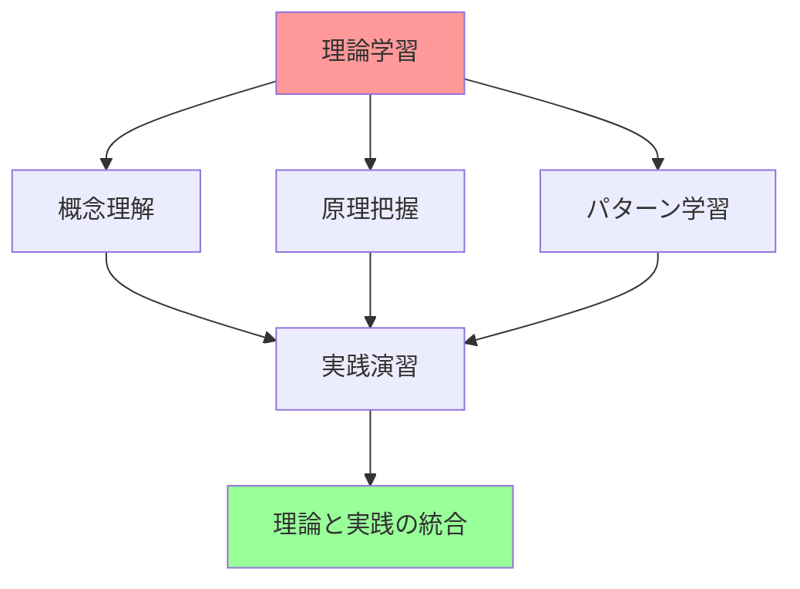

# Phase 3: 理論学習詳細化プラン - TypeScript設計手法の理論的基盤

## 📚 理論学習の目的と構成

### 🎯 学習目標

本プランは、Phase3の実践学習を支える理論的基盤を提供し、TypeScript設計手法の深い理解を促進することを目的とします。

- **DDD理論の体系的理解**: ドメイン駆動設計の哲学と実践手法
- **アーキテクチャパターンの理論**: Clean Architecture、Hexagonal Architecture等
- **関数型プログラミング理論**: モナド、関数合成、不変性の数学的基礎
- **設計原則の深い理解**: SOLID原則、DRY、KISS等の理論的背景

### 📖 学習アプローチ



## 📋 Week 1-2: DDD理論詳細化

### 🏛️ ドメイン駆動設計の哲学

#### ドメインの中心性

**ドメインとは何か**

ドメインは、ソフトウェアが解決しようとする問題領域そのものです。DDDでは、このドメインを中心に据えることで、ビジネス価値の高いソフトウェアを構築します。

```typescript
// ドメインの例：Eコマース
// - 商品管理（Product Management）
// - 注文処理（Order Processing）
// - 顧客管理（Customer Management）
// - 在庫管理（Inventory Management）
// - 支払い処理（Payment Processing）

// 各ドメインは独自のルールと概念を持つ
interface EcommerceDomain {
  productCatalog: ProductCatalogDomain;
  orderManagement: OrderManagementDomain;
  customerService: CustomerServiceDomain;
  inventory: InventoryDomain;
  payment: PaymentDomain;
}
```

#### ユビキタス言語の重要性

**言語の統一による理解の深化**

ユビキタス言語は、ドメインエキスパート、開発者、ステークホルダー間で共有される共通言語です。

```typescript
// 悪い例：技術的な用語が混在
class OrderProcessor {
  processData(data: any): void {
    // データベースレコードを更新
    this.updateRecord(data);
  }
}

// 良い例：ビジネス言語を使用
class OrderService {
  fulfillOrder(order: Order): Result<void, OrderError> {
    // 注文を履行する
    return this.processOrderFulfillment(order);
  }
}
```

#### 境界付けられたコンテキスト

**コンテキストの分離による複雑性の管理**

大きなドメインを管理可能な境界付けられたコンテキストに分割します。

```typescript
// Sales Context（販売コンテキスト）
namespace SalesContext {
  interface Product {
    id: ProductId;
    name: string;
    price: Money;
    availability: ProductAvailability;
  }
  
  interface Customer {
    id: CustomerId;
    name: string;
    creditRating: CreditRating;
  }
}

// Inventory Context（在庫コンテキスト）
namespace InventoryContext {
  interface Product {
    id: ProductId;
    sku: SKU;
    stockLevel: number;
    reorderPoint: number;
    supplier: Supplier;
  }
  
  interface StockMovement {
    productId: ProductId;
    movementType: MovementType;
    quantity: number;
    timestamp: Date;
  }
}
```

### 🧱 戦術的設計パターンの理論

#### Value Object の数学的基礎

**値オブジェクトの不変性と等価性**

Value Objectは数学的な値の概念に基づいています。

```typescript
// 数学的等価性の実装
abstract class ValueObject<T> {
  protected readonly value: T;

  constructor(value: T) {
    this.value = Object.freeze(this.deepFreeze(value));
  }

  // 構造的等価性（Structural Equality）
  equals(other: ValueObject<T>): boolean {
    if (!(other instanceof this.constructor)) {
      return false;
    }
    return this.structuralEquals(this.value, other.value);
  }

  // ハッシュコードの一貫性
  hashCode(): number {
    return this.calculateHash(this.value);
  }

  private structuralEquals(a: any, b: any): boolean {
    if (a === b) return true;
    if (a == null || b == null) return false;
    if (typeof a !== typeof b) return false;
    
    if (typeof a === 'object') {
      const keysA = Object.keys(a);
      const keysB = Object.keys(b);
      
      if (keysA.length !== keysB.length) return false;
      
      return keysA.every(key => 
        keysB.includes(key) && this.structuralEquals(a[key], b[key])
      );
    }
    
    return false;
  }

  private deepFreeze(obj: any): any {
    if (obj === null || typeof obj !== 'object') return obj;
    
    Object.getOwnPropertyNames(obj).forEach(prop => {
      if (obj[prop] !== null && typeof obj[prop] === 'object') {
        this.deepFreeze(obj[prop]);
      }
    });
    
    return Object.freeze(obj);
  }

  private calculateHash(value: any): number {
    // 簡単なハッシュ関数の実装
    const str = JSON.stringify(value);
    let hash = 0;
    for (let i = 0; i < str.length; i++) {
      const char = str.charCodeAt(i);
      hash = ((hash << 5) - hash) + char;
      hash = hash & hash; // 32bit整数に変換
    }
    return hash;
  }
}
```

#### Entity の同一性理論

**同一性 vs 等価性**

Entityは時間を通じて変化する同一性を持つオブジェクトです。

```typescript
// 同一性の理論的基礎
abstract class Entity<TId extends EntityId> {
  protected readonly id: TId;
  protected readonly createdAt: Date;

  constructor(id: TId, createdAt?: Date) {
    this.id = id;
    this.createdAt = createdAt || new Date();
  }

  // 同一性による等価性（Identity Equality）
  equals(other: Entity<TId>): boolean {
    if (!(other instanceof this.constructor)) {
      return false;
    }
    return this.id.equals(other.id);
  }

  // ライフサイクルの管理
  abstract isValid(): boolean;
  abstract canBeModified(): boolean;
}
```

## 📋 Week 3-4: Repository・Use Case 理論

### 🗄️ Repository パターンの理論的基礎

#### ドメイン層とインフラ層の分離

**依存性逆転原則の適用**

Repository パターンは、ドメイン層をインフラストラクチャの詳細から分離します。

```typescript
// 抽象化レベルでの設計
interface Repository<TEntity, TId> {
  // ドメイン中心のインターフェース
  findById(id: TId): Promise<Option<TEntity>>;
  save(entity: TEntity): Promise<Result<void, RepositoryError>>;
  delete(id: TId): Promise<Result<void, RepositoryError>>;
}

// ドメイン固有のRepository
interface ProductRepository extends Repository<Product, ProductId> {
  // ドメイン固有のクエリメソッド
  findByCategory(category: ProductCategory): Promise<Product[]>;
  findLowStockProducts(threshold: number): Promise<Product[]>;
  findByPriceRange(min: Money, max: Money): Promise<Product[]>;
}
```

### 🎯 Use Case の理論的基礎

#### アプリケーション層の責任

**ビジネスフローの調整**

Use Case は、アプリケーション固有のビジネスフローを表現します。

```typescript
// Use Case の理論的構造
abstract class UseCase<TRequest, TResponse> {
  // テンプレートメソッドパターン
  async execute(request: TRequest): Promise<Result<TResponse, UseCaseError>> {
    try {
      // 1. 入力検証
      const validationResult = await this.validateInput(request);
      if (validationResult.isErr()) {
        return Result.err(validationResult.error);
      }

      // 2. ビジネスロジック実行
      const businessResult = await this.executeBusinessLogic(request);
      if (businessResult.isErr()) {
        return Result.err(businessResult.error);
      }

      // 3. 出力変換
      const response = await this.transformOutput(businessResult.value);
      return Result.ok(response);

    } catch (error) {
      return Result.err(new UseCaseError(`Unexpected error: ${error.message}`));
    }
  }

  protected abstract validateInput(request: TRequest): Promise<Result<void, ValidationError>>;
  protected abstract executeBusinessLogic(request: TRequest): Promise<Result<any, BusinessError>>;
  protected abstract transformOutput(businessResult: any): Promise<TResponse>;
}
```

## 📋 Week 5-6: Clean Architecture・関数型プログラミング理論

### 🏗️ Clean Architecture の理論的基礎

#### 依存性の方向性

**依存性逆転原則の徹底適用**

Clean Architecture では、依存性は常に内側（ドメイン）に向かいます。

```typescript
// 依存性の方向性を示す理論的実装

// Domain Layer (最内層) - 依存性なし
namespace Domain {
  export interface Product {
    id: ProductId;
    name: string;
    price: Money;
  }
  
  export interface ProductRepository {
    findById(id: ProductId): Promise<Option<Product>>;
    save(product: Product): Promise<Result<void, RepositoryError>>;
  }
}

// Application Layer - Domain に依存
namespace Application {
  export class CreateProductUseCase {
    constructor(
      private productRepository: Domain.ProductRepository // インターフェースに依存
    ) {}
    
    async execute(request: CreateProductRequest): Promise<Result<CreateProductResponse, UseCaseError>> {
      // ドメインロジックの調整
    }
  }
}
```

### 🔄 関数型プログラミングの理論的基礎

#### モナドの数学的基礎

**モナド則の実装**

モナドは、関数型プログラミングにおける重要な抽象化です。

```typescript
// モナド則の理論的実装
interface Monad<T> {
  // Functor則
  map<U>(fn: (value: T) => U): Monad<U>;
  
  // Monad則
  flatMap<U>(fn: (value: T) => Monad<U>): Monad<U>;
  
  // Unit/Return
  static of<T>(value: T): Monad<T>;
}

// Maybe モナドの完全実装
abstract class Maybe<T> implements Monad<T> {
  abstract map<U>(fn: (value: T) => U): Maybe<U>;
  abstract flatMap<U>(fn: (value: T) => Maybe<U>): Maybe<U>;
  abstract isSome(): this is Some<T>;
  abstract isNone(): this is None<T>;

  static of<T>(value: T): Maybe<T> {
    return value != null ? new Some(value) : new None<T>();
  }

  static some<T>(value: T): Maybe<T> {
    return new Some(value);
  }

  static none<T>(): Maybe<T> {
    return new None<T>();
  }
}
```

## 📋 Week 7-8: 実践統合理論

### 🔄 イベントソーシングの理論的基礎

#### イベントストリームとしての状態管理

**時間軸での状態変化の記録**

イベントソーシングは、状態の変化をイベントの連続として記録します。

```typescript
// イベントソーシングの理論的モデル
interface EventStream<T> {
  // イベントの追加
  append(event: DomainEvent): EventStream<T>;
  
  // 状態の再構築
  fold<U>(initialState: U, reducer: (state: U, event: DomainEvent) => U): U;
  
  // イベントの取得
  getEvents(fromVersion?: number): DomainEvent[];
}

// 状態の再構築理論
class StateReconstruction {
  static reconstruct<T extends AggregateRoot>(
    events: DomainEvent[],
    aggregateConstructor: new () => T
  ): T {
    const aggregate = new aggregateConstructor();
    
    events.forEach(event => {
      aggregate.apply(event);
    });
    
    return aggregate;
  }
}
```

## 🎯 理論学習の段階的アプローチ

### 📚 学習段階

1. **概念理解段階**: 基本概念と原理の理解
2. **パターン学習段階**: 設計パターンの習得
3. **実践適用段階**: 理論の実践への適用
4. **統合発展段階**: 複数理論の統合と発展

### 📖 推奨学習リソース

#### 書籍
- Domain-Driven Design: Tackling Complexity in the Heart of Software
- Clean Architecture: A Craftsman's Guide to Software Structure and Design
- Functional Programming in TypeScript

#### 論文・記事
- Event Sourcing pattern
- CQRS pattern
- Hexagonal Architecture

#### 実践リソース
- TypeScript Handbook
- fp-ts ライブラリドキュメント
- Clean Architecture テンプレート

---

**📌 重要**: 理論学習は実践学習と並行して進めることで、より深い理解が得られます。理論で学んだ概念を実際のコードで確認し、実践で遭遇した問題を理論で解決するサイクルを意識しましょう。