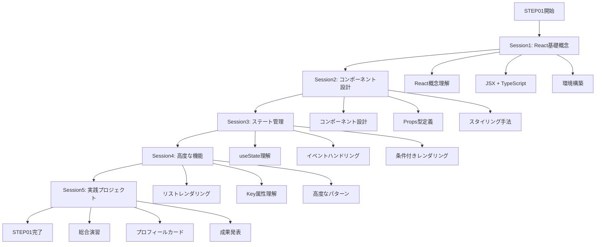

# STEP01: React基礎とTypeScript統合（5セッション分割学習）

> 💡 **対象**: TypeScript上級者・React初心者
> 🎯 **形式**: 講師サポート付き5セッション分割学習
> ⏰ **総時間**: 450分（7.5時間）

## 📚 関連補足資料

このSTEPの学習をサポートする補足資料をご用意しています：

- 📖 **[専門用語集](./STEP01_補足_専門用語集.md)** - React + TypeScript の重要な概念と用語の詳細解説
- 🛠️ **[開発環境ガイド](./STEP01_補足_開発環境ガイド.md)** - React + TypeScript 環境構築と設定方法
- 💻 **[実践コード例](./STEP01_補足_実践コード例.md)** - 段階的なコンポーネント作成例集
- 🚨 **[トラブルシューティング](./STEP01_補足_トラブルシューティング.md)** - よくあるエラーと解決方法
- 📚 **[参考リソース](./STEP01_補足_参考リソース.md)** - 学習に役立つリンク集

> 💡 **活用方法**: 学習中に疑問が生じた際や、より深く理解したい場合に参照してください 🐰

## 📅 STEP概要

**学習目標**:
- [ ] React の基本概念（仮想DOM、コンポーネント思考）の理解
- [ ] TypeScript × React の型安全な開発手法の習得
- [ ] JSX記法とTypeScript型システムの統合理解
- [ ] 段階的な型安全コンポーネント設計の習得
- [ ] 実践的なReactアプリケーション開発の基礎完成

**前提知識**:
- TypeScript上級レベル（ジェネリクス、ユニオン型、条件型等の理解）
- JavaScript ES6+の深い理解
- モダンフロントエンド開発の基礎知識

---

## ⏰ 5セッション構成

| セッション | 時間 | 内容 | 対象レクチャー | 成果物 |
|-----------|------|------|---------------|--------|
| **[Session1](./STEP01_Session1_React基礎概念.md)** | 90分 | React基礎概念・JSX・環境構築 | 1-8 | Hello Reactプロジェクト |
| **[Session2](./STEP01_Session2_コンポーネント設計.md)** | 90分 | コンポーネント設計・Props・スタイリング | 9-16 | 再利用可能コンポーネント |
| **[Session3](./STEP01_Session3_ステート管理.md)** | 90分 | useState・イベント・条件分岐 | 17-24 | インタラクティブコンポーネント |
| **[Session4](./STEP01_Session4_高度な機能.md)** | 90分 | リスト・Key・高度なパターン | 25-30 | 動的リストコンポーネント |
| **[Session5](./STEP01_Session5_実践プロジェクト.md)** | 90分 | 総合演習・プロフィールカード完成 | 31-32 | プロフィールカード v2 |

---

## 🗺️ 学習フローマップ

## 🎯 TypeScript統合の特徴

### 1. 型安全なコンポーネント設計
- Props・State・Eventの厳密な型定義
- インターフェースベースの設計パターン
- 型推論を活用した効率的な開発

### 2. 高度な型活用
- ジェネリクスを活用した再利用可能コンポーネント
- ユニオン型・条件型の実践活用
- TypeScript上級者向けの応用パターン

### 3. 実践的なエラーハンドリング
- TypeScriptエラーの読み方と対処法
- React特有の型エラー解決
- デバッグ効率化のテクニック

## 📊 STEP01 評価基準

### 技術習得度（70%）

#### React基礎理解（25%）
- [ ] React の基本概念（仮想DOM、コンポーネント思考）を説明できる
- [ ] JSX記法を理解し、TypeScriptと統合して使用できる
- [ ] React vs. バニラJavaScriptの違いを理解している
- [ ] コンポーネントベースアーキテクチャの利点を説明できる

#### TypeScript統合（25%）
- [ ] Props・State・Eventに適切な型注釈を付けられる
- [ ] インターフェースを使ったコンポーネント設計ができる
- [ ] ジェネリクスを活用した再利用可能コンポーネントを作成できる
- [ ] TypeScript特有のエラーを理解し、解決できる

#### 実践スキル（20%）
- [ ] useState を使った状態管理ができる
- [ ] イベントハンドリングを型安全に実装できる
- [ ] 条件付きレンダリングを適切に使用できる
- [ ] リストレンダリングとKey属性を理解している

### 実装品質（20%）

- [ ] **コードの可読性**: 変数名・関数名・コンポーネント名の適切性
- [ ] **型安全性**: TypeScriptの恩恵を最大限活用
- [ ] **保守性**: 拡張しやすい設計とコンポーネント分割
- [ ] **動作確認**: 実装した機能の正常動作

### 学習姿勢（10%）

- [ ] **積極性**: 質問・議論への参加
- [ ] **問題解決**: 自力でのデバッグ・調査
- [ ] **協調性**: 他の学習者との協力
- [ ] **振り返り**: 学習内容の整理・次ステップの計画

## 🎯 成果物

- [ ] **プロフィールカード v1 & v2**: TypeScript × React の総合演習プロジェクト → [STEP01 成果物](./STEP01_成果物.md)で詳細確認

---

## 🚀 学習の進め方

### 1. 事前準備
- TypeScriptの基礎知識の確認
- 開発環境の準備（Node.js、エディタ設定）
- 学習目標の明確化

### 2. セッション受講
- 各セッション90分の集中学習
- 実践演習を通じた理解の定着
- 講師・他学習者との積極的な議論

### 3. 復習・定着
- 補足資料を活用した知識の深化
- 実践コード例での追加練習
- 疑問点の解決とトラブルシューティング

### 4. 成果物作成
- 学習内容を統合した実践プロジェクト
- TypeScript × React のベストプラクティス適用
- コードレビューとフィードバック

---

**📌 重要**: STEP01はReact学習の基盤となる重要なステップです。TypeScriptの知識を活かして、効率的にReactの概念を習得しましょう。

**🌟 次のステップ**: STEP02では、より高度なReactパターンと状態管理について学習します！