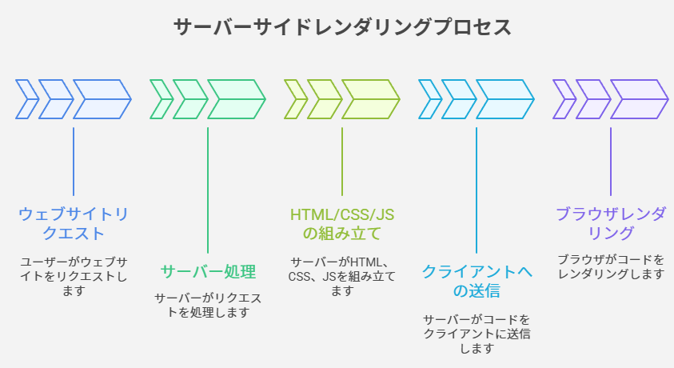
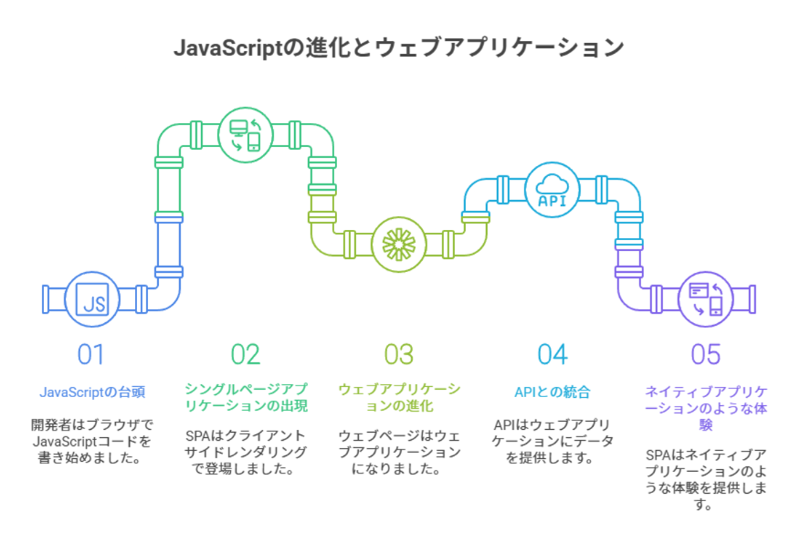

# セッション 0: なぜフロントエンドのフレームワークが存在するのか

## 🎯 このセッションで理解すること

- なぜ React のようなフロントエンドフレームワークが生まれたのか
- ウェブ開発の歴史的変遷
- バニラ JavaScript だけでは大規模アプリケーション開発が困難な理由
- フレームワークが解決する根本的な問題

---

## 🤔 最初の疑問：なぜ React が必要なのか？

React について学び始める前に、実はとても重要な質問をひとつしておきましょう。

**そもそも、なぜ React のようなフロントエンドフレームワークが存在するのか？**

単純にバニラ JavaScript を使ってアプリを作ればいいのではないか、と思うかもしれません。

さて、このセッションでその疑問に答えていきましょう。過去にどのようにウェブサイトが構築され、どのように新しい方法へと移行し、フロントエンドフレームワークの台頭へとつながっていったのかを振り返りながら、基礎から整理していきます。

---

## 📜 ウェブ開発の歴史：サーバーサイドレンダリングの時代

### 2010 年以前：すべてはサーバーで作られていた

2010 年以前は、すべてのウェブサイトは常にサーバー上でレンダリングされていました。

サーバーサイドレンダリングでは、ウェブサイトは基本的にバックエンドで組み立てられます。ウェブサーバー上で、データとテンプレートに基づいて完成された HTML、CSS、JavaScript のコードが、クライアントサイド（つまりページを要求したウェブブラウザ）に送られます。ブラウザはこのコードを受け取り、基本的にそれを画面に描画します。

サーバーサイドでレンダリングされたウェブサイトの典型的な例は、WordPress で構築されたすべてのウェブサイトです。



### 当時の JavaScript の役割

このようなウェブサイトに含まれていた JavaScript は、当初は簡単なアニメーションやホバー効果など、ページに簡単なダイナミクスを加えるためだけのものでした。そして通常、jQuery と呼ばれる当時大人気だったライブラリがこのために使われました。なぜなら、当時はブラウザごとに JavaScript の動作が異なっていたからです。もちろん、あなたもすでにこのような API に触れたことがあると思います。

```javascript
// 2010年頃の典型的なjQueryコード
$(document).ready(function () {
  $(".button").hover(
    function () {
      $(this).addClass("highlight");
    },
    function () {
      $(this).removeClass("highlight");
    }
  );

  $(".menu-toggle").click(function () {
    $(".menu").slideToggle();
  });
});
```

---

## 🌐 変化の波：シングルページアプリケーションの台頭

### JavaScript の進化と新しい課題

しかし時が経つにつれ、開発者はブラウザで実行される JavaScript コードをどんどん書くようになり、いつしか本格的なウェブアプリケーションとなり、いわゆる**シングルページアプリケーション（SPA）**が台頭するようになりました。

これらは基本的にサーバーではなくクライアントでレンダリングされるウェブページです。つまり、クライアントサイドレンダリングでは、基本的にウェブページをレンダリングする作業はサーバーからクライアントに移されました。

### 現代のウェブアプリケーション

現在、これらをウェブページとは呼ばず、**ウェブアプリケーション**と呼ぶようになりました。

現在、ウェブアプリケーションは依然としてデータを必要としており、それは通常 **API** という形でバックエンドから取得します。そのため、アプリケーションはこの API データを利用し、アプリケーションのビューごとに画面をレンダリングします。

これらのシングルページアプリケーションは、基本的にネイティブのデスクトップアプリケーションや電話アプリケーションを使っているかのように感じられます。そのため、ページをリロードすることなく、リンクをクリックしたり、フォームを送信したりできます。技術的には常に同じページにいることになり、**シングルページアプリ**と呼ばれる理由がここにあります。



### サーバーサイドレンダリングの復活

ここで触れておきたいのは、サーバーサイドレンダリングが再び重要性を増しているという点です。Next.js や Remix など、クライアントサイドレンダリングで培われた概念に新しい仕組みを統合したメタフレームワークが登場したことで、SSR は現代的な形に再定義されています。

しかし、いずれにせよ、シングルページアプリケーションの作り方を学ぶ必要があることに変わりはありません。しかし、本当にバニラ JavaScript でそれを行うのが良いのでしょうか？

実際には、そうではありません。なぜなら、大規模なアプリケーションを構築するためにバニラ JavaScript を使用することには、いくつかの問題があるからです。これからその詳細をお見せしますが、まず、フロントエンドアプリケーションの構築とは、実際にはデータを処理し、そのデータを美しいユーザーインターフェイスで表示することがすべてだということを確認しておきましょう。

---

## 💭 フロントエンド開発の本質：データと UI の同期

### フロントエンド開発とは何か

フロントエンドアプリケーションの構築とは、**データを処理し、そのデータを美しいユーザーインターフェイスで表示すること**がすべてです。

考えてみれば、ウェブアプリケーションがすることは基本的にそれだけです。データを受信し、ユーザーがアプリを使用するたびにデータを変更し、常に現在のデータを画面に表示します。

### 最も重要で困難な課題

これは何を意味するかというと、シングルページアプリ、そしてあらゆるアプリケーションやウェブサイトにおいて最も重要なタスクは、**ユーザーインターフェイスをデータと同期させ続けること**、言い換えれば、**UI が常にデータの現在の状態を表示するようにすること**です。

結局のところ、正しいデータを表示し、それが長期にわたって正しいままであることを確認することは、解決するのが本当に難しい問題なのです。

### 現実世界の例：Airbnb アプリケーション

その理由を理解するために、この Airbnb のアプリケーションを見てみましょう。

https://www.airbnb.jp/

このインターフェイスでは、多数の複雑なデータを確認できます：

- **物件リスト**：各物件の写真、価格、評価、タイトル、ホスト情報
- **検索バー**：目的地、チェックイン・チェックアウト日、ゲスト数
- **フィルター機能**：価格帯、物件タイプ、アメニティ、評価などの絞り込み条件
- **地図表示**：物件の位置情報とピン表示、地図の移動・ズーム状態
- **ユーザー情報**：ログイン状態、お気に入りリスト、予約履歴
- **検索結果の更新設定**：「地図を移動したときに検索を更新する」のオン/オフ状態
- **表示設定**：リスト表示/グリッド表示の切り替え、ソート順序
- **ページネーション**：現在のページ番号、読み込み状態
- **一時的な状態**：ローディング状態、エラー状態、モーダルの開閉状態

これらはすべて、アプリが依存している相互に関連するデータです。そして実際に現実世界の Airbnb のアプリケーションには、これよりもはるかに多くの状態とデータがあります。

これらのデータはすべて、ユーザーインターフェースと常に同期している必要があり、また他のデータとも同期している必要があります。なぜなら、これらはすべて相互に関連しているからです。

具体的な例：

- **検索条件を変更**した場合：

  - 新しい条件に基づいて物件リストを更新
  - 地図上のピンの位置と数を更新
  - URL のパラメータを更新（ブックマーク・共有対応）
  - ローディング状態を表示

- **地図を移動**した場合：

  - 新しいエリアの物件を取得・表示
  - 物件リストのスクロール位置をリセット
  - 「検索結果を更新」ボタンの表示/非表示を制御
  - 現在の地図範囲を URL に反映

- **物件をお気に入りに追加**した場合：

  - 該当物件のハートアイコンの状態を更新
  - ユーザーのお気に入り総数を更新
  - ローカルストレージまたはサーバーに保存
  - 他のページでも同期表示

- **フィルターを適用**した場合：
  - 条件に合わない物件をリストから除外
  - 該当件数の表示を更新
  - 地図上のピンも条件に合致するもののみ表示
  - ページネーションをリセット

そのため、これらのデータ同士の依存関係は非常に複雑で、一つの変更が連鎖的に他の多くの要素に影響を与えます。

### ステート（状態）という概念

現実世界のアプリでは、これらのデータの一つ一つを**ステート（状態）**と呼びます。
※ 状態管理の文脈で使われるステート(状態)はそれが変更されると UI が自動的に変更されるようなデータのことを指します。

これらの例に基づけば、**フレームワークなしでは、この超複雑な UI とこの膨大な量のデータを同期させ続けることは事実上不可能**だと言えます。

---

## 🚫 バニラ JavaScript の限界

### なぜバニラ JavaScript では困難なのか

バニラ JavaScript でこのようなものを作るのがなぜそんなに難しいのでしょうか。

それでも疑問に思うかもしれません。バニラ JavaScript でこのようなものを構築するのがなぜそんなに困難なのでしょうか。

それは 2 つの大きな側面に集約されます。

### 問題 1：直接的な DOM 操作の複雑さ

第一に、バニラ JavaScript だけで複雑なフロントエンドを構築するには、**大量の DOM を直接横断して操作する必要がある**ことです。

```javascript
// バニラJavaScriptでの典型的なDOM操作
const counterElement = document.getElementById("counter");
const incrementButton = document.getElementById("increment-btn");
const decrementButton = document.getElementById("decrement-btn");
const resetButton = document.getElementById("reset-btn");
const messageElement = document.getElementById("message");

let count = 0;

function updateUI() {
  counterElement.textContent = count;

  // 複雑な条件分岐
  if (count > 10) {
    counterElement.style.color = "red";
    messageElement.textContent = "高い値です！";
    messageElement.style.display = "block";
  } else if (count < 0) {
    counterElement.style.color = "blue";
    messageElement.textContent = "負の値です";
    messageElement.style.display = "block";
  } else {
    counterElement.style.color = "black";
    messageElement.style.display = "none";
  }

  // ボタンの状態管理
  decrementButton.disabled = count <= 0;
  incrementButton.disabled = count >= 20;
}

incrementButton.addEventListener("click", () => {
  count++;
  updateUI();
});

decrementButton.addEventListener("click", () => {
  count--;
  updateUI();
});

resetButton.addEventListener("click", () => {
  count = 0;
  updateUI();
});

// 初期化
updateUI();
```

このように、手動での要素選択、クラスの切り替え、DOM のトラバース、テキストやスタイル操作などをすべて自前で記述する方法は、Airbnb のような規模のアプリケーションでは確実に破綻します。コードは指数関数的に複雑化し、スパゲッティ化が避けられません。

これが第一の問題です。

### 問題 2：ステートの分散管理

2 つ目の大きな問題は、典型的なバニラ JavaScript アプリでは、**単純なテキストや数字などの状態が、しばしば DOM にそのまま格納されてしまう**ことです。

つまり、アプリケーションの中心的な場所ではなく、HTML 要素そのものにあるのです。

```javascript
// 悪い例：状態がDOMに分散している
function getCurrentCount() {
  return parseInt(document.getElementById("counter").textContent);
}

function isMessageVisible() {
  return document.getElementById("message").style.display !== "none";
}

function updateCounterFromInput() {
  const inputValue = document.getElementById("counter-input").value;
  const currentCount = getCurrentCount();

  // 状態がDOMの各所に散らばっているため、同期が困難
  if (inputValue !== currentCount.toString()) {
    document.getElementById("counter").textContent = inputValue;
    // 他のすべての関連要素も更新する必要がある...
  }
}
```

その結果、アプリの多くの部分が DOM の状態に直接アクセスして変更することになり、スパゲッティコードはさらに理解しづらくなります。さらに悪いことに、アプリケーションに多くのバグをもたらすことになります。

### 自力解決の困難さ

もちろん、これらの問題を自力で解決しようとすることも可能ですが、その場合、独自のフレームワークを作ることになり、すでに存在する確立されたフレームワークよりもずっと悪いものになる可能性が高いです。

だから現時点では、React のような戦場でテストされたフレームワークを使ったほうがいいのです。

さて、JavaScript だけでシングルページのアプリを書くのが難しい理由がわかったところで、冒頭で質問した基本的な質問に答えましょう。

---

## ✨ フロントエンドフレームワークが存在する理由

### 根本的な理由

JavaScript だけでシングルページのアプリを書くのが難しい理由がわかったところで、冒頭で質問した基本的な質問に答えましょう。

**では、なぜフロントエンドフレームワークが実際に存在するのでしょうか。**

ここまでの内容で、すでに答えの大部分は見えてきたはずです。

このようなフレームワークが存在する大きな基本的理由は、**ユーザーインターフェイスをデータと同期させ続けることが本当に難しく、そして膨大な作業でもあるから**です。

### フレームワークが提供する価値

基本的に、Angular、React、Vue のようなフレームワークは、**データをユーザーインターフェースと同期させるという困難な作業を開発者から取り除いてくれます。**

これらのフレームワークは、この困難な問題を解決してくれるので、開発者はデータ自体とユーザーインターフェース自体の構築だけに集中できます。

異なるフレームワークがこれを実現するアプローチは異なりますが、それらはすべて UI とデータを時間の経過とともに同期させるという点で共通しています。

### 構造化されたコードの強制

フレームワークが与えてくれるもうひとつの非常に貴重な価値は、**基本的に正しいコードの構造化と記述方法を強制してくれること**です。

本質的には、これらのフレームワークの作者たちは、アプリケーションを構造化する優れた方法を考案したのであり、他の開発者たちも同様にこれらの規約に従うことで、スパゲッティコードを大幅に減らし、より良いアプリケーションを構築できます。

### チーム開発における一貫性

最後に、フレームワークは開発者、特にチームにウェブアプリケーションを構築する一貫した方法を提供します。

こうすることで、チームの全員が他の全員と同じスタイルでアプリの各部分を構築することになり、最終的にはより一貫性のあるコードベースと製品を作れます。

**これが、現代のウェブ開発において JavaScript フレームワークが中心的な役割を果たしている根本理由です。**

---

では、ここから React 自体の概要に入ります。

## 🚀 React 概要：React とは何か

ここまでで、そもそもなぜ JavaScript フレームワークが必要なのかを理解できました。では、最も人気のあるフレームワークである **React** について学び始めましょう。

この講義では、React が実際に何なのか、どのように動作するのかを高い視点から概観していきます。内容盛りだくさんですが、とても興味深い内容になるでしょう。

早速始めましょう。

### 🔖 公式定義と拡張された定義

公式の React ドキュメントによると：

> React はユーザーインターフェイスを構築するための JavaScript ライブラリです。

これは確かに正しいのですが、正直あまり参考になりませんよね？

そこで、この定義をもう少し拡張して、より有用な、もう少し詳しい定義にしてみましょう：

> React とは、**非常に人気が高く、宣言的で、コンポーネントベースで、ステート駆動な、ユーザーインターフェイス構築のための JavaScript ライブラリ ** である。

この拡張された定義の方が実際にずはっと有用です。なぜなら、この定義を分解すると、React が実際に何なのかを段階的に学んでいくことができるからです。

---

### 🧱 コンポーネントベースから始めよう

React は、ボタン、入力フィールド、検索バー、などのコンポーネントがすべてです。
コンポーネントは React におけるユーザーインターフェイスの構成要素です。
実際、React が行うことは、コンポーネントを受け取り、それらをウェブページ上に描画することだけです。
つまり、React では複数のコンポーネントを構築し、それらのコンポーネントをレゴのピースのように組み合わせることで、複雑な UI を構築します。
例えば、Airbnb のような複雑なアプリケーションを作成する場合を考えてみましょう。
複雑な UI を形成しています。ナビゲーションバー、検索バー、結果パネル、そして地図です。

さらに、コンポーネントで行うもう一つのことは、それらを再利用することです。
複数のコンポーネントを組み合わせ再利用することで複雑な UI を構築するため、各コンポーネントは自分がどのように見えるべきかについてのすべての情報を持っている必要があります。
そこで、各コンポーネントがどのように見えるか、どのように動作するかを記述するために、**JSX** という特別な宣言的構文を使用します。

#### 💻 JSX の具体例

例えば、Airbnb の物件カードコンポーネントは以下のように書くことができます：

```jsx
function PropertyCard({ title, price, rating, image, isSuperHost }) {
  return (
    <div className="property-card">
      

      {isSuperHost && <span className="super-host-badge">スーパーホスト</span>}

      <div className="property-info">
        <h3 className="property-title">{title}</h3>
        <div className="property-rating">⭐ {rating}</div>
        <p className="property-price">¥{price.toLocaleString()}/泊</p>
      </div>
    </div>
  );
}

// このコンポーネントを使用する場合
function PropertyList() {
  return (
    <div className="property-list">
      <PropertyCard
        title="海沿いの素敵なロッジ"
        price={12800}
        rating={4.8}
        image="/images/lodge.jpg"
        isSuperHost={true}
      />
      <PropertyCard
        title="都心のモダンアパート"
        price={8500}
        rating={4.2}
        image="/images/apartment.jpg"
        isSuperHost={false}
      />
    </div>
  );
}
```

この JSX コードの特徴：

- **HTML 風の記法**：見た目は HTML のようですが、実際は JavaScript です
- **動的な値**：`{title}`や`{price}`のように、波括弧で JavaScript の値を埋め込めます
- **条件付きレンダリング**：`{isSuperHost && <span>...}</span>`のように条件に応じて要素を表示
- **再利用可能**：同じコンポーネントを異なるデータで何度でも使用可能

#### ♻️ 再利用バリエーション例（ListingCard）

| Prop          | 型           | 役割             | 例                    |
| ------------- | ------------ | ---------------- | --------------------- |
| title         | string       | 物件タイトル表示 | "海沿いロッジ"        |
| pricePerNight | number       | 料金表示         | 12800                 |
| isSuperHost   | boolean      | バッジ表示制御   | true                  |
| images        | string[]     | スライダー画像   | ["a.jpg", "b.jpg"]    |
| onSelect      | (id) => void | クリックハンドラ | (id) => setActive(id) |

---

### 🗣 宣言的とは何を意味するか

宣言的とは単純に、現在のステートに基づいて、コンポーネントが、そして最終的には UI 全体がどのように見えるべきかを React に伝えることを意味します。

つまり、React は基本的に DOM からの巨大な抽象化であり、私たちがバニラ JavaScript で行うように DOM と直接作業する必要がありません。

そのため、いくつかのデータが変更されたときに何を起こしたいかを React に伝えるだけで、それをどのように行うかを伝える必要はありません。そして繰り返しになりますが、それは JSX を使って行います。

JSX は基本的に HTML、CSS、JavaScript の部分を組み合わせた構文であり、他の React コンポーネントを参照することも可能です。

そして React の宣言的な性質は、もちろん後で深く掘り下げていく重要な概念です。

しかし今、あなたは疑問に思うかもしれません。DOM に触れることがないなら、React はどのように UI を更新するのでしょうか？

そこで **ステート** という概念が登場します。

簡単な例：

```jsx
function Counter() {
  const [count, setCount] = useState(0);
  return (
    <div className="counter">
      <p>現在値: {count}</p>
      <button onClick={() => setCount(count + 1)}>＋1</button>
    </div>
  );
}
```

ここでは「状態がこうなら UI はこう」と宣言しているだけで、`count` が変わったあとの DOM 差分適用ロジックは書いていません。

#### 🆚 命令的 vs 宣言的 比較表

| 観点             | 命令的（Imperative: jQuery/バニラ） | 宣言的（Declarative: React） |
| ---------------- | ----------------------------------- | ---------------------------- |
| 思考単位         | 「手順」(どうやるか)                | 「最終形」(何であるべきか)   |
| DOM への関与     | 直接取得・操作                      | 抽象化（仮想 DOM / Fiber）   |
| 状態変化         | 手動で同期（class 追加/削除等）     | state を更新すると自動反映   |
| レンダリング粒度 | 自分で必要箇所を決める              | React が差分計算             |
| 学習初期負荷     | 低め（直感的）                      | やや高い（概念習得必要）     |
| 規模拡大時の保守 | 複雑化しがち                        | 構造化されやすい             |

#### 簡易コード比較

命令的（変更点を逐次指示）:

```js
// ボタンをクリックするたびに手動で DOM 更新
btn.addEventListener("click", () => {
  count++;
  span.textContent = count;
  if (count > 10) span.classList.add("warn");
  else span.classList.remove("warn");
});
```

宣言的（状態 -> UI マッピング）:

```jsx
function Counter() {
  const [count, setCount] = useState(0);
  return (
    <button
      className={count > 10 ? "warn" : ""}
      onClick={() => setCount((c) => c + 1)}
    >
      {count}
    </button>
  );
}
```

> 宣言的アプローチは「現在の state が UI の唯一の真実」であることを保証し、同期ミスを減らします。

---

### 🔄 ステート駆動 (State-Driven) と再レンダリング

React の中心概念は **state（状態）** です。state が UI の「ソース・オブ・トゥルース (単一の信頼できる源)」。

レンダリングの流れ（超シンプル化）：

1. 初期 state を使ってコンポーネントを描画
2. ユーザー操作 / API レスポンスなどで state が変化
3. React がその変更を検出し、差分を計算
4. 変更が必要な部分だけ DOM を更新（再レンダリング）

> React は **state の変化に“反応 (react)” して UI を更新する** — これが名前の由来です。

例：Airbnb の「物件一覧 state」が API で増える → 新しいリストアイテムが自動で表示される。

---

#### 🔁 状態更新ライフサイクル（概念フロー）

| ステップ              | 役割             | 注意点                     | 例                 |
| --------------------- | ---------------- | -------------------------- | ------------------ |
| 1. イベント           | ユーザー操作発火 | 同期/非同期両方あり        | onClick / onChange |
| 2. setState 呼び出し  | 更新予約         | バッチングされる可能性     | setCount(c=>c+1)   |
| 3. 再レンダリング判定 | shouldUpdate?    | メモ化や比較が関与         | React 内部         |
| 4. 仮想 DOM 再構築    | 新ツリー生成     | 副作用はここでは起こさない | render phase       |
| 5. Diff               | 旧ツリー比較     | key の設計が効く           | key=...            |
| 6. DOM パッチ         | 必要最小限更新   | 大量更新を抑制             | 実 DOM mutate      |
| 7. 画面反映           | UI 一貫性        | レイアウト/ペイント発生    | ブラウザ           |

> 詳細な Fiber のスケジューリング（中断・再開等）は後続セッションで扱います。

---

### 🧩 React はライブラリかフレームワークか

React が実際にフレームワークなのか、それとも単なるライブラリなのかについては、常に議論がありました。
短い答えは、React は実際には単なるライブラリだということです。
その理由は、React 自体は実際にはいわゆるビュー層だけだからです。
つまり、完全な実世界のアプリケーションを構築したい場合、複数の外部ライブラリを選んでプロジェクトに追加する必要があります。

例えば、ルーティングやデータ取得のためのライブラリなどです。
この問題に対処するため、実際には React の上に構築された複数のフレームワークがあります。
React にそのまま欠けているこれらすべての機能を含むフレームワークであり、最も人気のあるものは Next.js と Remix と呼ばれています。

ただし、これらについてはもちろん、コースの後半で詳しく扱います。

#### 📊 比較表：React と代表的メタフレームワーク

| 項目         | React 本体                | Next.js                                 | Remix                            | 備考                         |
| ------------ | ------------------------- | --------------------------------------- | -------------------------------- | ---------------------------- |
| 提供範囲     | View レイヤ               | SSR/SSG, ルーティング, 画像最適化       | サーバーアクション, ルーティング | React を内包                 |
| データ取得   | 自前実装 / ライブラリ選択 | fetch + Route Handlers / Server Actions | loader / action                  | アーキテクチャ思想が異なる   |
| ルーティング | なし                      | ファイルシステムベース                  | ファイル + ネスト                | 両者ともレイアウト構造を表現 |
| 静的生成     | 直接は不可                | SSG/ISR 標準                            | 対応（Remix v2+）                | 配信最適化                   |
| 画像最適化   | なし                      | `<Image />`                             | 一部外部連携                     | CDN と連携                   |
| Edge 対応    | 任意                      | 対応拡大中                              | 対応                             | 実行環境差異考慮             |
| 学習曲線     | 低〜中（概念理解必須）    | 中（フレームワーク規約追加）            | 中（Web Standard 志向）          | 目的で選定                   |

> まずは「React 単体の挙動」を理解してからメタフレームワークへ進むと混乱が少ないです

---

### 🧠 React が特に「得意なこと」まとめ

1. **現在の state に基づきコンポーネントツリーを宣言し、UI を描画すること**
2. **state 変化に “反応” して UI を最新の状態へ同期し続けること**

これを支える内部メカニズム（キーワードだけ先取り）：

- Virtual DOM / Diffing
- Fiber アーキテクチャ（協調的レンダリング）
- 単方向データフロー（データは上 → 下へ）
- コンポーネント分割と props
- フック（Hooks）によるロジック再利用
