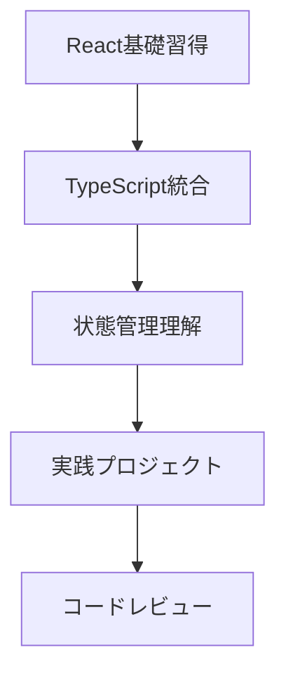
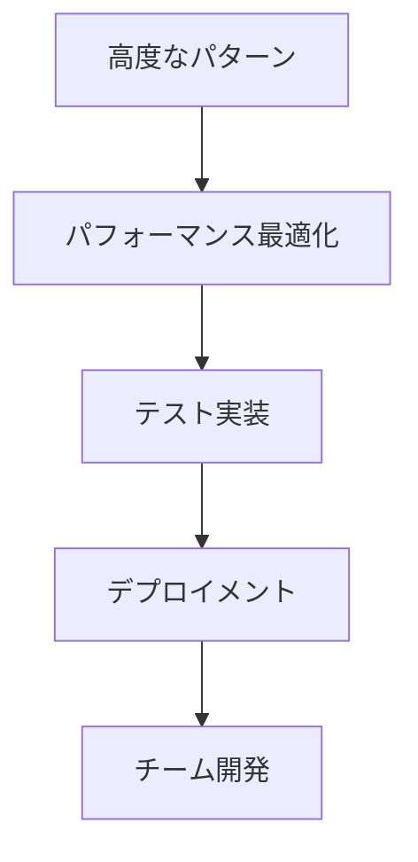
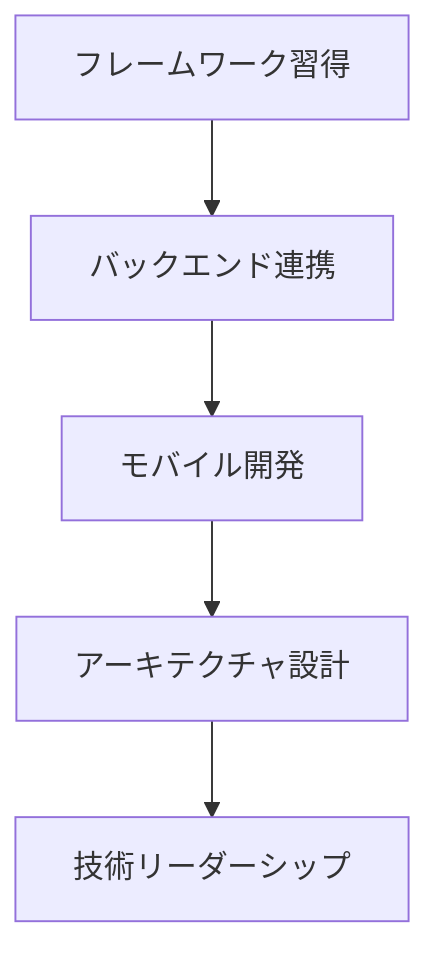

# STEP01 補足資料：参考リソース

> 📚 **このファイルについて**: React × TypeScript 学習を継続するための厳選されたリソース集です。レベル別・目的別に整理されており、学習の進度に合わせて活用してください。

---

## 📚 目次

- [公式ドキュメント](#公式ドキュメント)
- [学習サイト・チュートリアル](#学習サイトチュートリアル)
- [書籍・電子書籍](#書籍電子書籍)
- [動画・コース](#動画コース)
- [実践プロジェクト](#実践プロジェクト)
- [コミュニティ・フォーラム](#コミュニティフォーラム)
- [ツール・拡張機能](#ツール拡張機能)
- [ブログ・記事](#ブログ記事)
- [GitHub リポジトリ](#github-リポジトリ)
- [継続学習ロードマップ](#継続学習ロードマップ)

---

## 公式ドキュメント

### React 関連

| リソース | URL | 説明 | レベル |
|---------|-----|------|--------|
| **React 公式ドキュメント** | [react.dev](https://react.dev/) | 最新のReact学習リソース | 初級〜上級 |
| **React Legacy Docs** | [legacy.reactjs.org](https://legacy.reactjs.org/) | 旧バージョンの参考資料 | 中級〜上級 |
| **React Native** | [reactnative.dev](https://reactnative.dev/) | モバイルアプリ開発 | 中級〜上級 |
| **Next.js** | [nextjs.org](https://nextjs.org/) | React フレームワーク | 中級〜上級 |

### TypeScript 関連

| リソース | URL | 説明 | レベル |
|---------|-----|------|--------|
| **TypeScript 公式** | [typescriptlang.org](https://www.typescriptlang.org/) | TypeScript の公式ドキュメント | 初級〜上級 |
| **TypeScript Handbook** | [typescriptlang.org/docs](https://www.typescriptlang.org/docs/) | 包括的なガイド | 初級〜上級 |
| **TypeScript Playground** | [typescriptlang.org/play](https://www.typescriptlang.org/play) | ブラウザ上でのコード実行 | 全レベル |

### 開発ツール

| リソース | URL | 説明 | レベル |
|---------|-----|------|--------|
| **Vite** | [vitejs.dev](https://vitejs.dev/) | 高速ビルドツール | 初級〜中級 |
| **ESLint** | [eslint.org](https://eslint.org/) | コード品質ツール | 初級〜中級 |
| **Prettier** | [prettier.io](https://prettier.io/) | コードフォーマッター | 初級〜中級 |

---

## 学習サイト・チュートリアル

### 無料学習サイト

| サイト名 | URL | 特徴 | 推奨レベル |
|---------|-----|------|-----------|
| **freeCodeCamp** | [freecodecamp.org](https://www.freecodecamp.org/) | 無料の包括的なカリキュラム | 初級〜中級 |
| **MDN Web Docs** | [developer.mozilla.org](https://developer.mozilla.org/) | Web技術の権威的リファレンス | 全レベル |
| **JavaScript.info** | [javascript.info](https://javascript.info/) | JavaScript の詳細な解説 | 初級〜上級 |
| **React Tutorial** | [react.dev/learn](https://react.dev/learn) | React 公式チュートリアル | 初級〜中級 |

### 日本語学習サイト

| サイト名 | URL | 特徴 | 推奨レベル |
|---------|-----|------|-----------|
| **Zenn** | [zenn.dev](https://zenn.dev/) | 技術記事プラットフォーム | 全レベル |
| **Qiita** | [qiita.com](https://qiita.com/) | エンジニア向け情報共有 | 全レベル |
| **ドットインストール** | [dotinstall.com](https://dotinstall.com/) | 動画学習サイト | 初級〜中級 |
| **Progate** | [prog-8.com](https://prog-8.com/) | インタラクティブ学習 | 初級 |

### インタラクティブ学習

| サイト名 | URL | 特徴 | 推奨レベル |
|---------|-----|------|-----------|
| **CodeSandbox** | [codesandbox.io](https://codesandbox.io/) | ブラウザ上でのコード実行 | 全レベル |
| **StackBlitz** | [stackblitz.com](https://stackblitz.com/) | オンライン IDE | 全レベル |
| **Codepen** | [codepen.io](https://codepen.io/) | フロントエンド実験場 | 全レベル |
| **JSFiddle** | [jsfiddle.net](https://jsfiddle.net/) | JavaScript 実行環境 | 全レベル |

---

## 書籍・電子書籍

### React 関連書籍

| 書籍名 | 著者 | 出版社 | レベル | 備考 |
|--------|------|--------|--------|------|
| **モダンJavaScriptの基本から始める React実践の教科書** | じゃけぇ | SBクリエイティブ | 初級〜中級 | 日本語、実践的 |
| **React.js & Next.js超入門** | 掌田津耶乃 | 秀和システム | 初級 | 日本語、入門向け |
| **Learning React** | Alex Banks, Eve Porcello | O'Reilly | 中級 | 英語、包括的 |
| **React Hooks in Action** | John Larsen | Manning | 中級〜上級 | 英語、Hooks特化 |

### TypeScript 関連書籍

| 書籍名 | 著者 | 出版社 | レベル | 備考 |
|--------|------|--------|--------|------|
| **プログラミングTypeScript** | Boris Cherny | オライリー・ジャパン | 中級〜上級 | 日本語、詳細 |
| **TypeScript実践プログラミング** | 今村謙士 | 技術評論社 | 初級〜中級 | 日本語、実践的 |
| **Effective TypeScript** | Dan Vanderkam | オライリー・ジャパン | 中級〜上級 | 日本語、ベストプラクティス |

### Web開発全般

| 書籍名 | 著者 | 出版社 | レベル | 備考 |
|--------|------|--------|--------|------|
| **JavaScript: The Good Parts** | Douglas Crockford | オライリー・ジャパン | 中級 | JavaScript の本質 |
| **You Don't Know JS** | Kyle Simpson | O'Reilly | 中級〜上級 | JavaScript 深掘り |
| **Clean Code** | Robert C. Martin | アスキードワンゴ | 全レベル | コード品質 |

---

## 動画・コース

### YouTube チャンネル

| チャンネル名 | URL | 特徴 | 言語 |
|-------------|-----|------|------|
| **しまぶーのIT大学** | [YouTube](https://www.youtube.com/@shimabukuIT) | 初心者向け解説 | 日本語 |
| **たにぐちまことのともすたチャンネル** | [YouTube](https://www.youtube.com/@tomosutatv) | Web開発全般 | 日本語 |
| **React** | [YouTube](https://www.youtube.com/@reactjs) | React 公式チャンネル | 英語 |
| **Traversy Media** | [YouTube](https://www.youtube.com/@TraversyMedia) | Web開発チュートリアル | 英語 |
| **The Net Ninja** | [YouTube](https://www.youtube.com/@NetNinja) | 段階的チュートリアル | 英語 |

### オンラインコース

| プラットフォーム | コース例 | 特徴 | 価格 |
|-----------------|----------|------|------|
| **Udemy** | React完全ガイド | 包括的なコース | 有料 |
| **Coursera** | React Specialization | 大学レベル | 有料/無料 |
| **edX** | Introduction to ReactJS | MIT提供 | 無料/有料 |
| **Pluralsight** | React Path | 体系的学習 | 有料 |

---

## 実践プロジェクト

### 初級プロジェクト

| プロジェクト名 | 説明 | 学習ポイント | 推定時間 |
|---------------|------|-------------|----------|
| **Todo アプリ** | タスク管理アプリ | 基本的なCRUD操作 | 1-2週間 |
| **カウンターアプリ** | 数値の増減 | useState の基本 | 1-3日 |
| **天気アプリ** | 天気情報表示 | API連携 | 1週間 |
| **電卓アプリ** | 計算機能 | イベントハンドリング | 1週間 |

### 中級プロジェクト

| プロジェクト名 | 説明 | 学習ポイント | 推定時間 |
|---------------|------|-------------|----------|
| **ブログアプリ** | 記事投稿・閲覧 | ルーティング、状態管理 | 2-4週間 |
| **Eコマースサイト** | オンラインショップ | 複雑な状態管理 | 1-2ヶ月 |
| **チャットアプリ** | リアルタイム通信 | WebSocket、リアルタイム | 2-3週間 |
| **ダッシュボード** | データ可視化 | チャート、グラフ | 2-4週間 |

### 上級プロジェクト

| プロジェクト名 | 説明 | 学習ポイント | 推定時間 |
|---------------|------|-------------|----------|
| **SNSアプリ** | ソーシャルネットワーク | 認証、複雑なUI | 2-3ヶ月 |
| **プロジェクト管理ツール** | タスク・チーム管理 | 高度な状態管理 | 2-3ヶ月 |
| **動画配信プラットフォーム** | 動画アップロード・再生 | メディア処理 | 3-4ヶ月 |

---

## コミュニティ・フォーラム

### 国際コミュニティ

| コミュニティ名 | URL | 特徴 | 活動レベル |
|---------------|-----|------|-----------|
| **React Community** | [react.dev/community](https://react.dev/community) | 公式コミュニティ | 非常に活発 |
| **Stack Overflow** | [stackoverflow.com](https://stackoverflow.com/) | Q&Aプラットフォーム | 非常に活発 |
| **Reddit r/reactjs** | [reddit.com/r/reactjs](https://www.reddit.com/r/reactjs/) | ディスカッション | 活発 |
| **Discord React** | [discord.gg/react](https://discord.gg/react) | リアルタイムチャット | 活発 |

### 日本語コミュニティ

| コミュニティ名 | URL | 特徴 | 活動レベル |
|---------------|-----|------|-----------|
| **React Japan** | [react-japan-community](https://react-japan-community.connpass.com/) | 日本のReactコミュニティ | 活発 |
| **Frontend Meetup** | [frontend.connpass.com](https://frontend.connpass.com/) | フロントエンド勉強会 | 活発 |
| **TypeScript Japan** | [typescript-jp.connpass.com](https://typescript-jp.connpass.com/) | TypeScript勉強会 | 活発 |

---

## ツール・拡張機能

### VSCode 拡張機能

| 拡張機能名 | 説明 | 重要度 |
|-----------|------|--------|
| **ES7+ React/Redux/React-Native snippets** | Reactスニペット | ★★★★★ |
| **TypeScript Importer** | 自動インポート | ★★★★★ |
| **Prettier** | コードフォーマット | ★★★★★ |
| **ESLint** | コード品質チェック | ★★★★★ |
| **Auto Rename Tag** | タグの自動リネーム | ★★★★☆ |
| **Bracket Pair Colorizer** | 括弧の色分け | ★★★☆☆ |
| **GitLens** | Git情報表示 | ★★★★☆ |
| **Thunder Client** | API テスト | ★★★☆☆ |

### Chrome 拡張機能

| 拡張機能名 | 説明 | 重要度 |
|-----------|------|--------|
| **React Developer Tools** | React デバッグ | ★★★★★ |
| **Redux DevTools** | Redux デバッグ | ★★★★☆ |
| **Lighthouse** | パフォーマンス測定 | ★★★★☆ |
| **Web Developer** | Web開発ツール | ★★★☆☆ |

### オンラインツール

| ツール名 | URL | 用途 | 重要度 |
|---------|-----|------|--------|
| **Can I Use** | [caniuse.com](https://caniuse.com/) | ブラウザ対応確認 | ★★★★★ |
| **Bundlephobia** | [bundlephobia.com](https://bundlephobia.com/) | パッケージサイズ確認 | ★★★★☆ |
| **npm trends** | [npmtrends.com](https://npmtrends.com/) | パッケージ比較 | ★★★☆☆ |
| **TypeScript AST Viewer** | [ts-ast-viewer.com](https://ts-ast-viewer.com/) | AST可視化 | ★★☆☆☆ |

---

## ブログ・記事

### 技術ブログ

| ブログ名 | URL | 特徴 | 更新頻度 |
|---------|-----|------|---------|
| **React Blog** | [react.dev/blog](https://react.dev/blog) | React公式ブログ | 定期的 |
| **Overreacted** | [overreacted.io](https://overreacted.io/) | Dan Abramov のブログ | 不定期 |
| **Kent C. Dodds** | [kentcdodds.com](https://kentcdodds.com/) | React/Testing専門家 | 定期的 |
| **Robin Wieruch** | [robinwieruch.de](https://www.robinwieruch.de/) | React チュートリアル | 定期的 |

### 日本語技術記事

| サイト名 | 特徴 | おすすめタグ |
|---------|------|-------------|
| **Zenn** | 高品質な技術記事 | #React #TypeScript |
| **Qiita** | 幅広い技術情報 | #React #TypeScript |
| **note** | 個人の学習記録 | #プログラミング学習 |

---

## GitHub リポジトリ

### 学習用リポジトリ

| リポジトリ名 | URL | 説明 | スター数 |
|-------------|-----|------|---------|
| **React** | [facebook/react](https://github.com/facebook/react) | React本体 | 200k+ |
| **TypeScript** | [microsoft/TypeScript](https://github.com/microsoft/TypeScript) | TypeScript本体 | 90k+ |
| **30-seconds-of-react** | [30-seconds/30-seconds-of-react](https://github.com/30-seconds/30-seconds-of-react) | Reactスニペット集 | 4k+ |
| **React Patterns** | [chantastic/reactpatterns.com](https://github.com/chantastic/reactpatterns.com) | Reactパターン集 | 13k+ |

### プロジェクトテンプレート

| リポジトリ名 | URL | 説明 | 用途 |
|-------------|-----|------|------|
| **Create React App** | [facebook/create-react-app](https://github.com/facebook/create-react-app) | React プロジェクト作成 | 初学者向け |
| **Vite React Template** | [vitejs/vite](https://github.com/vitejs/vite) | 高速ビルド環境 | 推奨 |
| **Next.js** | [vercel/next.js](https://github.com/vercel/next.js) | フルスタックフレームワーク | 本格開発 |

### 実践例

| リポジトリ名 | URL | 説明 | レベル |
|-------------|-----|------|--------|
| **RealWorld** | [gothinkster/realworld](https://github.com/gothinkster/realworld) | 実世界アプリの実装例 | 中級〜上級 |
| **React TodoMVC** | [tastejs/todomvc](https://github.com/tastejs/todomvc) | Todo アプリの実装例 | 初級〜中級 |

---

## 継続学習ロードマップ

### 短期目標（1-3ヶ月）

#### 学習ステップ
1. **Week 1-2**: React基礎概念の理解
2. **Week 3-4**: TypeScript との統合
3. **Week 5-8**: 状態管理とフック
4. **Week 9-12**: 実践プロジェクト開発

### 中期目標（3-6ヶ月）

#### 学習ステップ
1. **Month 4**: 高度なReactパターン
2. **Month 5**: パフォーマンス最適化
3. **Month 6**: テスト駆動開発

### 長期目標（6ヶ月以上）

#### 学習ステップ
1. **Month 7-9**: Next.js/Gatsby等のフレームワーク
2. **Month 10-12**: フルスタック開発
3. **Year 2+**: アーキテクチャ設計、チームリード

---

## 📈 学習効率を上げるコツ

### 1. アクティブラーニング
- **コードを書きながら学ぶ**: 読むだけでなく実際に手を動かす
- **プロジェクトベース学習**: 実際のアプリケーションを作成
- **ペアプログラミング**: 他の人と一緒にコードを書く

### 2. 継続的な学習
- **毎日少しずつ**: 1日30分でも継続する
- **学習ログの記録**: 進捗を可視化する
- **定期的な復習**: 忘却曲線を意識した復習

### 3. コミュニティ参加
- **勉強会への参加**: オフライン・オンライン問わず
- **OSS貢献**: 小さなバグ修正から始める
- **技術記事の執筆**: アウトプットで理解を深める

### 4. 実践的なスキル
- **Git/GitHub**: バージョン管理の習得
- **デバッグスキル**: 問題解決能力の向上
- **コードレビュー**: 他人のコードから学ぶ

---

## 🎯 レベル別推奨リソース

### 初級者（0-6ヶ月）
1. **React公式チュートリアル** - 基礎理解
2. **TypeScript Handbook** - 型システム理解
3. **freeCodeCamp** - 実践的な練習
4. **Todo アプリ作成** - 基本的なCRUD操作

### 中級者（6ヶ月-1年）
1. **React Hooks in Action** - 高度なフック使用
2. **Testing Library** - テスト実装
3. **Next.js** - フレームワーク学習
4. **実際のプロジェクト参加** - 実務経験

### 上級者（1年以上）
1. **React内部実装の理解** - ソースコード読解
2. **パフォーマンス最適化** - 高度な最適化技術
3. **アーキテクチャ設計** - 大規模アプリケーション設計
4. **OSS貢献** - コミュニティへの貢献

---

## 🔄 定期的な見直し

### 月次レビュー
- [ ] 学習目標の達成度確認
- [ ] 新しいリソースの発見
- [ ] 学習方法の見直し
- [ ] 次月の目標設定

### 四半期レビュー
- [ ] スキルレベルの評価
- [ ] キャリア目標との整合性確認
- [ ] 学習リソースの更新
- [ ] 長期計画の調整

---

> 💡 **継続学習のコツ**: 技術は日々進歩しています。定期的に新しいリソースをチェックし、コミュニティに参加して最新の情報をキャッチアップしましょう。また、学んだことを他の人に教えることで、自分の理解も深まります。

> 🚀 **次のステップ**: このリソース集を参考に、自分に合った学習計画を立てて実行してください。継続的な学習と実践により、必ずスキルアップできます！