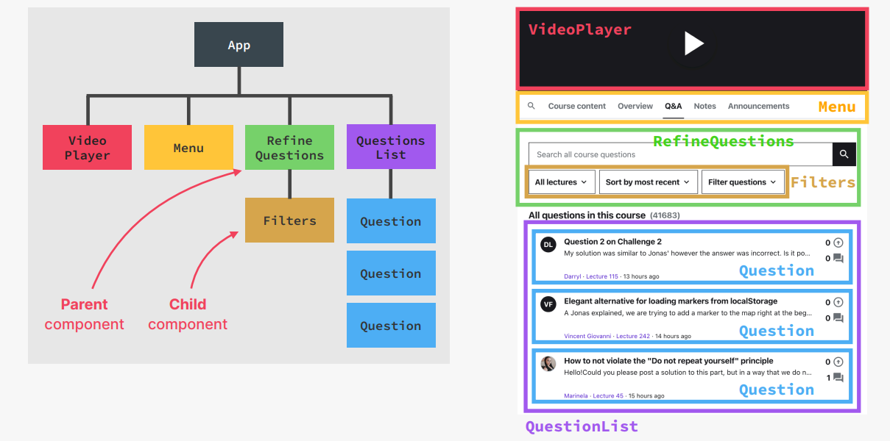

# Session1: React 開発環境とコンポーネント基礎

## 🎯 このセッションで学ぶこと

このセッションでは、React アプリ構築の 3 つの核となる概念を学びます：

- **コンポーネント**：React アプリケーションの構成要素
- **Props**：コンポーネント間でのデータ共有
- **JSX**：強力な宣言的構文

コンポーネントが React アプリの構成要素であることを理解し、JSX 構文でコンポーネントを作成・再利用する方法を習得します。props でコンポーネント間のデータ共有、リストや条件付きレンダリングも学びます。

これらを最初のプロジェクト構築を通じて実践します。

**最終プロジェクト参照**: [`STEP01_project/final`](STEP01_project/final)

---

## 🚀 ルートコンポーネントのレンダリングと StrictMode

### プロジェクトの初期設定

ピザメニュープロジェクトをゼロから構築しましょう。

STEP01/starterディレクトリをVS Codeのプロジェクトとして開きましょう。
```bash
npm install
npm run start
```

上記コマンドでreactアプリを立ち上げて、ブラウザを右、エディタを左に配置して、常に出力を確認できるようにしましょう。

### React 18 での基本セットアップ

最初のファイル `index.js` を作成します。webpack（モジュールバンドラー）はエントリーポイントが `index.js` であることを期待しています。

```javascript
// 基本的なReactライブラリのインポート
import React from "react";
import ReactDOM from "react-dom/client";
```

これは JavaScript のモジュールインポートです。ES6 以降の機能を使っています。

### App コンポーネントの作成

```jsx
function App() {
  return <h1>Hello React!</h1>;
}
```

**重要なルール**：

- コンポーネント名は**大文字で始める**
- 関数は何らかのマークアップ（通常は JSX）を返す

### React 18 でのレンダリング方法

```jsx
// React 18の新しいレンダリング方法
const root = ReactDOM.createRoot(document.getElementById("root"));
root.render(<App />);
```

この方法は、public/index.html の `id="root"` を持つ div 要素に React アプリをレンダリングします。

### React 17 以前との違い

参考：React 17 以前は以下のような書き方でした。

```javascript
// React 17以前の方法（参考用）
// ReactDOM.render(<App />, document.getElementById('root'));
```

### StrictMode の活用

```jsx
const root = ReactDOM.createRoot(document.getElementById("root"));
root.render(
  <React.StrictMode>
    <App />
  </React.StrictMode>
);
```

**StrictMode の効果**：

- 開発中にすべてのコンポーネントを 2 回レンダリングしてバグを発見
- 古い React API の使用をチェック
- 開発時のみ動作（本番環境では影響なし）

StrictMode は画期的な機能ではありませんが、React 開発時は常に有効にするのがおすすめです。

---

## 🔧 コーディング開始前に：デバッグ技術

### 実際の開発で直面する問題への準備

これから自分の PC でコーディングを始めると、必ずエラーやうまくいかないことが出てきます。
そこでまずエラーや問題への対処テクニックを紹介します。

### アプリケーションが更新されない場合の対処法

コードを変更して保存したのに、ページが更新されないことがあります。そんな時はパニックにならず、これから紹介する解決策を試してください。

まず、アプリが本当に動いているか確認しましょう。意外と「npm start」をしていないだけ、ということもあります。
動いているのに更新されない場合は、アプリを一度停止（Ctrl+C）して再起動（npm start）しましょう。
こうした再起動は意外とよく必要になります。

### ブラウザのハードリロードの重要性

また、ブラウザのリロードボタンをクリックしてハードリロードするだけで直ることも多いです。自動リロード（ホットモジュールリプレースメント）はよく壊れます。

### 開発環境の適切な設定

常にターミナルとブラウザの開発者ツール（コンソール）を開いておきましょう。React 開発ツールも便利です。
エラーはコンソールや Problems タブに表示されるので、必ず確認しましょう。

### エラーメッセージの理解と活用

Create React App では、エラーが画面上部にオーバーレイ表示されます。エラーメッセージをよく読んで、分からなければ Google や Stack Overflow で検索しましょう。React のコミュニティは大きいので、必ず答えが見つかります。

### ESLint の活用

ESLint はデフォルトで有効です。未使用変数などを警告してくれるので、黄色い線や Problems タブを必ずチェックしましょう。

### VS Code の出力タブの活用

Prettier や ESLint が動かない場合は、VS Code の Output タブでエラーを確認しましょう。

### 最終的な解決策

それでも動かない場合は、最終プロジェクトのコードと自分のコードを比較しましょう。バグの発見に役立ちます。
これらが React アプリ開発でよくある問題への対処法です。

---

## 🧱 コンポーネント：構成要素としての概念

### コンポーネントとは何か

コンポーネントは React の最も基本的な概念です。React アプリはすべてコンポーネントで構成されています。
React はコンポーネントを Web ページ（UI）に描画します。各コンポーネントがビューとなり、それらが集まって UI を構成します。

### コンポーネントの重要な特性

コンポーネントは独自のデータ・ロジック・外観を持ちます。自分の動作や見た目を記述できるので、UI 構築に最適です。
複雑な UI も、複数のコンポーネントをレゴのように組み合わせて作ります。



### 複雑な UI の構築：実例による理解!

例えば、複雑な UI には大きなコンポーネント（ビデオプレーヤー、メニュー、質問リストなど）と小さなコンポーネント（フィルターなど）が混在します。
フィルターは絞り込み質問コンポーネントの内部にあり、コンポーネントを他のコンポーネントの中にネストして使います。

### コンポーネントの再利用性：重複の解決

コンポーネントのネストと再利用は React の重要な特徴です。
例えば、質問リストに似た質問が 3 つあれば、1 つの質問コンポーネントを作って 3 回再利用します。データは props で渡せます。
UI で重複が必要な場合は、新しいコンポーネントを作り、必要な回数だけ使いましょう。

### コンポーネント分析の重要なスキル

このSTEPで重要なのは、デザインをコンポーネントに分解する力です。
コンポーネントツリーを使うと、UI を構成するコンポーネントの階層やネスト関係が分かりやすくなります。

### 親子関係の理解

コンポーネント間の親子関係も明確に分かります。React では親コンポーネント・子コンポーネントという用語をよく使うので、意味を理解しておきましょう。
コンポーネントツリーはこうした関係の理解に役立ちます。

これでコンポーネントの基本は OK です。再利用性などは後で詳しく説明しますが、まずは実践してみましょう。

---

## ♻️ コンポーネントの作成と再利用

### アプリケーション開発の継続

新しいコンポーネントを作成し、再利用性を体験しながらアプリを作っていきましょう。
まずは GitHub からダウンロードしたスターターファイルを使います。

### スターターファイルの準備

スターターフォルダのpublic フォルダを確認しましょう（pizzas 画像・data.js）

### 新しいコンポーネントの作成

それでは新しいコンポーネントを作成しましょう。

React では、関数を使用して新しいコンポーネントを作成します。

```jsx
function Pizza() {}
```

ピザに関するデータを含むので、関数名を`Pizza`とします。今のところこの関数にはパラメータはなく、関数本体のみあります。

### コンポーネント作成の重要なルール

React で関数としてコンポーネントを書く際には、2 つの重要なルールがあります。

**第一に、関数名は大文字で始める必要があります**。

**第二に、関数は何らかのマークアップを返す必要があります**。通常は `JSX` の形か `null` を返すことがきます。

ここでは、例えば H2 要素を返して、「Pizza」と書きましょう。

```jsx
function Pizza() {
  return <h2>Pizza</h2>;
}
```

保存しても、もちろんユーザーインターフェースには何も表示されません。それは、この新しいコンポーネントをどこにも含めていないからです。

### コンポーネントの使用

つまり、現在画面にレンダリングされているコンポーネントである app コンポーネントに、この pizza コンポーネントを含めていないのです。

h1タグの下に `<Pizza />` と書いてコンポーネントを他のコンポーネントの中で使用できます

```jsx
function App() {
  return (
    <h1>Hello React!</h1>
    <Pizza />
  );
}
```

しかし、これはエラーを発生させます。以前にも見たことがあるエラーです。このエラーの理由は、各コンポーネントは正確に 1 つの要素のみを返すことができ、ここにあるような 2 つの要素は返せないからです。

そこで、2つの要素を div でラップしましょう。今度は UI にピザが表示されます。

```jsx
function App() {
  return (
    <div>
      <h1>Hello React!</h1>
      <Pizza />
    </div>
  );
}
```

### コンポーネントのネスト

これは、この pizza コンポーネントをこの app コンポーネント内にネストしたからです。

ネストとは、基本的にこのコンポーネントを app 内で使用した、または呼び出したということです。

**非常に重要な注意点**：ネストとは、この他の関数内に関数を書くことを意味するのではありません。

```jsx
// ❌ 絶対にやってはいけないこと
function App() {
  function Pizza() {
    // これは非常に悪いアイデア
    return <h2>Pizza</h2>;
  }
  return (
    <div>
      <Pizza />
    </div>
  );
}
```

これは実際にはまだ動作しますが、後で学ぶ理由により、非常に悪いアイデアです。

**したがって、関数宣言をネストしてはいけません。常にすべてのコンポーネントをトップレベルで宣言してください。**

```jsx
// ✅ 正しい方法
function Pizza() {
  return <h2>Pizza</h2>;
}

function App() {
  return (
    <div>
      <Pizza />
    </div>
  );
}
```

つまり、コンポーネントをネストすると言うとき、私たちが意味するのは、このように 1 つのコンポーネントを別のコンポーネントに呼び出す、つまり含めることです。

### より興味深いコンポーネントの作成

さて、この pizza コンポーネントをもう少し発展させましょ🐰。そのために、ここのスターターデータを使用します。

data.js を開いて、すべてを選択し、コピーして、ここに貼り付けます。

今は 1 つの大きなファイルで開発していますが、実際はコードをモジュールに分割します。ここではシンプルに進めます。
data.js の内容を使い、ピザの名前や材料をコピーして貼り付けます。HTML と同じく、テキストには引用符は不要です。

```jsx
function Pizza() {
  return (
    <div>
      
      <h2>スピナーチピザ</h2>
      <p>トマト、モッツァレラ、ほうれん草、リコッタチーズ</p>
    </div>
  );
}
```

段落を追加すると、2 つの要素を返してしまいエラーになります。必ず 1 つの親要素でラップしましょう。

### 画像の使用

public フォルダの画像も使いましょう。画像パスは HTML と同じように書けば Webpack が自動で取得します。

```jsx

```

そして実際、そこに画像があります。

### ESLint による品質管理

画像には必ず alt 属性を付けましょう。ピザの名前を入れると ESLint も満足します。

### コンポーネントの再利用

このコンポーネントを再利用するには、何度も使えば OK です。

```jsx
function App() {
  return (
    <div>
      <h1>Hello React!</h1>
      <Pizza />
      <Pizza />
      <Pizza />
    </div>
  );
}
```

3 回使えば、UI にピザが 3 つ表示されます。今はすべて同じデータですが、props でカスタマイズできるようになります。

### 再利用性の重要な概念

UI の各部分（コンポーネント）は複数回呼び出して再利用できます。これが React の基本です。

### 開発環境の設定（オプション）

最後に、サイドバーや下に色付きの線が表示されるのは、Create React App が自動で GitHub リポジトリ設定するためです。
GitHub を使わない場合は「diff decorations」を「none」に設定するとエディタが見やすくなります。

---

## 📚 学習のまとめ

### このセッションで習得したスキル

| 概念                      | 説明                                | 実例                       |
| ------------------------- | ----------------------------------- | -------------------------- |
| **React 18 セットアップ** | 新しいレンダリング方法と StrictMode | `ReactDOM.createRoot()`    |
| **コンポーネント作成**    | 関数を使用したコンポーネント定義    | `function Pizza() { ... }` |
| **JSX 基礎**              | HTML 風の構文で UI を記述           | `<h1>Hello React!</h1>`    |
| **コンポーネント再利用**  | 同じコンポーネントを複数回使用      | `<Pizza />` × 3            |
| **デバッグ技術**          | エラー対処とツールの活用            | ESLint、開発者ツール       |

### 次のステップ

このセッションで学んだ基礎知識を基に、次のセッションでは以下を学習します：

- **Props**：コンポーネント間でのデータ受け渡し
- **条件付きレンダリング**：状況に応じた表示制御
- **リストレンダリング**：配列データの表示
- **イベントハンドリング**：ユーザー操作への対応

---

## 🎯 重要なポイント

### React 開発の基本原則

- **コンポーネント思考**：UI を小さな再利用可能な部品として考える
- **宣言的アプローチ**：「何を」表示するかに集中する
- **単一責任の原則**：各コンポーネントは 1 つの明確な役割を持つ

### 開発効率を上げるコツ

- **常にターミナルと開発者ツールを開いておく**
- **ESLint の警告に注意を払う**
- **エラーメッセージを恐れずに読む**
- **小さく始めて段階的に複雑にする**

### よくある間違いと対策

| 間違い                         | 正しい方法           | 理由                 |
| ------------------------------ | -------------------- | -------------------- |
| 小文字でコンポーネント名を開始 | 大文字で開始         | React の規約         |
| 複数要素を直接返す             | 1 つの親要素でラップ | JSX の制限           |
| 関数内で関数を定義             | トップレベルで定義   | パフォーマンスの問題 |

このセッションで学んだ基礎知識は React 開発の土台です。次のセッションでより高度な概念を学ぶ準備ができました！
