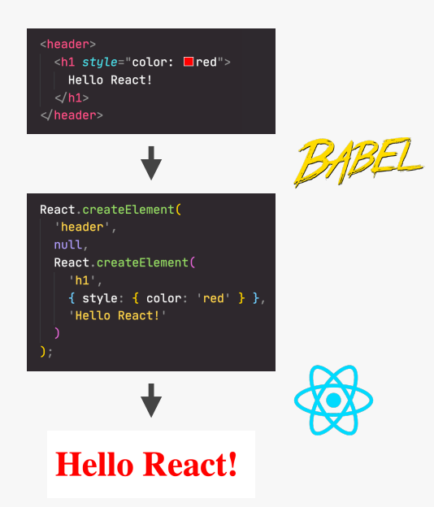

# Session2: JSX とコンポーネント設計

## 🎯 このセッションで学ぶこと

Session1 で学んだ React の基礎を発展させ、より深くコンポーネント設計を理解します：

- **JSX の本質**：宣言的構文の理解と活用方法
- **コンポーネント設計**：再利用可能で保守性の高いコンポーネントの作成
- **JavaScript ロジック**：コンポーネント内でのロジック実装
- **関心の分離**：React における新しい設計思想の理解

Session1 で作ったピザメニューアプリをさらに発展させながら、これらの概念を実践的に学びます。

**最終プロジェクト参照**: [`react/STEP01_基礎/session2_project/final`](react/STEP01_基礎/session2_project/final)

---

## 🎨 JSX とは何か？

### JSX の本質的な理解

このSTEPですでに JSX を書いてきましたが、JSX とは何か、なぜ React で重要なのかを深く理解しましょう。

コンポーネントには独自のデータ、ロジック、外観が含まれます。UI の一部として、どのように見えるかを正確に記述できる必要があります。

そこで JSX が登場します。JSX は、データやロジックに基づいてコンポーネントの見た目や動作を記述する宣言的な構文です。つまり、コンポーネントの外観を表現します。

### JSX の実践的な理解

各コンポーネントは 1 つの JSX ブロックを返し、React はそれを UI にレンダリングします。

JSX は HTML によく似ていますが、実際は JavaScript の拡張です。HTML・CSS・JavaScript を 1 つのコードブロックにまとめて書けます。

HTML を書きつつ、必要に応じて JavaScript の変数や他の React コンポーネントを埋め込んで、組み合わせ・ネスト・再利用できます。

### JSX から JavaScript への変換プロセス

では、React はどうやってこの HTML のようなコードを理解するのでしょう？

JSX は JavaScript の拡張なので、JSX を JavaScript に変換する Babel というツールが自動で行います。

変換後は、各 JSX 要素が React.createElement 関数の呼び出しに変わります。

Babel がなければ JSX は使えません。



### 変換の必要性と意義

この変換が必要なのは、ブラウザが JSX を理解せず HTML しか扱えないからです。JSX は舞台裏で React.createElement の呼び出しに変換され、最終的に HTML 要素が画面に表示されます。

つまり、JSX なしで React を使うこともできますが、createElement 関数を手書きするのは大変ですし、コードも読みにくくなります。

そのため、実際には誰もが JSX を使用しています。

### 宣言的アプローチの理解

JSX が何か分かったところで、「宣言的」とはどういう意味か考えてみましょう。

宣言的の前に、まず命令的とは何かを確認しましょう。

バニラ JavaScript で UI を作るときは命令的アプローチになります。要素を手動で選択し、DOM を操作し、イベントハンドラーを付けて、UI をどう変えるかを細かく指示します。

つまり、命令的アプローチは「どうやって」実現するかを細かく指示する方法です。

### 宣言的アプローチの優位性

複雑なアプリでは命令的アプローチは現実的ではありません。だからこそ React のようなフレームワークが生まれ、宣言的アプローチが選ばれました。

宣言的アプローチは、コンポーネント内のデータ（props や state）に基づいて UI の見た目を記述する方法です。

データが変わると React が自動で UI を再レンダリングし、新しい状態を反映します。

React 開発者は、props や state に基づいて UI の見た目を記述するだけで、DOM 操作などの細かい作業は React が自動でやってくれます。

これが JSX が宣言的である理由です。JSX でデータに基づいて見た目を記述し、DOM 操作は React に任せます。

### 命令的と宣言的の本質的な違い

命令的と宣言的の違いは、宣言的アプローチでは「何を」したいかを記述し、React が「どうやって」実現するかを担当する点です。命令的アプローチは「どうやって」を自分で細かく指示します。

これが JSX と React の強みです。複雑な DOM 操作を気にせず、UI の見た目だけを記述できます。

---

## 🏗️ より多くのコンポーネントの作成

### アプリ完成イメージ

JSX の新しい知識を使って、さらにコンポーネントを作成しましょう。

このセクション終了後のアプリは、ヘッダーにピザ屋の名前、メニュー、営業中かどうかを知らせるフッター、そして注文ボタンが表示されます（ボタンはまだ機能しません）。

アプリの中心は 6 つのピザの表示です。Pizza コンポーネントを 6 回再利用して表示します。

### レイアウトコンポーネントの作成

ここからは、より大きなレイアウトコンポーネントに注目します。

ヘッダー・メニュー・フッターの 3 つの主要部分それぞれにコンポーネントを作成します。

```jsx
function Header() {
  // 今のところ空
}

function Menu() {
  // 今のところ空
}

function Footer() {
  // 今のところ空
}
```

メニュー用・フッター用にも同様に作ります。

ちなみに、これらの関数は関数式やアロー関数でも書けます。

```jsx
// 関数式
const Test = function () {
  return <div>Test</div>;
};

// アロー関数
const Test = () => {
  return <div>Test</div>;
};
```

どの書き方でも OK ですが、関数宣言を使うと一貫性が保てておすすめです。

### Header コンポーネントの実装

では、Header コンポーネントでレストラン名を返しましょう。「Fast React Pizza Company」です。

```jsx
function Header() {
  return <h1>Fast React Pizza Co.</h1>;
}
```

この h1 の代わりに Header コンポーネントを使えます。

```jsx
function App() {
  return (
    <div>
      <Header />
      <Pizza />
      <Pizza />
      <Pizza />
    </div>
  );
}
```

他の HTML 要素と同じように使えるのが JSX の魅力です。

### Footer コンポーネントの実装と React.createElement

次はフッターを作成します。JSX と createElement の違いも体験してみましょう。

```jsx
function Footer() {
  return React.createElement("footer", null, "現在営業中です！");
}
```

JSX なしで React.createElement を使うと、どれだけ書きづらいかが分かります。

footer 要素を返し、props は不要なので null、子要素はテキストだけです。「現在営業中です！」と表示します。

```jsx
function App() {
  return (
    <div>
      <Header />
      <Pizza />
      <Pizza />
      <Pizza />
      <Footer />
    </div>
  );
}
```

アプリで Footer コンポーネントを使うと、下部にフッターが表示されます。

### JSX への変換

では、Footer を JSX で書き直しましょう。今は同じ内容ですが、より分かりやすい書き方です。

```jsx
function Footer() {
  return (
    <footer>現在営業中です！ {new Date().toLocaleTimeString()}</footer>
  );
}
```

ここで JavaScript モードに入り、現在時刻を表示します。
新しい Date を作成し、.toLocaleTimeString で時刻を表示します。
これが HTML と JavaScript を直接組み合わせられる React の力です。

### Menu コンポーネントの実装

最後に Menu コンポーネントです。h2 で「Our menu」と表示し、ピザを並べます。

```jsx
function Menu() {
  return (
    <main>
      <h2>Our Menu</h2>
      <Pizza />
      <Pizza />
      <Pizza />
    </main>
  );
}
```

ピザはメニューの一部なので、Menu コンポーネント内に配置します。
JSX は必ず 1 つのルート要素を返すことを忘れずに。

```jsx
function App() {
  return (
    <div>
      <Header />
      <Menu />
      <Footer />
    </div>
  );
}
```

これで以前と同じ表示ですが、コンポーネントがよりネストされて構造的になりました。

### コンポーネントの階層構造

App コンポーネントの中に Menu コンポーネント、その中に複数の Pizza コンポーネントがネストされます。
小さなコンポーネントを組み合わせて、複雑な UI を構築するイメージがつかめます。

---

## 💡 コンポーネント内の JavaScript ロジック

### コンポーネント内でのロジック実装

React コンポーネント内でロジックを書く例を見てみましょう。

これまでは JSX の中で JavaScript を書いていましたが、コンポーネントはただの関数なので、好きな JavaScript を実行できます。関数が呼ばれると（コンポーネントが初期化されると）すぐに実行されます。

```jsx
function Footer() {
  // コンポーネント内でのJavaScriptロジック
  const hour = new Date().getHours();
  console.log(hour);

  return (
    <footer>現在営業中です！ {new Date().toLocaleTimeString()}</footer>
  );
}
```

たとえば、hour という変数を作り、現在時刻を取得してコンソールに出力できます。

### 条件付きロジックの実装

コンソールをチェックすると、現在の時刻が表示されます。

次は、レストランが営業中かどうかをアラートで表示してみましょう。

```jsx
function Footer() {
  const hour = new Date().getHours();
  const openHour = 12;
  const closeHour = 22;

  // 条件付きロジック
  if (hour >= openHour && hour <= closeHour) {
    alert("現在営業中です！");
  } else {
    alert("申し訳ございません、閉店しております");
  }

  return (
    <footer>現在営業中です！ {new Date().toLocaleTimeString()}</footer>
  );
}
```

openHour（12 時）と closeHour（22 時）を定義し、時刻が営業中なら「現在営業中です！」、そうでなければ「申し訳ございません、閉店しております」とアラートを出します。

なお、React の StrictMode ではコンポーネントが 2 回レンダリングされるため、アラートも 2 回表示されます。

### より実用的なアプローチ

openHour を 8 に変えると「現在営業中です！」と表示されます。

alert は実際のアプリでは使いませんが、ここではデモとして使っています。

```jsx
function Footer() {
  const hour = new Date().getHours();
  const openHour = 12;
  const closeHour = 22;
  const isOpen = hour >= openHour && hour <= closeHour;

  console.log(isOpen);

  return (
    <footer>現在営業中です！ {new Date().toLocaleTimeString()}</footer>
  );
}
```

isOpen という変数を作り、営業中かどうかを判定してコンソールに出力します。
このように、コンポーネント内で JavaScript ロジックを書くことで動的な動作を実装できます。

### 宣言的アプローチの威力

JSX が**宣言的**であるということの意味を理解しましょう。

#### 🆚 命令的 vs 宣言的アプローチ

| 観点     | 命令的（バニラ JavaScript） | 宣言的（React JSX）    |
| -------- | --------------------------- | ---------------------- |
| 思考方法 | 「どうやって」実現するか    | 「何を」表示するか     |
| DOM 操作 | 手動で DOM 要素を選択・変更 | JSX で最終状態を記述   |
| 状態変化 | 各変更を逐次実行            | 状態に基づいて自動更新 |
| コード量 | 多くの手順が必要            | 簡潔で読みやすい       |

#### 命令的アプローチの例（バニラ JavaScript）

```javascript
// 命令的：手順を詳細に指示
const button = document.querySelector("#increment-btn");
const counter = document.querySelector("#counter");
let count = 0;

button.addEventListener("click", () => {
  count++;
  counter.textContent = count;

  // 条件に応じて手動でスタイルを変更
  if (count > 10) {
    counter.classList.add("warning");
  } else {
    counter.classList.remove("warning");
  }
});
```

#### 宣言的アプローチの例（React JSX）

```jsx
// 宣言的：最終状態を記述
function Counter() {
  const [count, setCount] = useState(0);

  return (
    <div>
      <span className={count > 10 ? "warning" : ""}>{count}</span>
      <button onClick={() => setCount(count + 1)}>増加</button>
    </div>
  );
}
```

### JSX の利点

1. **DOM 抽象化**：直接 DOM 操作が不要
2. **自動同期**：データが変更されると自動的に UI が更新
3. **可読性**：HTML ライクな構文で直感的
4. **保守性**：状態と UI の関係が明確

---

## 🧩 より多くのコンポーネントの作成

### アプリケーションの完成形を確認

Session1 で作成したピザアプリケーションを発展させ、以下の構造を持つアプリケーションを構築します：

```
Fast React Pizza Co.
├── Header（ヘッダー）
├── Menu（メニュー）
│   └── Pizza × 6（個別のピザコンポーネント）
└── Footer（フッター）
```

### レイアウトコンポーネントの作成

大きなレイアウト部分ごとにコンポーネントを作成しましょう：

#### Header コンポーネント

```jsx
function Header() {
  return (
    <header className="header">
      <h1>Fast React Pizza Co.</h1>
    </header>
  );
}
```

#### Footer コンポーネント

```jsx
function Footer() {
  return (
    <footer className="footer">
      <p>現在営業中です！ {new Date().toLocaleTimeString()}</p>
    </footer>
  );
}
```

**JSX の威力を実感**：

- HTML と JavaScript を自然に組み合わせ
- `{new Date().toLocaleTimeString()}`でリアルタイム表示
- 波括弧`{}`内で JavaScript 式を実行

#### Menu コンポーネント

```jsx
function Menu() {
  return (
    <main className="menu">
      <h2>Our Menu</h2>
      <Pizza />
      <Pizza />
      <Pizza />
    </main>
  );
}
```

### コンポーネント関数の記述方法

React コンポーネントは複数の方法で記述できます：

```jsx
// 1. 関数宣言（推奨）
function Pizza() {
  return <h2>Pizza</h2>;
}

// 2. 関数式
const Pizza = function () {
  return <h2>Pizza</h2>;
};

// 3. アロー関数
const Pizza = () => {
  return <h2>Pizza</h2>;
};
```

**推奨事項**：関数宣言を使用することで、コードの一貫性と可読性を保ちます。

### React.createElement との比較

JSX の価値を理解するために、JSX を使わない場合を見てみましょう：

```jsx
// JSXなしの場合（非推奨）
function Footer() {
  return React.createElement("footer", null, "現在営業中です！");
}

// JSXを使用した場合（推奨）
function Footer() {
  return <footer>現在営業中です！</footer>;
}
```

**明らかな違い**：

- JSX は直感的で読みやすい
- HTML ライクな構文で学習コストが低い
- ネストした要素も自然に表現可能

### コンポーネントの階層構造

```jsx
function App() {
  return (
    <div className="container">
      <Header />
      <Menu />
      <Footer />
    </div>
  );
}
```

**重要なルール**：

- 各コンポーネントは**1 つのルート要素**のみを返す
- 複数の要素を返す場合は親要素でラップする
- コンポーネント名は**大文字で始める**

### コンポーネントのネスト構造

```
App
├── Header
├── Menu
│   ├── Pizza
│   ├── Pizza
│   └── Pizza
└── Footer
```

この階層構造により、複雑な UI を小さな再利用可能な部品の組み合わせとして構築できます。

---

## 💡 コンポーネント内の JavaScript ロジック

### コンポーネント内でのロジック実装

これまで JSX の返り値内で JavaScript を使用してきましたが、コンポーネントは単なる JavaScript 関数であるため、任意の JavaScript コードを記述できます。

```jsx
function Footer() {
  // コンポーネント内でのJavaScriptロジック
  const hour = new Date().getHours();
  const openHour = 12;
  const closeHour = 22;
  const isOpen = hour >= openHour && hour <= closeHour;

  console.log(`現在時刻: ${hour}時`);
  console.log(`営業中: ${isOpen}`);

  return (
    <footer className="footer">
      {isOpen ? (
        <div className="order">
          <p>
            {openHour}:00から{closeHour}:00まで営業中です。
            ご来店またはオンラインでご注文ください。
          </p>
          <button className="btn">注文する</button>
        </div>
      ) : (
        <p>
          {openHour}:00から{closeHour}:00の間にお越しください。
        </p>
      )}
    </footer>
  );
}
```

### ロジックの実行タイミング

**重要な理解**：コンポーネント内の JavaScript コードは、コンポーネントが初期化される（呼び出される）たびに実行されます。

```jsx
function Pizza() {
  // このコードはコンポーネントがレンダリングされるたびに実行
  console.log("Pizzaコンポーネントがレンダリングされました");

  const pizzaName = "マルゲリータ";
  const price = 1500;

  return (
    <div className="pizza">
      <h3>{pizzaName}</h3>
      <p>価格: ¥{price}</p>
    </div>
  );
}
```

### 条件付きレンダリングの実装

```jsx
function Menu() {
  const hour = new Date().getHours();
  const openHour = 12;
  const closeHour = 22;
  const isOpen = hour >= openHour && hour <= closeHour;

  if (!isOpen) {
    return (
      <main className="menu">
        <h2>申し訳ございません</h2>
        <p>
          {openHour}:00から{closeHour}:00の間にお越しください。
        </p>
      </main>
    );
  }

  return (
    <main className="menu">
      <h2>Our Menu</h2>
      <p>本格的なイタリア料理をお楽しみください。</p>
      <Pizza />
      <Pizza />
      <Pizza />
    </main>
  );
}
```

### デバッグとコンソール出力

開発中は`console.log`を活用してデータの流れを確認しましょう：

```jsx
function Footer() {
  const hour = new Date().getHours();
  const isOpen = hour >= 12 && hour <= 22;

  // デバッグ用のログ出力
  console.log("現在時刻:", hour);
  console.log("営業状態:", isOpen);

  return <footer>{/* JSX内容 */}</footer>;
}
```

**開発のコツ**：

- React StrictMode により、開発環境ではコンポーネントが 2 回レンダリングされる
- そのため、console.log も 2 回表示される
- これは正常な動作で、バグではない

---

## 🏗️ 関心の分離：React の新しいパラダイム

### 従来の関心の分離の理解

Web 開発を学び始めると「関心の分離」として HTML・CSS・JavaScript を分けると教わります。
長い間これが正しい方法とされてきました。技術ごとに分けることで責任が明確になると考えられていました。

しかし、ページがインタラクティブになり SPA が主流になると、JavaScript が HTML の内容や表示を決めるようになりました。
今や HTML は空のコンテナで、内容は JavaScript で動的に生成されます。
つまり、ロジックと UI は密接に結合しており、HTML だけではアプリの動作は分かりません。

この現実を受けて、React は「技術ごと」ではなく「コンポーネントごと」に分離する新しいアプローチを提案しました。
つまり、各コンポーネントが関連する HTML・CSS・JavaScript をすべて持ちます。

この新しいアプローチの強みは「コロケーション（co-location）」です。一緒に変更されるものは一緒に配置する、という考え方です。
例えばボタンの見た目を変えたい場合、HTML・CSS・JavaScript を 1 つのコンポーネントファイルでまとめて変更できます。

React のアプローチは「単一責任の原則」の新しい解釈でもあります。
従来は「HTML は構造、CSS は見た目、JavaScript は動作」と技術ごとに責任を分けていました。
React では「各コンポーネントは 1 つの UI 要素に責任を持つ」という機能的な分離になります。

この新しいアプローチで保守性が大きく向上します。特定の UI 要素に問題があれば、関連コードが 1 箇所にまとまっているので修正が簡単です。
新機能追加も、関連コードを 1 箇所に書けるので効率的です。

さらに、コンポーネントが自己完結型なので、他のプロジェクトや他の場所でも簡単に再利用できます。

React の関心の分離は「技術ごと」から「機能ごと」への大きなパラダイムシフトです。
これにより、保守しやすく、理解しやすく、再利用しやすいコードが書けるようになりました。
この新しいアプローチが、React が大規模・複雑なアプリ開発に向いている理由のひとつです。
