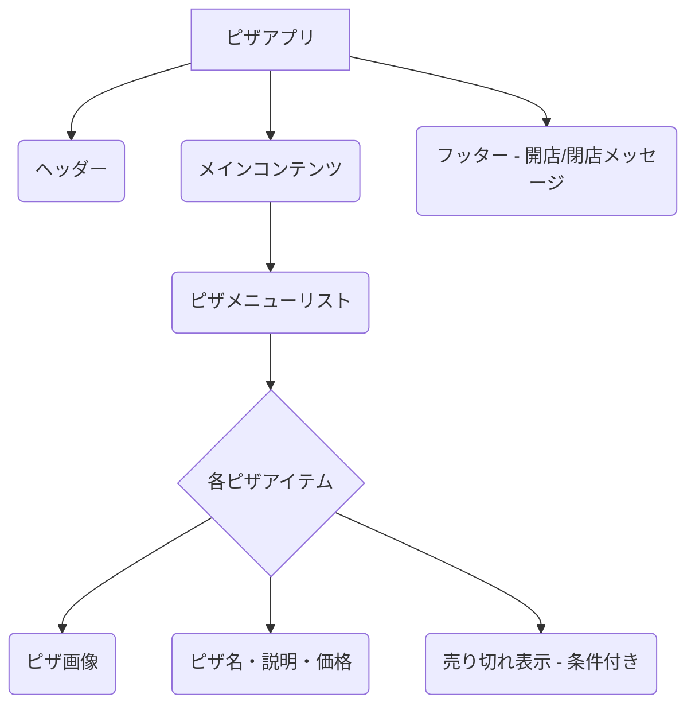

# STEP02 Session 1: プロジェクト設定とヘッダーコンポーネント

> ⏰ **セッション時間**: 90 分
> 🎯 **目標**: React + TypeScript + Vite プロジェクトをセットアップし、基本的なヘッダーコンポーネントを作成して `props` の受け渡しを理解する。
> 📋 **前提**: STEP01 で学習した React 基礎概念、TypeScript の基本的な型定義。

## 🚀 はじめに：ピザアプリ開発の旅へ

この STEP02 では、React と TypeScript を用いて、シンプルな**オンラインピザメニューアプリ**を開発します。このアプリを通じて、コンポーネント設計、データフロー、条件付きレンダリング、スタイリングといった React 開発の核となる概念を実践的に学びます。

### 🍕 ピザアプリの全体像と主な機能

私たちが作成するピザアプリは、以下のような機能を持つことを目指します。

- **ヘッダー**: アプリケーションのタイトルを表示します。
- **ピザメニュー表示**: 利用可能なピザの一覧を、画像、名前、説明、価格と共に表示します。
- **売り切れ表示**: 特定のピザが売り切れの場合、その旨を視覚的に示します。
- **開店/閉店メッセージ**: アプリケーションが開店時間内か閉店時間外かに応じて、異なるメッセージを表示します。

最終的なアプリケーションのイメージは以下のようになります。



### 💡 なぜヘッダーから始めるのか？

「なぜ、いきなりピザのメニューではなく、ヘッダーから作成するのだろう？」と感じるかもしれません。これにはいくつかの重要な理由があります。

1.  **アプリケーションの骨格構築**: ヘッダーは、ウェブアプリケーションの基本的なレイアウトを構成する上で不可欠な要素です。まずヘッダーを作成することで、アプリケーションの「顔」となる部分を定義し、その後のコンテンツ配置の基準を確立します。
2.  **`props` の概念導入**: ヘッダーコンポーネントは、アプリケーションのタイトルなど、親コンポーネントからデータを受け取る良い例となります。これにより、React におけるデータの一方向フローの基本である `props` の概念を、シンプルかつ明確に学ぶことができます。
3.  **開発環境の動作確認**: 最小限のコンポーネント（ヘッダー）を作成し、それが正しく表示されることを確認することで、Vite と React のセットアップが正常に機能しているかを早期に検証できます。これは、複雑な機能に進む前の重要なステップです。

このセッションでは、まず開発環境を整え、次にこのヘッダーコンポーネントを実装することで、React 開発の基礎をしっかりと固めていきます。

## 📅 セッション構成

| 時間     | 内容                                       | 形式 | 成果物                              |
| :------- | :----------------------------------------- | :--- | :---------------------------------- |
| 0-15 分  | 導入: STEP02 の概要とプロジェクトの目的    | 講義 | STEP02 の学習目標理解               |
| 15-45 分 | React + TypeScript + Vite プロジェクト設定 | 実践 | 動作する開発環境                    |
| 45-75 分 | ヘッダーコンポーネントの作成と Props       | 実践 | タイトル表示ヘッダーコンポーネント  |
| 75-90 分 | まとめ・振り返り                           | 討論 | プロジェクト設定と Props の理解確認 |

## 🎯 学習目標の詳細

### 💡 このセッションで身につけること

- [ ] Vite を使った React + TypeScript プロジェクトの初期設定ができる
- [ ] 最小限の React コンポーネントを作成し、アプリケーションに組み込める
- [ ] コンポーネントに `props` を使ってデータを渡す基本的な方法を理解し、実装できる
- [ ] TypeScript で `props` の型定義を行うことができる

### 📝 成果物

- Vite で初期化された React + TypeScript プロジェクト
- アプリケーションのタイトルを表示する `Header` コンポーネント
- `Header` コンポーネントが `props` でタイトルを受け取り、表示していること

## 📚 レクチャー 1-8: プロジェクト設定とヘッダーコンポーネント

### 🔍 なぜこの技術が重要なのか

💡 **実務での価値**:

- 現代のフロントエンド開発において、効率的な開発環境の構築は必須です。Vite は高速な開発サーバーとビルドプロセスを提供し、開発体験を大幅に向上させます。
- コンポーネントは React アプリケーションの基本単位であり、再利用性と保守性を高めます。
- `props` は React の一方向データフローの根幹であり、コンポーネント間のデータ連携を安全かつ予測可能にします。
- TypeScript による `props` の型定義は、開発中のエラーを減らし、大規模なアプリケーション開発におけるコードの堅牢性を保証します。

🎯 **解決する課題**:

- 開発環境のセットアップにかかる時間を短縮し、すぐに開発を始められるようにする。
- UI を再利用可能な部品に分割し、コードの重複を避ける。
- コンポーネント間でデータを安全に受け渡し、予期せぬバグを防ぐ。
- 開発初期段階で型関連のエラーを検出し、実行時エラーを未然に防ぐ。

### 📝 実装の詳細解説

#### Level 1: 基礎実装 - Vite プロジェクトの作成

```bash
# 💡 基本的な実装例
# Vite を使って React + TypeScript プロジェクトを作成します
npm create vite@latest pizza-menu -- --template react-ts
cd pizza-menu
npm install
npm run dev
```

**🔍 解説ポイント**:

- `npm create vite@latest` コマンドは、Vite のプロジェクトテンプレートを使って新しいプロジェクトを生成します。
- `-- --template react-ts` は、React と TypeScript を使用するテンプレートを指定しています。
- `cd pizza-menu` で作成されたプロジェクトディレクトリに移動し、`npm install` で必要な依存関係をインストールします。
- `npm run dev` で開発サーバーを起動し、ブラウザでアプリケーションを確認できます。

#### Level 2: 型安全な実装 - ヘッダーコンポーネントの作成と Props の型定義

`src/components/Header.tsx` を作成します。

```typescript
// 🎯 型安全性を高めた実装
// src/components/Header.tsx
import React from "react";

// Headerコンポーネントが受け取るpropsの型を定義
interface HeaderProps {
  title: string; // タイトルは必須の文字列
}

const Header: React.FC<HeaderProps> = ({ title }) => {
  return (
    <header>
      <h1>{title}</h1>
    </header>
  );
};

export default Header;
```

`src/App.tsx` を修正します。

```typescript
// 🎯 型安全性を高めた実装
// src/App.tsx
import React from "react";
import Header from "./components/Header"; // Headerコンポーネントをインポート

function App() {
  return (
    <div className="container">
      {/* Headerコンポーネントにpropsとしてタイトルを渡す */}
      <Header title="ピザメニュー" />
      <main>
        {/* ここに他のコンポーネントが配置されます */}
        <p>ようこそ、ピザの世界へ！</p>
      </main>
    </div>
  );
}

export default App;
```

**⚠️ 注意点**:

- `interface HeaderProps` で `title` プロップが `string` 型であることを明示しています。これにより、`Header` コンポーネントを使用する際に `title` プロップが文字列でない場合、TypeScript がエラーを報告します。
- `React.FC<HeaderProps>` は、関数コンポーネントの型定義に `HeaderProps` を適用しています。これにより、`props` の型安全性が保証されます。
- `({ title }) => { ... }` のように、`props` オブジェクトを分割代入することで、コードの可読性が向上します。

#### Level 3: 実践的実装 - スタイリングの適用

`src/App.css` を修正します。

```css
/* 🚀 実務レベルの実装 */
/* src/App.css */
body {
  font-family: sans-serif;
  margin: 0;
  background-color: #f4f4f4;
  color: #333;
}

.container {
  max-width: 960px;
  margin: 0 auto;
  padding: 20px;
  background-color: #fff;
  box-shadow: 0 0 10px rgba(0, 0, 0, 0.1);
}

header {
  background-color: #a00;
  color: white;
  padding: 20px;
  text-align: center;
  margin-bottom: 20px;
}

header h1 {
  margin: 0;
  font-size: 2.5em;
}

main {
  padding: 20px 0;
}
```

**📝 実装のコツ**:

- グローバルなスタイルは `index.css` や `App.css` に記述し、コンポーネント固有のスタイルは CSS Modules を使用して管理すると、スタイルの衝突を防ぎやすくなります。
- 今回はシンプルなアプリケーションのため、`App.css` に直接スタイルを記述していますが、大規模なプロジェクトでは CSS Modules や styled-components などの利用を検討しましょう。

### 💻 実践演習

#### 演習 1-1: ヘッダーにサブタイトルを追加する

**🎯 演習目的**: `props` の受け渡しと型定義の理解を深める。

**📋 要件**:

- `Header` コンポーネントに `subtitle` という新しい `props` を追加する。
- `subtitle` は文字列型で、必須ではない（オプショナル）。
- `Header` コンポーネント内で `subtitle` が存在する場合のみ表示する。
- `App.tsx` から `Header` コンポーネントに `subtitle` を渡して表示を確認する。

**💡 ヒント**:

- TypeScript でオプショナルなプロパティを定義するには、プロパティ名の後ろに `?` をつけます（例: `subtitle?: string;`）。
- 条件付きレンダリングには、論理 AND 演算子 (`&&`) や三項演算子 (`? :`) を使用できます。

**✅ 期待される結果**:

- ヘッダーにメインタイトルとサブタイトルが表示される。
- `subtitle` を渡さない場合でもエラーが発生せず、サブタイトルが表示されないこと。

### 🔍 理解度チェック

以下の質問に答えられるかチェックしてみましょう：

1. **基礎理解**: Vite を使って React + TypeScript プロジェクトを作成する基本的なコマンドは何ですか？
2. **応用理解**: `props` を使って親コンポーネントから子コンポーネントへデータを渡すメリットは何ですか？
3. **実践理解**: TypeScript で `props` の型定義を行うことの重要性と、それが開発プロセスにどのように役立つかを説明してください。

## 🗒️ セッションまとめ

### ✅ 今回学んだこと

- Vite を用いた React + TypeScript プロジェクトの初期設定方法
- React コンポーネントの基本的な作成とアプリケーションへの組み込み方
- `props` を使ったコンポーネントへのデータ受け渡し
- TypeScript を用いた `props` の型定義と型安全性の確保

### 📝 次回への準備

- 今回作成したプロジェクトをベースに開発を進めますので、プロジェクトが正しく動作することを確認しておきましょう。
- 次回はピザのデータ構造を定義し、メニューコンポーネントと個々のピザコンポーネントを作成します。

### 🔄 復習推奨項目

- React のコンポーネントの概念
- JavaScript の分割代入（Destructuring Assignment）
- TypeScript の `interface` または `type` によるオブジェクトの型定義

---

**次のセッション**: [Session2](./STEP02_Session2_メニューとピザコンポーネント.md)
