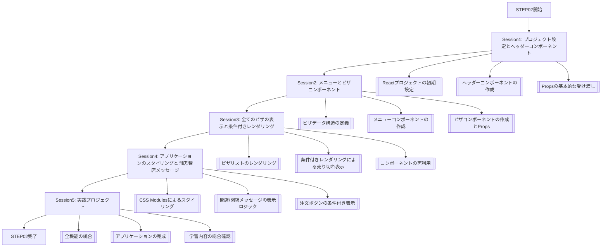

# STEP02: コンポーネント型設計とプロップの受け渡し基礎と TypeScript 統合（セッション分割学習）

> 💡 **対象**: TypeScript 上級者・React 初心者
> 🎯 **形式**: 講師サポート付きセッション分割学習（5 セッション、最終は実践プロジェクト）
> ⏰ **総時間**: 450 分（7.5 時間）

## 📚 関連補足資料

この STEP の学習をサポートする補足資料をご用意しています：

- 📖 **[専門用語集](./STEP02_補足_専門用語集.md)** - コンポーネント型設計とプロップの受け渡し + TypeScript の重要な概念と用語の詳細解説
- 🛠️ **[開発環境ガイド](./STEP02_補足_開発環境ガイド.md)** - React + TypeScript + Vite 環境構築と設定方法
- 💻 **[実践コード例](./STEP02_補足_実践コード例.md)** - 段階的なコンポーネント型設計とプロップの受け渡し実装例集
- 🚨 **[トラブルシューティング](./STEP02_補足_トラブルシューティング.md)** - よくあるエラーと解決方法
- 📚 **[参考リソース](./STEP02_補足_参考リソース.md)** - 学習に役立つリンク集

> 💡 **活用方法**: 学習中に疑問が生じた際や、より深く理解したい場合に参照してください 🐰

## 📅 STEP 概要

**学習目標**:

- [ ] React コンポーネントの基本的な型設計を理解し、実践できる
- [ ] `props` を使ったデータフローの管理方法を習得する
- [ ] 条件付きレンダリングを適切に実装できる
- [ ] コンポーネントの再利用性と分割の重要性を理解し、実践できる
- [ ] TypeScript を用いたプロップの型定義を正確に行える
- [ ] CSS Modules によるコンポーネントスコープのスタイリングを適用できる

**前提知識**:

- TypeScript 上級レベル（ジェネリクス、ユニオン型、条件型等の理解）
- React 基礎概念（STEP01 で学習した内容）
- コンポーネントの分割とプロップの受け渡しに関する基礎知識

---

## ⏰ セッション構成（5 セッション、最終は実践プロジェクト）

| セッション                                                                               | 時間  | 内容                                                | 対象レクチャー | 成果物                                |
| :--------------------------------------------------------------------------------------- | :---- | :-------------------------------------------------- | :------------- | :------------------------------------ |
| **[Session1](./STEP02_Session1_プロジェクト設定とヘッダーコンポーネント.md)**            | 90 分 | プロジェクト設定とヘッダーコンポーネント            | 1-8            | 基本的な React プロジェクトとヘッダー |
| **[Session2](./STEP02_Session2_メニューとピザコンポーネント.md)**                        | 90 分 | メニューとピザコンポーネント                        | 9-16           | ピザデータの表示基盤                  |
| **[Session3](./STEP02_Session3_全てのピザの表示と条件付きレンダリング.md)**              | 90 分 | 全てのピザの表示と条件付きレンダリング              | 17-24          | 売り切れ表示機能付きピザリスト        |
| **[Session4](./STEP02_Session4_アプリケーションのスタイリングと開店_閉店メッセージ.md)** | 90 分 | アプリケーションのスタイリングと開店/閉店メッセージ | 25-30          | スタイリングされたピザメニューアプリ  |
| **[Session5](./STEP02_Session5_実践プロジェクト.md)**                                    | 90 分 | **実践プロジェクト** - ピザメニューアプリケーション | 31-32          | **完成ピザメニューアプリケーション**  |

### セッション数決定ガイドライン（学習内容分割 + 実践プロジェクト）

**基本構成**: 理論学習セッション（4 個） + 実践プロジェクトセッション（1 個）

- **5 セッション**: 豊富な学習内容（基本概念 3-4 個）

**最終セッション（実践プロジェクト）の役割**:

- その STEP で学んだ全ての概念を統合
- 実際に動作するプロジェクトの完成
- 学習内容の実践的な応用
- 理解度の総合的な確認

---

## 🗺️ 学習フローマップ

## 🎯 TypeScript 統合の特徴

### 1. コンポーネントプロップの厳格な型定義

- React コンポーネントが受け取る `props` オブジェクトに対して、TypeScript の `interface` や `type` を用いて厳格な型定義を行います。
- これにより、コンポーネントが期待するデータの構造を明確にし、誤ったプロップの受け渡しによるバグを開発段階で検出します。
- オプショナルなプロップや、特定の型制約（例: 数値の範囲、文字列のパターン）も型システムで表現します。

### 2. イベントハンドラーの型安全性

- `onClick` や `onChange` といったイベントハンドラー関数に対しても、TypeScript の組み込み型（例: `React.MouseEvent<HTMLButtonElement>`）やカスタム型を適用します。
- イベントオブジェクトのプロパティ（例: `event.target.value`）へのアクセスが型安全になり、実行時エラーのリスクを低減します。
- コールバック関数として渡されるプロップの型定義も行い、親コンポーネントと子コンポーネント間のインターフェースを明確にします。

### 3. 条件付きレンダリングにおける型の推論とガード

- 条件付きレンダリング（例: `if` 文、三項演算子）において、TypeScript が自動的に型の絞り込み（Type Narrowing）を行うことで、コードの安全性を高めます。
- 特定の条件分岐内で変数の型が保証されるため、不必要な型アサーションを避け、よりクリーンなコードを記述できます。
- `null` や `undefined` の可能性のある値に対する安全なアクセス（オプショナルチェイニング `?.` や Nullish Coalescing `??`）と、それらの型ガードの適用を学習します。

## 📊 STEP02 評価基準

### 技術習得度（70%）

#### コンポーネント型設計（25%）

- [ ] React コンポーネントの `props` に適切な TypeScript の型定義（`interface` または `type`）を適用できる
- [ ] コンポーネントの役割に応じた型設計の原則を理解し、実践できる
- [ ] 複雑なデータ構造を持つプロップに対しても、ネストされた型定義を正確に行える

#### プロップの受け渡しとデータフロー（25%）

- [ ] 親コンポーネントから子コンポーネントへ `props` を使ってデータを正しく受け渡せる
- [ ] `props` オブジェクトの分割代入（Destructuring Assignment）を効果的に利用できる
- [ ] コンポーネントツリーにおけるデータフローの方向（一方向データフロー）を理解し、それに沿った実装ができる

#### 条件付きレンダリングと再利用性（20%）

- [ ] 条件付きレンダリング（`if`文、三項演算子、論理 AND 演算子）を用いて、特定の条件に基づいて UI 要素を表示・非表示できる
- [ ] コンポーネントを適切に分割し、再利用可能なコンポーネントを作成できる
- [ ] 売り切れ表示など、動的な UI 変更を条件付きレンダリングで実装できる

### 実践活用度（30%）

#### ピザメニューアプリケーションの実装（15%）

- [ ] 指示された要件に基づき、ピザメニューアプリケーションをゼロから構築できる
- [ ] ヘッダー、メニュー、ピザアイテムなど、アプリケーションの主要コンポーネントを適切に分割し、実装できる
- [ ] 実際のピザデータを用いて、アプリケーションが正しく動作することを確認できる

#### スタイリングとユーザー体験（15%）

- [ ] CSS Modules を用いて、コンポーネントごとにスコープされたスタイリングを適用できる
- [ ] 開店/閉店メッセージや注文ボタンなど、動的な UI 要素をスタイリングし、ユーザー体験を向上できる
- [ ] アプリケーション全体の一貫したデザインとレイアウトを実現できる

---

## 🚀 次のステップ

**STEP02 完了後の学習パス**:

- 🔜 **STEP03**: Props・State・Event 型管理
- 📈 **応用課題**: ピザメニューアプリケーションにカート機能を追加し、注文合計金額を計算する機能を実装してみましょう。
- 🔄 **復習推奨**: コンポーネントの分割、`props` の受け渡し、条件付きレンダリングの概念と実装パターンを復習しましょう。

**学習継続のコツ**:

- 学んだ概念を小さな独立したコンポーネントで試す習慣をつけましょう。
- 公式ドキュメントや信頼できる技術ブログを定期的に参照し、最新の情報をキャッチアップしましょう。
- 他の人のコードを読み、様々な実装パターンから学びを得ましょう。

---

💡 **学習サポート**: 疑問や課題があれば、補足資料を参照するか、講師にお気軽にご相談ください！
