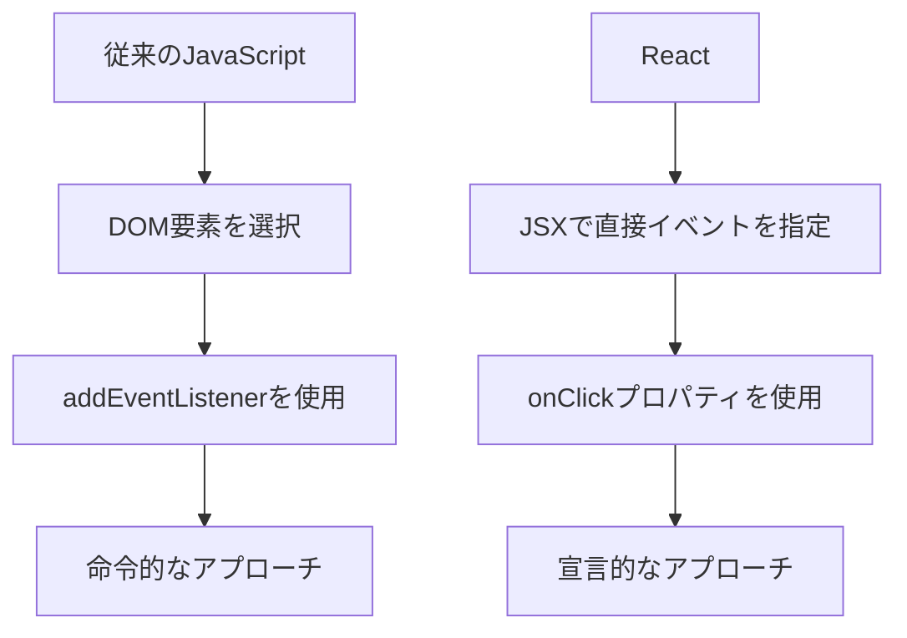
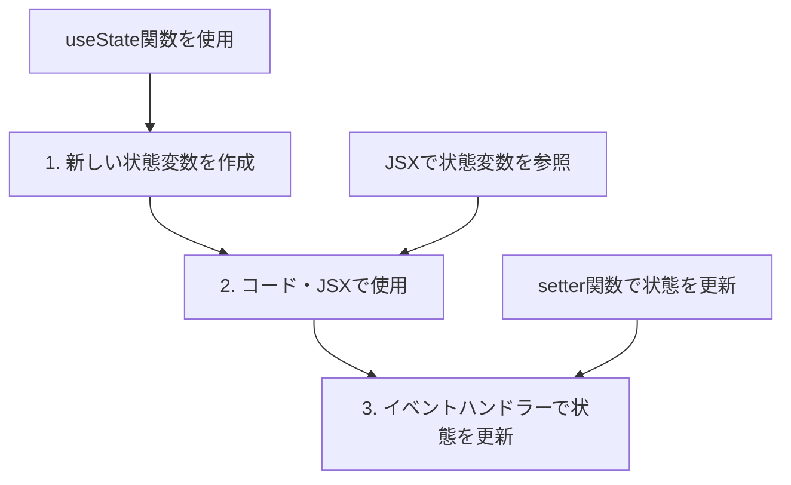
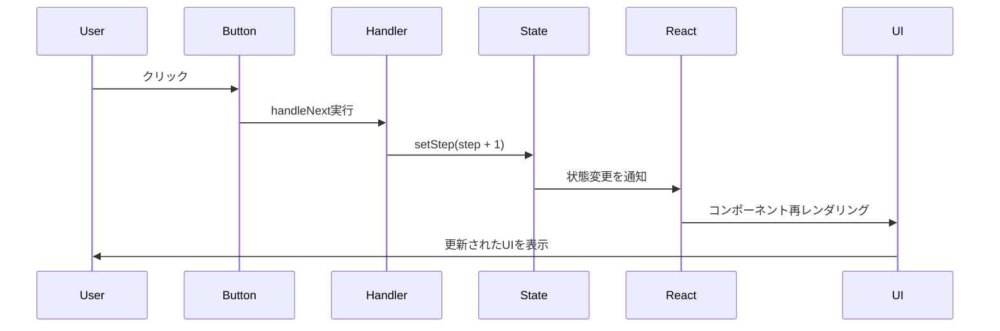

# Session1: イベント処理と状態の基本

## セクション概要

ここでは、基本的なReactのトピックを引き続き探求し、最終的にコンポーネントをインタラクティブにします。そのためには、Reactでのイベント処理方法と、非常に重要な概念である状態（state）を使用してユーザーインターフェースを更新する方法を学習します。

また、次のプロジェクトの構築も開始します。ここでは、状態と制御された要素を使用してReactの流儀でフォームを構築することに焦点を当てます。セクションの終わりには、PropsとStateについて理論と実践の両方で学んだ内容を、優れた小さなフラッシュカードアプリケーションを構築することで習得します。

これは非常に重要で基礎的なセクションですので、早速進めていきましょう。

## ステップコンポーネントを構築しましょう

このセクションでは、イベントと状態について学習し、いくつかのステップをナビゲートできるシンプルなコンポーネントを構築します。この講義では、そのコンポーネントの静的な部分の構築から始めます。

コンポーネントを構築するために、Create-React-Appを使用して新しいプロジェクトを作成します。Windowsを使用している場合はコマンドプロンプトを、Macを使用している場合はターミナルを開いてください。

ターミナルでは、現在どのフォルダにいるかを常に確認してください。コマンドプロンプトで現在のフォルダを確認できます。そこから、新しいプロジェクトを作成したいフォルダに移動してください。今回はデスクトップに移動します。

移動可能なフォルダを確認できます。現在はホームフォルダにいるので、cdコマンドを使用してフォルダを移動できます。なお、Windowsでは、lsの代わりにdirコマンドを使用します。

デスクトップに移動したら、新しいプロジェクトを作成しましょう。npx Create-React-Appを実行し、バージョン番号5を指定してください。これにより、全員が同じバージョンを使用できます。

このプロジェクトに「steps」という名前を付けます。Enterキーを押すと、Create-React-Appが処理を開始します。

その間、実際に構築するコンポーネントを確認しましょう。これは3つのステップがあるコンポーネントです。最初に説明したように、ボタンをクリックすることでステップをナビゲートできます。

「次へ」をクリックすると、ステップ2に移動します。「求職に応募する」というメッセージが表示されます。まずReactを学び、次に求職に応募し、そして新しい収入を投資するという流れです。これらのボタンをクリックできるため、インタラクティブな機能があります。また、このコンポーネントを閉じたり開いたりすることもできます。

改めて説明しますが、この講義では、このコンポーネントの静的な部分の構築から始めます。つまり、インタラクティビティなしのコンポーネントです。JSXを記述するだけです。

Create-React-Appが完了しました。フォルダをVS Codeにドラッグアンドドロップするか、直接開いてください。

スターターファイルを整理しましょう。ほとんどのファイルを削除し、app.jsとindex.jsだけを残します。不要なファイルはすべてゴミ箱に移動できます。

index.jsを開きましょう。今回は、すべてを手動で記述する必要はありません。動作原理はすでに理解しているため、Create-React-Appが提供したコードを保持できます。不要な部分とインポートを削除するだけです。

index.cssファイルも削除したため、このインポートは現在機能しませんが、スターターファイルにはCSSファイルがあります。最初にダウンロードしたファイルを開き、stepsスターターファイルから必要なファイルをコピーして、steps内のソースに配置します。vanilla.HTMLもpublicフォルダに移動しましょう。これについては後で説明します。

app.jsファイルからappをインポートする方法を確認してください。ここですべてを整理し、最初から新しいコンポーネントを作成しましょう。

通常通り、そのコンポーネントはappコンポーネントになります。function appとして定義し、appという名前のコンポーネントをルートコンポーネントとして使用します。これは、アプリケーション内のすべてのコンポーネントの親コンポーネントです。

何かを返しましょう。Hello React。最後に、この関数をエクスポートする必要があります。export defaultを使用することで、index.jsがここでインポートできるようになり、DOMにレンダリングされます。以前手動で記述したのと同じ仕組みですが、今回はコードを残しておきます。すべてを手動で行う必要はありません。

統合されたVS Codeターミナルを開きましょう。クリックするだけで開けます。ご覧のとおり、すでにプロジェクトフォルダに自動的に入っています。プロジェクトを開始するために必要なのは、npm startを実行することだけです。

これにより、新しいブラウザタブが自動的に開きます。ここにapp.jsの内容が表示されています。少しスペースを空けて、ファイル名app.jsがコンポーネントの名前と同じであることを確認してください。これはコース全体を通してのパターンになります。

ここではJSXを記述して、インタラクティビティなしのコンポーネントを作成しましょう。クラス名がstepsのdivから始めます。CSSに興味がある場合は、含めたCSSファイルを確認してください。

このdivには3つの子要素があります。numbersというクラスのdivがあり、ここに数字1、2、3があります。作業を効率化するために、コードを複製します。以前説明したように、コピーラインダウンで実行できます。このコマンドをカスタマイズしている場合は、どのコマンドかを確認し、必要に応じてショートカットをカスタマイズできます。

次に進みましょう。ここでは段落が必要です。クラス名がmessageの段落を作成し、とりあえずプレースホルダーを使用しましょう。最後にボタン用のdivを作成し、ボタン要素を追加します。

確認してみましょう。最初のボタンは「前へ」と表示され、次に「次へ」と表示される別のボタンがあります。ここでは基本的に数字、メッセージ、ボタンがあります。現在の状態はすでにそれに非常に近いです。

このボタンはデモのように紫色ではありません。後でもう1つのボタンがあり、背景色がないためです。これらのスタイルを2つのボタンに直接追加しましょう。これで、個々のJSX要素にスタイルを追加する方法を再度練習できます。

styleプロパティを要素に渡すことでスタイルを適用できることを覚えています。JavaScriptモードに入り、ここでスタイルのオブジェクトを定義できます。背景色を設定し、色は7950F2です。テキストの色も白（FFF）に設定します。JavaScriptオブジェクトなので、文字列である必要があります。

これらの色がきれいにハイライトされている理由が気になる場合は、color highlightという拡張機能があるためです。インストール数が500万個もある非常に人気のある拡張機能です。この外観を再現したい場合は、インストールできます。

効率化のため、これをすべてコピーします。「次へ」ボタンも同様に設定します。かなり近い状態になりました。現在欠けているのは、現在のステップのハイライトです。ステップ1にいるので、紫色でハイライトされています。そのためには別のクラス名があります。activeというクラス名です。

最後にメッセージも追加しましょう。これらのメッセージは、提供したCSSファイルにあります。このJavaScriptオブジェクトをコメントとして配置したので、これをコンポーネントの外に貼り付けましょう。

このデータはコンポーネント内のものに依存しないため、この配列が毎回再作成されるのを防ぐために、外側に配置する必要があります。オブジェクトが作成されるタイミングや、これらの関数が実行されるタイミングについては、後で詳しく学習します。

現在は、これらのReact機能の使い方を学んでいるだけです。それらが裏でどのように機能するかはまだ学んでいません。Reactの仕組みはまだ隠されており、さまざまな機能の使い方だけを学んでいます。

このメッセージ、つまり配列の最初の要素をここに必要としています。しかし、それをコピーするだけではありません。動的に読み取りたいのです。このコンポーネント内で、現在どのステップにいるかを示す変数を定義しましょう。

const stepと設定し、1に設定しましょう。後でこれらのボタンをクリックしたときに更新したいのは、このステップです。しかし、今は静的な部分を構築しているだけなので、手動で1に設定しています。

stepとステップ番号を記述し、配列から値を取得しましょう。messages[step - 1]です。配列は0から始まるため、マイナス1が必要です。素晴らしいですね。

ここで手動で2に変更すると、メッセージが変更されます。しかし、変更されなかったのは、ステップ番号2がアクティブとしてマークされなかったことです。これらの要素にスタイルを条件付きで設定する必要があります。

activeというクラス名をすべてに追加すると、常にアクティブになります。しかし、それは望ましくありません。この文字列を条件に基づいて生成する必要があります。前のセクションで学んだ通りです。

JavaScriptモードに入り、テンプレートリテラルを記述できるようにします。ここではアクティブまたは何も返します。基本的にテンプレートのJavaScriptモードに入り、ステップが1以上かどうかを確認しましょう。そうであれば、操作の結果はアクティブという文字列になります。そうでない場合は、何もありません。

この1つはすでに紫色になったことがわかります。2は1より大きいからです。これをすべてに追加しましょう。ここでは、適応する必要があります。うまくいっています。3があれば、すべてがアクティブになります。

これを素早く確認しましょう。この1つにはactiveというクラスがあり、これらにはクラス属性がありますが、ここでは空文字列を指定しました。これは、これら2つのケースで返す空の文字列です。

素晴らしい。これがアプリケーションの静的な部分です。しかし、ボタンをクリックしてナビゲートできるようにしたいのです。このステップ変数を手動で変更するのではなく、ボタンのクリックイベントを処理する方法を学ぶ時が来ました。それが次の講義で扱う内容です。

# React流でイベントを処理する

Reactでイベントを処理することは、実際には非常に簡単です。その方法を学びましょう。想像できるように、DOMを直接操作するaddEventListenerは使用しません。それはUIを構築する命令的な方法だからです。Reactでは、より宣言的なアプローチを使用します。

## イベントハンドリングの基本概念

### 従来のJavaScriptとReactの違い



### Reactのイベントハンドリング方法

DOM要素を直接選択しません。そのため、addEventListenerも使用しません。代わりに、HTMLのインラインイベントリスナーと似たものを使用します。

基本的に、イベントが発生する要素で直接イベントをリッスンします。例えば、ボタンでは、onClickプロパティを使用できます。

## 基本的なイベントハンドラーの実装

### インラインでのイベントハンドラー定義

```javascript
// 基本的なイベントハンドラーの例
function App() {
  return (
    <div className="steps">
      <div className="numbers">
        <div className="active">1</div>
        <div>2</div>
        <div>3</div>
      </div>

      <p className="message">Step 1: Learn React ⚛️</p>

      <div className="buttons">
        <button
          style={{ backgroundColor: "#7950f2", color: "#fff" }}
          onClick={() => alert("Previous")}
        >
          Previous
        </button>
        <button
          style={{ backgroundColor: "#7950f2", color: "#fff" }}
          onClick={() => alert("Next")}
        >
          Next
        </button>
      </div>
    </div>
  );
}
```

### 重要なポイント：関数 vs 関数呼び出し

```javascript
// ❌ 間違った方法：関数を呼び出している
<button onClick={alert("TEST")}>
  Click me
</button>

// ✅ 正しい方法：関数を渡している
<button onClick={() => alert("TEST")}>
  Click me
</button>
```

**なぜ間違いなのか？**
- `alert("TEST")`は関数呼び出しで、コンポーネントがレンダリングされた瞬間に実行される
- `() => alert("TEST")`は関数で、ボタンがクリックされたときに実行される

## 分離されたイベントハンドラー関数

### handleで始まる関数の命名規則

通常、イベントハンドラー関数を直接onClickプロパティに定義するのではなく、代わりに別の関数を作成し、その関数をここに渡します。

```javascript
function App() {
  // イベントハンドラー関数をコンポーネント内で定義
  function handlePrevious() {
    alert("Previous");
  }
  
  function handleNext() {
    alert("Next");
  }
  
  return (
    <div className="steps">
      <div className="numbers">
        <div className="active">1</div>
        <div>2</div>
        <div>3</div>
      </div>

      <p className="message">Step 1: Learn React ⚛️</p>

      <div className="buttons">
        <button
          style={{ backgroundColor: "#7950f2", color: "#fff" }}
          onClick={handlePrevious}
        >
          Previous
        </button>
        <button
          style={{ backgroundColor: "#7950f2", color: "#fff" }}
          onClick={handleNext}
        >
          Next
        </button>
      </div>
    </div>
  );
}
```

### 命名規則の重要性

- `handle`で始まる関数名は、React開発では非常に標準的
- この関数がイベントハンドラー関数であることが一目で分かる
- コンポーネントのJSXのどこかで使用されていることが推測できる

## その他のイベントタイプ

Reactでは、クリックイベント以外にも様々なイベントを処理できます：

```javascript
function EventExamples() {
  return (
    <div>
      <button
        onClick={() => console.log("クリックされました")}
        onMouseEnter={() => console.log("マウスが入りました")}
        onMouseLeave={() => console.log("マウスが出ました")}
      >
        イベントテスト
      </button>
      
      <input
        onChange={(e) => console.log("入力値:", e.target.value)}
        onFocus={() => console.log("フォーカスされました")}
        onBlur={() => console.log("フォーカスが外れました")}
      />
    </div>
  );
}
```

## 実践演習

### 演習1: 基本的なイベントハンドリング

以下のコンポーネントを作成してください：

```javascript
function ClickCounter() {
  // ここにイベントハンドラーを実装してください
  
  return (
    <div>
      <h2>クリックカウンター</h2>
      <button>クリックしてください</button>
      <p>まだクリックされていません</p>
    </div>
  );
}
```

**要件：**
- ボタンをクリックするとアラートが表示される
- 適切な命名規則を使用する
- 関数呼び出しではなく関数を渡す

### 演習2: 複数のイベントハンドラー

```javascript
function InteractiveButton() {
  return (
    <button>
      インタラクティブボタン
    </button>
  );
}
```

**要件：**
- クリック時：「ボタンがクリックされました」をコンソールに出力
- マウスエンター時：「マウスが入りました」をコンソールに出力
- マウスリーブ時：「マウスが出ました」をコンソールに出力

これで、イベントハンドリングの基本は理解できました。しかし、実際にUIを更新するためには、**状態（state）**が必要です。次のセクションで状態について学びましょう。

# ReactにおけるStateとは何か？

イベントハンドラーの使用方法を学びましたが、今度はそれらに実際に有用なことをさせたいと思います。コンポーネントをインタラクティブにしたいのです。そのためには、すでに述べたように、状態が必要です。

間違いなく、状態はReactで最も重要な概念です。基本的にReactではすべてが状態を中心に回っています。コース全体を通して状態について学び続けます。

このコースを進める間に状態について実際に学ぶことの概要から始めましょう。まず、状態が実際に何であるか、何をするか、そしてなぜそれが必要なのかを学びます。これがこのセクションの内容です。

次に、useStateまたはuseReducerフック、Context API、またはReduxなどの外部ツールを使用して、実際に状態を使用する方法を学ぶ必要があります。また、Reactで状態について考える方法を深く理解する必要があります。これらは将来のセクションのトピックです。

これで準備ができたので、状態が実際に何であるかを学ぶ準備ができました。

propsを使用してコンポーネントにデータを渡す方法を学びました。これは、コンポーネントの外部から来るデータであることを覚えています。しかし、コンポーネントが実際に独自のデータを保持し、時間の経過とともにそれを保持する必要がある場合はどうでしょうか？また、アクションの結果としてUIを変更して、アプリを実際にインタラクティブにしたい場合はどうでしょうか？

そこで状態が登場します。状態は基本的に、コンポーネントが時間の経過とともに保持できるデータです。コンポーネントがそのライフサイクル全体を通して覚えておく必要がある情報に使用します。

状態をコンポーネントのメモリと考えることができます。これはかなり役立つ類推だと思います。

状態の例は、通知カウント、入力フィールドのテキスト内容、またはタブコンポーネントのアクティブなタブなどの単純なものである可能性があります。また、ショッピングカートの内容など、もう少し複雑なデータである可能性もあります。

これらすべての状態の断片に共通しているのは、アプリケーションで、ユーザーがこれらの値を簡単に変更できることです。例えば、通知を読むと、カウントが1つ減ります。または、別のタブをクリックすると、そのタブがアクティブになります。

これらの各コンポーネントは、アプリケーションのライフサイクル全体にわたって、このデータを時間の経過とともに保持できる必要があります。その理由で、これらの各情報は状態の一部です。

ここで状態の一部という用語を使用していることに注意してください。状態という用語自体はより一般的な用語だからです。状態の一部、または状態変数は、コンポーネント内で定義できる単一の実際の変数です。

一方、状態という用語自体は、コンポーネントが置かれている全体的な状態についてです。つまり、特定の時点での全体的な条件です。基本的に、一般的な用語である状態は、すべての状態の断片を合わせたものです。

これが混乱に聞こえる場合は、心配しないでください。これらは用語の小さな違いです。実際には、通常、状態、状態の一部、および状態変数という用語をかなり互換的に使用します。

状態の最も重要な側面に移りましょう。それは、状態を更新するとReactがコンポーネントを再レンダリングするという事実です。

コンポーネント内の状態の一部を更新するたびに、これによりReactはユーザーインターフェースでそのコンポーネントを再レンダリングします。そのコンポーネントの新しい更新されたビューを作成します。コンポーネントのビューは、基本的に画面上で視覚的にレンダリングされたコンポーネントです。つまり、ユーザーインターフェースです。

この時点まで、一般的な用語であるユーザーインターフェースを使用してきました。しかし、今は実際に単一のコンポーネントについて話しています。単一のコンポーネントがレンダリングされるとき、それをビューと呼びます。すべてのビューが組み合わされて、最終的なユーザーインターフェースを構成します。

コースの最初にReactがデータをUIと同期させる方法について最初に話したときに見た小さな図を覚えていますか？状態はReactがそれを行う方法です。状態はReactがユーザーインターフェースをデータと同期させる方法です。

状態を変更すると、UIが変更されます。状態は開発者に2つの重要なことを可能にします。第一に、状態はコンポーネントのビューをコンポーネントを再レンダリングすることによって更新することを可能にします。UIの一部を変更する方法を提供します。

第二に、状態は開発者が複数のレンダリングおよび再レンダリングの間でローカル変数を永続化することを可能にします。これを考えると、状態は基本的にツールです。実際、それは私たちがReactの世界で持っている最も強力なツールです。

状態がどのように機能するか、そしてそれが何をするかを理解すること、つまり、状態の仕組みを理解することは、React開発の力を解き放つでしょう。しかし、状態の仕組みを理解する前に、まずコードに戻って、この強力なツールを実際に行動で初めて使用しましょう。

# useStateで状態変数を作成する

状態とは何かを知ったので、私たちの小さなプロジェクトに実装してみましょう。そして、簡単なリマインダーとして、私たちが望むことは、この次へボタンと前へボタンをクリックしたときに、ステップを変更したいということです。

## 状態を使用する3つのステップ

コンポーネントで実際の状態を使用するために、3つのステップで行います：



### ステップ1: 状態変数の作成

まず、静的な変数を削除して、useStateを使用します：

```javascript
import { useState } from 'react';

const messages = [
  "Learn React ⚛️",
  "Apply for jobs 💼",
  "Invest your new income 🤑"
];

function App() {
  // ❌ 静的な変数（削除）
  // const step = 1;
  
  // ✅ useState関数を使用して状態変数を作成
  const [step, setStep] = useState(1);
  
  // ... 残りのコード
}
```

### useStateの仕組みを理解する

useStateが何を返すのかを、段階的に理解しましょう：

**ステップ1：useStateの戻り値を確認**
```javascript
function App() {
  const array = useState(1);
  console.log(array);
  // 出力: [1, function]
}
```

**配列の中身：**
- `array[0]`：現在の状態値（この場合は1）
- `array[1]`：状態を更新するための関数

**ステップ2：通常の配列アクセス方法**
```javascript
const array = useState(1);
const currentValue = array[0];  // 1
const updateFunction = array[1]; // function

// 使用例
updateFunction(2); // 状態を2に更新
```

**ステップ3：分割代入を使った簡潔な書き方**
```javascript
// 上記と同じ意味だが、より簡潔
const [currentValue, updateFunction] = useState(1);
//     ↑            ↑
//   状態値      更新関数
```

**命名規則：**
```javascript
const [step, setStep] = useState(1);
//     ↑     ↑
//   状態名  set + 状態名
```

この分割代入により、配列の要素に意味のある名前を付けて、コードを読みやすくしています。

### ステップ2: JSXでの状態使用

```javascript
function App() {
  const [step, setStep] = useState(1);
  
  return (
    <div className="steps">
      <div className="numbers">
        <div className={step >= 1 ? "active" : ""}>1</div>
        <div className={step >= 2 ? "active" : ""}>2</div>
        <div className={step >= 3 ? "active" : ""}>3</div>
      </div>

      <p className="message">
        Step {step}: {messages[step - 1]}
      </p>

      <div className="buttons">
        <button
          style={{ backgroundColor: "#7950f2", color: "#fff" }}
          onClick={handlePrevious}
        >
          Previous
        </button>
        <button
          style={{ backgroundColor: "#7950f2", color: "#fff" }}
          onClick={handleNext}
        >
          Next
        </button>
      </div>
    </div>
  );
}
```

### ステップ3: イベントハンドラーでの状態更新

```javascript
function App() {
  const [step, setStep] = useState(1);
  
  function handlePrevious() {
    if (step > 1) {
      setStep(step - 1); // 状態を更新
    }
  }
  
  function handleNext() {
    if (step < 3) {
      setStep(step + 1); // 状態を更新
    }
  }
  
  // ... JSX
}
```

## 完全なStepsコンポーネント

```javascript
import { useState } from 'react';

const messages = [
  "Learn React ⚛️",
  "Apply for jobs 💼",
  "Invest your new income 🤑"
];

function App() {
  const [step, setStep] = useState(1);
  
  function handlePrevious() {
    if (step > 1) setStep(step - 1);
  }
  
  function handleNext() {
    if (step < 3) setStep(step + 1);
  }
  
  return (
    <div className="steps">
      <div className="numbers">
        <div className={step >= 1 ? "active" : ""}>1</div>
        <div className={step >= 2 ? "active" : ""}>2</div>
        <div className={step >= 3 ? "active" : ""}>3</div>
      </div>

      <p className="message">
        Step {step}: {messages[step - 1]}
      </p>

      <div className="buttons">
        <button
          style={{ backgroundColor: "#7950f2", color: "#fff" }}
          onClick={handlePrevious}
        >
          Previous
        </button>
        <button
          style={{ backgroundColor: "#7950f2", color: "#fff" }}
          onClick={handleNext}
        >
          Next
        </button>
      </div>
    </div>
  );
}

export default App;
```

## 状態更新の流れ

ボタンをクリックしてから画面が更新されるまでの処理を、段階的に説明します：

**ステップ1：イベント発生**
- ユーザーが「Next」ボタンをクリック
- ブラウザがクリックイベントを検知

**ステップ2：イベントハンドラー実行**
- `handleNext`関数が呼び出される
- 関数内で`setStep(step + 1)`が実行される

**ステップ3：Reactの内部処理**
- Reactが状態変更を検知
- 「step」の値が1から2に変更されることを記録
- コンポーネントの再レンダリングをスケジュール

**ステップ4：再レンダリング実行**
- `App`関数が再度実行される
- 新しい状態値（step = 2）でJSXが生成される
- 仮想DOMで前回との差分を計算

**ステップ5：DOM更新**
- 実際に変更が必要な部分のみDOMを更新
- 例：「Step 1: Learn React」→「Step 2: Apply for jobs」
- 例：ステップ2の円の背景色が紫色に変更

**ステップ6：画面表示**
- ブラウザが更新されたDOMを画面に描画
- ユーザーに新しいUIが表示される

この一連の流れは、通常数ミリ秒で完了するため、ユーザーには瞬時に更新されているように見えます。



## バグの修正：境界値チェック

最初の実装では、ボタンを連続でクリックすると問題が発生します：

```javascript
// ❌ 問題のあるコード
function handleNext() {
  setStep(step + 1); // step が 4, 5, 6... と無制限に増加
}

function handlePrevious() {
  setStep(step - 1); // step が 0, -1, -2... と減少
}
```

**修正版：**

```javascript
// ✅ 修正されたコード
function handleNext() {
  if (step < 3) {  // 最大値をチェック
    setStep(step + 1);
  }
}

function handlePrevious() {
  if (step > 1) {  // 最小値をチェック
    setStep(step - 1);
  }
}
```

## Reactフックのルール

useStateは**Reactフック**です。フックには重要なルールがあります：

### ✅ 正しい使用方法

```javascript
function App() {
  // ✅ コンポーネントのトップレベルで使用
  const [step, setStep] = useState(1);
  const [isOpen, setIsOpen] = useState(true);
  
  // ... 残りのコード
}
```

### ❌ 間違った使用方法

```javascript
function App() {
  // ❌ 条件文の中で使用
  if (someCondition) {
    const [step, setStep] = useState(1); // エラー！
  }
  
  // ❌ ループの中で使用
  for (let i = 0; i < 3; i++) {
    const [count, setCount] = useState(0); // エラー！
  }
  
  // ❌ 関数の中で使用
  function handleClick() {
    const [temp, setTemp] = useState(0); // エラー！
  }
}
```

**なぜこのルールが重要なのか？**
- Reactは呼び出し順序でフックを識別している
- 条件やループで呼び出し順序が変わると、Reactが混乱する
- ESLintが自動的にこれらのエラーを検出してくれる

## 実践演習

### 演習1: 基本的なカウンター

以下のカウンターコンポーネントを完成させてください：

```javascript
import { useState } from 'react';

function Counter() {
  // ここにuseStateを実装してください
  
  return (
    <div>
      <h2>カウンター</h2>
      <p>現在の値: {/* ここに状態値を表示 */}</p>
      <button onClick={/* 増加ハンドラー */}>+1</button>
      <button onClick={/* 減少ハンドラー */}>-1</button>
      <button onClick={/* リセットハンドラー */}>リセット</button>
    </div>
  );
}
```

### 演習2: 表示/非表示の切り替え

```javascript
import { useState } from 'react';

function ToggleComponent() {
  // ここにuseStateを実装してください
  
  return (
    <div>
      <button onClick={/* 切り替えハンドラー */}>
        {/* 状態に応じてボタンテキストを変更 */}
      </button>
      
      {/* 条件付きレンダリングでメッセージを表示/非表示 */}
      <p>この文章は表示/非表示が切り替わります</p>
    </div>
  );
}
```

おめでとうございます！あなたは**状態の力とReactの力を解き放ちました**。これで、命令的なDOM操作なしで、動的なコンポーネントを作成できるようになりました。
