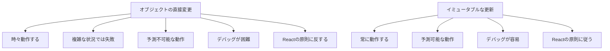

# Session2: useState実装と状態更新

# 状態を手動で設定しないでください！

前回の講義の終わりには、セッター関数を使用して状態を更新するだけだと言いましたが、それを鵜呑みにしないでください。実際にこれを探索して、Reactを壊してみましょう。

## なぜ手動での状態更新が問題なのか

状態を手動で更新しようとするとどうなるかを見てみましょう。

### 実験1: let変数での直接更新

```javascript
function App() {
  // ❌ constをletに変更（間違った方法）
  let [step, setStep] = useState(1);
  
  function handleNext() {
    // ❌ 直接変数を更新（間違った方法）
    step = step + 1;
    console.log("step updated to:", step); // コンソールでは更新される
  }
  
  return (
    <div className="steps">
      <p>Step {step}: {messages[step - 1]}</p>
      <button onClick={handleNext}>Next</button>
    </div>
  );
}
```

**何が起こるか：**
- ボタンをクリックしても**UIは更新されない**
- コンソールでは値が変更されているが、画面は変わらない
- Reactはエラーを出さないが、何も起こらない

### なぜこれが問題なのか？

```mermaid
graph TD
    A[ボタンクリック] --> B[step = step + 1]
    B --> C[変数は更新される]
    C --> D[しかしReactは知らない]
    D --> E[再レンダリングが発生しない]
    E --> F[UIは更新されない]
    
    G[正しい方法] --> H[setStep(step + 1)]
    H --> I[Reactが状態変更を検知]
    I --> J[再レンダリングが発生]
    J --> K[UIが更新される]
```

**理由：**
- Reactは、これが状態を更新しようとしていることを知る方法がない
- Reactは魔法の方法で変数の変更を検知できない
- 状態変更の通知システムが機能しない

### 正しい方法との比較

```javascript
function App() {
  const [step, setStep] = useState(1);
  
  function handleNextWrong() {
    // ❌ 間違った方法
    step = step + 1; // UIは更新されない
  }
  
  function handleNextCorrect() {
    // ✅ 正しい方法
    setStep(step + 1); // UIが更新される
  }
  
  return (
    <div className="steps">
      <p>Step {step}: {messages[step - 1]}</p>
      <button onClick={handleNextWrong}>Wrong Way</button>
      <button onClick={handleNextCorrect}>Correct Way</button>
    </div>
  );
}
```

## 実験2: オブジェクト状態の直接変更

より微妙な問題として、オブジェクトや配列の状態を直接変更する場合があります：

### 問題のあるコード例

```javascript
function App() {
  // オブジェクト状態を作成（セッター関数を取得しない）
  const [test] = useState({ name: "Jonas" });
  
  function handleNext() {
    // ❌ オブジェクトのプロパティを直接変更
    test.name = "Fred";
    console.log("Updated name:", test.name);
  }
  
  return (
    <div>
      <p>Name: {test.name}</p>
      <button onClick={handleNext}>Change Name</button>
    </div>
  );
}
```

**驚くべきことに、これは動作する場合があります！**
しかし、これは**非常に悪い習慣**です。

### なぜオブジェクトの直接変更が悪いのか



### 正しいオブジェクト状態の更新方法

```javascript
function App() {
  // ✅ セッター関数も取得
  const [test, setTest] = useState({ name: "Jonas" });
  
  function handleNext() {
    // ✅ 新しいオブジェクトを作成して更新
    setTest({ name: "Fred" });
  }
  
  return (
    <div>
      <p>Name: {test.name}</p>
      <button onClick={handleNext}>Change Name</button>
    </div>
  );
}
```

## Reactのイミュータビリティ原則

### 基本原則

```javascript
// ❌ 状態を直接変更（ミューテーション）
state.property = newValue;
state.push(newItem);
state[index] = newValue;

// ✅ 新しい状態を作成（イミュータブル）
setState({ ...state, property: newValue });
setState([...state, newItem]);
setState(state.map((item, i) => i === index ? newValue : item));
```

### 配列状態の正しい更新方法

```javascript
function TodoList() {
  const [todos, setTodos] = useState([]);
  
  function addTodo(text) {
    // ❌ 間違った方法
    // todos.push({ id: Date.now(), text });
    
    // ✅ 正しい方法
    setTodos([...todos, { id: Date.now(), text }]);
  }
  
  function removeTodo(id) {
    // ❌ 間違った方法
    // const index = todos.findIndex(todo => todo.id === id);
    // todos.splice(index, 1);
    
    // ✅ 正しい方法
    setTodos(todos.filter(todo => todo.id !== id));
  }
  
  function updateTodo(id, newText) {
    // ✅ 正しい方法
    setTodos(todos.map(todo =>
      todo.id === id ? { ...todo, text: newText } : todo
    ));
  }
}
```

## 実践演習

### 演習1: 間違いを見つけて修正

以下のコードの問題点を見つけて修正してください：

```javascript
function BuggyCounter() {
  let [count, setCount] = useState(0);
  const [user, setUser] = useState({ name: "Alice", age: 25 });
  
  function incrementCount() {
    count = count + 1; // 問題1
  }
  
  function updateAge() {
    user.age = user.age + 1; // 問題2
  }
  
  return (
    <div>
      <p>Count: {count}</p>
      <p>User: {user.name}, Age: {user.age}</p>
      <button onClick={incrementCount}>Increment</button>
      <button onClick={updateAge}>Age Up</button>
    </div>
  );
}
```

### 演習2: 複雑なオブジェクト状態の更新

以下の要件を満たすコンポーネントを作成してください：

```javascript
function UserProfile() {
  const [user, setUser] = useState({
    name: "John",
    age: 30,
    address: {
      city: "Tokyo",
      country: "Japan"
    },
    hobbies: ["reading", "coding"]
  });
  
  // 以下の関数を実装してください：
  // 1. 名前を更新する関数
  // 2. 年齢を1つ増やす関数
  // 3. 都市を更新する関数
  // 4. 新しい趣味を追加する関数
  // 5. 趣味を削除する関数
}
```

## まとめ

**重要なルール：**
1. **常に`const`を使用**してuseStateの結果を受け取る
2. **セッター関数のみを使用**して状態を更新する
3. **状態を直接変更しない**（イミュータビリティを保つ）
4. **新しいオブジェクト/配列を作成**して状態を更新する

これらのルールを守ることで、予測可能で安全なReactアプリケーションを構築できます。

# 状態の仕組み

useState関数を使用して状態の力を目の当たりにしましたが、今度は状態がReactでどのように機能するかをよりよく理解しましょう。以前に議論した基本的なReactの原則から始めます。

Reactでは、DOMを直接操作しないことを学んだことを覚えていますか？コンポーネントのビューを更新したいときは、Reactは宣言的であり、命令的ではありません。コードでDOMに触れることはありません。

しかし、そうであれば、データが変更されたとき、またはクリックなどのイベントに応答する必要があるときに、画面上のコンポーネントを更新する方法という質問につながります。答えは状態であることをすでに知っていますが、ここでは最初の原則から導き出そうとしています。

その質問に答えるために、もう1つの基本的なReactの原則を理解する必要があります。それは、Reactがコンポーネントビューを基になるデータが変更されるたびにそのコンポーネント全体を再レンダリングすることによって更新するという事実です。

Reactの裏側で何が起こるかについて言及するセクションに達すると、コンポーネントが再レンダリングされるときにReact内で実際に何が起こるかについてすべてを学びます。しかし、今のところ、再レンダリングは基本的に、Reactがコンポーネント関数を再度呼び出すことを意味します。コンポーネントがレンダリングされるたびにです。

概念的には、Reactがビュー全体を削除し、再レンダリングが必要になるたびに新しいビューに置き換えると想像できます。しかし、後で何が起こるかを正確に学びます。

Reactは、再レンダリングの間、コンポーネントの状態を保持します。コンポーネントがレンダリングされても、コンポーネントがUIから完全に消えない限り、再レンダリングされても、状態はリセットされません。それをマウント解除と呼びます。

状態といえば、状態が更新されたときにコンポーネントが自動的に再レンダリングされます。ビューにイベントハンドラーがあると想像してみましょう。例えば、ユーザーがクリックできるボタンなど。

そのボタンがクリックされた瞬間、useStateフックからのセット関数を使用して、コンポーネントの状態の一部を更新できます。前回の講義で行ったように。すると、Reactは状態が変更されたことを認識し、コンポーネントを自動的に再レンダリングします。これにより、このコンポーネントの更新されたビューが作成されます。

または、より現実的な例として、コースの最初の講義で構築したシンプルなアドバイスアプリを見てみましょう。そのアプリケーションでは、アドバイスを取得ボタンをクリックするたびに、APIから新しいアドバイスが取得されます。

そのデータが到着すると、アドバイス状態変数にデータを保存します。アドバイス状態を更新します。新しいアドバイスは「質が量に勝る」と想像しましょう。Reactは状態の変更を検出し、コンポーネントを再レンダリングします。古いものを削除し、画面に新しい更新されたコンポーネントビューを表示します。

これで、Reactの状態の仕組みがはっきりとわかったと思います。この結論は、React開発者として、コンポーネントビューを更新したいときはいつでも、その状態を更新するということです。Reactはその更新に反応し、それを実行します。

実際、このメカニズム全体はReactの基本です。ReactがReactと呼ばれる理由です。高レベルで、コンポーネントレベルからアプリケーションレベルに移動すると、Reactは状態の変更に反応してユーザーインターフェースを再レンダリングします。それが主なことです。

このライブラリをReactと呼ぶことにしました。これで、最初の講義のフレームワークの存在理由に戻りました。そこで、フレームワークはUIをデータと同期させるために存在すると学びました。今、Reactがそれをどのように行うかについて少し詳しく学びました。

# 現在の状態に基づく状態の更新

状態をもう少し練習するために、コンポーネントの開閉機能を実装しましょう。デモを見ると、今実装したいのは、このボタンをクリックしたとき、コンポーネントのこの部分が消え、もう一度クリックすると、元に戻ることです。

これは画面上で変化することなので、新しい状態が必要です。まず、実験のために作成している他の状態をコメントアウトしましょう。参照として完全には削除しません。

新しい状態を作成しましょう。これはisOpenと呼ばれます。セッターの慣例は、setと状態の名前、つまりsetIsOpenと呼ぶことです。useStateに等しいです。デフォルトでは、コンポーネントは開いているはずなので、trueの値を渡します。isOpenはtrueから始まります。それがisOpen状態のデフォルト状態値です。

だから、状態を使用する最初の部分です。2番目は、実際にはコードで状態変数を使用することです。だから、この状態変数で何を達成したいですか？まあ、それがtrueのときは、これを表示したいです。そして、それがfalseの場合は、表示したくありません。

だから、これは条件付きレンダリングが必要であることを意味します。だから、そうしましょう。今、これすべてをJavaScriptモードにラップすることはできません。しかし、それでも試してみましょう。だから、これすべてを選択しました。そして、中括弧を開きます。JavaScriptモードに入るためです。

しかし、これは実際には機能しません。なぜなら、それは何らかの要素内でのみ実行できるからです。だから、たとえば、ここにdivが必要です。そして、ここで、それを閉じます。しかし、Reactはまだ満足していません。だから、ここで何がありますか？

ああ、testは定義されていません。だから、以前の状態を削除したからです。だから、これをコメントアウトして保存しましょう。そして、まず、この外部のdiv要素を作成する必要があります。基本的にJSXを開始するために。

そして、そのJSXの内部で、JavaScriptモードに入ることができます。そして、ここでJavaScriptモードが必要なのは、isOpenを使用するためです。そして、条件付きレンダリングについては、and演算子を使用しましょう。保存すると、それがすべてです。

だから、これがtrueの場合、次に、この2番目の部分が返されます。そして、falseの場合は、falseのみが返されます。だから、前のセクションで学んだことです。さて。だから、これがtrueなので、ここでは何も起こりません。だから、これはまだ表示されています。

しかし、falseに設定すると、私たちのコンポーネントは消えるはずです。はい、それが消えました。そして、したがって、これは機能していることを意味します。だから、それをtrueに戻しましょう。そして、これで、状態を使用する2番目の部分を終了します。

そして、今、状態を使用する3番目の部分は、実際には状態を更新することです。だから、そのためには、角にあるボタンが必要です。だから、そのためには、さらにJSXを記述する必要があります。だから、ここではそうしましょう。だから、classNameがcloseのボタン。そして、ここでは、timesのHTMLエンティティを使用できます。それは基本的にXを書きます。はい。

そして、今、イベントハンドラが必要です。だから、そのためには、onClickプロパティを再度使用しましょう。だから、イベントハンドラーをこの要素に直接アタッチします。そして、今回はあなたに示すために、実際にインラインで関数を作成します。

だから、これらのようにコンポーネントの外でハンドル関数を作成するのではなく、ここでは、関数を直接定義します。だから、これは時々行うことも示すためです。特に、非常に単純なロジックがある場合。だから、新しい関数を作成する必要があります。

そして、今、ここで何をしたいですか？まあ、isOpen状態を更新したいのです。だから、setIsOpen、そして、再び、新しい状態、つまり、更新された状態を渡す必要があります。そして、それは何であるべきか？まあ、それは現在の状態の反対であるべきです。

だから、このopenがtrueの場合、falseになります。そして、それがfalseの場合、trueになります。そして、それを達成する方法は、not演算子を使用することです。だから、それは一般的なJavaScriptです。さて、そしてこれはすでに機能するはずです。

だから、エラーを削除するためにリロードしましょう。そして、はい、素晴らしい。それはうまく機能しています。だから、私たちのビューは更新されました。だから、再レンダリングされました。そして、その再レンダリングの後、isOpenはもはやtrueではありません。しかし、falseです。したがって、このJSX全体がレンダリングされなくなります。

しかし、もう一度クリックすると、この関数が再度呼び出され、isOpenを別の状態に切り替えます。だから、この場合はfalseからtrueへ。そして、この状態を更新すると、Reactがコンポーネントを再レンダリングします。今回、isOpenはtrueです。

だから、Reactはこのコード、isOpenがtrueであると認識すると、したがって、このJSXが返されます。そして、これらは、アプリケーションのビューを更新します。素晴らしい。

さて、これについて気づいてほしいことは、状態をここで変更しましょう。だから、また、これで、ステップ状態を変更します。それは現在2です。そして、この状態を切り替えると、だから、この状態を変更してもう一度変更すると、Reactはステップの状態を覚えていることがわかります。たとえこのコンポーネントを複数回再レンダリングしたとしても。

だから、それを3に設定すると、そしてまた、開いたり閉じたりできます。つまり、このコンポーネント、つまり、このビューは2回再描画されました。それでも、この他の状態を覚えています。だから、3はまだここにあります。そして、だから、状態はコンポーネントのメモリのようなものだと言います。