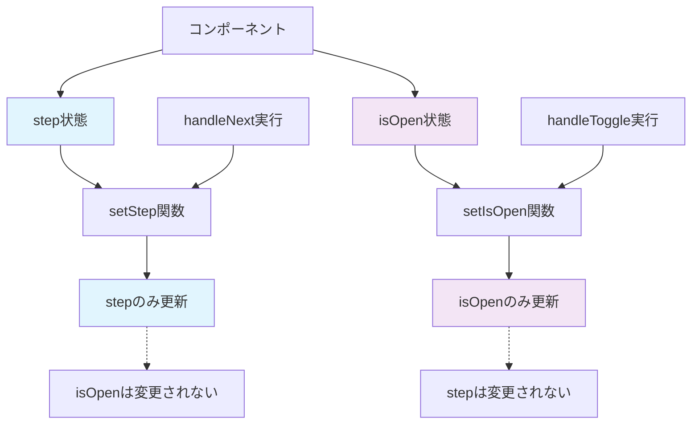
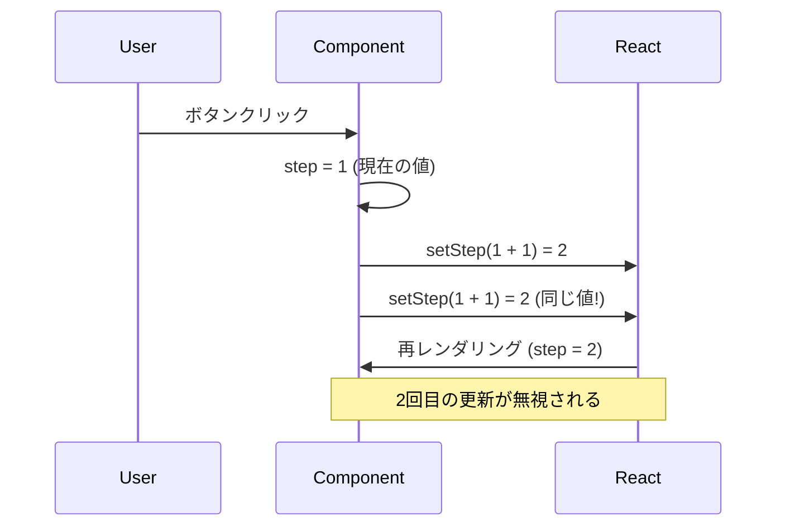
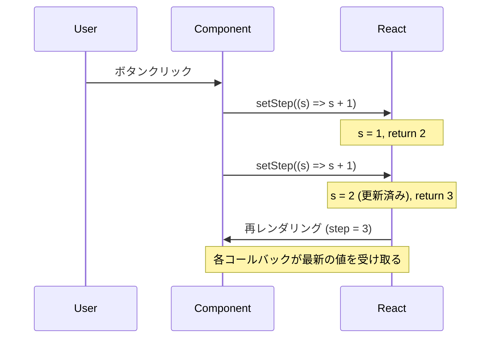

# Session3: 複数状態管理と開発者ツール

## セクション概要

このセッションでは、Reactアプリケーションにおける複数の状態変数の管理方法を学習します。単一の状態から複数の状態へと発展させ、それぞれが独立して動作する仕組みを理解します。また、React開発において必須のツールであるReact Developer Toolsの使用方法と、現在の状態に基づいた安全な状態更新パターンについても詳しく解説します。

実際のアプリケーション開発では、複数の状態を同時に管理することが一般的です。例えば、ユーザーインターフェースの表示/非表示状態と、アプリケーションの進行状態を同時に管理する必要があります。このセッションを通じて、そのような複雑な状態管理を効率的に行う方法を身につけましょう。

---

## 複数の状態変数の追加

これまでのアプリケーションに新しい機能を追加してみましょう。現在は単一の状態（ステップ番号）のみを管理していますが、実際のアプリケーションでは複数の状態を同時に管理することが一般的です。

今回追加したい機能は、ユーザーがコンポーネント全体を開閉できる機能です。これは画面上で変化する要素なので、新しい状態変数が必要になります。

### 新しい状態の実装

まず、新しい状態変数を追加してみましょう：

```javascript
import { useState } from 'react';

const messages = [
  "Learn React ⚛️",
  "Apply for jobs 💼", 
  "Invest your new income 🤑"
];

function App() {
  const [step, setStep] = useState(1);        // 既存のステップ状態
  const [isOpen, setIsOpen] = useState(true); // 新しい開閉状態
  
  function handlePrevious() {
    if (step > 1) setStep(step - 1);
  }
  
  function handleNext() {
    if (step < 3) setStep(step + 1);
  }
  
  return (
    <div className="steps">
      {/* JSXの実装は後で追加 */}
    </div>
  );
}

export default App;
```

ここで重要なポイントがいくつかあります。まず、`isOpen`という名前を選んだ理由について説明しましょう。boolean（真偽値）の状態変数には、`is`で始まる名前を付けるのが一般的な慣例です。これにより、その変数がtrue/falseの値を持つことが一目で分かります。

初期値として`true`を設定したのは、コンポーネントがデフォルトで開いた状態で表示されるようにするためです。ユーザーは必要に応じてコンポーネントを閉じることができますが、最初は内容が見える状態の方が使いやすいでしょう。

### 状態の独立性について

ここで非常に重要な概念について説明します。それは、**各状態変数は完全に独立している**ということです。

`step`状態が変更されても`isOpen`状態には影響しません。同様に、`isOpen`状態が変更されても`step`状態は保持されます。これは、Reactが各状態を個別に管理しているためです。

```javascript
function App() {
  const [step, setStep] = useState(1);      // ステップの状態
  const [isOpen, setIsOpen] = useState(true); // 開閉の状態
  
  function handleNext() {
    setStep(step + 1); // stepのみ更新、isOpenは変更されない
  }
  
  function handleToggle() {
    setIsOpen(!isOpen); // isOpenのみ更新、stepは変更されない
  }
  
  // 両方の状態は独立して管理される
}
```

### コンポーネントの独立性の具体的な動作

同じStepsコンポーネントを2つ表示した場合の動作を詳しく説明します：

**画面の構成：**
```
┌─────────────────────────────────────┐
│ 1つ目のStepsコンポーネント              │
│ ● ○ ○  Step 1: Learn React          │
│ [Previous] [Next]                   │
└─────────────────────────────────────┘

┌─────────────────────────────────────┐
│ 2つ目のStepsコンポーネント              │
│ ● ○ ○  Step 1: Learn React          │
│ [Previous] [Next]                   │
└─────────────────────────────────────┘
```

**独立した動作の例：**

1. **初期状態**：両方とも「Step 1」から開始
2. **1つ目のNextボタンをクリック**：
   - 1つ目：「Step 2: Apply for jobs」に変更
   - 2つ目：「Step 1: Learn React」のまま（変化なし）
3. **2つ目のNextボタンを2回クリック**：
   - 1つ目：「Step 2」のまま（変化なし）
   - 2つ目：「Step 3: Invest your new income」に変更

**React Developer Toolsでの確認：**
```
▼ App
  ▼ Steps (1つ目)
    hooks: [2, true]  ← step=2, isOpen=true
  ▼ Steps (2つ目)  
    hooks: [3, true]  ← step=3, isOpen=true
```

このように、同じコンポーネントでも、それぞれが独自の状態を持ち、他のインスタンスに影響を与えることなく動作します。

#### 状態の独立性を視覚化



#### 複数状態の管理パターン

```javascript
function MultiStateExample() {
  // 各状態は独立して管理される
  const [count, setCount] = useState(0);
  const [name, setName] = useState("");
  const [isVisible, setIsVisible] = useState(true);
  const [items, setItems] = useState([]);
  
  // 各状態は他の状態に影響を与えない
  function incrementCount() {
    setCount(count + 1); // countのみ変更
  }
  
  function updateName(newName) {
    setName(newName); // nameのみ変更
  }
  
  function toggleVisibility() {
    setIsVisible(!isVisible); // isVisibleのみ変更
  }
  
  function addItem(item) {
    setItems([...items, item]); // itemsのみ変更
  }
  
  return (
    <div>
      <p>Count: {count}</p>
      <p>Name: {name}</p>
      <p>Visible: {isVisible ? "Yes" : "No"}</p>
      <p>Items: {items.length}</p>
    </div>
  );
}
```

### 条件付きレンダリングの実装

次に、`isOpen`状態に基づいてコンポーネントの表示/非表示を制御してみましょう：

```javascript
function App() {
  const [step, setStep] = useState(1);
  const [isOpen, setIsOpen] = useState(true);
  
  function handlePrevious() {
    if (step > 1) setStep(step - 1);
  }
  
  function handleNext() {
    if (step < 3) setStep(step + 1);
  }
  
  return (
    <>
      <button className="close" onClick={() => setIsOpen(!isOpen)}>
        &times;
      </button>
      
      {isOpen && (
        <div className="steps">
          <div className="numbers">
            <div className={step >= 1 ? "active" : ""}>1</div>
            <div className={step >= 2 ? "active" : ""}>2</div>
            <div className={step >= 3 ? "active" : ""}>3</div>
          </div>

          <p className="message">
            Step {step}: {messages[step - 1]}
          </p>

          <div className="buttons">
            <button 
              style={{ backgroundColor: "#7950f2", color: "#fff" }}
              onClick={handlePrevious}
            >
              Previous
            </button>
            <button 
              style={{ backgroundColor: "#7950f2", color: "#fff" }}
              onClick={handleNext}
            >
              Next
            </button>
          </div>
        </div>
      )}
    </>
  );
}
```

この実装で注目すべき点がいくつかあります。

まず、開閉ボタンは常に表示されています。これは条件付きレンダリングの外側に配置されているためです。ユーザーはいつでもコンポーネントを開閉できる必要があるので、このボタンは常にアクセス可能でなければなりません。

次に、`{isOpen && (...)}` という条件付きレンダリングの構文を使用しています。これは、`isOpen`がtrueの場合のみ、括弧内のJSXがレンダリングされることを意味します。

### 状態の永続性

ここで実際にアプリケーションを動かしてみると、非常に興味深い動作を確認できます。

1. ステップを2や3に進める
2. 閉じるボタンをクリックしてコンポーネントを非表示にする
3. 再度開くボタンをクリックしてコンポーネントを表示する

すると、ステップの値が保持されていることが分かります。これは、Reactが状態をコンポーネントのメモリとして管理しているためです。

コンポーネントが一時的に非表示になっても、状態は失われません。レンダリングと再レンダリングを繰り返しても、この情報を時間とともに保持できます。素晴らしいですね。

これで、状態をさまざまな状況でさまざまな目的で実際に使用する方法を理解し始めていることを願っています。

## React Fragmentの活用

ここで変更できる小さなことが1つあります。これは状態とは関係ありません。実際には1つの要素だけを返す必要はないということです。

基本的に開閉ボタンとステップコンテンツの両方を返したいのです。これはReact Fragmentの優れたユースケースです。

まず、検査してみましょう。ルートがあります。これは基本的にアプリ全体です。その中に、このdivがあります。

しかし、それを望まない場合を考えてみましょう。ボタンとこのステップdivを同じレベルに配置したい場合です。

不要なラッパー要素を削除して、フラグメントを使用しましょう。フラグメントはこのJSX要素のルートのようなものです。これはDOMでは消えます。

```javascript
return (
  <>
    <button className="close" onClick={() => setIsOpen(!isOpen)}>
      &times;
    </button>
    
    {isOpen && (
      <div className="steps">
        {/* ステップの内容 */}
      </div>
    )}
  </>
);
```

今見ると、ボタンとステップdivしかありません。このような状況にあるときは、2つの要素を返すJSXが必要な場合、フラグメントはそれに最適です。

## React開発者ツール

ウェブ開発者として、開発者ツールに大きく依存しています。ブラウザのコンソールや要素の検査パネルなどです。ツールは開発者にとって非常に役立つので、ReactチームはReact専用の開発者ツールを構築しました。

これは、状態を扱う場合に非常に役立ちます。現在状態を扱っているので、それらを確認しましょう。

### インストール方法

最初から、コンソールにこのメッセージが表示され、これらの開発者ツールをダウンロードするように指示しています。コンソールを開くと、Reactドキュメントの場所へのリンクが見つかります。そこで、開発者ツールへのリンクを見つけることができます。

Chrome Web Storeへのリンクがあります。他のブラウザ用もあります。しかし、Google Chromeを使用しているので、これが必要なものです。

何らかの理由でこのリンクがコンソールに表示されなかった場合は、「chrome react dev tools」とGoogle検索してください。これが最初の結果です。

このページにアクセスしたら、この拡張機能をダウンロードして、Google Chromeにインストールできます。

### React Developer Toolsの画面構成と操作方法

React Developer Toolsをインストールして開発者ツールを開くと、以下のような構成になります：

**画面の構成：**
1. **上部タブエリア**：
   - 「Elements」「Console」「Sources」などの既存タブの右側に
   - 「⚛️ Components」タブと「⚛️ Profiler」タブが追加される

2. **Componentsタブの画面構成**：
   - **左側パネル**：コンポーネントツリー（階層構造で表示）
     ```
     ▼ App
       ▼ Steps
         - div.steps
         - div.numbers
         - p.message
     ```
   - **右側パネル**：選択したコンポーネントの詳細情報
     - **Props**セクション：受け取っているpropsの一覧
     - **Hooks**セクション：使用している状態の一覧
       - State: 1 (現在の値)
       - State: true (現在の値)

**操作方法：**
1. 左側のコンポーネント名をクリックして選択
2. 右側で状態値を直接編集可能
   - boolean値：チェックボックスで切り替え
   - 数値：直接入力で変更
3. 変更すると即座にUIに反映される

**実際の使用例：**
- Appコンポーネントを選択すると、右側に「Hooks」セクションが表示
- 「State: 1」と「State: true」の2つの状態が確認できる
- 「State: 1」を「3」に変更すると、画面のステップが即座に3に変わる

### Componentsタブの活用

Componentsは、名前が示すように、コンポーネントツリーを表示するためです。現在、コンポーネントは1つしかありません。appコンポーネントのみです。

現在のアプリケーションでは、propsは受け取っていないので、Propsセクションには何も表示されません。

しかし、ここに興味深い部分があります。右側パネルの「Hooks」セクションに、使用した各useStateフックのすべてのリストがあります。useStateで状態を作成したことを覚えています。これらのuse関数はフックです。フックのリストにあります。

### 状態の操作と実験

興味深いのは、これらの値をここで操作して、実験できることです。

例えば、boolean値がある場合、チェックボックスが表示され、それを切り替えることができます。これにより、値も切り替わります。trueからfalseへ。UIでできることと同じことをしています。それは非常に役立ちます。

CSSでできることと少し似ています。これはCSSに触発されています。

ここで、この数値を変更することもできます。1から3に直接移動できます。または、UIから通常アクセスできない値で試すこともできます。

これらのボタンをクリックしても、状態を10に設定することはできません。しかし、何らかの理由でUIが10でどのように見えるかを確認する必要があるかもしれません。開発者ツールでそれを設定できます。

これは単なる小さなデモ例です。ここでは重要ではありません。しかし、より大きく、大規模なアプリケーションでは、これは時々必要になるかもしれません。

開発者ツールをこの種のことに使用できることを覚えておくことは非常に重要です。

### コンポーネントツリーの表示

前述したように、コンポーネントツリー全体をここに表示できることは非常に役立ちます。プロジェクトに多くのファイルがあり、アプリに数十または数百のコンポーネントがある場合、すぐに手に負えなくなり、どのコンポーネントがどこにあるかを見失う可能性があります。

コンポーネントツリーは非常に便利になります。手動で描画する代わりに、ここで確認できます。

開発者ツールについて話すことは以上です。非常に便利です。それらをインストールすることを確認してください。将来の講義で必ずまた戻ってきます。

## 現在の状態に基づいて状態を更新する

状態変数をその状態の現在の値に基づいて更新することは非常に一般的です。そして、それを行う最善の方法を学びましょう。

実際、常に状態を現在の状態に基づいて更新しています。ここで、例えば、setStepで、現在のステップを取り、1を引きます。ここでも同じです。現在のisOpen状態を取り、それを切り替えています。

これが現在の状態に基づいて状態を更新することの意味です。

### 現在のアプローチの問題点

今やっている方法はうまくいっています。アプリはうまくいっていますが、数ヶ月後にこのアプリに戻ってきて、何かを変更したいと想像してみましょう。

handleNext関数が実際には2回前進するようにしたいとしましょう。ステップ状態を2回設定したいとしましょう。それを行うことを妨げるものは何もありません。これを一度行って、それを複製できます。

```javascript
function handleNext() {
  setStep(step + 1);
  setStep(step + 1); // 2回呼び出し
}
```

これは完全に問題ありません。同じ関数を2回呼び出すことができます。

しかし、何が起こるでしょうか？今、次へをクリックすると何が起こると思いますか？

理論的には、ステップを取り、それは現在1で、1を足して2になり、そして、ここで2から3に同じことをしなければなりません。

しかし、実際に何が起こるか見てください。それは一度だけ状態を更新しました。

### なぜこれが起こるのか

#### 問題の根本原因

```javascript
// ❌ 問題のあるコード
function handleNext() {
  setStep(step + 1); // step = 1
  setStep(step + 1); // step = 1 (まだ更新されていない)
}
// 結果: 1 + 1 = 2 (2回目の更新も1 + 1 = 2)
```

**なぜこうなるのか：**
- Reactの状態更新は**非同期**
- 関数実行中は`step`の値は変わらない
- 両方の`setStep`が同じ古い値を参照



なぜこれが起こるのかを詳細に説明します。しかし、今のところ、あなたが知っておくべきことは、現在の状態に基づいて状態を更新すべきではないということです。私たちがやっている方法では。

代わりに、ここにコールバック関数を渡すべきです。値の代わりに、関数を渡します。それは引数として受け取ります、状態の現在の値を。

#### 問題の根本原因

```javascript
// ❌ 問題のあるコード
function handleNext() {
  setStep(step + 1); // step = 1
  setStep(step + 1); // step = 1 (まだ更新されていない)
}
// 結果: 1 + 1 = 2 (2回目の更新も1 + 1 = 2)
```

**なぜこうなるのか：**
- Reactの状態更新は**非同期**
- 関数実行中は`step`の値は変わらない
- 両方の`setStep`が同じ古い値を参照


### コールバック関数を使用した正しい方法

これを削除して、関数を作成しましょう。簡単なアロー関数を作成します。

```javascript
function handleNext() {
  setStep((s) => s + 1);
  setStep((s) => s + 1);
}
```

私が言ったように、これは入力として、状態の現在の値を受け取ります。この引数を呼び出す方法については、複数の慣例があります。再びstepと呼ぶことができますが、それは少し混乱するかもしれません。currentStep、たとえば、またはsと呼ぶことができます。今からそうします。略語です。

#### コールバック関数の仕組み



#### コールバック関数の仕組み


ここで、以前と同じようにs + 1を行うことができます。これは以前と同じように機能します。ビューは以前と同じように更新されました。

しかし、これはもう少し正確です。なぜなら、これをやると、現在のステップを入力として受け取り、sと呼びますが、何とでも呼べます。そして、ここで現在のステップ + 1を返します。そして、ここでも + 1。

これをもう一度実行すると、機能します。それは状態を2回更新しています。

それは1で始まり、それから、このコールバックは1の値を受け取り、そして、1 + 1は2になります。そして、次の状態更新では、その更新された値は、このコールバックに渡されます。そして、2 + 1は3になります。

#### 実践的な比較例

```javascript
function Counter() {
  const [count, setCount] = useState(0);
  
  // ❌ 間違った方法
  function incrementTwiceWrong() {
    setCount(count + 1); // count = 0, 結果 = 1
    setCount(count + 1); // count = 0, 結果 = 1
    // 最終結果: 1 (期待値: 2)
  }
  
  // ✅ 正しい方法
  function incrementTwiceCorrect() {
    setCount(prev => prev + 1); // prev = 0, 結果 = 1
    setCount(prev => prev + 1); // prev = 1, 結果 = 2
    // 最終結果: 2 (期待値: 2)
  }
  
  return (
    <div>
      <p>Count: {count}</p>
      <button onClick={incrementTwiceWrong}>Wrong (+2)</button>
      <button onClick={incrementTwiceCorrect}>Correct (+2)</button>
    </div>
  );
}
```

### 実践的な適用

さて、ここでは実際にはこれを望んでいません。ただ1つずつ進むだけです。しかし、将来の更新のために安全であるために、現在の状態値に基づいて状態を更新するときは、常にこのようなコールバックを使用するのが良いアイデアです。

```javascript
function handlePrevious() {
  if (step > 1) setStep((s) => s - 1);
}

function handleNext() {
  if (step < 3) setStep((s) => s + 1);
}
```

ここでも同じことをしましょう。ここでも同じことをしています。この開いている状態も、現在の状態に基づいて設定しています。sと呼び、そして、それを切り替えましょう。

```javascript
<button className="close" onClick={() => setIsOpen((s) => !s)}>
  &times;
</button>
```

そして、それは美しく機能します。

### いつコールバックが必要か

私たちが状態を設定していないときは、現在の状態に基づいて、もちろん、通常の値を渡すことができます。たとえば、ここで行ったように。それは時々起こります。その場合、コールバックは必要ありません。新しい状態値を渡します。

多くの状況では、それはうまく機能します。以前はここにs - 1しかありませんでした。そして、それ以外は何もなく、それも機能しました。

しかし、将来の更新のために安全であるために、または同僚と協力するために、状態をより安全な方法で更新するのが最善です。

今から、状態が現在の状態値に基づいて更新されるたびに、これを毎回行います。

## 状態に関するさらなる考察 + 状態ガイドライン

状態への最初のダイブを終えたので、状態に関するさらにいくつかの重要な考え、またはアイデアを共有したいと思います。また、実践的なガイドラインも共有したいと思います。

### 重要な技術的詳細

まず、あなたが知っておくべき重要な技術的な詳細が1つあります。これは明白に見えるかもしれませんが、それでも言及する価値があります。

私が話しているのは、各コンポーネントがその状態を実際に持ち、管理するという事実です。同じコンポーネントを複数回レンダリングしても、ページ上で、これらの各コンポーネントインスタンスは、他のすべてのコンポーネントから独立して動作します。

この例では、3つのカウンターコンポーネントすべてが、「Score」という状態の一部から始まります。それは最初にゼロに設定されます。次に、ボタンのいずれかをクリックすると、それは各クリックでスコアを1つ増やしますが、そのコンポーネント内でのみ。他のすべてのコンポーネントの状態は同じままです。

再び、1つのコンポーネントの状態を変更すると、それは他のコンポーネントにはまったく影響しません。もちろん、同じことが起こります。別のボタンのいずれかをクリックするとき、またはコンポーネントがUIから完全に削除された場合でも。

状態は各コンポーネント内に本当に孤立しています。

### UIは状態の関数

私たちが学んだすべてを分析すると、全体的なアプリケーションビュー、つまり、ユーザーインターフェース全体を状態の関数と考えることができるという結論に達することができます。

言い換えれば、UI全体はすべてのコンポーネントのすべての現在の状態の表現です。

このアイデアをさらに一歩進めると、Reactアプリケーションは基本的に時間とともに状態を変更し、もちろん、また、常にその状態を正しく表示することです。

これが宣言的なアプローチです。ユーザーインターフェースを構築すること。UIを明示的なDOM操作として見るのではなく、状態を使用すると、UIを時間とともに変化するデータの反映と見なすことができます。

すでに知っているように、私たちはそのデータの反映を状態、イベントハンドラー、そしてJSXで記述します。UIを記述します。Reactは残りを処理します。

### 哲学的な理解

これはあなたの旅のこの時点では、すべてが少し哲学的に聞こえるかもしれませんが、私を信じてください。Reactアプリの構築と状態の操作に慣れてくると、私が今言ったすべてを本当に深く理解するでしょう。

### 実践的なガイドライン

そして、終わるために、状態について、いくつかのガイドラインを共有させてください。実践的なガイドラインは常に学生が最も好きなものです。ここでは、これは状態の要約としても機能します。これらのガイドラインは参照として保持するためのものです。

ここに多くのテキストがあります。今すぐに確認します。

まず、コンポーネントが時間とともに追跡する必要があるあらゆるデータに対して新しい状態変数を作成する必要があります。それを見つける簡単な方法は、将来のある時点で変更する必要がある変数について考えることです。

Vanilla JavaScriptでアプリを構築することに慣れている場合、それらは「let」または「var」で定義された変数、またはアプリケーションのライフサイクル中に変更する配列またはオブジェクトになります。Reactではそれらのために状態を使用します。

いつ状態が必要かを見つけるもう1つの方法はこれです。コンポーネント内の何かを動的にしたいときはいつでも、その「もの」に関連する状態の一部を作成し、「もの」が変更されるときに状態を更新します。または、動的にしたいときに。

この「もの」は少し抽象的なので、開閉できるモーダルウィンドウを考えてみましょう。モーダルウィンドウの場合、「isOpen」という状態変数を作成できます。それは、モーダルが現在開いているかどうかを追跡します。

「isOpen」がtrueの場合、ウィンドウを画面に表示します。そして、falseの場合は、それを非表示にします。シンプルでしょう？

コンポーネントの外観を変更したいときはいつでも、または表示するデータ。状態を更新するだけで、通常はイベントハンドラー関数内で行います。

コンポーネントを構築するときは、コンポーネントのビュー、つまり、画面にレンダリングされたコンポーネントを、時間とともに変化し進化する状態の反映と想像するのが役立ちます。

### 一般的な間違い

最後に、多くの初心者が犯す一般的な間違いが1つあります。それは、コンポーネントで必要なすべての変数に状態を使用することです。しかし、それは本当に必要ではありません。

再レンダリングを引き起こすべきではない変数に状態を使用しないでください。なぜなら、それは不必要な再レンダリングを引き起こし、パフォーマンスの問題を引き起こす可能性があるからです。

状態ではない変数を必要とすることは非常に一般的です。それらのために、あなたは単に「const」で定義された通常の変数を使用できます。しかし、次のセクションでまた戻ってきます。

これで、状態に関する私の最初のガイドラインは、今のところ十分すぎるはずです。もしあなたがこれらを真に内面化するなら、将来Reactアプリケーションを構築することは、あなたにとってずっと簡単になるはずです。

私は状態を習得することがReactを学ぶ上で最も難しい部分であると信じているので、しかし、このハードルを乗り越え、いつ状態が必要か、そして、それがどのように機能するかを真に内面化すると、React開発の扉を開くでしょう。

だから、私はここに多くの時間を費やしました。状態がどのように機能するかを示しています。

## Vanilla JavaScriptの実装との比較

このパートを締めくくるために、Reactコードと、同じアプリの同等のVanilla JavaScript実装をもう一度比較したいと思います。このVanilla JavaScript実装は、このセクションの最初に提供しました。publicフォルダに配置しました。それを開いて、サイトで開きましょう。

再び、Vanilla JavaScript実装はHTMLファイル内にあり、ここで最初にHTMLがあり、次にJavaScriptを分離しました。

このHTMLはfamiliarに見えるかもしれません。なぜなら、それはもちろん、このJSXに非常に似ているからです。ここで持っていない唯一のことは、コンポーネントを開閉するボタンです。その部分は含んでいません。

いずれにせよ、ここでスクリプトが始まります。同じメッセージがあります。そして、ここで、私たちが手動で選択する必要があるすべてのDOM要素は、それらに与えたクラスに基づいています。

次に、ステップというlet変数があります。そして、ここではイベントハンドラー関数で更新します。ここで、私たちが手動で選択した要素を取り、それらにadd event listenerを使用します。

これらのイベントハンドラーには同様のロジックがあります。基本的にステップ変数を更新します。戻ると、ステップはマイナス1になり、前進すると、ステップはプラス1になります。これはここにあるものに似ています。これらのイベントハンドラーですが、大きな違いは、ここで、状態変数を更新するだけでよいということです。ReactはUIを同期させます。

ここでは、状態変数を更新してから、DOM操作を実行するこの関数を呼び出す必要があります。ここでUI値の更新関数内、DOMを自分で更新する必要があります。そして、このステップ状態と同期させます。

なぜなら、もちろん、これらのボタンをクリックするとすぐに、もし私たちがやったことがこの値の更新だけだったら、UIでは何も起こりません。それをやった後、ここでこの関数を呼び出す必要があります。

または、もちろん、このコード全体をここに置くこともできますが、ここで同じコードが必要なので、この関数に配置します。

ここでメッセージのテキストコンテンツを自分で更新します。一方、JSXでは、マークアップで単純に宣言されます。

ここにJavaScriptに指示する命令的なコードがあります。ステップバイステップで何をする必要があるか。テキストコンテンツを更新し、次にクラスリストを設定し、このクラスリストを設定し、このクラスリストを設定します。ステップがアクティブな場合は、アクティブというクラスを設定します。

一方、ここでは、すべてJSXで宣言されています。Reactに何かをさせる必要はありません。ここにステップがあることを宣言するだけです。現在のステップに等しくなり、そして、ここに、ステップが1以上の場合、アクティブクラスはクラス名にあるはずです。

しかし、ここにある命令的なDOM操作は必要ありません。これについては何度も話しました。この時点で十分だと思います。

しかし、もちろん、これらの2つの実装を比較し続けるのは良いことです。

## コンポーネントの独立性の実証

ここでやりたいことが1つだけあります。それは、前の講義に戻ることです。そこで、各コンポーネントがその状態を管理すると言いました。今、コードでそれを証明したいと思います。

このコードすべてを新しいコンポーネントに配置しましょう。それをステップと呼びます。または、実際にはこのコンポーネントをStepsと呼びます。

コピー＆ペーストをあまり行う必要はありません。これを削除して、実際にはそれをStepsと呼びます。

```javascript
function Steps() {
  const [step, setStep] = useState(1);
  const [isOpen, setIsOpen] = useState(true);
  
  function handlePrevious() {
    if (step > 1) setStep((s) => s - 1);
  }
  
  function handleNext() {
    if (step < 3) setStep((s) => s + 1);
  }
  
  return (
    <>
      <button className="close" onClick={() => setIsOpen((s) => !s)}>
        &times;
      </button>
      
      {isOpen && (
        <div className="steps">
          <div className="numbers">
            <div className={step >= 1 ? "active" : ""}>1</div>
            <div className={step >= 2 ? "active" : ""}>2</div>
            <div className={step >= 3 ? "active" : ""}>3</div>
          </div>

          <p className="message">
            Step {step}: {messages[step - 1]}
          </p>

          <div className="buttons">
            <button
              style={{ backgroundColor: "#7950f2", color: "#fff" }}
              onClick={handlePrevious}
            >
              Previous
            </button>
            <button
              style={{ backgroundColor: "#7950f2", color: "#fff" }}
              onClick={handleNext}
            >
              Next
            </button>
          </div>
        </div>
      )}
    </>
  );
}
```

そして、ここで再びAppを行います。export default function App、そして、このアプリは基本的に2つのStepsを含みます。

```javascript
function App() {
  return (
    <div>
      <Steps />
      <Steps />
    </div>
  );
}
```

私たちは2回Stepsを持つことになります。いくつか変更が必要です。今、同じページに2つのコンポーネントがあるので、実際にはdivを返します。ボタンと、そして、これらのステップはすべて同じ場所にあります。

CSSで簡単な変更を1つだけ行います。ここで、closeの近くで、このコード行を削除するだけです。それを閉じます。ここに置きます。

リロードすると、今、ページに2つのStepsがあることがわかります。Stepsコンポーネントを再利用することに成功しました。これはもはやアプリではありません。再び、それはStepsです。

React開発者ツールでそれをうまく確認できます。今、より大きなコンポーネントツリーがあります。Appがあり、2つの子コンポーネントがあります。

### 状態の独立性の確認

しかし、私が示したかったのは、これのいずれかを変更すると、ここでの状態は同じままになります。両方ともStepsコンポーネントですが、それぞれの状態は完全に孤立しています。

もちろん、これも閉じることができます。そして、これは開いたままです。もちろん、開発者ツールでこれも確認できます。より多くのスペースでさえ。

はい。最初のSteps、状態は3で、表示されています。これはtrueです。一方、2番目は、状態は1で、表示されていません。

それは小さな、簡単なデモでした。ここで状態を数回使用したので、今後のコーディングチャレンジで自分で状態を練習する時が来ました。

## まとめ

このセッションでは、以下の重要な概念を学習しました：

### 1. 複数状態の管理
- 複数の状態変数を独立して管理する方法
- 各状態の独立性と永続性
- boolean状態の命名規則（`is`プレフィックス）

### 2. 条件付きレンダリング
- `{condition && <JSX>}` パターンの活用
- 状態に基づくUI要素の表示/非表示制御

### 3. React Fragment
- 複数要素を返す際の適切な方法
- 不要なラッパー要素を避ける重要性

### 4. React Developer Tools
- インストール方法と基本的な使用方法
- 状態の検査と直接操作
- コンポーネントツリーの可視化

### 5. 現在の状態に基づく安全な更新
- コールバック関数を使用した状態更新
- 複数回の状態更新における正しいパターン

### 6. コンポーネントの独立性
- 同じコンポーネントの複数インスタンスの独立動作
- 各コンポーネントが独自の状態を管理

これらの概念は、より複雑なReactアプリケーションを構築する際の基礎となります。状態管理の理解を深めることで、React開発の扉が開かれるでしょう。

## 実践演習

### 演習1: 複数状態を持つタイマーアプリ

以下の要件を満たすタイマーコンポーネントを作成してください：

```javascript
function Timer() {
  // 必要な状態を定義してください
  // - seconds: 現在の秒数
  // - isRunning: タイマーが動作中かどうか
  // - isVisible: タイマーが表示されているかどうか
  
  // 以下の関数を実装してください：
  // 1. startTimer: タイマーを開始
  // 2. stopTimer: タイマーを停止
  // 3. resetTimer: タイマーをリセット
  // 4. toggleVisibility: 表示/非表示を切り替え
  
  return (
    <div>
      {/* UIを実装してください */}
    </div>
  );
}
```

**期待される動作：**
- タイマーは1秒ごとに増加
- 開始/停止ボタンでタイマーの制御
- リセットボタンで0に戻る
- 表示/非表示の切り替えが可能
- 各状態は独立して動作

### 演習2: ショッピングカートの状態管理

複数の状態を管理するショッピングカートを作成してください：

```javascript
function ShoppingCart() {
  // 必要な状態：
  // - items: カート内のアイテム配列
  // - total: 合計金額
  // - isOpen: カートの開閉状態
  // - itemCount: アイテム数
  
  const products = [
    { id: 1, name: "商品A", price: 1000 },
    { id: 2, name: "商品B", price: 1500 },
    { id: 3, name: "商品C", price: 800 }
  ];
  
  // 実装する関数：
  // 1. addToCart(product): 商品をカートに追加
  // 2. removeFromCart(productId): 商品をカートから削除
  // 3. clearCart(): カートを空にする
  // 4. toggleCart(): カートの開閉
  
  return (
    <div>
      {/* 商品リストとカートUIを実装 */}
    </div>
  );
}
```

### 演習3: React Developer Toolsを使ったデバッグ

上記で作成したコンポーネントを使って、以下のデバッグ作業を行ってください：

1. **状態の監視**
   - React Developer Toolsを開く
   - 各状態の変化をリアルタイムで確認
   - 予期しない状態変化がないかチェック

2. **状態の手動変更**
   - Developer Toolsから状態値を直接変更
   - UIが正しく更新されることを確認
   - エッジケース（負の値、極端に大きな値）をテスト

3. **コンポーネント構造の確認**
   - Component Treeでコンポーネントの階層を確認
   - 各コンポーネントのpropsとstateを調査
   - 不要な再レンダリングがないかチェック

### 演習4: 状態更新のベストプラクティス

以下のコードを修正して、安全な状態更新パターンに変更してください：

```javascript
function ProblematicComponent() {
  const [count, setCount] = useState(0);
  const [multiplier, setMultiplier] = useState(1);
  
  // ❌ 問題のあるコード
  function handleDoubleIncrement() {
    setCount(count + 1);
    setCount(count + 1);
  }
  
  function handleComplexUpdate() {
    setCount(count * multiplier);
    setMultiplier(multiplier + 1);
    setCount(count + multiplier);
  }
  
  function handleAsyncUpdate() {
    setTimeout(() => {
      setCount(count + 1);
    }, 1000);
  }
  
  return (
    <div>
      <p>Count: {count}</p>
      <p>Multiplier: {multiplier}</p>
      <button onClick={handleDoubleIncrement}>Double Increment</button>
      <button onClick={handleComplexUpdate}>Complex Update</button>
      <button onClick={handleAsyncUpdate}>Async Update</button>
    </div>
  );
}
```

**修正のポイント：**
- コールバック関数を使用した安全な状態更新
- 複数の状態更新の正しい順序
- 非同期処理での状態更新の注意点

### 解答例とポイント

#### 演習1の解答例

```javascript
function Timer() {
  const [seconds, setSeconds] = useState(0);
  const [isRunning, setIsRunning] = useState(false);
  const [isVisible, setIsVisible] = useState(true);
  
  useEffect(() => {
    let interval = null;
    if (isRunning) {
      interval = setInterval(() => {
        setSeconds(prev => prev + 1);
      }, 1000);
    }
    return () => clearInterval(interval);
  }, [isRunning]);
  
  const startTimer = () => setIsRunning(true);
  const stopTimer = () => setIsRunning(false);
  const resetTimer = () => {
    setSeconds(0);
    setIsRunning(false);
  };
  const toggleVisibility = () => setIsVisible(prev => !prev);
  
  return (
    <div>
      <button onClick={toggleVisibility}>
        {isVisible ? "Hide" : "Show"} Timer
      </button>
      
      {isVisible && (
        <div>
          <h2>Timer: {seconds}s</h2>
          <button onClick={startTimer} disabled={isRunning}>
            Start
          </button>
          <button onClick={stopTimer} disabled={!isRunning}>
            Stop
          </button>
          <button onClick={resetTimer}>Reset</button>
        </div>
      )}
    </div>
  );
}
```

**学習ポイント：**
- 各状態は独立して管理される
- `useEffect`を使った副作用の処理
- コールバック関数による安全な状態更新
- 条件付きレンダリングの活用

## まとめ

このセッションでは以下の重要な概念を学習しました：

### 1. 複数状態の管理
- 各状態変数は完全に独立している
- 状態の独立性により、一つの状態変更が他に影響しない
- 複数の状態を効率的に管理する方法

### 2. 条件付きレンダリング
- `{condition && <Component />}`パターンの活用
- 状態に基づくUIの動的な表示/非表示制御

### 3. React Fragment
- 不要なラッパー要素を避ける方法
- `<>...</>`記法の活用

### 4. React Developer Tools
- 状態とpropsのリアルタイム監視
- 開発者ツールを使った効率的なデバッグ
- コンポーネント構造の可視化

### 5. 現在の状態に基づく安全な更新
- コールバック関数を使った状態更新パターン
- 非同期な状態更新の仕組みの理解
- 複数回の状態更新における注意点

### 6. コンポーネントの独立性
- 同じコンポーネントの複数インスタンスは独立
- 各インスタンスが独自の状態を保持
- 状態の分離とカプセル化

これらの概念をマスターすることで、より複雑で実用的なReactアプリケーションを構築する基盤が整います。次のセッションでは、状態管理のベストプラクティスについてさらに詳しく学習していきます。