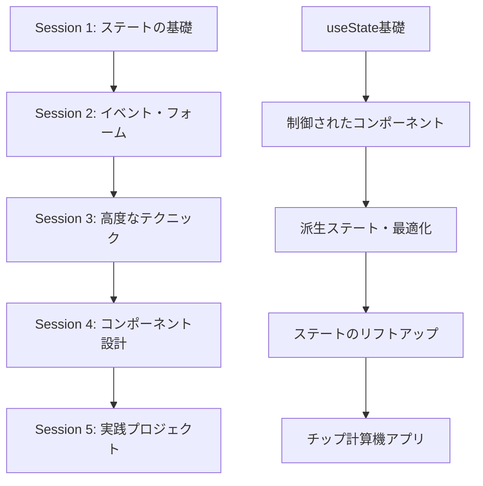

# STEP03: ステート、イベント、フォーム基礎と TypeScript 統合（セッション分割学習）

> 💡 **対象**: TypeScript 上級者・React 初心者
> 🎯 **形式**: 講師サポート付きセッション分割学習（5 セッション、最終は実践プロジェクト）
> ⏰ **総時間**: 450 分（7.5 時間）

## 📚 関連補足資料

この STEP の学習をサポートする補足資料をご用意しています：

- 📖 **[専門用語集](STEP03_補足_専門用語集.md)**: useState、イベントハンドラー、制御されたコンポーネント等の詳細解説
- 🛠️ **[開発環境ガイド](STEP03_補足_開発環境ガイド.md)**: React DevTools、状態デバッグツールの使用方法
- 💻 **[実践コード例](STEP03_補足_実践コード例.md)**: Level 1-4 の段階別実装例集
- 🔧 **[トラブルシューティング](STEP03_補足_トラブルシューティング.md)**: エラー → 原因 → 解決 → 予防の 4 段階解説
- 🌐 **[参考リソース](STEP03_補足_参考リソース.md)**: 公式・学習・ツール・コミュニティの 4 カテゴリ分類

## 🎯 STEP03 学習目標

### 📋 最終成果物

インタラクティブな「チップ計算機アプリ」の構築を通じて、以下の能力を習得：

- ✅ **ステート管理の基礎**: useState フックを使った状態管理
- ✅ **イベント処理**: フォーム入力、ボタンクリック等のイベントハンドリング
- ✅ **制御されたコンポーネント**: React における標準的なフォーム管理方式
- ✅ **派生ステート**: 既存のステートから新しい値を計算する技術
- ✅ **ステートのリフトアップ**: コンポーネント間でのステート共有

### 🔄 前 STEP からの継続要素

- TypeScript による型安全なコンポーネント設計
- props を使ったコンポーネント間のデータ受け渡し
- JSX の条件付きレンダリング
- 配列データの map メソッドを使った動的レンダリング

### 🆕 新規学習要素

- useState フックによる状態管理
- イベントハンドラーの実装
- フォーム入力の制御
- ステート更新のベストプラクティス
- コンポーネント間のステート共有戦略

## 📅 セッション構成

### 🎯 Session 1: ステートの基礎概念とその重要性（90 分）

**ファイル**: `STEP03_Session1_ステートの基礎概念とその重要性.md`

- **学習内容**:
  - ステートとは何か、なぜ重要なのか
  - useState フックの基本的な使用方法
  - ステートとプロップの違いと使い分け
  - プロップのバケツリレー問題の理解

### 🎯 Session 2: イベント処理とフォーム管理（90 分）

**ファイル**: `STEP03_Session2_イベント処理とフォーム管理.md`

- **学習内容**:
  - イベントハンドラーの実装方法
  - 制御されたコンポーネントの概念と実装
  - フォーム入力の管理とバリデーション
  - イベントオブジェクトの活用

### 🎯 Session 3: ステート管理の高度なテクニック（90 分）

**ファイル**: `STEP03_Session3_ステート管理の高度なテクニック.md`

- **学習内容**:
  - 派生ステートと useMemo の活用
  - 配列・オブジェクトの不変更新パターン
  - 関数型ステート更新の実践
  - パフォーマンス最適化テクニック
  - 実用例：ショッピングカート・銀行口座管理

### 🎯 Session 4: インタラクティブなコンポーネント設計（90 分）

**ファイル**: `STEP03_Session4_インタラクティブなコンポーネント設計.md`

- **学習内容**:
  - ステートのリフトアップパターン
  - Children プロップによる再利用可能コンポーネント
  - リスト操作の高度なテクニック（フィルタリング・ソート）
  - Context API を使った複合コンポーネント
  - 実用例：モーダル・アコーディオン・タスク管理

### 🎯 Session 5: 実践プロジェクト - チップ計算機アプリ（90 分）

**ファイル**: `STEP03_Session5_実践プロジェクト_チップ計算機アプリ.md`

- **学習内容**:
  - 複合ステート管理の実装
  - リアルタイム計算とバリデーション
  - 履歴機能とローカルストレージ連携
  - レスポンシブ UI 設計
  - アクセシビリティ対応
  - 完全な TypeScript 統合

## 🏗️ 実践プロジェクト概要

### 💰 チップ計算機アプリ

高度なステート管理とインタラクティブ機能を統合したチップ計算機を構築し、React 開発の実践的なスキルを習得します。

**主要機能**:

- 📊 **リアルタイム計算**: 支払い金額・チップ率・人数に基づく即座の計算
- 📝 **フォーム管理**: 制御されたコンポーネントによる入力管理
- 🔧 **設定機能**: カスタムチップ率の追加・編集
- 📋 **履歴管理**: 計算結果の保存・表示・削除
- 💾 **永続化**: ローカルストレージでのデータ保存
- 📱 **レスポンシブ**: モバイル・タブレット・デスクトップ対応
- ♿ **アクセシビリティ**: スクリーンリーダー・キーボード操作対応

**技術要素**:

- useState を使った複合ステート管理
- useMemo による派生ステート最適化
- Context API を活用したグローバルステート
- カスタムフックによるロジック抽象化
- TypeScript による完全な型安全性
- TailwindCSS によるモダンな UI 設計

## 💻 開発環境

### 必要なツール

- Node.js (v18 以上)
- npm または yarn
- VS Code（推奨エディタ）
- React Developer Tools（ブラウザ拡張）

### プロジェクト技術スタック

- **React**: 19.1.0
- **TypeScript**: 5.8.3
- **Vite**: 6.3.5
- **TailwindCSS**: 4.1.8
- **ESLint**: 9.25.0

## 📝 学習の進め方

### 🎯 推奨学習フロー

1. **Session 1**: ステートの基礎概念を理解
2. **Session 2**: イベント処理の実装方法を習得
3. **Session 3**: 応用的なステート管理技術を学習
4. **Session 4**: 複雑なインタラクティブコンポーネントの設計
5. **Session 5**: 実践プロジェクトで総合的な活用

### ✅ 各セッション後のチェックポイント

- **Session 1 完了後**: useState を使った基本的な状態管理ができる
- **Session 2 完了後**: フォーム入力とイベント処理が実装できる
- **Session 3 完了後**: 高度なステート管理（派生ステート、不変更新、最適化）ができる
- **Session 4 完了後**: 再利用可能なインタラクティブコンポーネントが設計できる
- **Session 5 完了後**: 実用的な Web アプリケーションを一から構築できる

## 🎓 習得できるスキル

### 📊 技術的スキル

- **基礎ステート管理**: useState フックの効果的な活用
- **高度なステート技術**: 派生ステート、不変更新、パフォーマンス最適化
- **イベント処理**: ユーザーインタラクションの実装
- **フォーム管理**: 制御されたコンポーネントとバリデーション
- **データ操作**: 配列・オブジェクトの状態変更
- **コンポーネント設計**: 再利用可能で保守性の高いコンポーネント作成
- **Context API**: グローバルステート管理の基礎
- **TypeScript 統合**: 型安全な React 開発

### 🎯 実践的スキル

- **デバッグ能力**: React DevTools を使った状態の監視
- **パフォーマンス意識**: useMemo を使った効率的な最適化
- **ユーザビリティ**: 直感的なインターフェースの設計
- **保守性**: 読みやすく理解しやすいコードの作成
- **アクセシビリティ**: 包括的な Web アプリケーション開発
- **レスポンシブ設計**: モバイルファーストの UI 実装

## 🔗 次のステップ（STEP04）への準備

STEP03 を完了すると、以下のスキルが身につき、STEP04「コンポーネント設計とカスタムフック」への準備が整います：

- ✅ 状態管理の基礎的な理解
- ✅ イベント処理の実装能力
- ✅ インタラクティブな UI の構築経験
- ✅ TypeScript との統合による型安全な開発

**STEP04 では**、より高度なコンポーネント設計パターンとカスタムフックを使った状態ロジックの抽象化を学習し、より保守性の高い React アプリケーションの構築を目指します。

## 🔗 セッション間の学習フロー

### 📚 推奨学習パス

### 🎯 各セッションの相互関係

| セッション    | 依存関係    | 提供するスキル                   | 次セッションでの活用                   |
| ------------- | ----------- | -------------------------------- | -------------------------------------- |
| **Session 1** | なし        | useState 基礎                    | Session 2 でのフォーム状態管理         |
| **Session 2** | Session 1   | イベント処理・制御コンポーネント | Session 3 での複雑なステート操作       |
| **Session 3** | Session 1-2 | 派生ステート・最適化             | Session 4 での高度なコンポーネント設計 |
| **Session 4** | Session 1-3 | リフトアップ・再利用性           | Session 5 での実践アプリ設計           |
| **Session 5** | Session 1-4 | 統合開発スキル                   | STEP04 への準備                        |

### 📋 各セッションファイルの詳細

- 📄 **[Session 1: ステートの基礎概念とその重要性](STEP03_Session1_ステートの基礎概念とその重要性.md)**

  - useState フックの基本的な使用方法
  - ステートとプロップの違いと使い分け
  - プロップのバケツリレー問題の理解

- 📄 **[Session 2: イベント処理とフォーム管理](STEP03_Session2_イベント処理とフォーム管理.md)**

  - イベントハンドラーの実装方法
  - 制御されたコンポーネントの概念と実装
  - フォーム入力の管理とバリデーション

- 📄 **[Session 3: ステート管理の高度なテクニック](STEP03_Session3_ステート管理の高度なテクニック.md)**

  - 派生ステートと useMemo の活用
  - 配列・オブジェクトの不変更新パターン
  - パフォーマンス最適化テクニック

- 📄 **[Session 4: インタラクティブなコンポーネント設計](STEP03_Session4_インタラクティブなコンポーネント設計.md)**

  - ステートのリフトアップパターン
  - Children プロップによる再利用可能コンポーネント
  - Context API を使った複合コンポーネント

- 📄 **[Session 5: 実践プロジェクト - チップ計算機アプリ](STEP03_Session5_実践プロジェクト_チップ計算機アプリ.md)**
  - 全セッションの学習内容を統合した実践開発
  - 実用的な Web アプリケーションの完全実装
  - TypeScript 統合とアクセシビリティ対応

---

**📚 各セッションの詳細内容は、対応するセッションファイルをご参照ください。**
