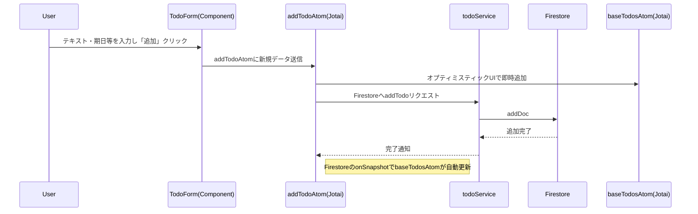
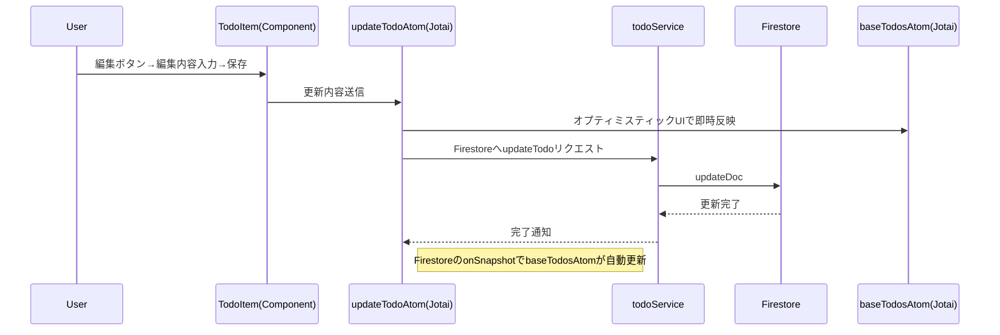
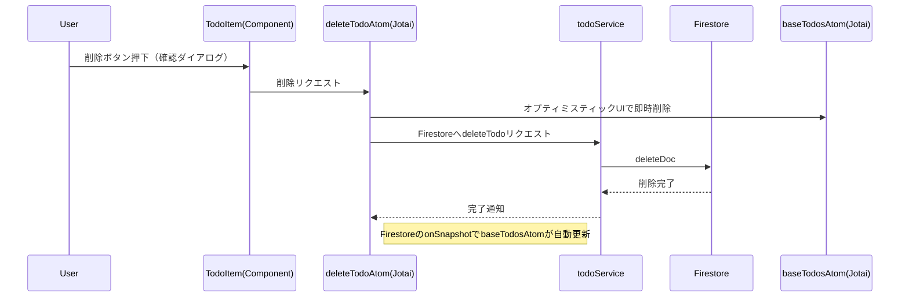
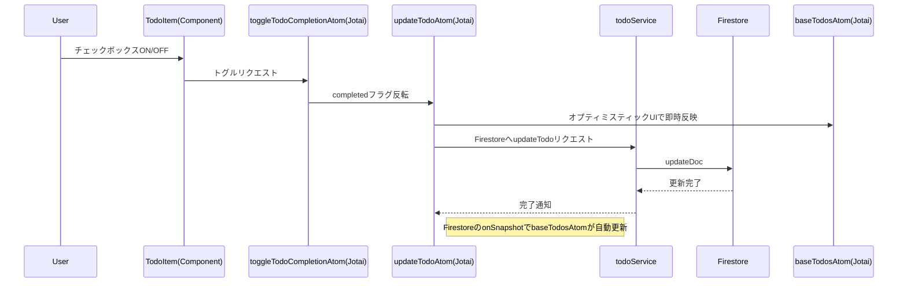
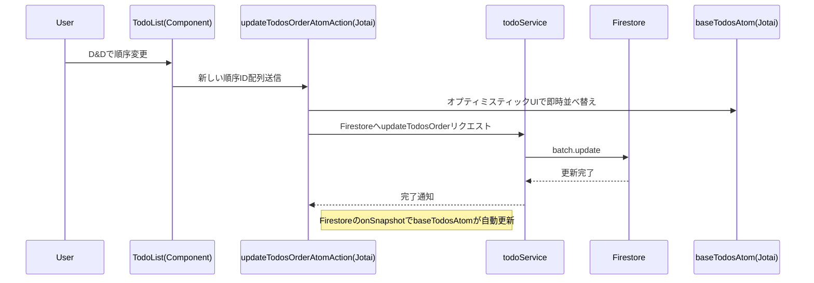

# Todo アプリ ユーザー操作シーケンス図

以下は、ユーザーの主要な操作（Todo 追加・編集・削除・完了トグル・D&D 順序変更）を起点としたシーケンス図です。

---

## 1. Todo 追加

---

## 2. Todo 編集

---

## 3. Todo 削除

---

## 4. Todo 完了トグル

---

## 5. D&D による順序変更

---

## 備考

- Firestore のリアルタイム購読（onSnapshot）により、DB 変更は baseTodosAtom に自動反映されます。
- オプティミスティック UI により、API 応答前に UI が即時更新されます。
- エラー時はロールバック処理が行われます。
