# 高機能 Todo アプリケーション（Jotai 版）詳細設計書

## 文書情報

- **作成日**: 2025 年 6 月 11 日
- **バージョン**: 1.0
- **対象システム**: 高機能 Todo アプリケーション（Jotai 版）
- **基準文書**: 仕様書.md、要件定義書.md、user-sequence-diagrams.md

---

## 1. システム全体アーキテクチャ設計

### 1.1 アーキテクチャ概要

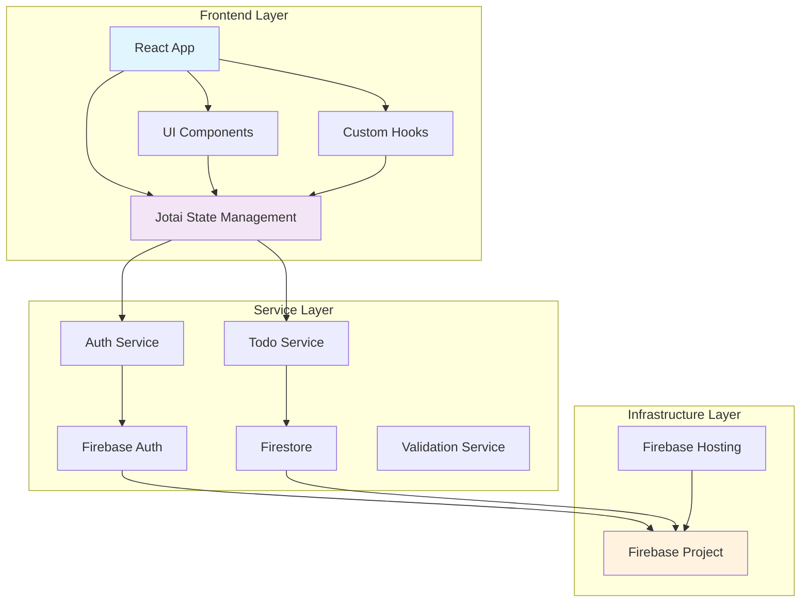

### 1.2 レイヤー責務

| レイヤー             | 責務                              | 主要コンポーネント            |
| -------------------- | --------------------------------- | ----------------------------- |
| Frontend Layer       | UI 表示、ユーザーインタラクション | React Components, Jotai Atoms |
| Service Layer        | ビジネスロジック、外部 API 連携   | Auth/Todo Services            |
| Infrastructure Layer | データ永続化、認証基盤            | Firebase Services             |

---

## 2. データベース設計（Firestore）

### 2.1 コレクション構造

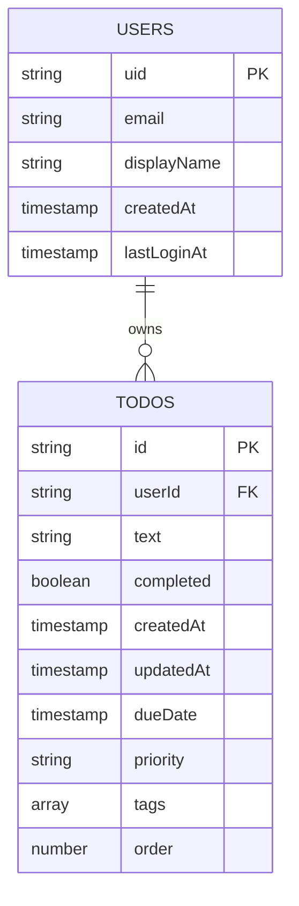

### 2.2 データモデル詳細

#### 2.2.1 Users Collection

```typescript
interface UserDocument {
  uid: string; // Firebase Auth UID
  email: string; // ユーザーメールアドレス
  displayName?: string; // 表示名（オプション）
  createdAt: Timestamp; // アカウント作成日時
  lastLoginAt: Timestamp; // 最終ログイン日時
}
```

#### 2.2.2 Todos Collection

```typescript
interface TodoDocument {
  id: string; // ドキュメントID
  userId: string; // 所有者UID
  text: string; // Todo内容
  completed: boolean; // 完了状態
  createdAt: Timestamp; // 作成日時
  updatedAt: Timestamp; // 更新日時
  dueDate?: Timestamp | null; // 期日（オプション）
  priority: "low" | "medium" | "high"; // 優先度
  tags: string[]; // タグ配列
  order: number; // 表示順序
}
```

### 2.3 Firestore セキュリティルール

```javascript
rules_version = '2';
service cloud.firestore {
  match /databases/{database}/documents {
    // Todos Collection Rules
    match /todos/{todoId} {
      // 読み取り・更新: 自分のTodoのみ
      allow read, write: if request.auth != null &&
                        request.auth.uid == resource.data.userId;

      // 作成: 認証済みユーザーが自分のTodoを作成
      allow create: if request.auth != null &&
                   request.auth.uid == request.resource.data.userId &&
                   validateTodoData(request.resource.data);
    }

    // Users Collection Rules
    match /users/{userId} {
      allow read, write: if request.auth != null &&
                        request.auth.uid == userId;
    }

    // バリデーション関数
    function validateTodoData(data) {
      return data.keys().hasAll(['text', 'completed', 'priority', 'tags', 'order']) &&
             data.text is string && data.text.size() > 0 && data.text.size() <= 500 &&
             data.completed is bool &&
             data.priority in ['low', 'medium', 'high'] &&
             data.tags is list && data.tags.size() <= 10 &&
             data.order is number;
    }
  }
}
```

### 2.4 インデックス設計

| コレクション | フィールド        | 種類 | 用途                       |
| ------------ | ----------------- | ---- | -------------------------- |
| todos        | userId, createdAt | 複合 | ユーザー別作成日時ソート   |
| todos        | userId, dueDate   | 複合 | ユーザー別期日ソート       |
| todos        | userId, priority  | 複合 | ユーザー別優先度フィルタ   |
| todos        | userId, completed | 複合 | ユーザー別完了状態フィルタ |

---

## 3. 状態管理設計（Jotai Atoms）

### 3.1 Atom 構造図

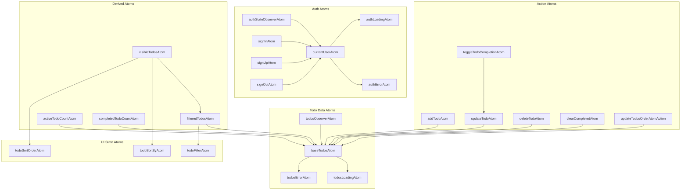

### 3.2 Atom 詳細設計

#### 3.2.1 認証関連 Atoms (`store/authAtoms.ts`)

```typescript
// 基本状態Atoms
export const currentUserAtom = atom<User | null>(null);
export const authLoadingAtom = atom<boolean>(true);
export const authErrorAtom = atom<string | null>(null);

// 監視Atom（副作用あり）
export const authStateObserverAtom = atom(
  (get) => get(currentUserAtom),
  (_get, set) => {
    // Firebase Auth状態変更監視の実装
    // onAuthStateChangedリスナー設定
    // unsubscribe関数を返す
  }
);

// アクションAtoms（書き込み専用）
export const signInAtom = atom(
  null,
  async (_get, set, { email, password }: SignInParams) => {
    // サインイン処理の実装
  }
);

export const signUpAtom = atom(
  null,
  async (_get, set, { email, password }: SignUpParams) => {
    // サインアップ処理の実装
  }
);

export const signOutAtom = atom(null, async (_get, set) => {
  // サインアウト処理の実装
});
```

#### 3.2.2 Todo 関連 Atoms (`store/todoAtoms.ts`)

```typescript
// データAtoms
export const baseTodosAtom = atom<Todo[]>([]);
export const todosLoadingAtom = atom<boolean>(true);
export const todosErrorAtom = atom<string | null>(null);

// UI状態Atoms
export const todoFilterAtom = atom<TodoFilterType>("all");
export const todoSortByAtom = atom<TodoSortBy>("order");
export const todoSortOrderAtom = atom<TodoSortOrder>("asc");

// 派生Atoms
export const filteredTodosAtom = atom<Todo[]>((get) => {
  const todos = get(baseTodosAtom);
  const filter = get(todoFilterAtom);

  switch (filter) {
    case "active":
      return todos.filter((todo) => !todo.completed);
    case "completed":
      return todos.filter((todo) => todo.completed);
    default:
      return todos;
  }
});

export const visibleTodosAtom = atom<Todo[]>((get) => {
  const filtered = get(filteredTodosAtom);
  const sortBy = get(todoSortByAtom);
  const sortOrder = get(todoSortOrderAtom);

  return sortTodos(filtered, sortBy, sortOrder);
});

// 統計Atoms
export const activeTodoCountAtom = atom(
  (get) => get(baseTodosAtom).filter((todo) => !todo.completed).length
);

export const completedTodoCountAtom = atom(
  (get) => get(baseTodosAtom).filter((todo) => todo.completed).length
);

// アクションAtoms
export const addTodoAtom = atom(
  null,
  async (get, set, newTodoData: NewTodoData) => {
    // Todo追加処理の実装
  }
);

export const updateTodoAtom = atom(
  null,
  async (get, set, { id, updatedFields }: UpdateTodoParams) => {
    // Todo更新処理の実装
  }
);

export const deleteTodoAtom = atom(null, async (get, set, id: string) => {
  // Todo削除処理の実装
});
```

### 3.3 状態フロー設計

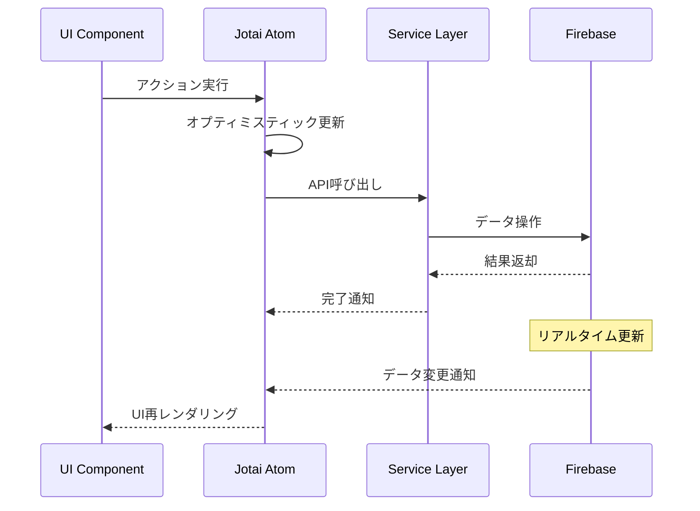

---

## 4. コンポーネント設計

### 4.1 コンポーネント階層構造

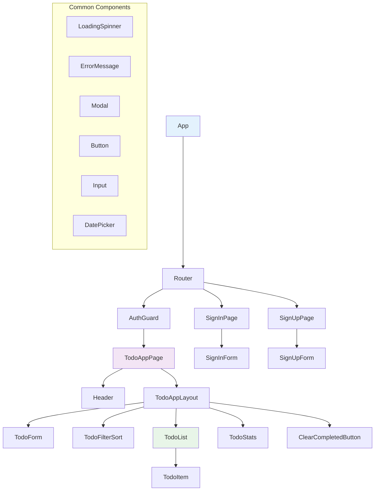

### 4.2 主要コンポーネント設計

#### 4.2.1 コンポーネント責務表

| コンポーネント   | 責務                   | Props                       | 内部 State | 使用 Atoms                                                     |
| ---------------- | ---------------------- | --------------------------- | ---------- | -------------------------------------------------------------- |
| `App`            | アプリケーション初期化 | なし                        | なし       | `authStateObserverAtom`                                        |
| `AuthGuard`      | 認証保護               | `children`                  | なし       | `currentUserAtom`                                              |
| `TodoAppLayout`  | メインレイアウト       | なし                        | なし       | なし                                                           |
| `TodoForm`       | Todo 追加・編集        | `editingTodo?`, `onCancel?` | フォーム値 | `addTodoAtom`, `updateTodoAtom`                                |
| `TodoList`       | Todo リスト表示        | なし                        | D&D 状態   | `visibleTodosAtom`, `updateTodosOrderAtomAction`               |
| `TodoItem`       | 個別 Todo 表示         | `todo`                      | 編集モード | `updateTodoAtom`, `deleteTodoAtom`, `toggleTodoCompletionAtom` |
| `TodoFilterSort` | フィルタ・ソート       | なし                        | なし       | `todoFilterAtom`, `todoSortByAtom`, `todoSortOrderAtom`        |

#### 4.2.2 コンポーネントインターフェース

```typescript
// TodoForm Component
interface TodoFormProps {
  editingTodo?: Todo;
  onCancel?: () => void;
}

interface TodoFormState {
  text: string;
  dueDate: Date | null;
  priority: Priority;
  tags: string[];
}

// TodoItem Component
interface TodoItemProps {
  todo: Todo;
}

interface TodoItemState {
  isEditing: boolean;
  editText: string;
  editDueDate: Date | null;
  editPriority: Priority;
  editTags: string[];
}

// TodoList Component
interface TodoListProps {
  // Props不要（Atomから直接取得）
}

interface TodoListState {
  draggedItem: string | null;
}
```

### 4.3 コンポーネント設計パターン

#### 4.3.1 Container/Presentational Pattern

```typescript
// Container Component (Logic)
const TodoListContainer: React.FC = () => {
  const [todos] = useAtom(visibleTodosAtom);
  const [, updateOrder] = useAtom(updateTodosOrderAtomAction);

  const handleDragEnd = (result: DropResult) => {
    // D&Dロジック
  };

  return <TodoListPresentation todos={todos} onDragEnd={handleDragEnd} />;
};

// Presentational Component (UI)
interface TodoListPresentationProps {
  todos: Todo[];
  onDragEnd: (result: DropResult) => void;
}

const TodoListPresentation: React.FC<TodoListPresentationProps> = ({
  todos,
  onDragEnd,
}) => {
  return (
    <DragDropContext onDragEnd={onDragEnd}>{/* UI実装 */}</DragDropContext>
  );
};
```

#### 4.3.2 Custom Hooks Pattern

```typescript
// Todo操作用カスタムフック
export const useTodoOperations = () => {
  const [, addTodo] = useAtom(addTodoAtom);
  const [, updateTodo] = useAtom(updateTodoAtom);
  const [, deleteTodo] = useAtom(deleteTodoAtom);
  const [, toggleCompletion] = useAtom(toggleTodoCompletionAtom);

  return {
    addTodo,
    updateTodo,
    deleteTodo,
    toggleCompletion,
  };
};

// フォーム管理用カスタムフック
export const useTodoForm = (initialTodo?: Todo) => {
  const [formData, setFormData] = useState<TodoFormData>({
    text: initialTodo?.text || "",
    dueDate: initialTodo?.dueDate || null,
    priority: initialTodo?.priority || "medium",
    tags: initialTodo?.tags || [],
  });

  const validate = () => {
    // バリデーションロジック
  };

  const reset = () => {
    // フォームリセット
  };

  return {
    formData,
    setFormData,
    validate,
    reset,
  };
};
```

---

## 5. API 設計（Firebase Service Layer）

### 5.1 サービス層アーキテクチャ

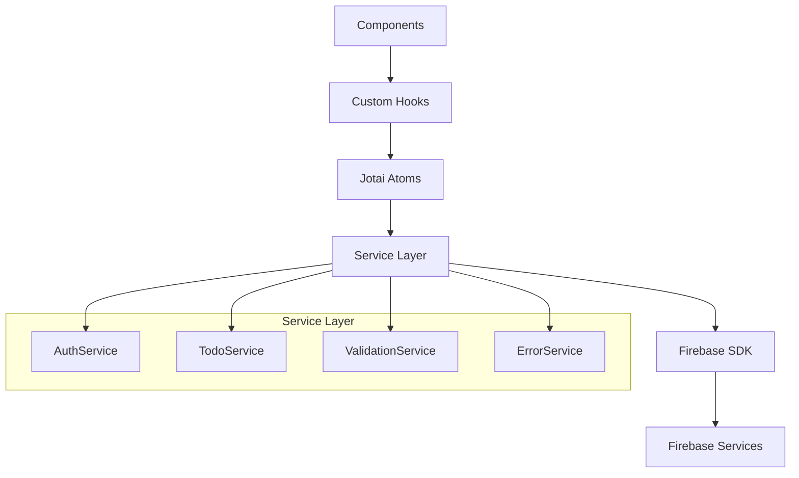

### 5.2 認証サービス設計

```typescript
// services/authService.ts
export interface AuthService {
  // 認証状態監視
  onAuthStateChanged(
    callback: (user: User | null) => void,
    errorCallback: (error: Error) => void
  ): () => void;

  // 認証操作
  signInWithEmailAndPassword(
    email: string,
    password: string
  ): Promise<UserCredential>;
  createUserWithEmailAndPassword(
    email: string,
    password: string
  ): Promise<UserCredential>;
  signOut(): Promise<void>;

  // パスワード管理
  sendPasswordResetEmail(email: string): Promise<void>;
  updatePassword(newPassword: string): Promise<void>;

  // プロフィール管理
  updateProfile(profile: { displayName?: string }): Promise<void>;
}

// 実装例
export const authService: AuthService = {
  onAuthStateChanged: (callback, errorCallback) => {
    return onAuthStateChanged(auth, callback, errorCallback);
  },

  signInWithEmailAndPassword: async (email, password) => {
    try {
      return await signInWithEmailAndPassword(auth, email, password);
    } catch (error) {
      throw new AuthError(error);
    }
  },

  // 他のメソッド実装...
};
```

### 5.3 Todo サービス設計

```typescript
// services/todoService.ts
export interface TodoService {
  // リアルタイム購読
  subscribeToTodos(
    userId: string,
    onUpdate: (todos: Todo[]) => void,
    onError: (error: Error) => void
  ): () => void;

  // CRUD操作
  addTodo(userId: string, todoData: CreateTodoData): Promise<string>;
  updateTodo(todoId: string, updates: UpdateTodoData): Promise<void>;
  deleteTodo(todoId: string): Promise<void>;
  getTodo(todoId: string): Promise<Todo | null>;

  // 一括操作
  clearCompletedTodos(todoIds: string[]): Promise<void>;
  updateTodosOrder(orderedTodos: OrderUpdateData[]): Promise<void>;

  // 検索・フィルタ
  searchTodos(userId: string, query: string): Promise<Todo[]>;
  getTodosByTag(userId: string, tag: string): Promise<Todo[]>;
}

// データ型定義
export interface CreateTodoData {
  text: string;
  dueDate?: Date | null;
  priority: Priority;
  tags: string[];
  order: number;
}

export interface UpdateTodoData {
  text?: string;
  completed?: boolean;
  dueDate?: Date | null;
  priority?: Priority;
  tags?: string[];
  order?: number;
}

export interface OrderUpdateData {
  id: string;
  order: number;
}
```

### 5.4 エラーハンドリング設計

```typescript
// services/errorService.ts
export class AppError extends Error {
  constructor(
    message: string,
    public code: string,
    public originalError?: Error
  ) {
    super(message);
    this.name = "AppError";
  }
}

export class AuthError extends AppError {
  constructor(originalError: any) {
    const message = getAuthErrorMessage(originalError.code);
    super(message, originalError.code, originalError);
    this.name = "AuthError";
  }
}

export class TodoError extends AppError {
  constructor(originalError: any) {
    const message = getTodoErrorMessage(originalError.code);
    super(message, originalError.code, originalError);
    this.name = "TodoError";
  }
}

// エラーメッセージマッピング
const getAuthErrorMessage = (code: string): string => {
  const messages: Record<string, string> = {
    "auth/user-not-found": "ユーザーが見つかりません",
    "auth/wrong-password": "パスワードが間違っています",
    "auth/email-already-in-use": "このメールアドレスは既に使用されています",
    "auth/weak-password": "パスワードが弱すぎます",
    "auth/invalid-email": "メールアドレスの形式が正しくありません",
  };

  return messages[code] || "認証エラーが発生しました";
};
```

---

## 6. UI/UX 設計

### 6.1 レスポンシブデザイン

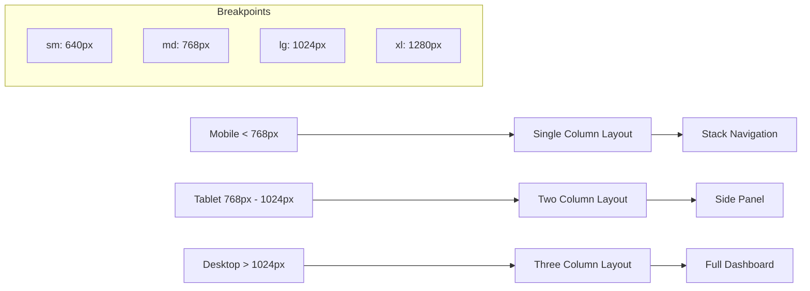

#### 6.1.1 レイアウト設計

| デバイス | 幅             | レイアウト | 特徴                                 |
| -------- | -------------- | ---------- | ------------------------------------ |
| Mobile   | < 768px        | 単一カラム | スタック配置、フルスクリーンモーダル |
| Tablet   | 768px - 1024px | 2 カラム   | サイドパネル、スライドメニュー       |
| Desktop  | > 1024px       | 3 カラム   | フルダッシュボード、固定サイドバー   |

#### 6.1.2 Tailwind CSS 設計システム

```css
/* カスタムユーティリティクラス */
@layer components {
  .todo-card {
    @apply bg-white rounded-lg shadow-sm border border-gray-200 p-4 hover:shadow-md transition-shadow;
  }

  .todo-input {
    @apply w-full px-3 py-2 border border-gray-300 rounded-md focus:outline-none focus:ring-2 focus:ring-blue-500 focus:border-transparent;
  }

  .btn-primary {
    @apply bg-blue-600 text-white px-4 py-2 rounded-md hover:bg-blue-700 focus:outline-none focus:ring-2 focus:ring-blue-500 focus:ring-offset-2 disabled:opacity-50 disabled:cursor-not-allowed;
  }

  .btn-secondary {
    @apply bg-gray-200 text-gray-800 px-4 py-2 rounded-md hover:bg-gray-300 focus:outline-none focus:ring-2 focus:ring-gray-500 focus:ring-offset-2;
  }
}
```

### 6.2 アクセシビリティ設計

#### 6.2.1 WCAG 2.1 AA 準拠

| 要素               | 対応内容                                | 実装方法                                 |
| ------------------ | --------------------------------------- | ---------------------------------------- |
| キーボード操作     | Tab 順序、Enter/Space 操作、Escape 終了 | `tabIndex`, `onKeyDown`                  |
| スクリーンリーダー | ARIA 属性、alt 属性、role 属性          | `aria-label`, `role`, `aria-describedby` |
| コントラスト       | 4.5:1 以上のコントラスト比              | カラーパレット設計                       |
| フォーカス表示     | 明確なフォーカスリング                  | `focus:ring-2`                           |

#### 6.2.2 アクセシビリティ実装例

```typescript
// TodoItem Component
const TodoItem: React.FC<TodoItemProps> = ({ todo }) => {
  return (
    <div
      role="listitem"
      aria-label={`Todo: ${todo.text}, ${todo.completed ? "完了" : "未完了"}`}
      className="todo-card"
    >
      <input
        type="checkbox"
        checked={todo.completed}
        onChange={handleToggle}
        aria-describedby={`todo-${todo.id}-description`}
        className="sr-only"
      />
      <label
        htmlFor={`todo-${todo.id}`}
        className="flex items-center cursor-pointer"
      >
        <span className="checkbox-custom" />
        <span
          id={`todo-${todo.id}-description`}
          className={todo.completed ? "line-through text-gray-500" : ""}
        >
          {todo.text}
        </span>
      </label>

      <button
        onClick={handleEdit}
        aria-label={`${todo.text}を編集`}
        className="btn-secondary"
      >
        編集
      </button>

      <button
        onClick={handleDelete}
        aria-label={`${todo.text}を削除`}
        className="btn-danger"
      >
        削除
      </button>
    </div>
  );
};
```

### 6.3 ローディング・エラー状態設計

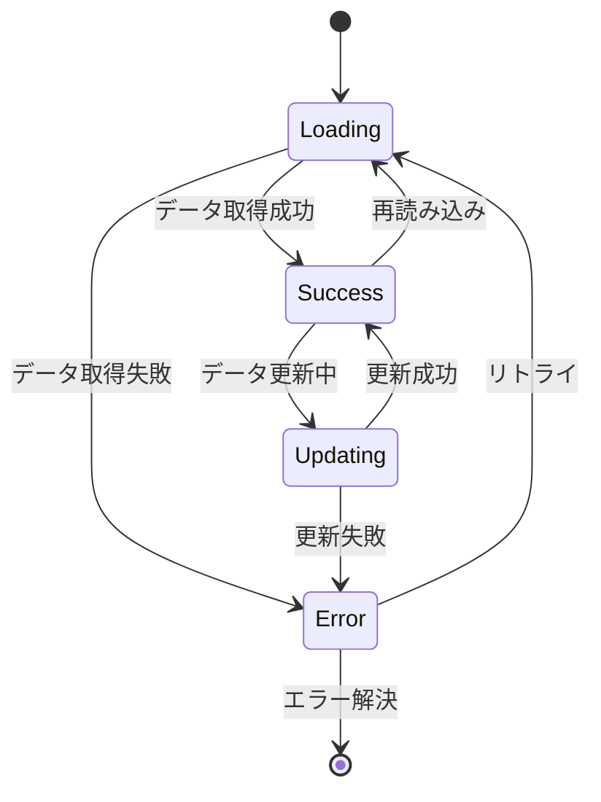

#### 6.3.1 ローディング状態

```typescript
// LoadingSpinner Component
const LoadingSpinner: React.FC<{
  text?: string;
  size?: "sm" | "md" | "lg";
}> = ({ text = "Loading...", size = "md" }) => {
  const sizeClasses = {
    sm: "w-4 h-4",
    md: "w-8 h-8",
    lg: "w-12 h-12",
  };

  return (
    <div className="flex flex-col items-center justify-center p-4">
      <div
        className={`animate-spin rounded-full border-2 border-gray-300 border-t-blue-600 ${sizeClasses[size]}`}
      />
      {text && <p className="mt-2 text-sm text-gray-600">{text}</p>}
    </div>
  );
};

// Skeleton Loading
const TodoSkeleton: React.FC = () => {
  return (
    <div className="todo-card animate-pulse">
      <div className="flex items-center space-x-3">
        <div className="w-4 h-4 bg-gray-300 rounded" />
        <div className="flex-1 space-y-2">
          <div className="h-4 bg-gray-300 rounded w-3/4" />
          <div className="h-3 bg-gray-300 rounded w-1/2" />
        </div>
      </div>
    </div>
  );
};
```

#### 6.3.2 エラー状態

```typescript
// ErrorMessage Component
interface ErrorMessageProps {
  message: string;
  onRetry?: () => void;
  type?: "error" | "warning" | "info";
}

const ErrorMessage: React.FC<ErrorMessageProps> = ({
  message,
  onRetry,
  type = "error",
}) => {
  const typeClasses = {
    error: "bg-red-50 border-red-200 text-red-800",
    warning: "bg-yellow-50 border-yellow-200 text-yellow-800",
    info: "bg-blue-50 border-blue-200 text-blue-800",
  };

  return (
    <div className={`border rounded-md p-4 ${typeClasses[type]}`}>
      <div className="flex items-center">
        <AlertCircle className="w-5 h-5 mr-2" />
        <p className="text-sm font-medium">{message}</p>
      </div>
      {onRetry && (
        <button
          onClick={onRetry}
          className="mt-2 text-sm underline hover:no-underline"
        >
          再試行
        </button>
      )}
    </div>
  );
};
```

---

## 7. セキュリティ設計

### 7.1 認証・認可フロー

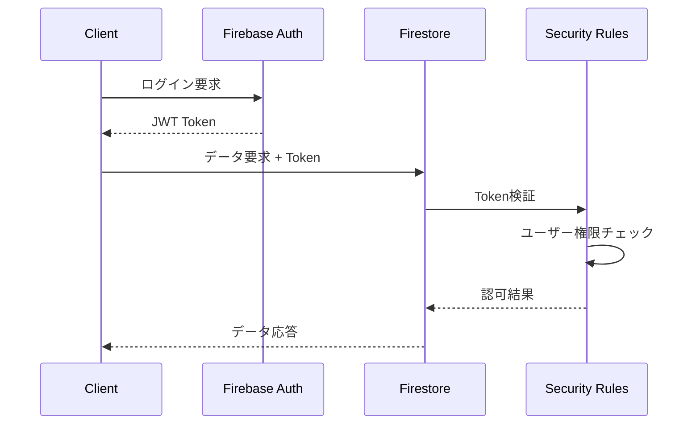

### 7.2 入力検証設計

#### 7.2.1 クライアント側検証

```typescript
// utils/validationUtils.ts
export const todoValidation = {
  text: {
    required: true,
    minLength: 1,
    maxLength: 500,
    pattern: /^[^<>]*$/, // HTMLタグ禁止
  },
  priority: {
    enum: ["low", "medium", "high"],
  },
  tags: {
    maxItems: 10,
    itemMaxLength: 20,
    pattern: /^[a-zA-Z0-9\u3040-\u309F\u30A0-\u30FF\u4E00-\u9FAF]+$/, // 英数字・ひらがな・カタカナ・漢字のみ
  },
  dueDate: {
    type: "date",
    min: new Date(), // 過去日付禁止
  },
};

export const validateTodo = (data: Partial<Todo>): ValidationResult => {
  const errors: string[] = [];

  // テキスト検証
  if (!data.text || data.text.trim().length === 0) {
    errors.push("Todoの内容を入力してください");
  } else if (data.text.length > 500) {
    errors.push("Todoの内容は500文字以内で入力してください");
  } else if (/<[^>]*>/.test(data.text)) {
    errors.push("HTMLタグは使用できません");
  }

  // 優先度検証
  if (data.priority && !["low", "medium", "high"].includes(data.priority)) {
    errors.push("無効な優先度です");
  }

  // タグ検証
  if (data.tags) {
    if (data.tags.length > 10) {
      errors.push("タグは10個まで設定できます");
    }
    data.tags.forEach((tag) => {
      if (tag.length > 20) {
        errors.push("タグは20文字以内で入力してください");
      }
    });
  }

  return {
    isValid: errors.length === 0,
    errors,
  };
};
```

#### 7.2.2 サーバー側検証（Firestore Rules）

```javascript
// Firestore Security Rules
function validateTodoData(data) {
  return data.keys().hasAll(['text', 'completed', 'priority', 'tags', 'order']) &&
         // テキスト検証
         data.text is string &&
         data.text.size() > 0 &&
         data.text.size() <= 500 &&
         !data.text.matches('.*<.*>.*') && // HTMLタグ禁止

         // 完了状態検証
         data.completed is bool &&

         // 優先度検証
         data.priority in ['low', 'medium', 'high'] &&

         // タグ検証
         data.tags is list &&
         data.tags.size() <= 10 &&
         data.tags.hasOnly([string]) &&

         // 順序検証
         data.order is number &&
         data.order >= 0;
}
```

### 7.3 XSS・CSRF 対策

| 脅威         | 対策               | 実装方法                        |
| ------------ | ------------------ | ------------------------------- |
| XSS          | 入力値サニタイズ   | DOMPurify、React 自動エスケープ |
| CSRF         | SameSite Cookie    | Firebase Auth 自動対応          |
| Injection    | パラメータ化クエリ | Firestore SDK 自動対応          |
| 認証バイパス | トークン検証       | Firebase Security Rules         |

---

## 8. パフォーマンス設計

### 8.1 最適化戦略

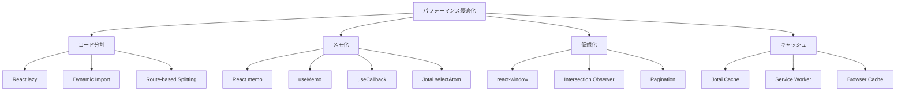

### 8.2 バンドル最適化

#### 8.2.1 Vite 設定

```typescript
// vite.config.ts
export default defineConfig({
  plugins: [react()],
  build: {
    rollupOptions: {
      output: {
        manualChunks: {
          vendor: ["react", "react-dom"],
          firebase: ["firebase/app", "firebase/auth", "firebase/firestore"],
          ui: ["react-beautiful-dnd", "date-fns"],
          jotai: ["jotai"],
        },
      },
    },
    chunkSizeWarningLimit: 1000,
  },
  optimizeDeps: {
    include: ["react", "react-dom", "jotai"],
  },
});
```

#### 8.2.2 パフォーマンス目標

| メトリクス               | 目標値  | 測定方法                |
| ------------------------ | ------- | ----------------------- |
| First Contentful Paint   | < 1.5s  | Lighthouse              |
| Largest Contentful Paint | < 2.5s  | Lighthouse              |
| Cumulative Layout Shift  | < 0.1   | Lighthouse              |
| First Input Delay        | < 100ms | Lighthouse              |
| Bundle Size              | < 500KB | webpack-bundle-analyzer |

### 8.3 レンダリング最適化

```typescript
// 最適化されたTodoItem
const TodoItem = React.memo<TodoItemProps>(
  ({ todo }) => {
    const [, updateTodo] = useAtom(updateTodoAtom);
    const [, deleteTodo] = useAtom(deleteTodoAtom);

    // メモ化されたコールバック
    const handleToggle = useCallback(() => {
      updateTodo({
        id: todo.id,
        updatedFields: { completed: !todo.completed },
      });
    }, [todo.id, todo.completed, updateTodo]);

    const handleDelete = useCallback(() => {
      if (window.confirm(`"${todo.text}"を削除しますか？`)) {
        deleteTodo(todo.id);
      }
    }, [todo.id, todo.text, deleteTodo]);

    // メモ化された計算値
    const formattedDueDate = useMemo(() => {
      return todo.dueDate ? formatDate(todo.dueDate) : null;
    }, [todo.dueDate]);

    return <div className="todo-item">{/* UI実装 */}</div>;
  },
  (prevProps, nextProps) => {
    // カスタム比較関数
    return (
      prevProps.todo.id === nextProps.todo.id &&
      prevProps.todo.text === nextProps.todo.text &&
      prevProps.todo.completed === nextProps.todo.completed &&
      prevProps.todo.updatedAt === nextProps.todo.updatedAt
    );
  }
);
```

---

## 9. テスト設計

### 9.1 テスト戦略

```mermaid
pyramid
    title テストピラミッド

    "E2E Tests (10%)" : 10
    "Integration Tests (30%)" : 30
    "Unit Tests (60%)" : 60
```

### 9.2 テスト種別詳細

#### 9.2.1 Unit Tests

```typescript
// __tests__/atoms/todoAtoms.test.ts
describe("todoAtoms", () => {
  test("filteredTodosAtom should filter active todos", () => {
    const store = createStore();

    // テストデータ設定
    store.set(baseTodosAtom, [
      { id: "1", text: "Todo 1", completed: false },
      { id: "2", text: "Todo 2", completed: true },
    ]);
    store.set(todoFilterAtom, "active");

    // 結果検証
    const filtered = store.get(filteredTodosAtom);
    expect(filtered).toHaveLength(1);
    expect(filtered[0].completed).toBe(false);
  });

  test("addTodoAtom should add new todo", async () => {
    const store = createStore();
    const mockService = jest.mocked(todoService);

    // モック設定
    mockService.addTodo.mockResolvedValue("new-id");

    // アクション実行
    await store.set(addTodoAtom, {
      text: "New Todo",
      priority: "medium",
      tags: [],
    });

    // 検証
    expect(mockService.addTodo).toHaveBeenCalledWith(
      "user-id",
      expect.objectContaining({
        text: "New Todo",
        priority: "medium",
      })
    );
  });
});
```

#### 9.2.2 Component Tests

```typescript
// __tests__/components/TodoItem.test.tsx
describe("TodoItem", () => {
  const mockTodo: Todo = {
    id: "1",
    text: "Test Todo",
    completed: false,
    priority: "medium",
    tags: ["test"],
    // ... other fields
  };

  test("should render todo text", () => {
    render(
      <JotaiProvider>
        <TodoItem todo={mockTodo} />
      </JotaiProvider>
    );

    expect(screen.getByText("Test Todo")).toBeInTheDocument();
  });

  test("should toggle completion on checkbox click", async () => {
    const user = userEvent.setup();

    render(
      <JotaiProvider>
        <TodoItem todo={mockTodo} />
      </JotaiProvider>
    );

    const checkbox = screen.getByRole("checkbox");
    await user.click(checkbox);

    // Atom更新の検証
    // (実際の実装では、atomの状態変更をテスト)
  });

  test("should be accessible", async () => {
    const { container } = render(
      <JotaiProvider>
        <TodoItem todo={mockTodo} />
      </JotaiProvider>
    );

    const results = await axe(container);
    expect(results).toHaveNoViolations();
  });
});
```

#### 9.2.3 E2E Tests

```typescript
// e2e/todo-app.spec.ts
test.describe("Todo App", () => {
  test.beforeEach(async ({ page }) => {
    // テストユーザーでログイン
    await page.goto("/signin");
    await page.fill("[data-testid=email]", "test@example.com");
    await page.fill("[data-testid=password]", "password123");
    await page.click("[data-testid=signin-button]");
    await page.waitForURL("/");
  });

  test("should add new todo", async ({ page }) => {
    // Todo追加
    await page.fill("[data-testid=todo-input]", "New E2E Todo");
    await page.click("[data-testid=add-button]");

    // 結果確認
    await expect(page.locator("[data-testid=todo-item]")).toContainText(
      "New E2E Todo"
    );
  });

  test("should complete todo", async ({ page }) => {
    // Todoを完了状態に
    await page.click("[data-testid=todo-checkbox]:first-child");

    // 完了状態の確認
    await expect(
      page.locator("[data-testid=todo-item]:first-child")
    ).toHaveClass(/completed/);
  });

  test("should drag and drop todos", async ({ page }) => {
    // D&D操作
    const firstTodo = page.locator("[data-testid=todo-item]:first-child");
    const secondTodo = page.locator("[data-testid=todo-item]:nth-child(2)");

    await firstTodo.dragTo(secondTodo);

    // 順序変更の確認
    // (実際の実装では、順序が変更されたことを検証)
  });
});
```

### 9.3 テスト環境設定

#### 9.3.1 Jest 設定

```javascript
// jest.config.js
module.exports = {
  testEnvironment: "jsdom",
  setupFilesAfterEnv: ["<rootDir>/src/setupTests.ts"],
  moduleNameMapping: {
    "^@/(.*)$": "<rootDir>/src/$1",
  },
  collectCoverageFrom: [
    "src/**/*.{ts,tsx}",
    "!src/**/*.d.ts",
    "!src/main.tsx",
    "!src/vite-env.d.ts",
  ],
  coverageThreshold: {
    global: {
      branches: 80,
      functions: 80,
      lines: 80,
      statements: 80,
    },
  },
};
```

#### 9.3.2 Firebase Emulator 設定

```json
// firebase.json
{
  "emulators": {
    "auth": {
      "port": 9099
    },
    "firestore": {
      "port": 8080
    },
    "ui": {
      "enabled": true,
      "port": 4000
    }
  }
}
```

---

## 10. 開発・デプロイ設計

### 10.1 開発フロー


### 10.2 CI/CD パイプライン

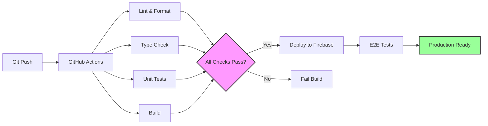

#### 10.2.1 GitHub Actions 設定

```yaml
# .github/workflows/ci-cd.yml
name: CI/CD Pipeline

on:
  push:
    branches: [main, develop]
  pull_request:
    branches: [main]

jobs:
  test:
    runs-on: ubuntu-latest
    steps:
      - uses: actions/checkout@v3
      - uses: actions/setup-node@v3
        with:
          node-version: "18"
          cache: "npm"

      - name: Install dependencies
        run: npm ci

      - name: Lint
        run: npm run lint

      - name: Type check
        run: npm run type-check

      - name: Unit tests
        run: npm run test:coverage

      - name: Build
        run: npm run build

      - name: Upload coverage
        uses: codecov/codecov-action@v3

  deploy:
    needs: test
    runs-on: ubuntu-latest
    if: github.ref == 'refs/heads/main'
    steps:
      - uses: actions/checkout@v3
      - uses: actions/setup-node@v3
        with:
          node-version: "18"
          cache: "npm"

      - name: Install dependencies
        run: npm ci

      - name: Build
        run: npm run build

      - name: Deploy to Firebase
        uses: FirebaseExtended/action-hosting-deploy@v0
        with:
          repoToken: "${{ secrets.GITHUB_TOKEN }}"
          firebaseServiceAccount: "${{ secrets.FIREBASE_SERVICE_ACCOUNT }}"
          projectId: "${{ secrets.FIREBASE_PROJECT_ID }}"
          channelId: live
```

### 10.3 環境管理

#### 10.3.1 環境別設定

| 環境        | 用途       | Firebase Project | URL                      |
| ----------- | ---------- | ---------------- | ------------------------ |
| Development | 開発環境   | todo-app-dev     | localhost:5173           |
| Staging     | テスト環境 | todo-app-staging | todo-app-staging.web.app |
| Production  | 本番環境   | todo-app-prod    | todo-app.web.app         |

#### 10.3.2 環境変数管理

```typescript
// src/config/env.ts
interface EnvConfig {
  firebase: {
    apiKey: string;
    authDomain: string;
    projectId: string;
    storageBucket: string;
    messagingSenderId: string;
    appId: string;
  };
  app: {
    name: string;
    version: string;
    environment: "development" | "staging" | "production";
  };
}

export const env: EnvConfig = {
  firebase: {
    apiKey: import.meta.env.VITE_FIREBASE_API_KEY,
    authDomain: import.meta.env.VITE_FIREBASE_AUTH_DOMAIN,
    projectId: import.meta.env.VITE_FIREBASE_PROJECT_ID,
    storageBucket: import.meta.env.VITE_FIREBASE_STORAGE_BUCKET,
    messagingSenderId: import.meta.env.VITE_FIREBASE_MESSAGING_SENDER_ID,
    appId: import.meta.env.VITE_FIREBASE_APP_ID,
  },
  app: {
    name: "Todo App",
    version: import.meta.env.VITE_APP_VERSION || "1.0.0",
    environment: import.meta.env.VITE_APP_ENV || "development",
  },
};
```

---

## 11. 監視・運用設計

### 11.1 エラー監視

```typescript
// src/services/errorReporting.ts
import { captureException, captureMessage } from "@sentry/react";

export const errorReporting = {
  captureError: (error: Error, context?: Record<string, any>) => {
    console.error("Error captured:", error);

    if (env.app.environment !== "development") {
      captureException(error, {
        tags: {
          component: context?.component,
          action: context?.action,
        },
        extra: context,
      });
    }
  },

  captureMessage: (
    message: string,
    level: "info" | "warning" | "error" = "info"
  ) => {
    console.log(`[${level.toUpperCase()}] ${message}`);

    if (env.app.environment !== "development") {
      captureMessage(message, level);
    }
  },
};
```

### 11.2 パフォーマンス監視

```typescript
// src/utils/performance.ts
export const performanceMonitoring = {
  measureRender: (componentName: string) => {
    const startTime = performance.now();

    return () => {
      const endTime = performance.now();
      const duration = endTime - startTime;

      if (duration > 16) {
        // 60fps threshold
        console.warn(
          `Slow render detected: ${componentName} took ${duration.toFixed(2)}ms`
        );
      }
    };
  },

  measureAsync: async <T>(
    operation: string,
    fn: () => Promise<T>
  ): Promise<T> => {
    const startTime = performance.now();

    try {
      const result = await fn();
      const duration = performance.now() - startTime;

      console.log(`${operation} completed in ${duration.toFixed(2)}ms`);
      return result;
    } catch (error) {
      const duration = performance.now() - startTime;
      console.error(
        `${operation} failed after ${duration.toFixed(2)}ms:`,
        error
      );
      throw error;
    }
  },
};
```

---

## 12. 実装計画

### 12.1 開発フェーズ

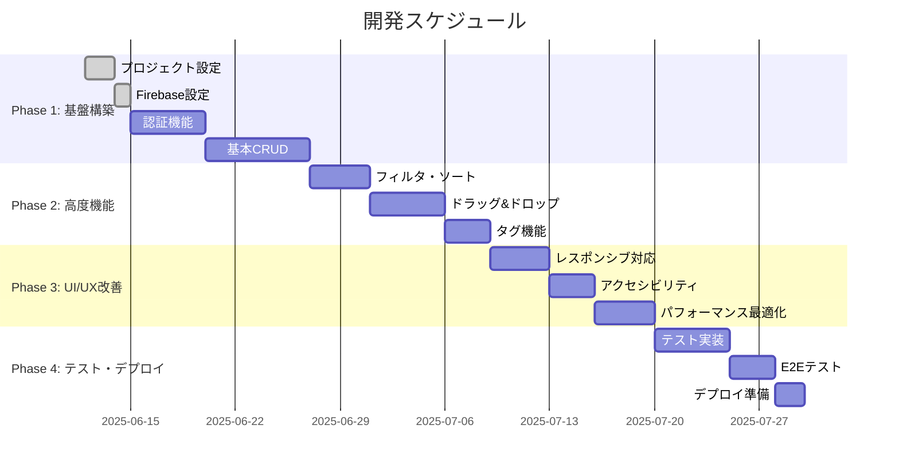

### 12.2 実装優先順位

| フェーズ | 機能                 | 優先度 | 期間 | 依存関係             |
| -------- | -------------------- | ------ | ---- | -------------------- |
| Phase 1  | プロジェクト設定     | 高     | 2 日 | なし                 |
| Phase 1  | Firebase 設定        | 高     | 1 日 | プロジェクト設定     |
| Phase 1  | 認証機能             | 高     | 5 日 | Firebase 設定        |
| Phase 1  | 基本 CRUD            | 高     | 7 日 | 認証機能             |
| Phase 2  | フィルタ・ソート     | 高     | 4 日 | 基本 CRUD            |
| Phase 2  | ドラッグ&ドロップ    | 高     | 5 日 | フィルタ・ソート     |
| Phase 2  | タグ機能             | 中     | 3 日 | ドラッグ&ドロップ    |
| Phase 3  | レスポンシブ対応     | 高     | 4 日 | タグ機能             |
| Phase 3  | アクセシビリティ     | 高     | 3 日 | レスポンシブ対応     |
| Phase 3  | パフォーマンス最適化 | 中     | 4 日 | アクセシビリティ     |
| Phase 4  | テスト実装           | 高     | 5 日 | パフォーマンス最適化 |
| Phase 4  | E2E テスト           | 中     | 3 日 | テスト実装           |
| Phase 4  | デプロイ準備         | 高     | 2 日 | E2E テスト           |

---

## 13. まとめ

この詳細設計書では、高機能 Todo アプリケーション（Jotai 版）の包括的な設計を行いました。

### 13.1 設計のポイント

1. **スケーラブルなアーキテクチャ**: Jotai を活用した細粒度状態管理
2. **セキュアな設計**: Firebase Security Rules による多層防御
3. **優れた UX**: レスポンシブ対応とアクセシビリティ準拠
4. **高パフォーマンス**: 最適化戦略とバンドル管理
5. **品質保証**: 包括的なテスト戦略
6. **運用性**: 監視・デプロイ自動化

### 13.2 技術的な特徴

- **React 18 + TypeScript**: 型安全性とモダンな開発体験
- **Jotai**: 宣言的で効率的な状態管理
- **Firebase**: 認証・データベース・ホスティングの統合
- **Tailwind CSS**: ユーティリティファーストなスタイリング
- **react-beautiful-dnd**: アクセシブルなドラッグ&ドロップ

### 13.3 期待される成果

- **開発効率**: 明確な設計による迅速な開発
- **保守性**: 構造化されたコードベース
- **拡張性**: 将来の機能追加への対応
- **品質**: 高いテストカバレッジ
- **ユーザー体験**: 直感的で使いやすいインターフェース

この設計書を基に、実装フェーズに進むことができます。

---

**文書作成日**: 2025 年 6 月 11 日  
**バージョン**: 1.0  
**作成者**: システム設計チーム  
**承認者**: プロジェクトマネージャー
