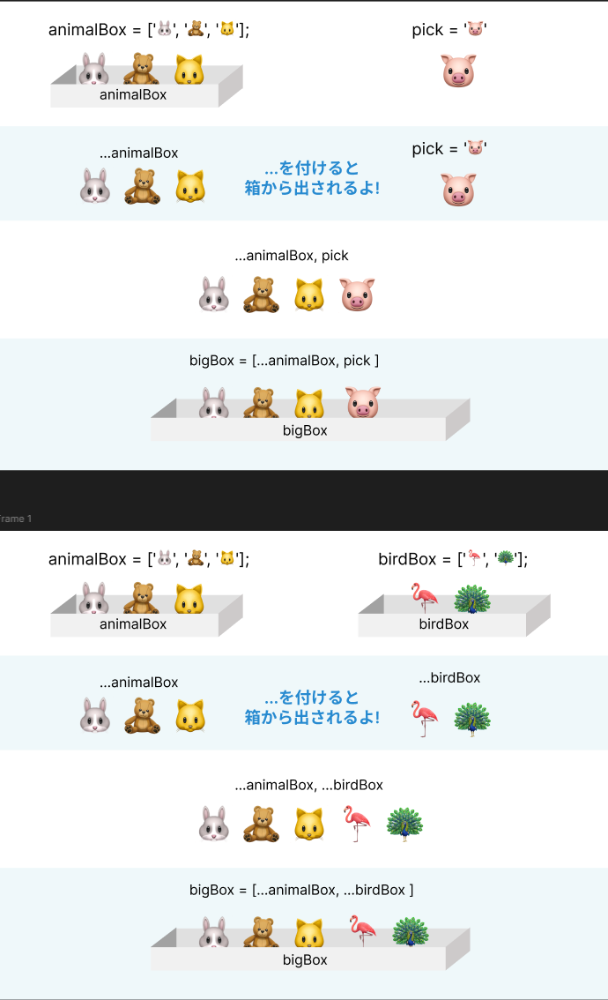

# スプレッド演算子（...）による配列の結合

## コード例

```javascript
const animalBox = ["🐰", "🧸", "🐱"];
const birdBox = ["🦩", "🦚"];

// 2つの箱の中身をぜんぶ出して、新しい大きな箱に入れる
const bigBox = [...animalBox, ...birdBox];

// bigBoxの中身を見てみると…
// ['🐰', '🧸', '🐱', '🦩', '🦚']
// 全部入った！
```

## 解説

スプレッド演算子（`...`）は、配列の要素を個別に展開する機能です。

- `...animalBox` → `'🐰', '🧸', '🐱'` に展開される
- `...birdBox` → `'🦩', '🦚'` に展開される
- 結果として新しい配列 `['🐰', '🧸', '🐱', '🦩', '🦚']` が作成される

この方法により、元の配列を変更することなく、新しい配列を作成できます。

## 視覚的な説明


