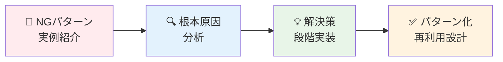
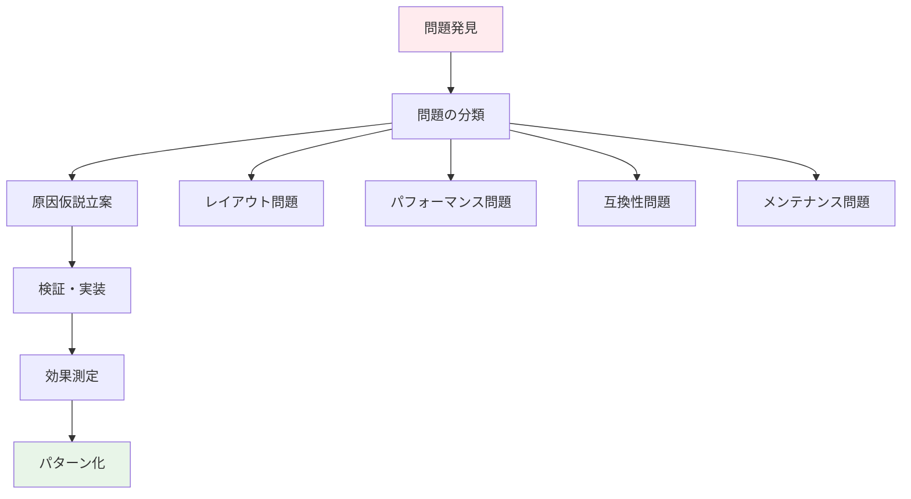

# CSS・Tailwind 実務エッジケース学習プラン

## 🎯 学習プラン概要

### 対象者

- **CSS 経験 2 年以上**のフロントエンドエンジニア
- 実務でレイアウト・パフォーマンス問題に直面している方
- Tailwind の導入・運用で課題を抱えている方
- 基礎知識はあるが、複雑な実務問題に対応したい方

### 学習期間・時間

- **期間**: 9 ステップ
- **総学習時間**: 22 時間
- **学習スタイル**: 問題分析 40% + 解決実践 50% + パターン習得 10%

### 最終到達目標

- 実務で頻発する CSS 問題の迅速な解決能力
- ブラウザ間差異・デバイス依存問題への対応力
- Tailwind を使った大規模プロジェクトの設計・運用スキル
- メンテナブルな CSS 設計手法の実践能力

## 📚 学習アプローチ



### 重点学習領域

- **問題解決プロセス**: なぜその問題が起こるのか → どう解決するかの思考法
- **実装パターン蓄積**: 再利用可能な解決パターンの体系化
- **デバッグ手法**: 効率的な問題特定と解決手順
- **プロダクション対応**: 大規模・チーム開発での実践手法

## 📅 ステップ別学習スケジュール

| Step  | 学習内容                   | 主要トピック                              | 学習時間 | 解決する実務問題                               |
| ----- | -------------------------- | ----------------------------------------- | -------- | ---------------------------------------------- |
| **1** | Flexbox/Grid 入門          | tailwindを使ったFlexbox/Grid 入門         | 3 時間   | tailwindを使った自由度の高いレイアウトの構築   |
| **2** | 複雑レイアウト問題解決     | Flexbox/Grid 深層問題、コンテナクエリ     | 3 時間   | レイアウト崩れ、予期しない配置、カード配置問題 |
| **3** | z-index 地獄脱出           | スタッキングコンテキスト制御、重複解決    | 2.5 時間 | モーダル・ドロップダウン重複、レイヤー管理     |
| **4** | レスポンシブ設計の落とし穴 | 100vh 問題、アスペクト比、clamp()活用     | 3 時間   | モバイル表示崩れ、画面サイズ依存問題           |
| **5** | パフォーマンス最適化       | CSS 詳細度、リフロー対策、Critical CSS    | 2.5 時間 | 表示速度、アニメーション重さ、CLS 問題         |
| **6** | ブラウザ互換性地獄         | Safari 問題、モバイル特有、フォールバック | 2.5 時間 | クロスブラウザバグ、デバイス固有問題           |
| **7** | Tailwind 実務運用          | JIT 最適化、プラグイン、大規模設定        | 3 時間   | Tailwind スケーラビリティ、チーム運用          |
| **8** | CSS 設計手法統合           | BEM+Tailwind、コンポーネント設計手法      | 2.5 時間 | メンテナンス性、設計一貫性、チーム開発         |
| **9** | 実践問題解決統合           | 複合エッジケース、デバッグ手法体系化      | 3 時間   | 総合的な問題解決能力、実装判断力               |

## 🔧 学習環境・ツール

### 必須環境

```bash
# Node.js (LTS版)
node --version  # v18.x.x以上

# Tailwind CSS
npm install -D tailwindcss postcss autoprefixer
npx tailwindcss init -p

# 開発エディタ
# VS Code + CSS拡張機能推奨
```

### 推奨ツール

- **Chrome DevTools**: レイアウトデバッグ、パフォーマンス分析
- **Firefox DevTools**: CSS Grid Inspector、Flexbox Inspector
- **Safari Web Inspector**: iOS Safari 特有問題の検証
- **Lighthouse**: パフォーマンス測定、CLS 分析
- **Can I Use**: ブラウザ対応確認
- **BrowserStack**: クロスブラウザテスト

### デバッグ・検証ツール

- **CSS Tree Shaking**: PurgeCSS、未使用スタイル検出
- **Bundle Analyzer**: CSS サイズ分析
- **Performance Monitor**: リフロー・リペイント検証
- **Accessibility Tools**: コントラスト、フォーカス検証

## 📊 各ステップの学習構成

### 🚨 NG パターン分析 (40%)

```markdown
## よくある NG 事例

- 実際のコード例とその問題点
- なぜそのコードが書かれがちなのか
- 問題が顕在化する条件・環境
```

### 💡 解決策実装 (50%)

```markdown
## 段階的解決プロセス

1. 問題の根本原因特定
2. 最小限の修正による改善
3. 根本的な解決策の実装
4. エラーハンドリング・フォールバック対応
```

### ✅ パターン化・体系化 (10%)

```markdown
## 再利用可能なパターン

- 解決策のテンプレート化
- チェックリスト作成
- チーム共有可能な形での文書化
```

## 📈 実務対応力強化の仕組み

### 問題解決思考プロセス



### スキル習得マトリックス

| 領域               | 問題特定         | 原因分析                   | 解決実装            | 予防設計           |
| ------------------ | ---------------- | -------------------------- | ------------------- | ------------------ |
| **レイアウト**     | 目視・検証ツール | ボックスモデル・フロー理解 | Flexbox/Grid 最適化 | コンポーネント設計 |
| **パフォーマンス** | Lighthouse 分析  | リフロー・詳細度分析       | 最適化実装          | Critical CSS 設計  |
| **互換性**         | ブラウザテスト   | 実装差異理解               | フォールバック実装  | プログレッシブ設計 |
| **保守性**         | コードレビュー   | 設計原則分析               | リファクタリング    | 設計手法適用       |

## 🎯 実務応用シナリオ

### シナリオ 1: 緊急バグ対応

- **状況**: 本番環境でレイアウト崩れ発生
- **学習目標**: 迅速な問題特定と最小限修正
- **適用ステップ**: Step1, Step2, Step5

### シナリオ 2: パフォーマンス改善要求

- **状況**: ページ表示速度の改善要求
- **学習目標**: 体系的な最適化アプローチ
- **適用ステップ**: Step4, Step6

### シナリオ 3: 新機能開発

- **状況**: 複雑な UI コンポーネントの実装
- **学習目標**: 設計から実装まで一貫した品質確保
- **適用ステップ**: Step7, Step8

### シナリオ 4: チーム標準化

- **状況**: CSS 設計ルール・Tailwind 運用の標準化
- **学習目標**: メンテナブルな設計手法の確立
- **適用ステップ**: Step6, Step7

## 📝 詳細プラン

### [Step 1: 複雑レイアウト問題解決](./Step01_複雑レイアウト問題解決.md)

- Flexbox/Grid の深層的な動作理解
- コンテナクエリ実装の落とし穴
- カードレイアウト・グリッドシステムの問題解決
- レスポンシブグリッドの実装パターン

### [Step 2: z-index 地獄脱出](./Step02_z-index地獄脱出.md)

- スタッキングコンテキストの完全理解
- モーダル・ドロップダウンの重複問題解決
- レイヤー管理の体系的アプローチ
- ポータル・テレポートパターンの活用

### [Step 3: レスポンシブ設計の落とし穴](./Step03_レスポンシブ設計の落とし穴.md)

- 100vh 問題とビューポート単位の罠
- アスペクト比維持の実装パターン
- clamp()、min()、max()の実践活用
- フルードタイポグラフィとスケーリング

### [Step 4: パフォーマンス最適化](./Step04_パフォーマンス最適化.md)

- CSS 詳細度設計とカスケード最適化
- リフロー・リペイント対策
- Critical CSS 実装とレンダリング最適化
- CSS Houdini API の活用

### [Step 5: ブラウザ互換性地獄](./Step05_ブラウザ互換性地獄.md)

- Safari 特有問題の解決パターン
- モバイルブラウザ固有問題への対応
- フォールバック戦略とプログレッシブエンハンスメント
- Feature Query と条件分岐実装

### [Step 6: Tailwind 実務運用](./Step06_Tailwind実務運用.md)

- JIT（Just-In-Time）最適化と設定
- カスタムプラグイン開発
- 大規模プロジェクトでの設定管理
- デザインシステム統合

### [Step 7: CSS 設計手法統合](./Step07_CSS設計手法統合.md)

- BEM + Tailwind のハイブリッド設計
- Atomic Design 原則の実践
- コンポーネントドリブン開発
- 設計ドキュメント・スタイルガイド

### [Step 8: 実践問題解決統合](./Step08_実践問題解決統合.md)

- 複合的エッジケースの解決アプローチ
- デバッグ手法の体系化
- 実装判断基準の確立
- チーム知識共有の仕組み作り

## 📊 学習成果評価システム

### ステップ別評価基準

各ステップで以下の項目を評価：

- **問題認識力**: NG パターンを即座に識別できる（25%）
- **原因分析力**: 根本原因を論理的に特定できる（25%）
- **解決実装力**: 効果的な解決策を実装できる（35%）
- **パターン化力**: 再利用可能な形で知識を体系化できる（15%）

### 成果物チェックリスト

- [ ] **Step 1-2**: 複雑レイアウト問題の解決パターン集
- [ ] **Step 3-4**: レスポンシブ・パフォーマンス最適化ガイド
- [ ] **Step 5-6**: ブラウザ互換性・Tailwind 運用ベストプラクティス
- [ ] **Step 7-8**: CSS 設計手法統合と実践的問題解決フレームワーク

### 最終認定要件

- 全ステップの課題完了率 85% 以上
- 実務適用可能な解決パターン 20 個以上の習得
- チーム共有可能な知識体系の構築

## 🛠️ Phase1 への橋渡し

### TypeScript 学習への準備

```typescript
// CSS-in-JSライブラリでの型安全なスタイリング
// Styled-components, Emotion等での活用準備

interface ThemeProps {
  colors: {
    primary: string;
    secondary: string;
  };
  breakpoints: {
    mobile: string;
    tablet: string;
    desktop: string;
  };
}

// Tailwindとの統合パターン
type TailwindClass =
  | "flex"
  | "grid"
  | "block"
  | "w-full"
  | "h-screen"
  | "bg-blue-500"
  | "text-white";
```

### 学習継続のコツ

1. **実務問題への即時適用**: 学習した内容を実際のプロジェクトで試す
2. **問題パターンの蓄積**: 遭遇した問題を分類・記録する
3. **チーム知識共有**: 解決パターンをチームで共有・改善する
4. **継続的アップデート**: ブラウザ・ツールの進化に合わせて更新

---

**📌 重要**: Phase0 は実務即戦力となる CSS・Tailwind 運用スキルの習得を目指します。理論よりも実践、基礎よりも応用に重点を置き、実際の開発現場で直面する問題への対応力を身につけます。

**🌟 Phase1 では、この CSS・Tailwind スキルを基盤として、TypeScript による型安全なフロントエンド開発を学習していきます！**
