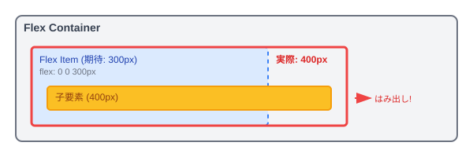

# 💡 CSS・Tailwind 実務で出会った新発見

> 🎯 **目的**: 業務中に遭遇した予期しない挙動や解決方法を記録し、今後の開発に活かそ 🐰

---

## FlexBox の意外な落とし穴

### 🔍 発見した問題

**現象**: Flex アイテムで指定した幅を超える子要素がある場合、Flex アイテムの幅が予期せず伸びる

```
期待値: Flexアイテム = 300px (固定)
実際値: Flexアイテム = 400px (子要素に合わせて拡張)
```

#### 📊 問題の構造図



### 💻 問題のコード例

```html
<!-- ❌ 問題のあるコード -->
<div class="flex">
  <!-- Flexアイテムはflex-basisで300pxに固定しているつもり -->
  <div class="flex-[0_0_300px] bg-amber-100 p-2">
    <!-- 子要素が親を超える幅になっている -->
    <div class="w-[400px] bg-amber-200">400pxの箱</div>
  </div>
</div>
```

#### 🎭 実際の挙動

| 設定値              | 期待値   | 実際値   | 理由                     |
| ------------------- | -------- | -------- | ------------------------ |
| `flex-basis: 300px` | 300px    | 400px    | `min-width: auto` の影響 |
| `flex-grow: 0`      | 伸びない | 伸びる   | min-width が優先される   |
| `flex-shrink: 0`    | 縮まない | 関係なし | 伸びる方向の問題         |

---

### ⚠️ 原因分析

> 💡 **核心的な問題**: Flex アイテムには**デフォルトで `min-width: auto` が適用**されている

#### 🔬 技術的背景

1. **CSS Flexbox の仕様**

   - Flex アイテムの初期値: `min-width: auto`
   - `min-width: auto` の実際の値 = 子要素の最小コンテンツサイズ

2. **優先順位**

   ```
   min-width > flex-basis > width
   ```

3. **計算過程**
   ```
   1. 子要素の幅: 400px
   2. min-width: auto → 400px (子要素に合わせる)
   3. flex-basis: 300px < min-width: 400px
   4. 結果: Flexアイテムの幅 = 400px
   ```

#### 🎯 なぜこの仕様なのか？

- **コンテンツの保護**: 子要素が切り取られることを防ぐ
- **レスポンシブ対応**: 画面サイズに応じて柔軟に調整
- **アクセシビリティ**: テキストの可読性を保つ

---

### ✅ 解決方法

#### 🏆 **推奨解決法**: `min-width: 0` を明示的に指定

```html
<!-- ✅ 修正されたコード -->
<div class="flex">
  <div class="flex-[0_0_300px] min-w-0 bg-amber-100 p-2">
    <div class="w-[400px] bg-amber-200">400pxの箱</div>
  </div>
</div>
```

#### 🛠️ その他の解決パターン

| 方法                 | コード            | 使用場面           | 注意点                         |
| -------------------- | ----------------- | ------------------ | ------------------------------ |
| **min-width 指定**   | `min-w-0`         | 最も一般的         | 子要素が切り取られる可能性     |
| **overflow 指定**    | `overflow-hidden` | 切り取りたい場合   | コンテンツが見えなくなる       |
| **flex-shrink 活用** | `flex-shrink: 1`  | 縮小を許可する場合 | レイアウトが不安定になる可能性 |

#### 🎨 Tailwind での実装例

```html
<!-- パターン1: 基本的な解決 -->
<div class="flex">
  <div class="flex-[0_0_300px] min-w-0 bg-blue-100 p-4">
    <div class="w-96 bg-blue-200 p-2">長いコンテンツがここに入ります...</div>
  </div>
</div>

<!-- パターン2: オーバーフロー制御 -->
<div class="flex">
  <div class="flex-[0_0_300px] min-w-0 overflow-hidden bg-green-100 p-4">
    <div class="w-96 bg-green-200 p-2">切り取られるコンテンツ</div>
  </div>
</div>

<!-- パターン3: スクロール対応 -->
<div class="flex">
  <div class="flex-[0_0_300px] min-w-0 overflow-x-auto bg-purple-100 p-4">
    <div class="w-96 bg-purple-200 p-2">スクロール可能なコンテンツ</div>
  </div>
</div>
```

---

### 📝 実装時のチェックリスト

- [ ] Flex アイテムに固定幅を設定する際は `min-w-0` を併用
- [ ] 子要素のコンテンツが切り取られても問題ないか確認
- [ ] レスポンシブ対応時の挙動をテスト
- [ ] アクセシビリティへの影響を検討

---

### 💡 今後に活かせる学び

#### 🎓 **重要な概念**

1. **CSS の優先順位を理解する**

   - `min-width` > `flex-basis` > `width`
   - 仕様を理解することで予期しない挙動を避けられる

2. **Flexbox の初期値を把握する**

   - `min-width: auto` (Flex アイテム)
   - `align-items: stretch`
   - `flex-direction: row`

3. **デバッグのアプローチ**
   - 開発者ツールで計算値を確認
   - 仕様書で初期値をチェック
   - 段階的に問題を切り分け

#### 🔗 関連知識

- **Grid Layout**: 同様の問題が `min-width: auto` で発生
- **Table Layout**: `table-layout: fixed` での類似現象
- **Block Layout**: `width` と `min-width` の関係

---

## FlexBox のアイコン表示問題

### 🔍 発見した問題

**現象**: `flex-row` レイアウトでアイコンとタイトルを並べた際、アイコンに固定幅を設定していても、長いタイトルがある場合にアイコンが見切れる

```
期待値: アイコン = 24px (固定), タイトル = 残りの幅
実際値: アイコン = 縮小されて見切れ, タイトル = 長い文字列がそのまま表示
```

### 💻 問題のコード例

```html
<!-- ❌ 問題のあるコード -->
<div class="flex flex-row items-center gap-2">
  <!-- アイコンに固定幅を設定しているつもり -->
  <div class="w-6 h-6 bg-blue-500 rounded">
    <svg><!-- アイコン --></svg>
  </div>
  <!-- 長いタイトルテキスト -->
  <span class="text-lg">とても長いタイトルテキストがここに入ります...</span>
</div>
```

#### 🎭 実際の挙動

| 設定値        | 期待値         | 実際値           | 理由                       |
| ------------- | -------------- | ---------------- | -------------------------- |
| `width: 24px` | 24px 固定      | 縮小されて見切れ | `flex-shrink: 1` の影響    |
| アイコン表示  | 正常に表示     | 潰れて見えない   | flex-item が縮小される     |
| タイトル表示  | 適切に折り返し | 長いまま表示     | flex-shrink が適用されない |

---

### ⚠️ 原因分析

> 💡 **核心的な問題**: Flex アイテムには**デフォルトで `flex-shrink: 1` が適用**されている

#### 🔬 技術的背景

1. **CSS Flexbox の仕様**

   - Flex アイテムの初期値: `flex-shrink: 1`
   - `flex-shrink: 1` = 必要に応じて縮小を許可

2. **縮小の優先順位**

   ```
   flex-shrink値が同じ場合、すべてのflex-itemが等しく縮小される
   ```

3. **計算過程**
   ```
   1. コンテナ幅: 300px
   2. アイコン幅: 24px + タイトル幅: 400px = 424px (オーバーフロー)
   3. オーバーフロー分: 124px
   4. flex-shrink: 1 により、アイコンとタイトルが等しく縮小
   5. 結果: アイコンが見切れる
   ```

#### なぜこの仕様なのか？

- **レスポンシブ対応**: 画面サイズに応じて柔軟に調整
- **コンテンツの均等配置**: 全ての要素が等しく縮小される
- **オーバーフローの防止**: コンテナからはみ出すことを防ぐ

---

### ✅ 解決方法

#### 🏆 **推奨解決法**: アイコンに `flex-shrink: 0` を指定

```html
<!-- ✅ 修正されたコード -->
<div class="flex flex-row items-center gap-2">
  <!-- flex-shrink: 0 でアイコンの縮小を防ぐ -->
  <div class="w-6 h-6 flex-shrink-0 bg-blue-500 rounded">
    <svg><!-- アイコン --></svg>
  </div>
  <!-- タイトルは必要に応じて縮小・折り返し -->
  <span class="text-lg flex-1 truncate"
    >とても長いタイトルテキストがここに入ります...</span
  >
</div>
```

#### 🛠️ その他の解決パターン

| 方法                 | コード                      | 使用場面             | 注意点                       |
| -------------------- | --------------------------- | -------------------- | ---------------------------- |
| **flex-shrink 指定** | `flex-shrink-0`             | アイコン固定表示     | タイトルが長すぎる場合の対応 |
| **flex-none 指定**   | `flex-none`                 | 完全に固定したい場合 | レスポンシブ性が失われる     |
| **min-width 併用**   | `min-w-6 flex-shrink-0`     | より確実な固定       | 冗長になる可能性             |
| **grid レイアウト**  | `grid grid-cols-[auto_1fr]` | より制御しやすい場合 | flexbox より複雑             |

#### 🎨 Tailwind での実装例

```html
<!-- パターン1: 基本的な解決（アイコン固定 + タイトル省略） -->
<div class="flex items-center gap-3 max-w-sm">
  <div
    class="w-8 h-8 flex-shrink-0 bg-indigo-500 rounded-full flex items-center justify-center"
  >
    <svg class="w-5 h-5 text-white"><!-- アイコン --></svg>
  </div>
  <span class="text-base font-medium truncate">長いタイトルテキスト...</span>
</div>

<!-- パターン2: アイコン固定 + タイトル折り返し -->
<div class="flex items-start gap-3 max-w-sm">
  <div class="w-6 h-6 flex-shrink-0 bg-green-500 rounded mt-0.5">
    <svg class="w-full h-full text-white"><!-- アイコン --></svg>
  </div>
  <div class="flex-1 min-w-0">
    <p class="text-sm text-gray-900 break-words">
      とても長いタイトルテキストが複数行にわたって表示されます
    </p>
  </div>
</div>

<!-- パターン3: Grid レイアウトでの解決 -->
<div class="grid grid-cols-[auto_1fr] gap-3 items-center max-w-sm">
  <div class="w-7 h-7 bg-purple-500 rounded">
    <svg class="w-full h-full text-white"><!-- アイコン --></svg>
  </div>
  <span class="text-base truncate">長いタイトルテキスト...</span>
</div>
```

---

### 📝 実装時のチェックリスト

- [ ] アイコンやボタンなど固定サイズにしたい要素に `flex-shrink-0` を設定
- [ ] テキスト要素には適切な省略処理（`truncate`）や折り返し処理を設定
- [ ] レスポンシブ対応時の各画面サイズでの表示を確認
- [ ] 長いコンテンツでのレイアウト崩れをテスト

---

### 💡 今後に活かせる学び

#### 🎓 **重要な概念**

1. **Flexbox の初期値を把握する**

   - `flex-shrink: 1` (すべての flex-item)
   - `flex-grow: 0` (伸びない)
   - `flex-basis: auto` (コンテンツサイズ)

2. **固定要素と可変要素の使い分け**

   - 固定要素: `flex-shrink-0` または `flex-none`
   - 可変要素: `flex-1` または `flex-shrink: 1`（デフォルト）

3. **レイアウト手法の選択**
   - Flexbox: 1 次元レイアウト、アイテム間の関係性重視
   - Grid: 2 次元レイアウト、より精密な制御

#### 🔗 関連知識

- **CSS Grid**: `grid-template-columns` での固定・可変の制御
- **Table Layout**: `table-layout: fixed` での列幅制御
- **Float Layout**: 古い手法での類似問題

---

> 🎯 **次回の発見もここに追記していこ 🐰！**
