# TypeScript 完全学習プラン

## 🎯 学習プラン概要

### 対象者

- **TypeScript 初心者**（他言語プログラミング経験 2 年以上）
- 基礎から段階的に TypeScript を習得したい方
- 実践的なコード例を通じて学習したい方

### 学習期間・時間

- **期間**: 12 ステップ
- **学習スタイル**: 理論 20% + 実践コード 50% + 演習 30%

### 最終到達目標

- TypeScript の型システムを完全理解
- 実用的なアプリケーション開発能力
- 型安全なライブラリ設計スキル

## 📚 学習フェーズ構成

```mermaid
graph TD
    A[Phase 1: 基礎適応期<br/>Step 1-3] --> B[Phase 2: 型システム習得期<br/>Step 4-6]
    B --> C[Phase 3: 実践応用期<br/>Step 7-9]

    A --> A1[JavaScript復習<br/>TypeScript導入<br/>基本型システム]
    B --> B1[ユニオン型<br/>ジェネリクス<br/>ユーティリティ型]
    C --> C1[実践プロジェクト<br/>ライブラリ統合<br/>エラーハンドリング]

    style A fill:#003300
    style B fill:#333300
    style C fill:#330000
```



## 📅 ステップ別学習スケジュール

| Step  | フェーズ         | 学習内容                          | 主要トピック                       | 学習時間 | 成果物                 |
| ----- | ---------------- | --------------------------------- | ---------------------------------- | -------- | ---------------------- |
| **1** | 基礎適応期       | JavaScript 復習と TypeScript 導入 | 環境構築、基本構文、型注釈         | 3 時間   | 開発環境、基本アプリ   |
| **2** | 基礎適応期       | 基本型システムと型注釈            | プリミティブ型、配列、オブジェクト | 4 時間   | 型注釈練習集           |
| **3** | 基礎適応期       | インターフェースとオブジェクト型  | interface、type、継承              | 3 時間   | データモデル設計       |
| **4** | 型システム習得期 | ユニオン型と型ガード              | Union、型ガード、型アサーション    | 3 時間   | 型安全な関数群         |
| **5** | 型システム習得期 | ジェネリクス基礎                  | 基本ジェネリクス、制約             | 3 時間   | 汎用ライブラリ         |
| **6** | 型システム習得期 | ユーティリティ型入門              | Pick、Omit、Partial 等             | 3 時間   | 型変換ツール           |
| **7** | 実践応用期       | 実践プロジェクト開始              | Todo App with TypeScript           | 3 時間   | 実用アプリケーション   |
| **8** | 実践応用期       | ライブラリ統合と型定義            | 外部ライブラリ、d.ts               | 3 時間   | 統合アプリケーション   |
| **9** | 実践応用期       | エラーハンドリングとデバッグ      | エラー処理、デバッグ技術           | 3 時間   | 堅牢なアプリケーション |

## 🔧 多言語経験者向け特別配慮

### 実践重視のアプローチ

- **理論説明**: 20%（概念の理解）
- **実際のコード例**: 50%（豊富な実装例）
- **実践演習**: 30%（手を動かす学習）

### 段階的複雑化

```typescript
// Step 1: 基本
let message: string = "Hello TypeScript";

// Step 4: 中級
function processData<T>(data: T[]): T | undefined {
  return data.length > 0 ? data[0] : undefined;
}

// Step 8: 応用
interface ApiResponse<T> {
  data: T;
  status: number;
  message: string;
}

// Step 12: 高度
type DeepReadonly<T> = {
  readonly [P in keyof T]: T[P] extends object ? DeepReadonly<T[P]> : T[P];
};
```

## 📊 学習成果評価システム

### 週次評価基準

各週で以下の項目を評価：

- **理解度**: 理論的な概念の理解（25%）
- **実装力**: コードを書く能力（35%）
- **応用力**: 学んだ内容を応用する能力（25%）
- **問題解決力**: エラーや課題を解決する能力（15%）

### 成果物チェックリスト

- [ ] **Step 1-3**: 基礎的な TypeScript アプリケーション
- [ ] **Step 4-6**: 型安全なライブラリ・ツール
- [ ] **Step 7-9**: 実用的な Web アプリケーション

### 最終認定要件

- 全週の課題完了率 80% 以上
- 実践プロジェクト 2 個以上完成
- TypeScript Expert 基礎レベル認定

## 🛠️ 学習環境・ツール

### 必須環境

```bash
# Node.js (LTS版)
node --version  # v18.x.x以上

# TypeScript
npm install -g typescript
tsc --version   # 5.x.x以上

# 開発エディタ
# VS Code + TypeScript拡張機能
```

### 推奨ツール

- **TypeScript Playground**: オンライン実行環境
- **ts-node**: TypeScript 直接実行
- **ESLint**: コード品質管理
- **Prettier**: コードフォーマット
- **Jest**: テストフレームワーク

### 学習リソース

- **公式ドキュメント**: [TypeScript Handbook](https://www.typescriptlang.org/docs/)
- **実践問題**: [type-challenges](https://github.com/type-challenges/type-challenges)
- **コミュニティ**: [TypeScript Discord](https://discord.gg/typescript)

## 📝 詳細プラン

### 基礎適応（Step 1-3）

#### [Step 1: JavaScript 復習と TypeScript 導入](./Step01_JavaScript復習とTypeScript導入.md)

- JavaScript 基礎の復習
- TypeScript 環境構築
- 基本的な型注釈
- 簡単なアプリケーション作成

#### [Step 2: 基本型システムと型注釈](./Step02_基本型システムと型注釈.md)

- プリミティブ型の完全理解
- 配列とタプル型
- オブジェクト型の基礎
- 型推論の活用

#### [Step 3: インターフェースとオブジェクト型](./Step03_インターフェースとオブジェクト型.md)

- interface の設計と活用
- type エイリアスとの使い分け
- 継承とコンポジション
- データモデルの設計

### 型システム習得（Step 4-6）

#### [Step 4: ユニオン型と型ガード](./Step04_ユニオン型と型ガード.md)

- ユニオン型とインターセクション型
- 型ガードの実装パターン
- 型アサーションの適切な使用
- 判別可能なユニオン

#### [Step 5: ジェネリクス基礎](./Step05_ジェネリクス基礎.md)

- ジェネリクスの基本概念
- 制約付きジェネリクス
- ジェネリック関数とクラス
- 実用的なジェネリクス活用

#### [Step 6: ユーティリティ型入門](./Step06_ユーティリティ型入門.md)

- 組み込みユーティリティ型
- カスタムユーティリティ型の作成
- 型変換のパターン
- 実践的な型操作

### 実践応用期（Step 7-9）

#### [Step 7: 実践プロジェクト開始](./Step07_実践プロジェクト開始.md)

- Todo アプリケーションの設計
- コンポーネント設計
- 状態管理の型安全性
- イベントハンドリング

#### [Step 8: ライブラリ統合と型定義](./Step08_ライブラリ統合と型定義.md)

- 外部ライブラリの型定義
- d.ts ファイルの理解
- DefinitelyTyped の活用
- 型定義の自作

#### [Step 9: エラーハンドリングとデバッグ](./Step09_エラーハンドリングとデバッグ.md)

- TypeScript エラーの理解
- 効果的なデバッグ手法
- エラーハンドリングパターン
- テストの型安全性

### 高度機能期（Step 10-12）

#### [Step 10: 高度な型機能](./Step10_高度な型機能.md)

- 条件付き型と infer
- マップ型の活用
- テンプレートリテラル型
- 再帰的型定義

#### [Step 11: ツール開発入門](./Step11_ツール開発入門.md)

- ESLint ルールの設定
- 簡単な開発ツール作成
- TypeScript Compiler API
- 自動化スクリプト

#### [Step 12: ポートフォリオ完成](./Step12_ポートフォリオ完成.md)

- 総合プロジェクトの完成
- ポートフォリオサイト構築
- 学習成果のまとめ
- 次のステップの準備

**📌 重要**: 各週の詳細プランには、豊富な実際のコード例（30-50 個）と実践演習が含まれています。理論だけでなく、手を動かしながら学習することで、確実にスキルを身につけることができます。
