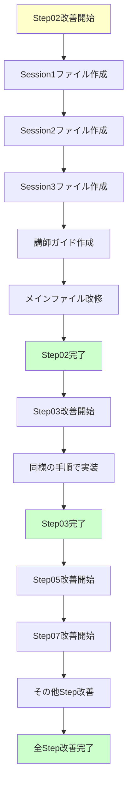

# Step02 以降学習ファイル改善プロンプト

> 🎯 **目的**: Phase1 TypeScript 完全習得の Step02 以降を、Step01 で実施した改善パターンに従って最適化する

## 📋 タスク概要

**対象**: Phase1 TypeScript 完全習得の Step02 以降の学習ファイル改善  
**方針**: Step01 で実施した改善パターンの体系的適用  
**目標**: 他言語経験者向け・講師サポート付き学習の最適化

---

## 🎯 対象ファイル一覧

### 改善対象 Step

- `Step02_基本型システムと型注釈.md`
- `Step03_インターフェースとオブジェクト型.md`
- `Step04_ユニオン型と型ガード.md`
- `Step05_ジェネリクス基礎.md`
- `Step06_ユーティリティ型入門.md`
- `Step07_実践プロジェクト開始.md`
- `Step08_ライブラリ統合と型定義.md`
- `Step09_エラーハンドリングとデバッグ.md`
- `Step10_高度な型機能.md`
- `Step11_TypeScript状態管理ライブラリ.md`
- `Step12_ポートフォリオ完成.md`

---

## 🚀 改善方針

### Step01 で実施した改善パターンを適用

#### 1. **3 セッション分割学習の導入**

```
従来: 3-4時間一括学習
↓
改善: 3セッション分割学習（総240分）

Session1: 理論学習 + 基本実践（90分）
Session2: 実践演習 + プロジェクト実装（90分）
Session3: プロジェクト完成 + 成果発表（60分）
```

#### 2. **他言語経験者向け最適化**

- 冗長な基礎説明の簡素化
- TypeScript 特有の概念に集中
- 実践重視の構成（理論 15% + 実践 60% + 演習 25%）
- 既存知識との差分を明確化

#### 3. **講師サポート付き学習対応**

- よくある質問と回答集
- 評価基準とフィードバック方法

#### 4. **ファイル構造の統一**

```
StepXX_[テーマ名].md                    # 改修済み（案内ファイル）
StepXX_Session1_[理論と基本実践].md      # 新規作成
StepXX_Session2_[実践演習].md           # 新規作成
StepXX_Session3_[プロジェクト完成].md    # 新規作成
StepXX_講師用ガイド.md                  # 新規作成
```

---

## 📝 具体的な実装要件

### 各 Session ファイルの構成

#### **Session1: 理論学習 + 基本実践（90 分）**

```markdown
# SessionX*Session1*[理論と基本実践]

## セッション概要

- 時間: 90 分
- 目標: [Step 固有の理論理解 + 基本実践]
- 前提: 前 Step の完了

## タイムテーブル

| 時間     | 内容                   | 講師の役割         | 学習者の活動   |
| -------- | ---------------------- | ------------------ | -------------- |
| 0-10 分  | 前 Step 復習・今回目標 | 復習確認・目標提示 | 振り返り・質問 |
| 10-50 分 | 新概念の理論学習       | 実演・解説         | 理解・メモ     |
| 50-80 分 | 基本実践・練習問題     | 個別サポート       | ハンズオン     |
| 80-90 分 | 振り返り・次回予告     | まとめ・予告       | 質問・確認     |

## 学習内容

[Step 固有の理論内容 - 簡潔に要点整理]

## 練習問題

[段階的な練習問題 - 基本レベル]
```

#### **Session2: 実践演習（90 分）**

```markdown
# SessionX*Session2*[実践演習]

## セッション概要

- 時間: 90 分
- 目標: [実践的なコード作成・ミニプロジェクト実装]
- 継続: Session1 の知識活用

## タイムテーブル

| 時間     | 内容                 | 講師の役割           | 学習者の活動     |
| -------- | -------------------- | -------------------- | ---------------- |
| 0-10 分  | 前回復習・今回目標   | 復習確認・目標提示   | 振り返り・質問   |
| 10-50 分 | 実践的演習           | 実演・個別指導       | ハンズオン・実践 |
| 50-80 分 | ミニプロジェクト実装 | コードレビュー・助言 | 個人開発         |
| 80-90 分 | 成果共有・質疑応答   | ファシリテート       | 発表・討論       |

## 実践演習

[Step 固有の実践的な課題]

## ミニプロジェクト

[実用的なプロジェクト課題]
```

#### **Session3: プロジェクト完成（60 分）**

```markdown
# SessionX*Session3*[プロジェクト完成]

## セッション概要

- 時間: 60 分
- 目標: [プロジェクト完成・成果発表・次 Step 準備]
- 成果: [Step 固有の完成品]

## タイムテーブル

| 時間     | 内容                   | 講師の役割                 | 学習者の活動   |
| -------- | ---------------------- | -------------------------- | -------------- |
| 0-10 分  | 最終課題説明           | 課題説明・期待値設定       | 理解・質問     |
| 10-45 分 | プロジェクト完成       | 個別サポート・デバッグ支援 | 開発・完成     |
| 45-60 分 | 成果発表・次 Step 準備 | 評価・フィードバック       | 発表・振り返り |

## 最終課題

[Step 固有の完成課題]

## 次 Step への準備

[次 Step で必要な知識・環境の確認]
```

### 講師用ガイドの内容

```markdown
# StepXX 講師用指導ガイド

## 指導方針

- 対象: 他言語経験者（[Step 固有の前提知識]）
- スタイル: ハンズオン重視・個別サポート
- 目標: [Step 固有の学習目標]

## セッション別指導ポイント

### Session1 指導ポイント

- 重点サポート箇所
- よくある質問と回答
- 時間管理のコツ

### Session2 指導ポイント

- 実践サポートの方法
- つまずきやすいポイント
- 個別対応の優先順位

### Session3 指導ポイント

- プロジェクト完成支援
- 評価基準
- フィードバック方法

## よくある質問と推奨回答

[Step 固有の Q&A 集]

## 評価・フィードバック方法

[具体的な評価基準とフィードバック例]
```

### メインファイルの改修

```markdown
# StepXX: [テーマ名]

> 🚀 **2025 年改良版**: 他言語経験者向け・講師サポート付き学習に最適化されました！

## 📋 学習方式の選択

### 🎯 推奨：3 セッション分割学習（他言語経験者・講師サポート付き）

**対象**: 他言語経験者（[Step 固有の前提知識]）  
**形式**: 講師サポート付き学習  
**総時間**: 240 分（4 時間）

#### 📚 セッション構成

- 🔰 **[Session1: [理論と基本実践]](./StepXX_Session1_[理論と基本実践].md)** (90 分)
- 🔧 **[Session2: [実践演習]](./StepXX_Session2_[実践演習].md)** (90 分)
- 🎯 **[Session3: [プロジェクト完成]](./StepXX_Session3_[プロジェクト完成].md)** (60 分)

#### 👨‍🏫 講師向けリソース

- 📖 **[講師用ガイド](./StepXX_講師用ガイド.md)** - 詳細な指導方法・評価基準

---

### 📖 従来版：一括学習（自習・復習用）

**対象**: 自習者・復習者  
**形式**: 個人学習  
**総時間**: [元の時間]

[既存の補足資料リンク群]

## 📅 学習期間・目標（従来版）

[既存の内容を維持]
```

---

## 🎯 優先順位

### Phase 1: 基盤 Step（最優先）

1. **Step02（基本型システム）** - TypeScript 学習の基盤
2. **Step03（インターフェース）** - オブジェクト指向設計の基礎

### Phase 2: 重要 Step

3. **Step05（ジェネリクス）** - 高度な型システムの入門
4. **Step07（実践プロジェクト）** - 実践力の強化

### Phase 3: その他 Step

5. **Step04, 06, 08-12** - 順次実装

---

## ⚠️ 注意事項

### 既存資産との整合性

- 既存の補足資料ファイルとの整合性を保つ
- Step01 で作成したファイル構造を参考にする
- 補足資料へのリンクを適切に維持

### Step 固有の考慮事項

- 各 Step の学習目標と難易度を考慮した時間配分
- 段階的な学習進行を重視した内容構成
- 前 Step との連続性を確保

### 品質基準

- 他言語経験者に適した説明レベル
- 実践重視の構成バランス
- 講師サポートのしやすさ

---

## 🎊 期待する成果

### 学習効果の向上

- 他言語経験者に最適化された効率的な学習プラン
- 挫折しにくい段階的な学習設計
- 実践力重視の学習効果向上

### 指導体制の強化

- 講師サポート付き学習に対応した指導体制
- 個別指導のための詳細ガイド
- 一貫性のある評価・フィードバック体制

### 学習体験の改善

- 集中力を維持しやすい時間配分
- 達成感を得やすい段階的な成果
- 継続学習への動機向上

---

## 🔄 実装フロー



---

## 📋 実装チェックリスト

### 各 Step 共通

- [ ] Session1 ファイル作成（90 分構成）
- [ ] Session2 ファイル作成（90 分構成）
- [ ] Session3 ファイル作成（60 分構成）
- [ ] 講師用ガイド作成
- [ ] メインファイル改修（案内追加）
- [ ] 既存補足資料との整合性確認
- [ ] ファイル間リンクの動作確認

### Step 固有

- [ ] 前 Step との連続性確保
- [ ] 学習目標の適切な設定
- [ ] 実践課題の難易度調整
- [ ] 時間配分の妥当性確認

---

**📌 重要**: このプロンプトに従って、指定された Step ファイルの改善を順次実施してください。Step01 で確立した改善パターンを一貫して適用し、学習プラン全体の品質向上を図ります。

**🌟 目標**: 他言語経験者が効率的に TypeScript を習得できる、講師サポート付きの最適化された学習体験の提供
