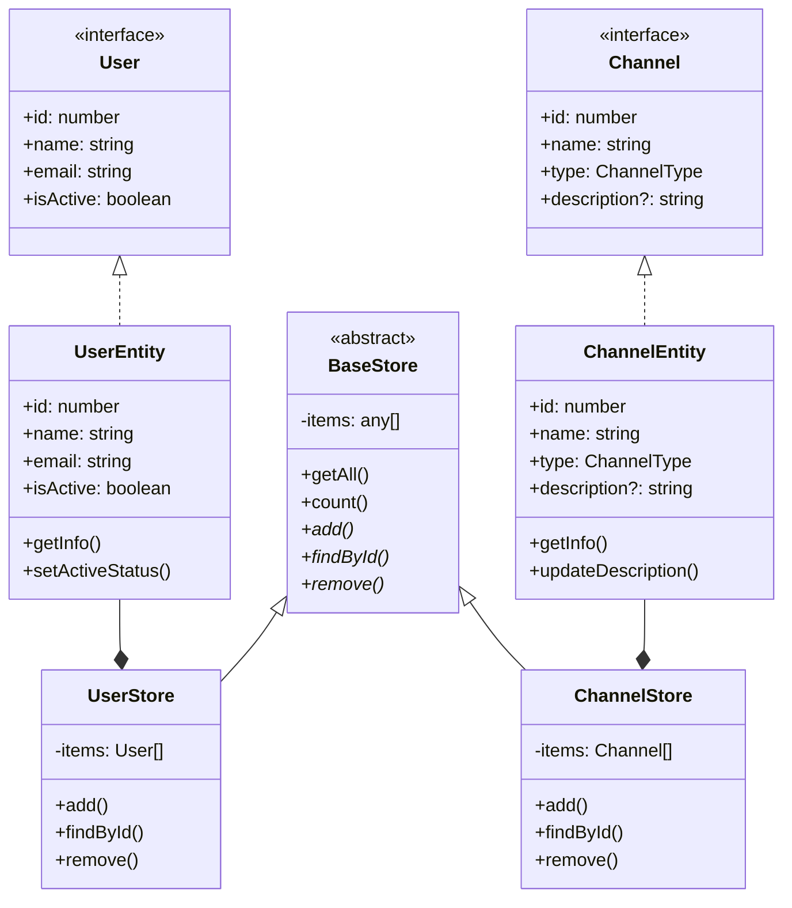

# Step03 成果物：シンプルなデータ管理システム

---

## 🎯 プロジェクトの目的

**あなたが挑戦する課題**: Step03 で学習した内容を実践する簡単なプロジェクト

**なぜ作るのか**: インターフェース、クラス、抽象クラスの基本を**実際に使って**理解するため

**学習目標**:

- [ ] インターフェースでデータの形を決める
- [ ] クラスでデータを管理する
- [ ] 抽象クラスで共通の機能を作る
- [ ] 継承の基本概念を理解する
- [ ] 複数のストアを通じた継承の実践

**⏰ 推定完了時間**: 30 分

---

## 📋 作成するシステムの要件

### 🎯 何を作るか

**簡単なデータ管理システム（ユーザー＋チャンネル）**

**基本機能**:

- ✅ **ユーザーの管理**: 新しいユーザーの登録・表示・削除
- ✅ **チャンネルの管理**: 新しいチャンネルの登録・表示・削除
- ✅ **継承の実践**: 共通の操作で異なるデータを管理

**扱うデータ**:

**ユーザーデータ**:

- **ID**: ユーザーを識別する番号
- **名前**: ユーザーの名前
- **メール**: ユーザーのメールアドレス
- **アクティブ状態**: ユーザーが有効かどうか

**チャンネルデータ**:

- **ID**: チャンネルを識別する番号
- **名前**: チャンネルの名前
- **タイプ**: チャンネルの種類（テキスト/音声）
- **説明**: チャンネルの説明（任意）

---

## 📊 システム設計図

### 🔍 詳細クラス関係図



## 📋 プロジェクト構成

### 作成ファイル

```
📁 data-management-system/
├── store.ts        # データ管理システム（ユーザー＋チャンネル）
└── main.ts         # 動作確認用（継承実演含む）
```

---

## 🚀 実践課題：段階的実装

### Phase 1: インターフェース作成 ⏰12 分

**ファイル**: `store.ts`

```typescript
// TODO: インターフェースを定義してください

// 1. ユーザーの形を決める
interface User {
  // TODO: 以下のプロパティを定義してください
  // - id: 変更できない数値型
  // - name: 文字列型
  // - email: 文字列型
  // - isActive: 真偽値型
}

// 2. チャンネルタイプを定義
type ChannelType = "text" | "voice";

// 3. チャンネルの形を決める
interface Channel {
  // TODO: 以下のプロパティを定義してください
  // - id: 変更できない数値型
  // - name: 文字列型
  // - type: ChannelType型
  // - description: 任意の文字列型
}
```

### Phase 2: クラス作成 ⏰12 分

**ファイル**: `store.ts`（続き）

```typescript
// TODO: ユーザークラスを作成してください

class UserEntity implements User {
  // TODO: プロパティを定義
  public readonly id: number;
  // 他のプロパティも追加...

  constructor(id: number, name: string, email: string) {
    // TODO: プロパティを初期化
    // ヒント: this.isActive = true; (最初はアクティブ)
  }

  // TODO: メソッドを追加
  public getInfo(): string {
    // "名前 (メール) - アクティブ" の形式で返す
    return "";
  }

  public setActiveStatus(isActive: boolean): void {
    // アクティブ状態を変更
  }
}

// TODO: チャンネルクラスを作成してください

class ChannelEntity implements Channel {
  // TODO: プロパティを定義
  public readonly id: number;
  // 他のプロパティも追加...

  constructor(
    id: number,
    name: string,
    type: ChannelType,
    description?: string
  ) {
    // TODO: プロパティを初期化
  }

  // TODO: メソッドを追加
  public getInfo(): string {
    // "チャンネル名 [タイプ] - 説明" の形式で返す
    return "";
  }

  public updateDescription(description: string): void {
    // 説明を更新
  }
}
```

### Phase 3: 抽象クラス作成 ⏰10 分

**ファイル**: `store.ts`（続き）

```typescript
// TODO: 抽象クラスを作成してください

// 統一された抽象クラス
abstract class BaseStore {
  // TODO: 共通のprotectedプロパティを定義してください
  // ヒント: any型の配列を格納するitemsプロパティが必要

  // 共通メソッド（継承の利点を活かす）
  public getAll(): any[] {
    // TODO: 全アイテムを返す処理を実装
    // ヒント: スプレッド演算子で配列のコピーを返す
    return [];
  }

  public count(): number {
    // TODO: アイテム数を返す処理を実装
    // ヒント: 配列のlengthプロパティを使用
    return 0;
  }

  public clear(): void {
    // TODO: 全アイテムを削除する処理を実装
    // ヒント: 配列を空にする
  }

  // TODO: 以下の抽象メソッドを定義してください
  // - add: アイテムを追加するメソッド（戻り値: boolean）
  // - findById: IDでアイテムを検索するメソッド（戻り値: アイテムまたはundefined）
  // - remove: IDでアイテムを削除するメソッド（戻り値: boolean）
}

class UserStore extends BaseStore {
  // TODO: 抽象メソッドを実装してください

  public add(user: UserEntity): boolean {
    // TODO: ユーザーを追加する処理を実装
    // ヒント:
    // 1. 同じIDのユーザーが既に存在するかチェック
    // 2. 存在しない場合のみ配列に追加
    // 3. 追加の成功/失敗を返す
    return false;
  }

  public findById(id: number): UserEntity | undefined {
    // TODO: IDでユーザーを検索する処理を実装
    // ヒント: 配列のfindメソッドを使用
    return undefined;
  }

  public remove(id: number): boolean {
    // TODO: IDでユーザーを削除する処理を実装
    // ヒント:
    // 1. findIndexメソッドでインデックスを取得
    // 2. spliceメソッドで削除
    // 3. 削除の成功/失敗を返す
    return false;
  }

  // 継承した共通メソッドはそのまま使用可能
  // getAll(), count(), clear() は自動的に利用可能
}

class ChannelStore extends BaseStore {
  // TODO: 抽象メソッドを実装してください

  public add(channel: ChannelEntity): boolean {
    // TODO: チャンネルを追加する処理を実装
    return false;
  }

  public findById(id: number): ChannelEntity | undefined {
    // TODO: IDでチャンネルを検索する処理を実装
    return undefined;
  }

  public remove(id: number): boolean {
    // TODO: IDでチャンネルを削除する処理を実装
    return false;
  }

  // 継承した共通メソッドはそのまま使用可能
  // getAll(), count(), clear() は自動的に利用可能
}
```

### 🔍 継承の利点を体験しよう

この設計では以下の継承の利点を体験できます：

1. **共通機能の再利用**

   - `getAll()`, `count()`, `clear()` メソッドは一度実装すれば全ての子クラスで使用可能
   - コードの重複を避けることができる

2. **保守性の向上**

   - 共通機能の修正は親クラスで一度行えば全ての子クラスに反映
   - バグ修正や機能改善が効率的

3. **統一されたインターフェース**

   - 全てのストアクラスが同じメソッドを持つことが保証される
   - 使い方が統一されて理解しやすい

4. **コードの簡潔性**
   - 子クラスは抽象メソッドの実装に集中できる
   - 共通処理を書く必要がない

### Phase 4: 動作確認と継承実演 ⏰6 分

**ファイル**: `main.ts`

```typescript
import { UserEntity, UserStore, ChannelEntity, ChannelStore } from "./store";

function testDataManagement(): void {
  console.log("=== データ管理システム テスト ===");

  // ストアを作成
  const userStore = new UserStore();
  const channelStore = new ChannelStore();

  // ユーザーを作成
  const user1 = new UserEntity(1, "山田太郎", "yamada@example.com");
  const user2 = new UserEntity(2, "田中花子", "tanaka@example.com");

  // チャンネルを作成
  const channel1 = new ChannelEntity(1, "一般", "text", "一般的な話題用");
  const channel2 = new ChannelEntity(2, "音声会議", "voice");

  // データを追加
  userStore.add(user1);
  userStore.add(user2);
  channelStore.add(channel1);
  channelStore.add(channel2);

  // 結果を表示
  console.log(`登録ユーザー数: ${userStore.count()}`);
  console.log("ユーザー一覧:");
  userStore.getAll().forEach((user) => {
    console.log(`- ${user.getInfo()}`);
  });

  console.log(`登録チャンネル数: ${channelStore.count()}`);
  console.log("チャンネル一覧:");
  channelStore.getAll().forEach((channel) => {
    console.log(`- ${channel.getInfo()}`);
  });

  console.log("=== テスト完了 ===");
}

// 継承のテスト
function testInheritance(): void {
  console.log("=== 継承実演 ===");

  const userStore = new UserStore();
  const channelStore = new ChannelStore();

  // データを追加
  userStore.add(new UserEntity(1, "テストユーザー", "test@example.com"));
  channelStore.add(new ChannelEntity(1, "テストチャンネル", "text"));

  // ポリモーフィズムを実演（継承の利点を体験）
  const stores: BaseStore[] = [userStore, channelStore];
  const storeNames = ["ユーザーストア", "チャンネルストア"];

  // 同じコードで異なるストアを操作（継承の恩恵）
  stores.forEach((store, index) => {
    console.log(`${storeNames[index]}の件数: ${store.count()}`);
    console.log(`${storeNames[index]}の全データ数: ${store.getAll().length}`);
  });

  // 共通メソッドの利用例
  console.log("--- 共通メソッドのテスト ---");
  console.log(`ユーザー数: ${userStore.count()}`); // 継承したメソッド
  console.log(`チャンネル数: ${channelStore.count()}`); // 継承したメソッド

  // clearメソッドのテスト（継承した共通機能）
  console.log("全データをクリア...");
  userStore.clear();
  channelStore.clear();
  console.log(`クリア後のユーザー数: ${userStore.count()}`);
  console.log(`クリア後のチャンネル数: ${channelStore.count()}`);

  console.log("=== 継承実演完了 ===");
}

// テスト実行
testDataManagement();
testInheritance();
```

---

## 🔄 継承とは？（初学者向け解説）

### 🤔 継承って何？

**簡単に言うと**: 「親クラスの機能を子クラスが受け継ぐ仕組み」

**身近な例で理解しよう**:

- **家族**: 親の特徴を子が受け継ぐ
- **車**: 基本的な「車」の機能を、「軽自動車」「トラック」が受け継ぐ
- **プログラム**: `BaseStore`の基本機能を、`UserStore`と`ChannelStore`が受け継ぐ

### 🔍 今回のプロジェクトでの継承

```typescript
// 親クラス（抽象クラス）
abstract class BaseStore {
  protected items: any[] = []; // 共通のデータ格納場所

  // 共通の実装（継承の利点）
  public getAll(): any[] {
    return [...this.items];
  }
  public count(): number {
    return this.items.length;
  }
  public clear(): void {
    this.items = [];
  }

  // 抽象メソッド（子クラスで実装必須）
  abstract add(item: any): boolean;
  abstract findById(id: number): any | undefined;
  abstract remove(id: number): boolean;
}

// 子クラス1
class UserStore extends BaseStore {
  // 抽象メソッドを実装
  add(user: UserEntity): boolean {
    /* ユーザー固有の実装 */
  }
  findById(id: number): UserEntity | undefined {
    /* 実装 */
  }
  remove(id: number): boolean {
    /* 実装 */
  }

  // getAll(), count(), clear() は自動的に利用可能！
}

// 子クラス2
class ChannelStore extends BaseStore {
  // 抽象メソッドを実装
  add(channel: ChannelEntity): boolean {
    /* チャンネル固有の実装 */
  }
  findById(id: number): ChannelEntity | undefined {
    /* 実装 */
  }
  remove(id: number): boolean {
    /* 実装 */
  }

  // getAll(), count(), clear() は自動的に利用可能！
}
```

### 🎯 継承の利点

1. **共通機能の再利用**: `getAll()`, `count()`, `clear()` メソッドを一度実装すれば全ての子クラスで使用可能
2. **コードの重複排除**: 同じ処理を何度も書く必要がない
3. **保守性の向上**: 共通機能の修正は親クラスで一度行えば全ての子クラスに反映
4. **統一されたインターフェース**: 全てのストアクラスが同じメソッドを持つことが保証される
5. **拡張性**: 新しいストアを追加しても、既存のコードを変更しなくて良い
6. **理解しやすさ**: 一度覚えた操作方法が他でも使える

### 💡 実際の開発での応用例

```typescript
// 将来的にこんな風に使える
function printStoreInfo(store: BaseStore, storeName: string) {
  console.log(`${storeName}の件数: ${store.count()}`);
  // UserStoreでもChannelStoreでも同じコードで動く！
}

printStoreInfo(userStore, "ユーザーストア"); // ユーザー件数を表示
printStoreInfo(channelStore, "チャンネルストア"); // チャンネル件数を表示
```

### 🔧 抽象クラスと継承の関係

- **抽象クラス**: 「こんなメソッドを持ってね」という約束
- **継承**: その約束を守って「同じ操作」ができるようにする

```
BaseStore（抽象クラス）
├── count() ← 抽象メソッド（継承先で実装必須）
├── getAll() ← 抽象メソッド（継承先で実装必須）
└── add() ← 抽象メソッド（継承先で実装必須）

UserStore（具体クラス）
├── count() ← 自分で実装
├── getAll() ← 自分で実装
└── add() ← 自分で実装
```

---

## ✅ 完了チェックリスト

### インターフェースの確認

- [ ] `User` インターフェースが定義されている
- [ ] `Channel` インターフェースが定義されている
- [ ] `ChannelType` 型エイリアスが定義されている
- [ ] `readonly` プロパティが使用されている

### クラスの確認

- [ ] `UserEntity` クラスが `User` インターフェースを実装している
- [ ] `ChannelEntity` クラスが `Channel` インターフェースを実装している
- [ ] 両クラスのコンストラクタが正しく実装されている
- [ ] `getInfo()` メソッドが両クラスに実装されている

### 抽象クラスの確認

- [ ] `BaseStore` 抽象クラスが定義されている
- [ ] `private items` 配列を使用している
- [ ] `UserStore` が `BaseStore` を継承している
- [ ] `ChannelStore` が `BaseStore` を継承している
- [ ] 全ての抽象メソッドが実装されている

### 継承の確認

- [ ] 両ストアが同じメソッド名（`count()`, `getAll()`）を持っている
- [ ] 異なるデータ型を同じ操作で扱えることを確認
- [ ] 継承の実演コードが動作する

### 動作確認

- [ ] TypeScript エラーがない
- [ ] `main.ts` が正常に実行される
- [ ] ユーザーとチャンネルの追加・表示が動作する
- [ ] 継承のテストが動作する

---

## 📝 解答例のヒント

詰まった場合は以下を参考にしてください：

**インターフェース**：

```typescript
interface User {
  readonly id: number;
  name: string;
  email: string;
  isActive: boolean;
}

type ChannelType = "text" | "voice";

interface Channel {
  readonly id: number;
  name: string;
  type: ChannelType;
  description?: string;
}
```

**クラス**：

```typescript
class UserEntity implements User {
  public readonly id: number;
  public name: string;
  public email: string;
  public isActive: boolean;

  constructor(id: number, name: string, email: string) {
    this.id = id;
    this.name = name;
    this.email = email;
    this.isActive = true;
  }

  public getInfo(): string {
    const status = this.isActive ? "アクティブ" : "非アクティブ";
    return `${this.name} (${this.email}) - ${status}`;
  }

  public setActiveStatus(isActive: boolean): void {
    this.isActive = isActive;
  }
}

class ChannelEntity implements Channel {
  public readonly id: number;
  public name: string;
  public type: ChannelType;
  public description?: string;

  constructor(
    id: number,
    name: string,
    type: ChannelType,
    description?: string
  ) {
    this.id = id;
    this.name = name;
    this.type = type;
    this.description = description;
  }

  public getInfo(): string {
    const typeText = this.type === "text" ? "テキスト" : "音声";
    const desc = this.description ? ` - ${this.description}` : "";
    return `${this.name} [${typeText}]${desc}`;
  }

  public updateDescription(description: string): void {
    this.description = description;
  }
}
```

**抽象クラス**：

```typescript
abstract class BaseStore {
  // 共通メソッド
  public abstract getAll(): any[];
  public abstract count(): number;
  public abstract add(item: any): boolean;
  public abstract findById(id: number): any;
  public abstract remove(id: number): boolean;
}

class UserStore extends BaseStore {
  private items: User[] = [];

  public add(user: UserEntity): boolean {
    if (this.findById(user.id)) {
      return false; // 既に存在
    }
    this.items.push(user);
    return true;
  }

  public findById(id: number): UserEntity | undefined {
    return this.items.find((user) => user.id === id) as UserEntity | undefined;
  }

  public remove(id: number): boolean {
    const index = this.items.findIndex((user) => user.id === id);
    if (index !== -1) {
      this.items.splice(index, 1);
      return true;
    }
    return false;
  }

  public getAll(): UserEntity[] {
    return [...this.items] as UserEntity[];
  }

  public count(): number {
    return this.items.length;
  }
}

class ChannelStore extends BaseStore {
  private items: Channel[] = [];

  public add(channel: ChannelEntity): boolean {
    if (this.findById(channel.id)) {
      return false; // 既に存在
    }
    this.items.push(channel);
    return true;
  }

  public findById(id: number): ChannelEntity | undefined {
    return this.items.find((channel) => channel.id === id) as
      | ChannelEntity
      | undefined;
  }

  public remove(id: number): boolean {
    const index = this.items.findIndex((channel) => channel.id === id);
    if (index !== -1) {
      this.items.splice(index, 1);
      return true;
    }
    return false;
  }

  public getAll(): ChannelEntity[] {
    return [...this.items] as ChannelEntity[];
  }

  public count(): number {
    return this.items.length;
  }
}
```

**継承の実演例**：

```typescript
function testInheritance(): void {
  console.log("=== 継承実演 ===");

  const userStore = new UserStore();
  const channelStore = new ChannelStore();

  // データを追加
  userStore.add(new UserEntity(1, "テストユーザー", "test@example.com"));
  channelStore.add(new ChannelEntity(1, "テストチャンネル", "text"));

  // 同じメソッド名で異なるデータを操作（継承の恩恵）
  console.log(`ユーザー数: ${userStore.count()}`);
  console.log(`チャンネル数: ${channelStore.count()}`);

  // 共通の操作を関数化
  function printStoreInfo(store: BaseStore, storeName: string) {
    console.log(`${storeName}の件数: ${store.count()}`);
  }

  printStoreInfo(userStore, "ユーザーストア");
  printStoreInfo(channelStore, "チャンネルストア");

  console.log("=== 継承実演完了 ===");
}
```

---

## 🎓 学習のポイント

### 今回学んだこと

1. **インターフェース**: データの形を決める契約（User と Channel）
2. **クラス**: 実際のデータとメソッドを持つ（UserEntity と ChannelEntity）
3. **抽象クラス**: 共通機能と実装必須メソッドを定義（BaseStore）
4. **継承**: 親クラスの機能を受け継ぐ（UserStore、ChannelStore）

### 継承の重要性

- **コードの再利用**: 同じメソッド名で異なるデータを操作
- **拡張性**: 新しいストアを追加しても既存コードを変更不要
- **保守性**: 統一されたインターフェースで理解しやすい
- **設計の美しさ**: オブジェクト指向の基本概念を体験

### シンプル設計の利点

- **理解しやすさ**: 初学者にとって分かりやすい構造
- **保守性**: 複雑さを避けることで、バグを減らし保守を容易にする
- **拡張性**: シンプルな基盤の上に機能を追加しやすい
- **学習効果**: 基本概念に集中して学習できる

### 実際の開発での応用

- **Web アプリ**: ユーザー管理、チャンネル管理、商品管理
- **ゲーム**: プレイヤー管理、アイテム管理、スキル管理
- **業務システム**: 顧客管理、在庫管理、注文管理
- **API 設計**: 統一された CRUD 操作の提供

### 次のステップ

- ジェネリクスを使った型安全なストア設計
- より複雑なデータ構造の管理
- エラーハンドリングの追加
- データベースとの連携
- デザインパターンの学習（Factory、Observer 等）

---

**🎉 お疲れさまでした！**

このデータ管理システムを通じて、TypeScript の基本的なオブジェクト指向プログラミングの概念と**継承**を実践できました。UserStore と ChannelStore という異なるデータを同じ操作で扱えることで、継承の真価を体験できたはずです。シンプルで理解しやすい設計により、Step03 レベルに最適な学習体験を提供できました。次の Step では、より高度な機能を学習していきましょう。
