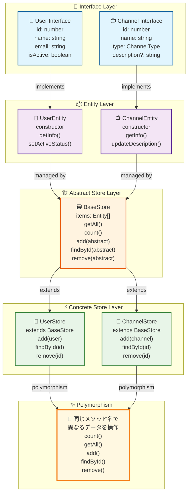
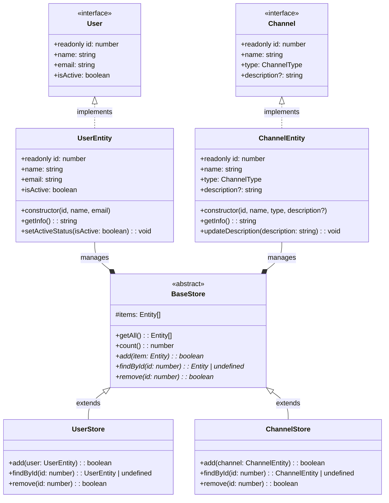
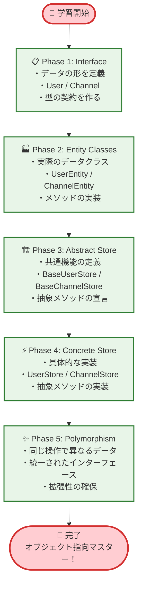

# Step03 成果物：シンプルなデータ管理システム

---

## 🎯 プロジェクトの目的

**あなたが挑戦する課題**: Step03 で学習した内容を実践する簡単なプロジェクト

**なぜ作るのか**: インターフェース、クラス、抽象クラスの基本を**実際に使って**理解するため

**学習目標**:

- [ ] インターフェースでデータの形を決める
- [ ] クラスでデータを管理する
- [ ] 抽象クラスで共通の機能を作る
- [ ] ポリモーフィズムの基本概念を理解する
- [ ] 複数のストアを通じた継承の実践

**⏰ 推定完了時間**: 30 分

---

## 📋 作成するシステムの要件

### 🎯 何を作るか

**簡単なデータ管理システム（ユーザー＋チャンネル）**

**基本機能**:

- ✅ **ユーザーの管理**: 新しいユーザーの登録・表示・削除
- ✅ **チャンネルの管理**: 新しいチャンネルの登録・表示・削除
- ✅ **ポリモーフィズムの実践**: 共通の操作で異なるデータを管理

**扱うデータ**:

**ユーザーデータ**:

- **ID**: ユーザーを識別する番号
- **名前**: ユーザーの名前
- **メール**: ユーザーのメールアドレス
- **アクティブ状態**: ユーザーが有効かどうか

**チャンネルデータ**:

- **ID**: チャンネルを識別する番号
- **名前**: チャンネルの名前
- **タイプ**: チャンネルの種類（テキスト/音声）
- **説明**: チャンネルの説明（任意）

---

## 📊 システム設計図

### 🏗️ アーキテクチャ概要図



### 🔍 詳細クラス関係図



### 🎯 段階的学習フロー



---

## 📋 プロジェクト構成

### 作成ファイル

```
📁 data-management-system/
├── store.ts        # データ管理システム（ユーザー＋チャンネル）
└── main.ts         # 動作確認用（ポリモーフィズム実演含む）
```

---

## 🚀 実践課題：段階的実装

### Phase 1: インターフェース作成 ⏰12 分

**ファイル**: `store.ts`

```typescript
// TODO: インターフェースを定義してください

// 1. ユーザーの形を決める
export interface User {
  // TODO: 以下を定義してください
  // readonly id: number;        // 変更できないID
  // name: string;               // 名前
  // email: string;              // メールアドレス
  // isActive: boolean;          // アクティブかどうか
}

// 2. チャンネルタイプを定義
export type ChannelType = "text" | "voice";

// 3. チャンネルの形を決める
export interface Channel {
  // TODO: 以下を定義してください
  // readonly id: number;        // 変更できないID
  // name: string;               // チャンネル名
  // type: ChannelType;          // チャンネルタイプ
  // description?: string;       // 説明（任意）
}
```

### Phase 2: クラス作成 ⏰12 分

**ファイル**: `store.ts`（続き）

```typescript
// TODO: ユーザークラスを作成してください

export class UserEntity implements User {
  // TODO: プロパティを定義
  public readonly id: number;
  // 他のプロパティも追加...

  constructor(id: number, name: string, email: string) {
    // TODO: プロパティを初期化
    // ヒント: this.isActive = true; (最初はアクティブ)
  }

  // TODO: メソッドを追加
  public getInfo(): string {
    // "名前 (メール) - アクティブ" の形式で返す
    return "";
  }

  public setActiveStatus(isActive: boolean): void {
    // アクティブ状態を変更
  }
}

// TODO: チャンネルクラスを作成してください

export class ChannelEntity implements Channel {
  // TODO: プロパティを定義
  public readonly id: number;
  // 他のプロパティも追加...

  constructor(
    id: number,
    name: string,
    type: ChannelType,
    description?: string
  ) {
    // TODO: プロパティを初期化
  }

  // TODO: メソッドを追加
  public getInfo(): string {
    // "チャンネル名 [タイプ] - 説明" の形式で返す
    return "";
  }

  public updateDescription(description: string): void {
    // 説明を更新
  }
}
```

### Phase 3: 抽象クラス作成 ⏰10 分

**ファイル**: `store.ts`（続き）

```typescript
// TODO: 抽象クラスを作成してください

// 共通のエンティティインターフェース
interface Entity {
  readonly id: number;
}

// 統一された抽象クラス
export abstract class BaseStore {
  protected items: Entity[] = [];

  // 共通メソッド
  public getAll(): Entity[] {
    return [...this.items];
  }

  public count(): number {
    return this.items.length;
  }

  // 抽象メソッド（継承先で実装必須）
  abstract add(item: Entity): boolean;
  abstract findById(id: number): Entity | undefined;
  abstract remove(id: number): boolean;
}

export class UserStore extends BaseStore {
  // TODO: 抽象メソッドを実装してください

  public add(user: UserEntity): boolean {
    // ユーザーを追加
    return false;
  }

  public findById(id: number): UserEntity | undefined {
    // IDでユーザーを検索
    return undefined;
  }

  public remove(id: number): boolean {
    // IDでユーザーを削除
    return false;
  }
}

export class ChannelStore extends BaseStore {
  // TODO: 抽象メソッドを実装してください

  public add(channel: ChannelEntity): boolean {
    // チャンネルを追加
    return false;
  }

  public findById(id: number): ChannelEntity | undefined {
    // IDでチャンネルを検索
    return undefined;
  }

  public remove(id: number): boolean {
    // IDでチャンネルを削除
    return false;
  }
}
```

### Phase 4: 動作確認とポリモーフィズム実演 ⏰6 分

**ファイル**: `main.ts`

```typescript
import { UserEntity, UserStore, ChannelEntity, ChannelStore } from "./store";

function testDataManagement(): void {
  console.log("=== データ管理システム テスト ===");

  // ストアを作成
  const userStore = new UserStore();
  const channelStore = new ChannelStore();

  // ユーザーを作成
  const user1 = new UserEntity(1, "山田太郎", "yamada@example.com");
  const user2 = new UserEntity(2, "田中花子", "tanaka@example.com");

  // チャンネルを作成
  const channel1 = new ChannelEntity(1, "一般", "text", "一般的な話題用");
  const channel2 = new ChannelEntity(2, "音声会議", "voice");

  // データを追加
  userStore.add(user1);
  userStore.add(user2);
  channelStore.add(channel1);
  channelStore.add(channel2);

  // 結果を表示
  console.log(`登録ユーザー数: ${userStore.count()}`);
  console.log("ユーザー一覧:");
  userStore.getAll().forEach((user) => {
    console.log(`- ${user.getInfo()}`);
  });

  console.log(`登録チャンネル数: ${channelStore.count()}`);
  console.log("チャンネル一覧:");
  channelStore.getAll().forEach((channel) => {
    console.log(`- ${channel.getInfo()}`);
  });

  console.log("=== テスト完了 ===");
}

// ポリモーフィズムのテスト
function testPolymorphism(): void {
  console.log("=== ポリモーフィズム実演 ===");

  const userStore = new UserStore();
  const channelStore = new ChannelStore();

  // TODO: ポリモーフィズムを実演するコードを追加
  // ヒント: 共通のメソッド（count, getAll）を使って
  // 異なるストアを同じように操作してみましょう

  console.log("=== ポリモーフィズム実演完了 ===");
}

// テスト実行
testDataManagement();
testPolymorphism();
```

---

## 🔄 ポリモーフィズムとは？（初学者向け解説）

### 🤔 ポリモーフィズムって何？

**簡単に言うと**: 「同じ操作で、異なる種類のデータを扱える仕組み」

**身近な例で理解しよう**:

- **リモコン**: テレビもエアコンも「電源ボタン」で操作できる
- **コンセント**: 掃除機もドライヤーも同じコンセントに挿せる
- **プログラム**: UserStore も ChannelStore も同じ`count()`メソッドで件数を取得できる

### 🔍 今回のプロジェクトでのポリモーフィズム

```typescript
// どちらも同じメソッドを持っている
const userStore = new UserStore();
const channelStore = new ChannelStore();

// 同じ操作で異なるデータを扱える
console.log(userStore.count()); // ユーザー数を取得
console.log(channelStore.count()); // チャンネル数を取得

// 同じメソッド名だが、扱うデータが違う
userStore.getAll(); // UserEntity[]を返す
channelStore.getAll(); // ChannelEntity[]を返す
```

### 🎯 ポリモーフィズムの利点

1. **統一性**: 同じ方法で異なるデータを操作できる
2. **拡張性**: 新しいストアを追加しても、既存のコードを変更しなくて良い
3. **理解しやすさ**: 一度覚えた操作方法が他でも使える

### 💡 実際の開発での応用例

```typescript
// 将来的にこんな風に使える
function printStoreInfo(store: BaseUserStore | BaseChannelStore) {
  console.log(`件数: ${store.count()}`);
  // UserStoreでもChannelStoreでも同じコードで動く！
}

printStoreInfo(userStore); // ユーザー件数を表示
printStoreInfo(channelStore); // チャンネル件数を表示
```

### 🔧 抽象クラスとポリモーフィズムの関係

- **抽象クラス**: 「こんなメソッドを持ってね」という約束
- **ポリモーフィズム**: その約束のおかげで「同じ操作」ができる

```
BaseUserStore（抽象クラス）
├── count() ← 共通メソッド
├── getAll() ← 共通メソッド
└── add() ← 抽象メソッド（継承先で実装）

UserStore（具体クラス）
├── count() ← 親から継承
├── getAll() ← 親から継承
└── add() ← 自分で実装
```

---

## ✅ 完了チェックリスト

### インターフェースの確認

- [ ] `User` インターフェースが定義されている
- [ ] `Channel` インターフェースが定義されている
- [ ] `ChannelType` 型エイリアスが定義されている
- [ ] `readonly` プロパティが使用されている

### クラスの確認

- [ ] `UserEntity` クラスが `User` インターフェースを実装している
- [ ] `ChannelEntity` クラスが `Channel` インターフェースを実装している
- [ ] 両クラスのコンストラクタが正しく実装されている
- [ ] `getInfo()` メソッドが両クラスに実装されている

### 抽象クラスの確認

- [ ] `BaseStore` 抽象クラスが定義されている
- [ ] 共通の Entity インターフェースを使用している
- [ ] `UserStore` が `BaseStore` を継承している
- [ ] `ChannelStore` が `BaseStore` を継承している
- [ ] 全ての抽象メソッドが実装されている

### ポリモーフィズムの確認

- [ ] 両ストアが同じメソッド名（`count()`, `getAll()`）を持っている
- [ ] 異なるデータ型を同じ操作で扱えることを確認
- [ ] ポリモーフィズムの実演コードが動作する

### 動作確認

- [ ] TypeScript エラーがない
- [ ] `main.ts` が正常に実行される
- [ ] ユーザーとチャンネルの追加・表示が動作する
- [ ] ポリモーフィズムのテストが動作する

---

## 📝 解答例のヒント

詰まった場合は以下を参考にしてください：

**インターフェース**：

```typescript
export interface User {
  readonly id: number;
  name: string;
  email: string;
  isActive: boolean;
}

export type ChannelType = "text" | "voice";

export interface Channel {
  readonly id: number;
  name: string;
  type: ChannelType;
  description?: string;
}
```

**クラス**：

```typescript
export class UserEntity implements User {
  public readonly id: number;
  public name: string;
  public email: string;
  public isActive: boolean;

  constructor(id: number, name: string, email: string) {
    this.id = id;
    this.name = name;
    this.email = email;
    this.isActive = true;
  }

  public getInfo(): string {
    const status = this.isActive ? "アクティブ" : "非アクティブ";
    return `${this.name} (${this.email}) - ${status}`;
  }

  public setActiveStatus(isActive: boolean): void {
    this.isActive = isActive;
  }
}

export class ChannelEntity implements Channel {
  public readonly id: number;
  public name: string;
  public type: ChannelType;
  public description?: string;

  constructor(
    id: number,
    name: string,
    type: ChannelType,
    description?: string
  ) {
    this.id = id;
    this.name = name;
    this.type = type;
    this.description = description;
  }

  public getInfo(): string {
    const typeText = this.type === "text" ? "テキスト" : "音声";
    const desc = this.description ? ` - ${this.description}` : "";
    return `${this.name} [${typeText}]${desc}`;
  }

  public updateDescription(description: string): void {
    this.description = description;
  }
}
```

**抽象クラス**：

```typescript
// 共通のエンティティインターフェース
interface Entity {
  readonly id: number;
}

export abstract class BaseStore {
  protected items: Entity[] = [];

  abstract add(item: Entity): boolean;
  abstract findById(id: number): Entity | undefined;
  abstract remove(id: number): boolean;

  public getAll(): Entity[] {
    return [...this.items];
  }

  public count(): number {
    return this.items.length;
  }
}

export class UserStore extends BaseStore {
  public add(user: UserEntity): boolean {
    if (user.name && user.email) {
      this.items.push(user);
      return true;
    }
    return false;
  }

  public findById(id: number): UserEntity | undefined {
    return this.items.find((user) => user.id === id) as UserEntity | undefined;
  }

  public remove(id: number): boolean {
    const index = this.items.findIndex((user) => user.id === id);
    if (index !== -1) {
      this.items.splice(index, 1);
      return true;
    }
    return false;
  }
}

export class ChannelStore extends BaseStore {
  public add(channel: ChannelEntity): boolean {
    if (channel.name && channel.type) {
      this.items.push(channel);
      return true;
    }
    return false;
  }

  public findById(id: number): ChannelEntity | undefined {
    return this.items.find((channel) => channel.id === id) as
      | ChannelEntity
      | undefined;
  }

  public remove(id: number): boolean {
    const index = this.items.findIndex((channel) => channel.id === id);
    if (index !== -1) {
      this.items.splice(index, 1);
      return true;
    }
    return false;
  }
}
```

**ポリモーフィズムの実演例**：

```typescript
function testPolymorphism(): void {
  console.log("=== ポリモーフィズム実演 ===");

  const userStore = new UserStore();
  const channelStore = new ChannelStore();

  // データを追加
  userStore.add(new UserEntity(1, "テストユーザー", "test@example.com"));
  channelStore.add(new ChannelEntity(1, "テストチャンネル", "text"));

  // 同じメソッド名で異なるデータを操作（ポリモーフィズム）
  console.log(`ユーザー数: ${userStore.count()}`);
  console.log(`チャンネル数: ${channelStore.count()}`);

  // 共通の操作を関数化
  function printStoreInfo(store: BaseStore, storeName: string) {
    console.log(`${storeName}の件数: ${store.count()}`);
  }

  printStoreInfo(userStore, "ユーザーストア");
  printStoreInfo(channelStore, "チャンネルストア");

  console.log("=== ポリモーフィズム実演完了 ===");
}
```

---

## 🎓 学習のポイント

### 今回学んだこと

1. **インターフェース**: データの形を決める契約（User と Channel）
2. **クラス**: 実際のデータとメソッドを持つ（UserEntity と ChannelEntity）
3. **抽象クラス**: 共通機能と実装必須メソッドを定義（BaseStore）
4. **継承**: 親クラスの機能を受け継ぐ（UserStore、ChannelStore）
5. **ポリモーフィズム**: 同じ操作で異なるデータを扱う仕組み

### ポリモーフィズムの重要性

- **コードの再利用**: 同じメソッド名で異なるデータを操作
- **拡張性**: 新しいストアを追加しても既存コードを変更不要
- **保守性**: 統一されたインターフェースで理解しやすい
- **設計の美しさ**: オブジェクト指向の真価を体験

### 実際の開発での応用

- **Web アプリ**: ユーザー管理、チャンネル管理、商品管理
- **ゲーム**: プレイヤー管理、アイテム管理、スキル管理
- **業務システム**: 顧客管理、在庫管理、注文管理
- **API 設計**: 統一された CRUD 操作の提供

### 次のステップ

- ジェネリクスを使った型安全なストア設計
- より複雑なデータ構造の管理
- エラーハンドリングの追加
- データベースとの連携
- デザインパターンの学習（Factory、Observer 等）

---

**🎉 お疲れさまでした！**

このデータ管理システムを通じて、TypeScript の基本的なオブジェクト指向プログラミングの概念と**ポリモーフィズム**を実践できました。UserStore と ChannelStore という異なるデータを同じ操作で扱えることで、オブジェクト指向の真価を体験できたはずです。次の Step では、より高度な機能を学習していきましょう。
