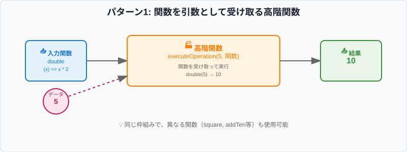
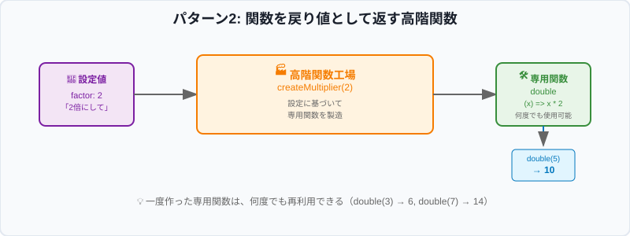
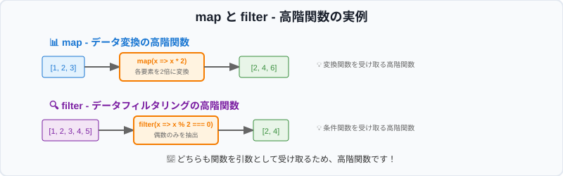

# Session0: 高階関数基礎（90 分）

> 💡 **対象**: Step01-04 完了者（基本型・インターフェース・ユニオン型・型ガード習得済み）
> 🎯 **形式**: 講師サポート付き学習
> ⏰ **時間**: 90 分（休憩含む）

## 📚 関連補足資料

このセッションの学習をサポートする補足資料をご用意しています：

- 📖 **[専門用語集](./Step05_補足_専門用語集.md)** - 高階関数・関数型プログラミングの重要な概念と用語の詳細解説
- 💻 **[実践コード例](./Step05_補足_実践コード例.md)** - 段階的な学習のためのコード例集
- 🔧 **[開発環境ガイド](./Step05_補足_開発環境ガイド.md)** - 効率的な開発環境の活用
- 🌐 **[参考リソース](./Step05_補足_参考リソース.md)** - 学習に役立つリンク集とリソース
- 🚨 **[トラブルシューティング](./Step05_補足_トラブルシューティング.md)** - よくあるエラーと解決方法

> 💡 **活用方法**: 学習中に疑問が生じた際や、より深く理解したい場合に参照してね 🐰

## 📅 セッション概要

**学習目標**:

- [ ] **高階関数の定義と基本概念の完全理解**
- [ ] **配列メソッド（map、filter）が高階関数である理由の理解**
- [ ] **コールバック関数の実践的活用方法の習得**
- [ ] **カリー化の基本概念と実装パターンの理解**
- [ ] **高階関数を使った実践的なコード作成能力の獲得**

**前提知識**:

- Step01-04 の内容（基本型、インターフェース、ユニオン型、型ガード）
- 関数・クラスの基本的な実装経験
- TypeScript の型システムの基礎理解

---

## ⏰ 詳細タイムテーブル

| 時間         | 内容                        | 講師の役割           | 学習者の活動   | 成果物     |
| ------------ | --------------------------- | -------------------- | -------------- | ---------- |
| **0-10 分**  | 全体概要・目標設定          | 説明・質疑応答       | 聞く・質問     | 理解確認   |
| **10-25 分** | 高階関数の定義と基本概念    | 要点解説・図解説明   | 個人学習・確認 | 知識整理   |
| **25-40 分** | 配列メソッド（map、filter） | 実演・個別サポート   | ハンズオン     | 基本コード |
| **40-55 分** | コールバック関数の実践      | 実演・個別サポート   | ハンズオン     | 応用コード |
| **55-70 分** | カリー化の基本理解          | 実演・個別サポート   | ハンズオン     | 応用コード |
| **70-85 分** | 練習問題 1-2                | 巡回サポート・ヒント | 個人作業       | 練習成果   |
| **85-90 分** | 振り返り・次回予告          | まとめ・予告         | 質問・確認     | 学習計画   |

---

## 📚 学習内容

### Section 1: 高階関数の定義と基本概念

> 📚 **関連資料**: [専門用語集 - 高階関数関連用語](./Step05_補足_専門用語集.md#高階関数higher-order-function) | [実践コード例 - 高階関数の基礎](./Step05_補足_実践コード例.md#高階関数の基礎)

#### 🎯 高階関数とは何か？

**💡 高階関数の定義**

高階関数（Higher-Order Function）とは、以下のいずれか（または両方）の特徴を持つ関数です：

###### 事前知識 :

javascriptの関数は変数に関数式を代入することが出来ます

```js
// logという変数に関数を代入
const log = function(message){
    console.log(message);
}
// アロー関数の例
const log = (message) => {
    console.log(message);
}
```

このようにして変数に代入された関数は通常の関数と同じように`()` をつけて呼び出すことが出来ます。

```js
log('hello');
```

通常関数の引数には変数に代入することが可能なオブジェクト(string, number, Array, Objectなど)を指定することが可能なので、引数に関数を指定することが出来ます。

#### 1. パターン 1：関数を引数として受け取る高階関数

**🏭 工場の例で理解しよう**



```
🏭 executeOperation工場の仕組み

材料: 5 (数値)
道具: double関数 (x => x * 2)

工場での作業:
1. 材料「5」を受け取る
2. 道具「double関数」を受け取る
3. 道具を使って材料を加工: double(5)
4. 完成品「10」を出荷

🔄 同じ工場で違う道具を使うと...
材料: 5, 道具: square関数 → 完成品: 25
材料: 5, 道具: addTen関数 → 完成品: 15
```

**🔍 最もシンプルな例**

```typescript
// 高階関数の定義
function executeOperation(
  value: number,
  operation: (x: number) => number // ← 関数を引数として受け取る
): number {
  return operation(value);
}

// 使用する関数たち
const double = (x: number): number => x * 2;
const square = (x: number): number => x * x;
const addTen = (x: number): number => x + 10;

// 高階関数の使用
console.log(executeOperation(5, double)); // 10
console.log(executeOperation(5, square)); // 25
console.log(executeOperation(5, addTen)); // 15
```

**💡 なぜこれが便利なのか？**

同じ「何かに処理を適用する」という枠組みを、異なる処理内容で再利用できます：

```typescript
// 文字列版の高階関数
function processStringWithLog(text: string, processor: (s: string) => string): string {
  console.log(text);
  return processor(text);
}

// 様々な文字列処理
const toUpperCase = (s: string): string => s.toUpperCase();
const addExclamation = (s: string): string => s + "!";
const reverse = (s: string): string => s.split("").reverse().join("");

console.log(processString("hello", toUpperCase)); // "HELLO"
console.log(processString("hello", addExclamation)); // "hello!"
console.log(processString("hello", reverse)); // "olleh"
```

#### 2. パターン 2：関数を戻り値として返す高階関数

**🏭 専用道具工場の例で理解しよう**



```
🏭 createMultiplier工場の仕組み

注文書: 「2倍にする道具が欲しい」

工場での作業:
1. 注文書を受け取る: factor = 2
2. 設計図を作成: (x) => x * 2
3. 専用道具を製造して出荷

👨‍🔧 お客さんの使い方:
const double = createMultiplier(2)  ← 「2倍道具」を注文
double(5) → 10  ← その道具で5を加工
double(3) → 6   ← 同じ道具で3を加工

🔄 別の注文もできる:
const triple = createMultiplier(3)  ← 「3倍道具」を注文
triple(4) → 12  ← その道具で4を加工
```

**🔍 関数ファクトリーの例**

```typescript
// 高階関数：設定に基づいて関数を生成する
function createMultiplier(factor: number): (x: number) => number {
  return (x: number): number => x * factor; // ← 関数を返す
}

// 特定の倍数を計算する関数を生成
const double = createMultiplier(2);
const triple = createMultiplier(3);
const tenTimes = createMultiplier(10);

// 生成された関数を使用
console.log(double(5)); // 10
console.log(triple(4)); // 12
console.log(tenTimes(3)); // 30
```

**💡 実用的な例：バリデーション関数の生成**

```typescript
// バリデーション関数を生成する高階関数
function createValidator(
  condition: (value: number) => boolean,
  errorMessage: string
): (value: number) => { isValid: boolean; error?: string } {
  return (value: number) => {
    const isValid = condition(value);
    return isValid
      ? { isValid: true }
      : { isValid: false, error: errorMessage };
  };
}

// 様々なバリデーターを生成
const isPositive = createValidator(
  (x: number) => x > 0,
  "値は正の数である必要があります"
);

const isEven = createValidator(
  (x: number) => x % 2 === 0,
  "値は偶数である必要があります"
);

// 使用例
console.log(isPositive(5)); // { isValid: true }
console.log(isPositive(-1)); // { isValid: false, error: "値は正の数である必要があります" }
console.log(isEven(4)); // { isValid: true }
console.log(isEven(3)); // { isValid: false, error: "値は偶数である必要があります" }
```

#### 🎯 高階関数の重要なポイント

1. **再利用性**: 同じ処理の枠組みを異なる内容で使い回せる
2. **抽象化**: 具体的な処理内容を後から指定できる
3. **柔軟性**: 処理をカスタマイズ可能にできる
4. **型安全性**: TypeScript の型システムで安全に設計できる

---

### Section 2: 配列メソッド（map、filter）- 高階関数の実用例

> 📚 **関連資料**: [実践コード例 - 配列メソッドの活用](./Step05_補足_実践コード例.md#配列メソッドの活用)

#### 🎯 なぜ map、filter が高階関数なのか？



**💡 重要な理解ポイント**

`map`と`filter`は、**関数を引数として受け取る**ため高階関数です。これらは配列の各要素に対して、私たちが指定した処理を適用してくれます。

#### 1. map - データ変換の高階関数

**📊 map の仕組み**

```
map の動作原理：

元の配列: [1, 2, 3]
     ↓
map(変換関数) ← ここで関数を引数として受け取る
     ↓
新しい配列: [変換後1, 変換後2, 変換後3]
```

**🔍 基本的な使用例**

```typescript
// 数値を2倍にする変換
const numbers = [1, 2, 3, 4, 5];

// map は変換関数を引数として受け取る高階関数
const doubled = numbers.map((x: number) => x * 2);
console.log(doubled); // [2, 4, 6, 8, 10]

// 異なる変換関数を使用
const squared = numbers.map((x: number) => x * x);
console.log(squared); // [1, 4, 9, 16, 25]

const withMessage = numbers.map((x: number) => `数値: ${x}`);
console.log(withMessage); // ["数値: 1", "数値: 2", "数値: 3", "数値: 4", "数値: 5"]
```

**💡 なぜこれが高階関数なのか？**

```typescript
// mapの内部的な動作（簡略版）
function myMapNumbers(
  array: number[],
  transformFunction: (item: number) => number // ← 関数を引数として受け取る
): number[] {
  const result: number[] = [];
  for (const item of array) {
    result.push(transformFunction(item)); // ← 受け取った関数を使用
  }
  return result;
}

// 使用例
const numbers = [1, 2, 3];
const doubled = myMapNumbers(numbers, (x: number) => x * 2);
console.log(doubled); // [2, 4, 6]
```

**🎯 実用的な例：オブジェクトの変換**

```typescript
interface Product {
  id: number;
  name: string;
  price: number;
}

interface ProductDisplay {
  id: number;
  displayName: string;
  formattedPrice: string;
}

const products: Product[] = [
  { id: 1, name: "ノートPC", price: 80000 },
  { id: 2, name: "マウス", price: 2000 },
  { id: 3, name: "キーボード", price: 5000 },
];

// map で Product を ProductDisplay に変換
const productDisplays: ProductDisplay[] = products.map((product: Product) => ({
  id: product.id,
  displayName: `商品: ${product.name}`,
  formattedPrice: `¥${product.price.toLocaleString()}`,
}));

console.log(productDisplays);
// [
//   { id: 1, displayName: "商品: ノートPC", formattedPrice: "¥80,000" },
//   { id: 2, displayName: "商品: マウス", formattedPrice: "¥2,000" },
//   { id: 3, displayName: "商品: キーボード", formattedPrice: "¥5,000" }
// ]
```

#### 2. filter - データフィルタリングの高階関数

**📊 filter の仕組み**

```
filter の動作原理：

元の配列: [1, 2, 3, 4, 5]
     ↓
filter(条件関数) ← ここで関数を引数として受け取る
     ↓
条件を満たす要素のみ: [2, 4] (偶数の場合)
```

**🔍 基本的な使用例**

```typescript
const numbers = [1, 2, 3, 4, 5, 6, 7, 8, 9, 10];

// filter は条件判定関数を引数として受け取る高階関数
const evenNumbers = numbers.filter((x: number) => x % 2 === 0);
console.log(evenNumbers); // [2, 4, 6, 8, 10]

// 異なる条件関数を使用
const greaterThanFive = numbers.filter((x: number) => x > 5);
console.log(greaterThanFive); // [6, 7, 8, 9, 10]

const singleDigit = numbers.filter((x: number) => x < 10);
console.log(singleDigit); // [1, 2, 3, 4, 5, 6, 7, 8, 9]
```

**💡 なぜこれが高階関数なのか？**

```typescript
// filterの内部的な動作（簡略版）
function myFilterNumbers(
  array: number[],
  conditionFunction: (item: number) => boolean // ← 関数を引数として受け取る
): number[] {
  const result: number[] = [];
  for (const item of array) {
    if (conditionFunction(item)) {
      // ← 受け取った関数を使用
      result.push(item);
    }
  }
  return result;
}

// 使用例
const numbers = [1, 2, 3, 4, 5];
const evenNumbers = myFilterNumbers(numbers, (x: number) => x % 2 === 0);
console.log(evenNumbers); // [2, 4]
```

**🎯 実用的な例：ユーザーデータのフィルタリング**

```typescript
interface User {
  id: number;
  name: string;
  age: number;
  isActive: boolean;
}

const users: User[] = [
  { id: 1, name: "Alice", age: 25, isActive: true },
  { id: 2, name: "Bob", age: 17, isActive: false },
  { id: 3, name: "Charlie", age: 30, isActive: true },
  { id: 4, name: "Diana", age: 16, isActive: true },
];

// アクティブな成人ユーザーのみを抽出
const activeAdults = users.filter((user: User) => {
  return user.isActive && user.age >= 18;
});

console.log(activeAdults);
// [
//   { id: 1, name: "Alice", age: 25, isActive: true },
//   { id: 3, name: "Charlie", age: 30, isActive: true }
// ]

// 条件関数を別途定義することも可能
const isActiveAdult = (user: User): boolean => {
  return user.isActive && user.age >= 18;
};

const activeAdults2 = users.filter(isActiveAdult);
console.log(activeAdults2); // 同じ結果
```

#### 3. map と filter の組み合わせ

**🎯 実践的な例：データ処理のパイプライン**

```typescript
interface Sale {
  id: number;
  productName: string;
  amount: number;
  category: string;
}

const sales: Sale[] = [
  { id: 1, productName: "ノートPC", amount: 80000, category: "電子機器" },
  { id: 2, productName: "マウス", amount: 2000, category: "電子機器" },
  { id: 3, productName: "本", amount: 1500, category: "書籍" },
  { id: 4, productName: "ペン", amount: 300, category: "文房具" },
];

// 1. 1000円以上の売上のみを抽出（filter）
// 2. 表示用フォーマットに変換（map）
const processedSales = sales
  .filter((sale: Sale) => sale.amount >= 1000) // 高階関数1
  .map((sale: Sale) => ({
    // 高階関数2
    id: sale.id,
    displayName: `${sale.category}: ${sale.productName}`,
    formattedAmount: `¥${sale.amount.toLocaleString()}`,
  }));

console.log(processedSales);
// [
//   { id: 1, displayName: "電子機器: ノートPC", formattedAmount: "¥80,000" },
//   { id: 2, displayName: "電子機器: マウス", formattedAmount: "¥2,000" },
//   { id: 3, displayName: "書籍: 本", formattedAmount: "¥1,500" }
// ]
```

**📊 処理の流れ**

```
元データ: [4つの売上データ]
    ↓
filter(amount >= 1000) ← 高階関数（条件関数を受け取る）
    ↓
[3つの売上データ] (300円のペンが除外)
    ↓
map(変換関数) ← 高階関数（変換関数を受け取る）
    ↓
[3つの表示用データ]
```

---

### Section 3: コールバック関数 - 高階関数の実践的活用

> 📚 **関連資料**: [実践コード例 - コールバック関数の実践](./Step05_補足_実践コード例.md#コールバック関数の実践)

#### 🎯 コールバック関数とは？

**💡 コールバック関数の定義**

コールバック関数とは、**他の関数に引数として渡される関数**のことです。「後で呼び出してもらう（call back）」ための関数という意味です。

```
📊 コールバック関数の仕組み

メイン関数: 何かの処理を実行
     ↓
処理完了時: コールバック関数を呼び出し
     ↓
コールバック関数: 指定された後処理を実行
```

#### 1. 基本的なコールバック関数

**🔍 シンプルな例**

```typescript
// 時間のかかる処理をシミュレートする関数
function processData(
  data: number[],
  onComplete: (result: number) => void // ← コールバック関数
): void {
  console.log("データ処理を開始...");

  // 処理をシミュレート
  let sum = 0;
  for (const num of data) {
    sum += num;
  }

  console.log("データ処理が完了しました");

  // 処理完了後にコールバック関数を呼び出し
  onComplete(sum);
}

// 使用例
const numbers = [1, 2, 3, 4, 5];

processData(numbers, (result: number) => {
  console.log(`計算結果: ${result}`);
  console.log("結果をデータベースに保存しました");
});

// 出力:
// データ処理を開始...
// データ処理が完了しました
// 計算結果: 15
// 結果をデータベースに保存しました
```

**💡 なぜコールバック関数が便利なのか？**

同じ処理の枠組みで、完了後の動作を自由にカスタマイズできます：

```typescript
// 同じprocessData関数を異なるコールバックで使用
processData(numbers, (result: number) => {
  console.log(`合計は ${result} です`);
});

processData(numbers, (result: number) => {
  if (result > 10) {
    console.log("大きな値です！");
  } else {
    console.log("小さな値です");
  }
});

processData(numbers, (result: number) => {
  const average = result / numbers.length;
  console.log(`平均値: ${average}`);
});
```

#### 2. エラーハンドリング付きコールバック

**🎯 実用的なパターン**

```typescript
// 成功とエラーの両方を処理するコールバック
function fetchUserData(
  userId: number,
  onSuccess: (user: { id: number; name: string; email: string }) => void,
  onError: (error: string) => void
): void {
  console.log(`ユーザー ${userId} のデータを取得中...`);

  // データ取得をシミュレート
  if (userId > 0) {
    // 成功の場合
    const user = {
      id: userId,
      name: `User${userId}`,
      email: `user${userId}@example.com`,
    };
    onSuccess(user);
  } else {
    // エラーの場合
    onError("無効なユーザーIDです");
  }
}

// 使用例
fetchUserData(
  1,
  (user) => {
    console.log("ユーザー取得成功:");
    console.log(`名前: ${user.name}`);
    console.log(`メール: ${user.email}`);
  },
  (error) => {
    console.error("エラーが発生しました:", error);
  }
);

fetchUserData(
  -1,
  (user) => {
    console.log("成功:", user);
  },
  (error) => {
    console.error("失敗:", error); // これが実行される
  }
);
```

#### 3. 配列処理でのコールバック活用

**🔍 カスタム配列処理関数**

```typescript
// 配列の各要素に対して処理を実行し、条件を満たす最初の要素を返す

// 文字列配列用の関数
function findFirstString(
  items: string[],
  condition: (item: string) => boolean // ← コールバック関数
): string | undefined {
  for (const item of items) {
    if (condition(item)) {
      return item;
    }
  }
  return undefined;
}

// 数値配列用の関数
function findFirstNumber(
  items: number[],
  condition: (item: number) => boolean // ← コールバック関数
): number | undefined {
  for (const item of items) {
    if (condition(item)) {
      return item;
    }
  }
  return undefined;
}

// 使用例
const fruits = ["りんご", "バナナ", "みかん", "ぶどう"];

// 「ん」で終わる果物を探す
const fruitEndingWithN = findFirstString(fruits, (fruit: string) => {
  return fruit.endsWith("ん");
});
console.log(fruitEndingWithN); // "みかん"

// 3文字の果物を探す
const threeCharFruit = findFirstString(fruits, (fruit: string) => {
  return fruit.length === 3;
});
console.log(threeCharFruit); // "りんご"

// 数値配列での例
const numbers = [1, 3, 5, 8, 9, 12];

// 最初の偶数を探す
const firstEven = findFirstNumber(numbers, (num: number) => num % 2 === 0);
console.log(firstEven); // 8

// 10以上の最初の数を探す
const firstLarge = findFirstNumber(numbers, (num: number) => num >= 10);
console.log(firstLarge); // 12
```

#### 4. イベント処理でのコールバック

**🎯 シンプルなイベントシステム**

```typescript
// シンプルなイベントエミッター
class SimpleEventEmitter {
  private listeners: Array<(data: any) => void> = [];

  // イベントリスナーを登録（コールバック関数を受け取る）
  on(callback: (data: any) => void): void {
    this.listeners.push(callback);
  }

  // イベントを発火（すべてのコールバック関数を実行）
  emit(data: any): void {
    this.listeners.forEach((callback) => callback(data));
  }
}

// 使用例
interface UserEvent {
  userId: number;
  action: string;
  timestamp: Date;
}

const eventEmitter = new SimpleEventEmitter();

// 複数のイベントリスナーを登録
eventEmitter.on((event: UserEvent) => {
  console.log(`ログ: ユーザー${event.userId}が${event.action}を実行`);
});

eventEmitter.on((event: UserEvent) => {
  console.log(`通知: ${event.action}が完了しました`);
});

eventEmitter.on((event: UserEvent) => {
  console.log(`時刻: ${event.timestamp.toLocaleString()}`);
});

// イベントを発火
eventEmitter.emit({
  userId: 123,
  action: "ログイン",
  timestamp: new Date(),
});

// 出力:
// ログ: ユーザー123がログインを実行
// 通知: ログインが完了しました
// 時刻: 2024/1/1 10:00:00
```

#### 🎯 コールバック関数の重要なポイント

1. **柔軟性**: 処理完了後の動作を自由にカスタマイズできる
2. **再利用性**: 同じ処理の枠組みを異なる後処理で使い回せる
3. **非同期処理**: 時間のかかる処理の完了を待って次の処理を実行できる
4. **イベント駆動**: ユーザーの操作やシステムイベントに応じた処理を実装できる

---

### Section 4: カリー化 - 高階関数の応用例

> 📚 **関連資料**: [専門用語集 - カリー化](./Step05_補足_専門用語集.md#カリー化currying) | [実践コード例 - カリー化の実践](./Step05_補足_実践コード例.md#カリー化の実践)

#### 🎯 カリー化とは？

**💡 カリー化の定義**

カリー化（Currying）とは、**複数の引数を取る関数を、一つの引数を取る関数の連鎖に変換する技法**です。

**🤔 なぜカリー化が必要なのか？**

日常生活で例えると、「コーヒーを作る」という作業を考えてみましょう：

```
通常の方法: コーヒーを作る(豆の種類, 水の量, 砂糖の量) → コーヒー

カリー化した方法:
1. 豆の種類を決める → 「その豆用のコーヒーメーカー」ができる
2. 水の量を決める → 「その豆・その水量用のコーヒーメーカー」ができる
3. 砂糖の量を決める → 最終的にコーヒーができる
```

このように、**段階的に設定を決めていく**ことで、途中で「特定の設定が決まった専用の道具」を作ることができます。

**📊 カリー化の仕組み**

```
通常の関数: add(x, y, z) → 結果
     ↓ カリー化
カリー化された関数: add(x) → 関数 → add(x)(y) → 関数 → add(x)(y)(z) → 結果

具体例:
add(1, 2, 3) = 6  ← 一度に全部指定

add(1)(2)(3) = 6  ← 段階的に指定
  ↑     ↑    ↑
  │     │    └─ 最終結果: 6
  │     └─ 1と2が決まった関数
  └─ 1が決まった関数
```

**💡 カリー化の 3 つの重要なポイント**

1. **段階的な設定**: 引数を一つずつ決めていける
2. **部分適用**: 途中まで設定した「専用関数」を作れる
3. **再利用性**: 同じ設定の関数を何度も使える

#### 1. 基本的なカリー化の例

**🔍 最もシンプルな例から始めよう**

まず、2 つの数を足す関数から始めます：

```typescript
// 通常の関数：2つの引数を一度に受け取る
function add(x: number, y: number): number {
  return x + y;
}

// 使用例
const result1 = add(3, 5); // 8
```

これをカリー化すると：

```typescript
// カリー化された関数：一つずつ引数を受け取る
function curriedAdd(x: number): (y: number) => number {
  return (y: number) => x + y;
}

// 使用例
const addThree = curriedAdd(3); // 3を足す専用関数ができる
const result2 = addThree(5); // 8

// または一度に書くこともできる
const result3 = curriedAdd(3)(5); // 8
```

**🤔 何が起こっているのか？**

```
curriedAdd(3) を実行すると...
↓
「3を足す専用の関数」が作られる
↓
その関数に5を渡すと、3 + 5 = 8 が計算される
```

**📊 3 つの引数の例**

```typescript
// 通常の関数：3つの引数を一度に受け取る
function add3Numbers(x: number, y: number, z: number): number {
  return x + y + z;
}

// 使用例
const result1 = add3Numbers(1, 2, 3); // 6

// カリー化された関数：一つずつ引数を受け取る
function curriedAdd3(x: number): (y: number) => (z: number) => number {
  return (y: number) => (z: number) => x + y + z;
}

// 段階的な使用例
const step1 = curriedAdd3(1); // 1が決まった関数
const step2 = step1(2); // 1と2が決まった関数
const result2 = step2(3); // 最終結果: 6

// 一度に書く場合
const result3 = curriedAdd3(1)(2)(3); // 6
```

**📊 実行過程の詳細図解**

```
curriedAdd3(1)(2)(3) の実行過程：

1. curriedAdd3(1) が呼び出される
   ├─ x = 1 を記憶
   └─ 「1 + y + z を計算する関数」を返す

2. 返された関数に (2) を適用
   ├─ x = 1, y = 2 を記憶
   └─ 「1 + 2 + z を計算する関数」を返す

3. 返された関数に (3) を適用
   ├─ x = 1, y = 2, z = 3 で計算実行
   └─ 1 + 2 + 3 = 6 を返す
```

**💡 カリー化の便利さ**

```typescript
// 「1を足す関数」を作って再利用
const addOne = curriedAdd(1);
console.log(addOne(5)); // 6
console.log(addOne(10)); // 11
console.log(addOne(20)); // 21

// 「10を足す関数」を作って再利用
const addTen = curriedAdd(10);
console.log(addTen(5)); // 15
console.log(addTen(3)); // 13
```

#### 2. カリー化の実用的な活用

**🎯 部分適用による関数の再利用**

```typescript
// 乗算のカリー化
const multiply = (x: number) => (y: number) => x * y;

// 特定の倍数を計算する関数を生成
const double = multiply(2);
const triple = multiply(3);
const tenTimes = multiply(10);

// 使用例
console.log(double(5)); // 10
console.log(triple(4)); // 12
console.log(tenTimes(3)); // 30

// 配列に適用
const numbers = [1, 2, 3, 4, 5];
const doubled = numbers.map(double);
console.log(doubled); // [2, 4, 6, 8, 10]
```

**🔍 文字列処理のカリー化**

```typescript
// 文字列フォーマットのカリー化
const formatMessage = (prefix: string) => (message: string) =>
  `${prefix}: ${message}`;

// 特定のプレフィックス用の関数を生成
const logInfo = formatMessage("INFO");
const logError = formatMessage("ERROR");
const logWarning = formatMessage("WARNING");

// 使用例
console.log(logInfo("アプリケーションが開始されました")); // "INFO: アプリケーションが開始されました"
console.log(logError("データベース接続に失敗しました")); // "ERROR: データベース接続に失敗しました"
console.log(logWarning("メモリ使用量が高くなっています")); // "WARNING: メモリ使用量が高くなっています"
```

#### 3. より実用的なカリー化の例

**🎯 バリデーション関数のカリー化**

```typescript
// バリデーション関数のカリー化
const createValidator =
  (condition: (value: number) => boolean) =>
  (errorMessage: string) =>
  (value: number) => {
    const isValid = condition(value);
    return isValid
      ? { isValid: true, value }
      : { isValid: false, error: errorMessage };
  };

// 条件関数を定義
const isPositive = (x: number) => x > 0;
const isEven = (x: number) => x % 2 === 0;
const isInRange = (min: number, max: number) => (x: number) =>
  x >= min && x <= max;

// バリデーターを生成
const positiveValidator =
  createValidator(isPositive)("値は正の数である必要があります");
const evenValidator = createValidator(isEven)("値は偶数である必要があります");
const rangeValidator = createValidator(isInRange(1, 100))(
  "値は1から100の間である必要があります"
);

// 使用例
console.log(positiveValidator(5)); // { isValid: true, value: 5 }
console.log(positiveValidator(-1)); // { isValid: false, error: "値は正の数である必要があります" }
console.log(evenValidator(4)); // { isValid: true, value: 4 }
console.log(evenValidator(3)); // { isValid: false, error: "値は偶数である必要があります" }
```

**🔍 API 呼び出しのカリー化**

```typescript
// HTTP リクエストのカリー化
type HttpMethod = "GET" | "POST" | "PUT" | "DELETE";

const createApiCall =
  (baseUrl: string) =>
  (method: HttpMethod) =>
  (endpoint: string) =>
  (data?: any) => {
    const url = `${baseUrl}${endpoint}`;
    console.log(
      `${method} ${url}`,
      data ? `with data: ${JSON.stringify(data)}` : ""
    );
    // 実際のHTTPリクエストはここで実行
    return { method, url, data };
  };

// API呼び出し関数を生成
const apiCall = createApiCall("https://api.example.com");
const getRequest = apiCall("GET");
const postRequest = apiCall("POST");

// 特定のエンドポイント用の関数を生成
const getUsers = getRequest("/users");
const getUserById = getRequest("/users/");
const createUser = postRequest("/users");

// 使用例
getUsers(); // GET https://api.example.com/users
createUser({ name: "Alice", email: "alice@example.com" }); // POST https://api.example.com/users with data
```

#### 🎯 カリー化の重要なポイント

1. **部分適用**: 一部の引数を固定した新しい関数を作成できる
2. **再利用性**: 共通の設定を持つ関数を効率的に生成できる
3. **関数合成**: 小さな関数を組み合わせて複雑な処理を構築できる
4. **型安全性**: TypeScript の型システムで安全に設計できる

---

### Section 5: 練習問題

> 📚 **サポート資料**: [実践コード例 - 高階関数の練習](./Step05_補足_実践コード例.md#高階関数の練習) | [トラブルシューティング](./Step05_補足_トラブルシューティング.md#高階関数関連エラー)

#### 練習問題 1: 基本的な高階関数の実装

以下の要件を満たす高階関数を実装してください：

```typescript
// 1. 配列の各要素に対して条件をチェックし、条件を満たす要素のインデックスを返す関数
function findIndices(
  array: number[],
  predicate: (item: number, index: number) => boolean
): number[] {
  // 実装してください
  // ヒント: forEachやmapを使用して、条件を満たすインデックスを収集
}

// 2. 関数を指定回数実行し、結果を配列で返す高階関数
function repeatFunction(
  fn: (count: number) => string,
  times: number
): string[] {
  // 実装してください
  // ヒント: Array.from()やforループを使用
}

// テストケース
const numbers = [1, 2, 3, 4, 5, 6];
const evenIndices = findIndices(numbers, (num) => num % 2 === 0);
console.log(evenIndices); // 期待値: [1, 3, 5] (偶数のインデックス)

const greet = (count: number) => `挨拶 ${count}回目`;
const greetings = repeatFunction(greet, 3);
console.log(greetings); // 期待値: ["挨拶 1回目", "挨拶 2回目", "挨拶 3回目"]
```

**解答例:**

```typescript
function findIndices(
  array: number[],
  predicate: (item: number, index: number) => boolean
): number[] {
  const result: number[] = [];
  array.forEach((item, index) => {
    if (predicate(item, index)) {
      result.push(index);
    }
  });
  return result;
}

function repeatFunction(
  fn: (count: number) => string,
  times: number
): string[] {
  return Array.from({ length: times }, (_, index) => fn(index + 1));
}
```

#### 練習問題 2: 配列メソッドとカリー化の組み合わせ

以下の要件を満たす関数を実装してください：

```typescript
interface Product {
  id: number;
  name: string;
  price: number;
  category: string;
  inStock: boolean;
}

const products: Product[] = [
  {
    id: 1,
    name: "ノートPC",
    price: 80000,
    category: "電子機器",
    inStock: true,
  },
  { id: 2, name: "マウス", price: 2000, category: "電子機器", inStock: false },
  { id: 3, name: "本", price: 1500, category: "書籍", inStock: true },
  { id: 4, name: "ペン", price: 300, category: "文房具", inStock: true },
];

// 1. カテゴリでフィルタリングする関数を生成するカリー化関数
const createCategoryFilter = (category: string) => (products: Product[]) => {
  // 実装してください
};

// 2. 価格範囲でフィルタリングし、表示用フォーマットに変換する関数
function getProductsInPriceRange(
  products: Product[],
  minPrice: number,
  maxPrice: number
): Array<{ name: string; formattedPrice: string }> {
  // 実装してください
  // ヒント: filter と map を組み合わせる
}

// テストケース
const electronicFilter = createCategoryFilter("電子機器");
const electronics = electronicFilter(products);
console.log(electronics); // 電子機器のみ

const affordableProducts = getProductsInPriceRange(products, 1000, 5000);
console.log(affordableProducts); // 1000円〜5000円の商品を表示用フォーマットで
```

**解答例:**

```typescript
const createCategoryFilter = (category: string) => (products: Product[]) =>
  products.filter((product) => product.category === category);

function getProductsInPriceRange(
  products: Product[],
  minPrice: number,
  maxPrice: number
): Array<{ name: string; formattedPrice: string }> {
  return products
    .filter((product) => product.price >= minPrice && product.price <= maxPrice)
    .map((product) => ({
      name: product.name,
      formattedPrice: `¥${product.price.toLocaleString()}`,
    }));
}
```

---

## 👨‍🏫 学習ポイント

### 🤔 よくある質問

**Q: 高階関数はいつ使うべきですか？**
A: 同じ処理の枠組みを異なる内容で繰り返し使いたい場合や、処理をカスタマイズ可能にしたい場合に使用します。配列操作、イベント処理、コールバック関数などが代表的な例です。

**Q: カリー化はいつ使うべきですか？**
A: 関数の部分適用が有効な場面で使用します。例えば、設定値を固定した関数を作成したい場合や、関数型プログラミングのパイプライン処理で使用する場合などです。

**Q: 高階関数は難しくないですか？**
A: 最初は複雑に感じるかもしれませんが、「関数を引数に取る」「関数を返す」という 2 つの基本パターンを理解すれば、実は日常的に使っている map、filter なども高階関数だと分かります。

**Q: TypeScript での型安全性はどう保てばよいですか？**
A: 関数の引数と戻り値に明確な型注釈を付けることで、コンパイル時にエラーを検出できます。Step01-04 で学習した基本型、インターフェース、ユニオン型を活用することで、安全で理解しやすい高階関数を作成できます。

### 🔧 実践的なヒント

**高階関数設計のベストプラクティス**:

1. **型安全性を重視**: 明確な型注釈を使って型安全な高階関数を設計する
2. **単一責任の原則**: 一つの高階関数は一つの責任のみを持つ
3. **純粋関数を心がける**: 副作用を避け、同じ入力に対して同じ出力を返す
4. **適切な命名**: 関数の目的と動作が明確に分かる名前を付ける

**学習を深めるための次のステップ**:

- ジェネリクスと組み合わせた高階関数の設計
- 非同期処理でのコールバック関数の活用
- 関数型プログラミングのパターンの学習

---

## 🌟 次回予告

**📌 重要**: Session0 で高階関数の基礎をしっかりと習得しました。これらの概念は次回のジェネリクス学習で重要な基盤となります。

**🎯 学習完了チェックリスト**

- [ ] 高階関数の定義を説明できる
- [ ] map、filter が高階関数である理由を理解している
- [ ] コールバック関数を実装できる
- [ ] カリー化の基本概念を理解している
- [ ] 練習問題を解くことができる

すべてチェックできたら、高階関数の学習完了です！🚀
