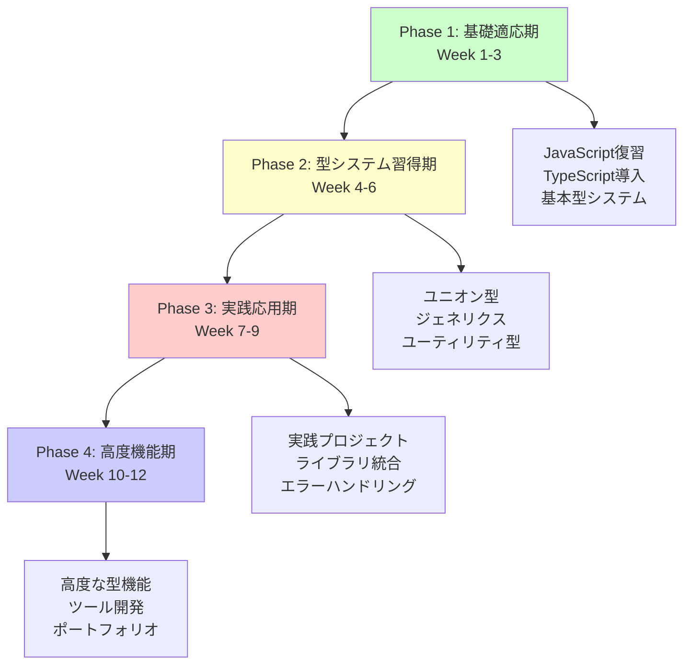

# TypeScript初心者向け完全学習プラン（多言語経験者対応版）

## 🎯 学習プラン概要

### 対象者
- **TypeScript初心者**（他言語プログラミング経験2年以上）
- 基礎から段階的にTypeScriptを習得したい方
- 実践的なコード例を通じて学習したい方

### 学習期間・時間
- **期間**: 12週間（3ヶ月）
- **総学習時間**: 144時間（週12時間）
- **学習スタイル**: 理論20% + 実践コード50% + 演習30%

### 最終到達目標
- TypeScriptの型システムを完全理解
- 実用的なアプリケーション開発能力
- 型安全なライブラリ設計スキル
- 現代的な開発ツールの活用能力

## 📚 学習フェーズ構成



## 📅 週次学習スケジュール

| Week | フェーズ | 学習内容 | 主要トピック | 成果物 |
|------|---------|----------|-------------|--------|
| **1** | 基礎適応期 | JavaScript復習とTypeScript導入 | 環境構築、基本構文、型注釈 | 開発環境、基本アプリ |
| **2** | 基礎適応期 | 基本型システムと型注釈 | プリミティブ型、配列、オブジェクト | 型注釈練習集 |
| **3** | 基礎適応期 | インターフェースとオブジェクト型 | interface、type、継承 | データモデル設計 |
| **4** | 型システム習得期 | ユニオン型と型ガード | Union、型ガード、型アサーション | 型安全な関数群 |
| **5** | 型システム習得期 | ジェネリクス基礎 | 基本ジェネリクス、制約 | 汎用ライブラリ |
| **6** | 型システム習得期 | ユーティリティ型入門 | Pick、Omit、Partial等 | 型変換ツール |
| **7** | 実践応用期 | 実践プロジェクト開始 | Todo App with TypeScript | 実用アプリケーション |
| **8** | 実践応用期 | ライブラリ統合と型定義 | 外部ライブラリ、d.ts | 統合アプリケーション |
| **9** | 実践応用期 | エラーハンドリングとデバッグ | エラー処理、デバッグ技術 | 堅牢なアプリケーション |
| **10** | 高度機能期 | 高度な型機能 | 条件付き型、マップ型 | 高度な型システム |
| **11** | 高度機能期 | ツール開発入門 | ESLint設定、簡単ツール | 開発ツール |
| **12** | 高度機能期 | ポートフォリオ完成 | 総合プロジェクト | 完成ポートフォリオ |

## 🔧 多言語経験者向け特別配慮

### 他言語との比較学習
各週で以下の言語との比較を含めます：
- **Java/C#**: 静的型付け言語との比較
- **Python**: 動的型付け言語との比較
- **Go**: モダンな型システムとの比較
- **Rust**: 所有権システムとの比較

### 実践重視のアプローチ
- **理論説明**: 20%（概念の理解）
- **実際のコード例**: 50%（豊富な実装例）
- **実践演習**: 30%（手を動かす学習）

### 段階的複雑化
```typescript
// Week 1: 基本
let message: string = "Hello TypeScript";

// Week 4: 中級
function processData<T>(data: T[]): T | undefined {
  return data.length > 0 ? data[0] : undefined;
}

// Week 8: 応用
interface ApiResponse<T> {
  data: T;
  status: number;
  message: string;
}

// Week 12: 高度
type DeepReadonly<T> = {
  readonly [P in keyof T]: T[P] extends object ? DeepReadonly<T[P]> : T[P];
};
```

## 📊 学習成果評価システム

### 週次評価基準
各週で以下の項目を評価：
- **理解度**: 理論的な概念の理解（25%）
- **実装力**: コードを書く能力（35%）
- **応用力**: 学んだ内容を応用する能力（25%）
- **問題解決力**: エラーや課題を解決する能力（15%）

### 成果物チェックリスト
- [ ] **Week 1-3**: 基礎的なTypeScriptアプリケーション
- [ ] **Week 4-6**: 型安全なライブラリ・ツール
- [ ] **Week 7-9**: 実用的なWebアプリケーション
- [ ] **Week 10-12**: 高度な型システムを活用したプロジェクト

### 最終認定要件
- 全週の課題完了率 80% 以上
- 実践プロジェクト 2個以上完成
- ポートフォリオサイト完成
- TypeScript Expert基礎レベル認定

## 🛠️ 学習環境・ツール

### 必須環境
```bash
# Node.js (LTS版)
node --version  # v18.x.x以上

# TypeScript
npm install -g typescript
tsc --version   # 5.x.x以上

# 開発エディタ
# VS Code + TypeScript拡張機能
```

### 推奨ツール
- **TypeScript Playground**: オンライン実行環境
- **ts-node**: TypeScript直接実行
- **ESLint**: コード品質管理
- **Prettier**: コードフォーマット
- **Jest**: テストフレームワーク

### 学習リソース
- **公式ドキュメント**: [TypeScript Handbook](https://www.typescriptlang.org/docs/)
- **実践問題**: [type-challenges](https://github.com/type-challenges/type-challenges)
- **コミュニティ**: [TypeScript Discord](https://discord.gg/typescript)

## 📝 各週の詳細プラン

### Phase 1: 基礎適応期（Week 1-3）

#### [Week 1: JavaScript復習とTypeScript導入](./Week01_JavaScript復習とTypeScript導入.md)
- JavaScript基礎の復習
- TypeScript環境構築
- 基本的な型注釈
- 簡単なアプリケーション作成

#### [Week 2: 基本型システムと型注釈](./Week02_基本型システムと型注釈.md)
- プリミティブ型の完全理解
- 配列とタプル型
- オブジェクト型の基礎
- 型推論の活用

#### [Week 3: インターフェースとオブジェクト型](./Week03_インターフェースとオブジェクト型.md)
- interface の設計と活用
- type エイリアスとの使い分け
- 継承とコンポジション
- データモデルの設計

### Phase 2: 型システム習得期（Week 4-6）

#### [Week 4: ユニオン型と型ガード](./Week04_ユニオン型と型ガード.md)
- ユニオン型とインターセクション型
- 型ガードの実装パターン
- 型アサーションの適切な使用
- 判別可能なユニオン

#### [Week 5: ジェネリクス基礎](./Week05_ジェネリクス基礎.md)
- ジェネリクスの基本概念
- 制約付きジェネリクス
- ジェネリック関数とクラス
- 実用的なジェネリクス活用

#### [Week 6: ユーティリティ型入門](./Week06_ユーティリティ型入門.md)
- 組み込みユーティリティ型
- カスタムユーティリティ型の作成
- 型変換のパターン
- 実践的な型操作

### Phase 3: 実践応用期（Week 7-9）

#### [Week 7: 実践プロジェクト開始](./Week07_実践プロジェクト開始.md)
- Todo アプリケーションの設計
- コンポーネント設計
- 状態管理の型安全性
- イベントハンドリング

#### [Week 8: ライブラリ統合と型定義](./Week08_ライブラリ統合と型定義.md)
- 外部ライブラリの型定義
- d.ts ファイルの理解
- DefinitelyTyped の活用
- 型定義の自作

#### [Week 9: エラーハンドリングとデバッグ](./Week09_エラーハンドリングとデバッグ.md)
- TypeScript エラーの理解
- 効果的なデバッグ手法
- エラーハンドリングパターン
- テストの型安全性

### Phase 4: 高度機能期（Week 10-12）

#### [Week 10: 高度な型機能](./Week10_高度な型機能.md)
- 条件付き型とinfer
- マップ型の活用
- テンプレートリテラル型
- 再帰的型定義

#### [Week 11: ツール開発入門](./Week11_ツール開発入門.md)
- ESLint ルールの設定
- 簡単な開発ツール作成
- TypeScript Compiler API
- 自動化スクリプト

#### [Week 12: ポートフォリオ完成](./Week12_ポートフォリオ完成.md)
- 総合プロジェクトの完成
- ポートフォリオサイト構築
- 学習成果のまとめ
- 次のステップの準備

## 🚀 学習継続・発展計画

### Phase 2 への準備
このプラン完了後は、以下のステップに進むことができます：
- **React + TypeScript**: フロントエンド開発の実践
- **Node.js + TypeScript**: バックエンド開発
- **TypeScript ライブラリ開発**: OSS貢献
- **高度な型システム**: 型レベルプログラミング

### 継続学習リソース
- **Weekly Practice**: 毎週の型パズル解決
- **Community Contribution**: OSS プロジェクトへの貢献
- **Technical Writing**: 学習内容のブログ記事化
- **Mentoring**: 他の学習者のサポート

## 📞 サポート・質問

### 学習サポート
- **Discord コミュニティ**: リアルタイム質問・議論
- **GitHub Issues**: 学習プランの改善提案
- **Weekly Review**: 進捗確認とフィードバック

### よくある質問
1. **Q**: 他言語経験がない場合は？
   **A**: JavaScript基礎学習を先に行うことを推奨

2. **Q**: 学習時間が確保できない場合は？
   **A**: 週10時間版のプランも用意可能

3. **Q**: 実践プロジェクトが難しい場合は？
   **A**: 段階的な演習問題から開始可能

---

**🌟 TypeScript Expert への第一歩を踏み出しましょう！**

このプランを通じて、TypeScriptの基礎から実践的な活用まで、体系的に学習できます。多言語経験を活かしながら、効率的にTypeScriptをマスターしていきましょう。

**📌 重要**: 各週の詳細プランには、豊富な実際のコード例（30-50個）と実践演習が含まれています。理論だけでなく、手を動かしながら学習することで、確実にスキルを身につけることができます。