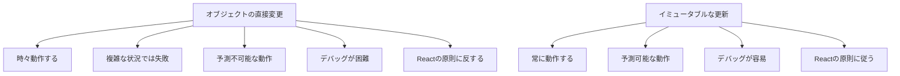

# Session2: useState 実装と状態更新

# 状態を手動で設定しないでください！

前回の講義の終わりには、セッター関数を使用して状態を更新するだけだと言いましたが、それを鵜呑みにしないでください。実際に React を壊してみましょう。

## なぜ手動での状態更新が問題なのか

状態を手動で更新しようとするとどうなるかを見てみましょう。

### 実験 1: let 変数での直接更新

```jsx
function App() {
  // ❌ constをletに変更（間違った方法）
  let [step, setStep] = useState(1);

  function handleNext() {
    // ❌ 直接変数を更新（間違った方法）
    step = step + 1;
    console.log("step updated to:", step); // コンソールでは更新される
  }

  return (
    <div className="steps">
      <p>
        Step {step}: {messages[step - 1]}
      </p>
      <button onClick={handleNext}>Next</button>
    </div>
  );
}
```

**何が起こるか：**

- ボタンをクリックしても**UI は更新されない**
- コンソールでは値が変更されているが、画面は変わらない
- React はエラーを出さないが、何も起こらない

### なぜこれが問題なのか？

**理由：**

- React は、これが状態を更新しようとしていることを知る方法がない
- React は魔法の方法で変数の変更を検知できない
- 状態変更の通知システムが機能しない

### 正しい方法との比較

```jsx
function App() {
  const [step, setStep] = useState(1);

  function handleNextWrong() {
    // ❌ 間違った方法
    step = step + 1; // UIは更新されない
  }

  function handleNextCorrect() {
    // ✅ 正しい方法
    setStep(step + 1); // UIが更新される
  }

  return (
    <div className="steps">
      <p>
        Step {step}: {messages[step - 1]}
      </p>
      <button onClick={handleNextWrong}>Wrong Way</button>
      <button onClick={handleNextCorrect}>Correct Way</button>
    </div>
  );
}
```

## 実験 2: オブジェクト状態の直接変更

より微妙な問題として、オブジェクトや配列の状態を直接変更する場合があります：

### 問題のあるコード例

```jsx
function App() {
  // オブジェクト状態を作成（セッター関数を取得しない）
  const [test] = useState({ name: "Jonas" });

  function handleNext() {
    // ❌ オブジェクトのプロパティを直接変更
    test.name = "Fred";
    console.log("Updated name:", test.name);
  }

  return (
    <div>
      <p>Name: {test.name}</p>
      <button onClick={handleNext}>Change Name</button>
    </div>
  );
}
```

**驚くべきことに、これは動作する場合があります！**
しかし、これは**非常に悪い習慣**です。

### なぜオブジェクトの直接変更が悪いのか



### 正しいオブジェクト状態の更新方法

```jsx
function App() {
  // ✅ セッター関数も取得
  const [test, setTest] = useState({ name: "Jonas" });

  function handleNext() {
    // ✅ 新しいオブジェクトを作成して更新
    setTest({ name: "Fred" });
  }

  return (
    <div>
      <p>Name: {test.name}</p>
      <button onClick={handleNext}>Change Name</button>
    </div>
  );
}
```

## React のイミュータビリティ原則

### 基本原則

```jsx
// ❌ 状態を直接変更（ミューテーション）
state.property = newValue;
state.push(newItem);
state[index] = newValue;

// ✅ 新しい状態を作成（イミュータブル）
setState({ ...state, property: newValue });
setState([...state, newItem]);
setState(state.map((item, i) => (i === index ? newValue : item)));
```

### 配列状態の正しい更新方法

```jsx
function TodoList() {
  const [todos, setTodos] = useState([]);

  function addTodo(text) {
    // ❌ 間違った方法
    // todos.push({ id: Date.now(), text });

    // ✅ 正しい方法
    setTodos([...todos, { id: Date.now(), text }]);
  }

  function removeTodo(id) {
    // ❌ 間違った方法
    // const index = todos.findIndex(todo => todo.id === id);
    // todos.splice(index, 1);

    // ✅ 正しい方法
    setTodos(todos.filter((todo) => todo.id !== id));
  }

  function updateTodo(id, newText) {
    // ✅ 正しい方法
    setTodos(
      todos.map((todo) => (todo.id === id ? { ...todo, text: newText } : todo))
    );
  }
}
```

## 実践演習

### 演習 1: 間違いを見つけて修正

以下のコードの問題点を見つけて修正してください：

```jsx
function BuggyCounter() {
  let [count, setCount] = useState(0);
  const [user, setUser] = useState({ name: "Alice", age: 25 });

  function incrementCount() {
    count = count + 1; // 問題1
  }

  function updateAge() {
    user.age = user.age + 1; // 問題2
  }

  return (
    <div>
      <p>Count: {count}</p>
      <p>
        User: {user.name}, Age: {user.age}
      </p>
      <button onClick={incrementCount}>Increment</button>
      <button onClick={updateAge}>Age Up</button>
    </div>
  );
}
```

### 演習 2: 複雑なオブジェクト状態の更新

以下の要件を満たすコンポーネントを作成してください：

```jsx
function UserProfile() {
  const [user, setUser] = useState({
    name: "John",
    age: 30,
    address: {
      city: "Tokyo",
      country: "Japan",
    },
    hobbies: ["reading", "coding"],
  });

  // 以下の関数を実装してください：
  // 1. 名前を更新する関数
  // 2. 年齢を1つ増やす関数
  // 3. 都市を更新する関数
  // 4. 新しい趣味を追加する関数
  // 5. 趣味を削除する関数
}
```

## まとめ

**重要なルール：**

1. **常に`const`を使用**して useState の結果を受け取る
2. **セッター関数のみを使用**して状態を更新する
3. **状態を直接変更しない**（イミュータビリティを保つ）
4. **新しいオブジェクト/配列を作成**して状態を更新する

これらのルールを守ることで、予測可能で安全な React アプリケーションを構築できます。

# 状態の仕組み

useState 関数を使用して状態の力を目の当たりにしましたが、今度は状態が React でどのように機能するかをよりよく理解しましょう。以前に議論した基本的な React の原則から始めます。

React では、DOM を直接操作しないことを学びました。コンポーネントのビューを更新したいときは、React は宣言的であり、命令的ではありません。コードで DOM に触れることはありません。

**ここで疑問が生まれます：**
「React では DOM を直接触れないのに、どうやって画面を更新するのか？」

例えば：

- ボタンがクリックされた時
- データが変更された時

このような時に、画面を更新する方法が必要です。答えは「状態（state）」ですが、ここでは React の基本原則から順を追って理解していきましょう。

その質問に答えるために、もう 1 つの基本的な React の原則を理解する必要があります。それは、**React は基になるデータが変更されるたびに、コンポーネント全体を再レンダリングすることでコンポーネントビューを更新する**ということです。

**再レンダリングについて：**

React の裏側で何が起こるかについては後のセクションで詳しく学びますが、今のところ理解しておくべきことは：

- 再レンダリングとは、基本的に**React がコンポーネント関数を再度呼び出すこと**です
- 概念的には、React がビュー全体を削除し、再レンダリングが必要になるたびに新しいビューに置き換えると想像できます（実際の動作は後で詳しく学びます）

**状態の保持：**

React は、再レンダリングの間もコンポーネントの状態を保持します。コンポーネントが再レンダリングされても、コンポーネントが UI から完全に消えない限り（マウント解除と呼びます）、状態はリセットされません。

**状態の更新と再レンダリング：**

状態が更新されると、コンポーネントは自動的に再レンダリングされます。例えば、ユーザーがクリックできるボタンのようなイベントハンドラーがあるとします。

そのボタンがクリックされた瞬間、`useState` フックからのセット関数を使用して、コンポーネントの状態を更新できます。すると、React は状態が変更されたことを認識し、コンポーネントを自動的に再レンダリングします。これにより、更新されたビューが作成されます。

```jsx
// 例：カウンターコンポーネント
function Counter() {
  const [count, setCount] = useState(0);

  function handleClick() {
    setCount(count + 1); // 状態を更新
    // → Reactが自動的に再レンダリング
    // → 画面が更新される
  }

  return <button onClick={handleClick}>{count}</button>;
}
```

**結論：**

これで、React の状態の仕組みがはっきりとわかったと思います。React 開発者として、**コンポーネントビューを更新したいときはいつでも、その状態を更新する**ということです。React はその更新に反応し、それを実行します。


