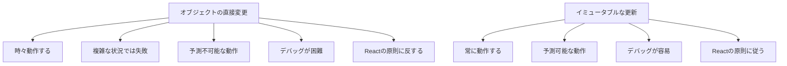

# Session2: useState 実装と状態更新

# 状態を手動で設定しないでください！

前回の講義の終わりには、セッター関数を使用して状態を更新するだけだと言いましたが、それを鵜呑みにしないでください。実際にこれを探索して、React を壊してみましょう。

## なぜ手動での状態更新が問題なのか

状態を手動で更新しようとするとどうなるかを見てみましょう。

### 実験 1: let 変数での直接更新

```jsx
function App() {
  // ❌ constをletに変更（間違った方法）
  let [step, setStep] = useState(1);

  function handleNext() {
    // ❌ 直接変数を更新（間違った方法）
    step = step + 1;
    console.log("step updated to:", step); // コンソールでは更新される
  }

  return (
    <div className="steps">
      <p>
        Step {step}: {messages[step - 1]}
      </p>
      <button onClick={handleNext}>Next</button>
    </div>
  );
}
```

**何が起こるか：**

- ボタンをクリックしても**UI は更新されない**
- コンソールでは値が変更されているが、画面は変わらない
- React はエラーを出さないが、何も起こらない

### なぜこれが問題なのか？

**理由：**

- React は、これが状態を更新しようとしていることを知る方法がない
- React は魔法の方法で変数の変更を検知できない
- 状態変更の通知システムが機能しない

### 正しい方法との比較

```jsx
function App() {
  const [step, setStep] = useState(1);

  function handleNextWrong() {
    // ❌ 間違った方法
    step = step + 1; // UIは更新されない
  }

  function handleNextCorrect() {
    // ✅ 正しい方法
    setStep(step + 1); // UIが更新される
  }

  return (
    <div className="steps">
      <p>
        Step {step}: {messages[step - 1]}
      </p>
      <button onClick={handleNextWrong}>Wrong Way</button>
      <button onClick={handleNextCorrect}>Correct Way</button>
    </div>
  );
}
```

## 実験 2: オブジェクト状態の直接変更

より微妙な問題として、オブジェクトや配列の状態を直接変更する場合があります：

### 問題のあるコード例

```jsx
function App() {
  // オブジェクト状態を作成（セッター関数を取得しない）
  const [test] = useState({ name: "Jonas" });

  function handleNext() {
    // ❌ オブジェクトのプロパティを直接変更
    test.name = "Fred";
    console.log("Updated name:", test.name);
  }

  return (
    <div>
      <p>Name: {test.name}</p>
      <button onClick={handleNext}>Change Name</button>
    </div>
  );
}
```

**驚くべきことに、これは動作する場合があります！**
しかし、これは**非常に悪い習慣**です。

### なぜオブジェクトの直接変更が悪いのか



### 正しいオブジェクト状態の更新方法

```jsx
function App() {
  // ✅ セッター関数も取得
  const [test, setTest] = useState({ name: "Jonas" });

  function handleNext() {
    // ✅ 新しいオブジェクトを作成して更新
    setTest({ name: "Fred" });
  }

  return (
    <div>
      <p>Name: {test.name}</p>
      <button onClick={handleNext}>Change Name</button>
    </div>
  );
}
```

## React のイミュータビリティ原則

### 基本原則

```jsx
// ❌ 状態を直接変更（ミューテーション）
state.property = newValue;
state.push(newItem);
state[index] = newValue;

// ✅ 新しい状態を作成（イミュータブル）
setState({ ...state, property: newValue });
setState([...state, newItem]);
setState(state.map((item, i) => (i === index ? newValue : item)));
```

### 配列状態の正しい更新方法

```jsx
function TodoList() {
  const [todos, setTodos] = useState([]);

  function addTodo(text) {
    // ❌ 間違った方法
    // todos.push({ id: Date.now(), text });

    // ✅ 正しい方法
    setTodos([...todos, { id: Date.now(), text }]);
  }

  function removeTodo(id) {
    // ❌ 間違った方法
    // const index = todos.findIndex(todo => todo.id === id);
    // todos.splice(index, 1);

    // ✅ 正しい方法
    setTodos(todos.filter((todo) => todo.id !== id));
  }

  function updateTodo(id, newText) {
    // ✅ 正しい方法
    setTodos(
      todos.map((todo) => (todo.id === id ? { ...todo, text: newText } : todo))
    );
  }
}
```

## 実践演習

### 演習 1: 間違いを見つけて修正

以下のコードの問題点を見つけて修正してください：

```jsx
function BuggyCounter() {
  let [count, setCount] = useState(0);
  const [user, setUser] = useState({ name: "Alice", age: 25 });

  function incrementCount() {
    count = count + 1; // 問題1
  }

  function updateAge() {
    user.age = user.age + 1; // 問題2
  }

  return (
    <div>
      <p>Count: {count}</p>
      <p>
        User: {user.name}, Age: {user.age}
      </p>
      <button onClick={incrementCount}>Increment</button>
      <button onClick={updateAge}>Age Up</button>
    </div>
  );
}
```

### 演習 2: 複雑なオブジェクト状態の更新

以下の要件を満たすコンポーネントを作成してください：

```jsx
function UserProfile() {
  const [user, setUser] = useState({
    name: "John",
    age: 30,
    address: {
      city: "Tokyo",
      country: "Japan",
    },
    hobbies: ["reading", "coding"],
  });

  // 以下の関数を実装してください：
  // 1. 名前を更新する関数
  // 2. 年齢を1つ増やす関数
  // 3. 都市を更新する関数
  // 4. 新しい趣味を追加する関数
  // 5. 趣味を削除する関数
}
```

## まとめ

**重要なルール：**

1. **常に`const`を使用**して useState の結果を受け取る
2. **セッター関数のみを使用**して状態を更新する
3. **状態を直接変更しない**（イミュータビリティを保つ）
4. **新しいオブジェクト/配列を作成**して状態を更新する

これらのルールを守ることで、予測可能で安全な React アプリケーションを構築できます。

# 状態の仕組み

useState 関数を使用して状態の力を目の当たりにしましたが、今度は状態が React でどのように機能するかをよりよく理解しましょう。以前に議論した基本的な React の原則から始めます。

React では、DOM を直接操作しないことを学んだことを覚えていますか？コンポーネントのビューを更新したいときは、React は宣言的であり、命令的ではありません。コードで DOM に触れることはありません。

しかし、そうであれば、データが変更されたとき、またはクリックなどのイベントに応答する必要があるときに、画面上のコンポーネントを更新する方法という質問につながります。答えは状態であることをすでに知っていますが、ここでは最初の原則から導き出そうとしています。

その質問に答えるために、もう 1 つの基本的な React の原則を理解する必要があります。それは、React がコンポーネントビューを基になるデータが変更されるたびにそのコンポーネント全体を再レンダリングすることによって更新するという事実です。

React の裏側で何が起こるかについて言及するセクションに達すると、コンポーネントが再レンダリングされるときに React 内で実際に何が起こるかについてすべてを学びます。しかし、今のところ、再レンダリングは基本的に、React がコンポーネント関数を再度呼び出すことを意味します。コンポーネントがレンダリングされるたびにです。

概念的には、React がビュー全体を削除し、再レンダリングが必要になるたびに新しいビューに置き換えると想像できます。しかし、後で何が起こるかを正確に学びます。

React は、再レンダリングの間、コンポーネントの状態を保持します。コンポーネントがレンダリングされても、コンポーネントが UI から完全に消えない限り、再レンダリングされても、状態はリセットされません。それをマウント解除と呼びます。

状態といえば、状態が更新されたときにコンポーネントが自動的に再レンダリングされます。ビューにイベントハンドラーがあると想像してみましょう。例えば、ユーザーがクリックできるボタンなど。

そのボタンがクリックされた瞬間、useState フックからのセット関数を使用して、コンポーネントの状態の一部を更新できます。すると、React は状態が変更されたことを認識し、コンポーネントを自動的に再レンダリングします。これにより、このコンポーネントの更新されたビューが作成されます。

これで、React の状態の仕組みがはっきりとわかったと思います。この結論は、React 開発者として、コンポーネントビューを更新したいときはいつでも、その状態を更新するということです。React はその更新に反応し、それを実行します。

実際、このメカニズム全体は React の基本です。React が React と呼ばれる理由です。

# 現在の状態に基づく状態の更新

状態をもう少し練習するために、コンポーネントの開閉機能を実装しましょう。デモを見ると、今実装したいのは、このボタンをクリックしたとき、コンポーネントのこの部分が消え、もう一度クリックすると、元に戻ることです。

これは画面上で変化することなので、新しい状態が必要です。まず、実験のために作成している他の状態をコメントアウトしましょう。参照として完全には削除しません。

```jsx
function Steps() {
  const [step, setStep] = useState(1);
  // const [test, setTest] = useState({ name: "Jonas" }); // ← テスト用の状態（コメントアウト）
  
  // ... 他のコード
}
```

新しい状態を作成しましょう。これは `isOpen` と呼ばれます。セッター関数の命名規則に従って、`setIsOpen` という名前にします。`useState` を使用して状態を作成します。デフォルトでは、コンポーネントは開いている状態にしたいので、初期値として `true` を渡します。これで `isOpen` は `true` から始まります。

```jsx
function Steps() {
  const [step, setStep] = useState(1);
  const [isOpen, setIsOpen] = useState(true); // ← ここで新しい状態を追加（開閉状態を管理）
  
  // ... 他のコード
}
```

これが状態を使用する最初のステップです。次のステップは、実際にコードで状態変数を使用することです。この状態変数で何を実現したいのでしょうか？`isOpen` が `true` のときはコンポーネントを表示し、`false` のときは非表示にしたいのです。

これには条件付きレンダリングが必要です。実装してみましょう。JSX内で条件付きレンダリングを行うには、まず外側の要素が必要です。そのため、`div` 要素でラップします。

その `div` 要素の中で、JavaScriptの式を使用できます。`isOpen` 状態を使って条件付きレンダリングを実装するために、AND演算子（`&&`）を使用します。

```jsx
function Steps() {
  const [step, setStep] = useState(1);
  const [isOpen, setIsOpen] = useState(true);
  
  return (
    <div>  {/* ← 外側のdiv要素でラップ */}
      {/* ← ここで条件付きレンダリングを使用 */}
      {isOpen && (
        <div className="steps">
          {/* ステップコンテンツがここに表示される */}
        </div>
      )}
    </div>
  );
}
```

`isOpen && <div>...</div>` という式は、`isOpen` が `true` の場合に `<div>` 要素を返し、`false` の場合は何も表示しません。これは前のセクションで学んだ条件付きレンダリングのパターンです。

現在、`isOpen` は `true` なので、ステップコンポーネントが表示されています。試しに初期値を `false` に変更すると、コンポーネントが非表示になります。そして `true` に戻すと、再び表示されます。これで、状態を使用する2番目のステップが完了しました。

次に、状態を使用する3番目のステップは、実際に状態を更新することです。そのためには、コンポーネントを閉じるためのボタンが必要です。閉じるボタンを追加しましょう。`className` を `close` に設定したボタン要素を作成し、`&times;` というHTMLエンティティを使用します。これは「×」記号を表示します。

```jsx
function Steps() {
  const [step, setStep] = useState(1);
  const [isOpen, setIsOpen] = useState(true);
  
  return (
    <div>
      {/* ← ここで閉じるボタンを追加 */}
      <button className="close">
        &times;  {/* ← HTMLエンティティで×記号を表示 */}
      </button>
      
      {isOpen && (
        <div className="steps">
          {/* ステップコンテンツ */}
        </div>
      )}
    </div>
  );
}
```

次に、イベントハンドラが必要です。`onClick` プロパティを使用して、ボタン要素に直接イベントハンドラをアタッチします。今回は、インライン関数を使用する方法を示します。

これまでのように、コンポーネントの外部でハンドラ関数を定義するのではなく、ここでは関数を直接定義します。これは、特にロジックが単純な場合によく使われるパターンです。

ここで何をしたいのでしょうか？`isOpen` 状態を更新したいのです。`setIsOpen` を呼び出して、新しい状態値を渡す必要があります。その値は何であるべきでしょうか？現在の状態の反対の値です。

つまり、`isOpen` が `true` の場合は `false` に、`false` の場合は `true` にします。これを実現するには、NOT演算子（`!`）を使用します。これは標準的なJavaScriptの演算子です。

**重要：ここで関数形式の状態更新を使用します。** `setIsOpen((is) => !is)` という形式で、現在の状態値 `is` を受け取り、その反対の値を返します。これで、ボタンをクリックするたびに状態がトグルされます。

```jsx
function Steps() {
  const [step, setStep] = useState(1);
  const [isOpen, setIsOpen] = useState(true);
  
  return (
    <div>
      {/* ← ここでonClickイベントハンドラを追加 */}
      <button className="close" onClick={() => setIsOpen((is) => !is)}>
        {/* ↑ インライン関数で関数形式の状態更新を使用 */}
        {/* setIsOpen((is) => !is) で現在の状態の反対の値に更新 */}
        &times;
      </button>
      
      {isOpen && (
        <div className="steps">
          {/* ステップコンテンツ */}
        </div>
      )}
    </div>
  );
}
```

**重要なポイント：**
- `setIsOpen((is) => !is)` は**関数形式の状態更新**
- `is` は現在の状態値を表す
- `!is` で現在の状態の反対の値を返す
- これにより、true ↔ false のトグルが実現される

これで実装が完了しました。ボタンをクリックすると、正しく動作します。ビューが更新され、コンポーネントが再レンダリングされます。

**動作の流れ：**

1. **最初のクリック**：ボタンをクリックすると、`setIsOpen((is) => !is)` が実行され、`isOpen` が `true` から `false` に変わります
2. **再レンダリング**：Reactが状態の変更を検知し、コンポーネントを再レンダリングします
3. **条件付きレンダリング**：`isOpen` が `false` なので、`{isOpen && ...}` の条件が満たされず、ステップコンテンツが非表示になります
4. **2回目のクリック**：もう一度ボタンをクリックすると、`isOpen` が `false` から `true` に戻ります
5. **再表示**：Reactが再レンダリングし、今度は `isOpen` が `true` なので、ステップコンテンツが再び表示されます

このように、関数形式の状態更新を使用することで、現在の状態に基づいて確実に状態を更新できます。

```jsx
// ← messages配列を定義（コンポーネント外部）
const messages = [
  "Reactを学ぶ ⚛️",
  "仕事に応募する 💼",
  "新しい収入を投資する 🤑",
];

function Steps() {
  const [step, setStep] = useState(1);
  const [isOpen, setIsOpen] = useState(true);
  
  // ← handlePrevious関数を定義
  function handlePrevious() {
    if (step > 1) setStep((s) => s - 1); // ← 関数形式で状態更新
  }
  
  // ← handleNext関数を定義
  function handleNext() {
    if (step < 3) setStep((s) => s + 1); // ← 関数形式で状態更新
  }
  
  return (
    <div>
      {/* ← インライン関数でトグル */}
      <button className="close" onClick={() => setIsOpen((is) => !is)}>
        &times;
      </button>
      
      {/* ← 条件付きレンダリング */}
      {isOpen && (
        <div className="steps">
          <div className="numbers">
            <div className={step >= 1 ? "active" : ""}>1</div>
            <div className={step >= 2 ? "active" : ""}>2</div>
            <div className={step >= 3 ? "active" : ""}>3</div>
          </div>
          
          <p>Step {step}: {messages[step - 1]}</p>
          
          <div className="buttons">
            <button onClick={handlePrevious}>Previous</button>
            <button onClick={handleNext}>Next</button>
          </div>
        </div>
      )}
    </div>
  );
}
```

ここで重要なポイントに気づいてください。試しに `step` の初期値を `2` に変更してみましょう。そして、`isOpen` をトグル（開閉）してみます。

**状態の永続性を確認：**

コンポーネントを開いたり閉じたりしても（つまり、`isOpen` 状態を何度も変更しても）、`step` の状態は `2` のまま保持されています。これは非常に重要な特性です。

```jsx
// 状態の永続性のデモ
function Steps() {
  const [step, setStep] = useState(2); // ← 初期値を2に変更してテスト
  const [isOpen, setIsOpen] = useState(true);
  
  function handlePrevious() {
    if (step > 1) setStep((s) => s - 1);
  }
  
  function handleNext() {
    if (step < 3) setStep((s) => s + 1);
  }
  
  return (
    <div>
      <button className="close" onClick={() => setIsOpen((is) => !is)}>
        &times;
      </button>
      
      {isOpen && (
        <div className="steps">
          {/* ← step状態は再レンダリング後も保持される */}
          <p>Step {step}: {messages[step - 1]}</p>
          <div className="buttons">
            <button onClick={handlePrevious}>Previous</button>
            <button onClick={handleNext}>Next</button>
          </div>
          <p>Step {step}: {messages[step - 1]}</p>
          {/* ... */}
        </div>
      )}
    </div>
  );
}
```

試しに `step` を `3` に設定してから、コンポーネントを開いたり閉じたりしてみましょう。コンポーネントが何度も再レンダリングされても、`step` の値は `3` のまま保持されています。

**これが示すこと：**
- コンポーネントが複数回再レンダリングされても、各状態は独立して保持される
- `isOpen` を変更しても `step` には影響しない
- 状態はコンポーネントの「メモリ」として機能する

このように、Reactの状態管理システムは、各状態を独立して管理し、再レンダリング間で値を保持します。これがReactの状態管理の基本的な仕組みです。

**重要な学習ポイント：**

1. **関数形式の状態更新を使用する場合**
   ```jsx
   // ✅ 現在の状態に基づいて更新する場合
   setStep((s) => s + 1);
   setIsOpen((is) => !is);
   ```

2. **状態の永続性**
   - コンポーネントが再レンダリングされても、状態は保持される
   - `step` が 3 の時に `isOpen` をトグルしても、`step` は 3 のまま
   - 状態はコンポーネントのメモリとして機能する

3. **複数の状態の独立性**
   - `step` と `isOpen` は独立して管理される
   - 一方の状態を更新しても、他方には影響しない
   - それぞれの状態が独自の値を保持する
