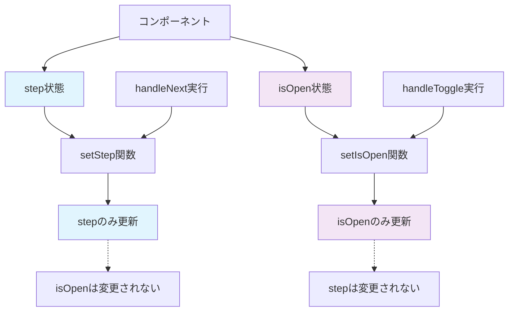
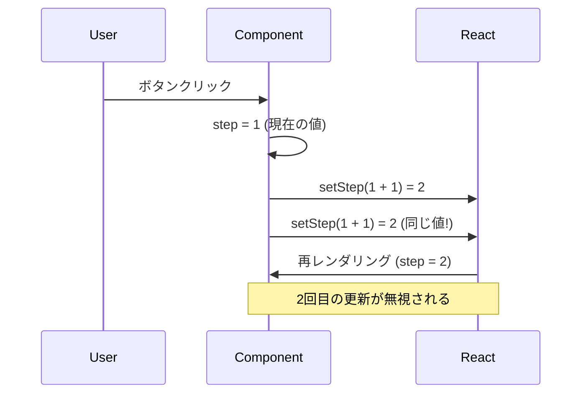
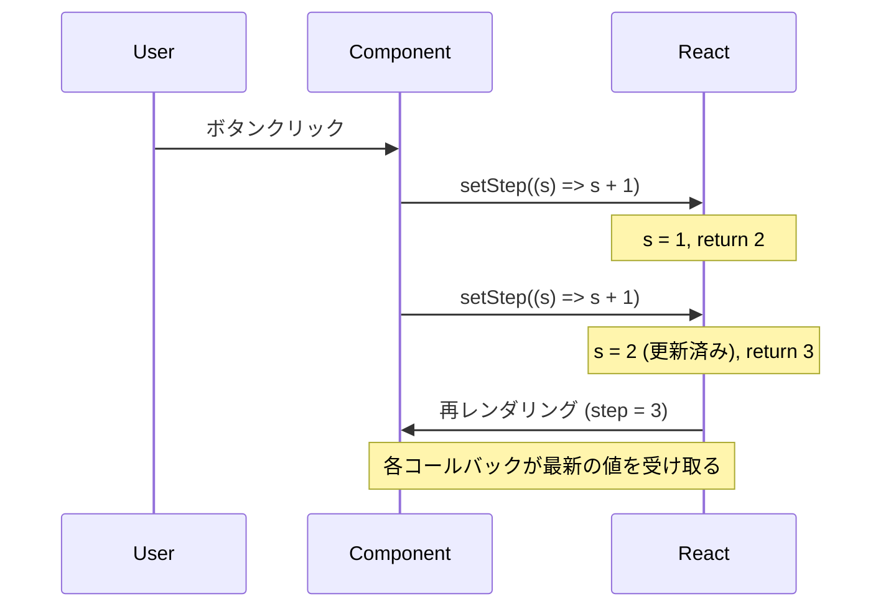

# Session3: 複数状態管理と開発者ツール

## セクション概要

このセッションでは、React アプリケーションにおける複数の状態変数の管理方法を学習します。単一の状態から複数の状態へと発展させ、それぞれが独立して動作する仕組みを理解します。また、React 開発において必須のツールである React Developer Tools の使用方法と、現在の状態に基づいた安全な状態更新パターンについても詳しく解説します。

実際のアプリケーション開発では、複数の状態を同時に管理することが一般的です。例えば、ユーザーインターフェースの表示/非表示状態と、アプリケーションの進行状態を同時に管理する必要があります。このセッションを通じて、そのような複雑な状態管理を効率的に行う方法を身につけましょう。

---

## 複数の状態変数の追加

これまでのアプリケーションに新しい機能を追加してみましょう。現在は単一の状態（ステップ番号）のみを管理していますが、実際のアプリケーションでは複数の状態を同時に管理することが一般的です。

今回追加したい機能は、ユーザーがコンポーネント全体を開閉できる機能です。これは画面上で変化する要素なので、新しい状態変数が必要になります。

### 新しい状態の実装

まず、新しい状態変数を追加してみましょう：

```jsx
import { useState } from "react";

const messages = [
  "Learn React ⚛️",
  "Apply for jobs 💼",
  "Invest your new income 🤑",
];

function App() {
  const [step, setStep] = useState(1); // 既存のステップ状態
  const [isOpen, setIsOpen] = useState(true); // 新しい開閉状態

  function handlePrevious() {
    if (step > 1) setStep(step - 1);
  }

  function handleNext() {
    if (step < 3) setStep(step + 1);
  }

  return <div className="steps">{/* つづき */}</div>;
}

export default App;
```

ここで重要なポイントがいくつかあります。まず、`isOpen`という名前を選んだ理由について説明しましょう。boolean（真偽値）の状態変数には、`is`で始まる名前を付けるのが一般的な慣例です。これにより、その変数が true/false の値を持つことが一目で分かります。

初期値として`true`を設定したのは、コンポーネントがデフォルトで開いた状態で表示されるようにするためです。ユーザーは必要に応じてコンポーネントを閉じることができますが、最初は内容が見える状態の方が使いやすいでしょう。

### 状態の独立性について

ここで非常に重要な概念について説明します。それは、**各状態変数は完全に独立している**ということです。

`step`状態が変更されても`isOpen`状態には影響しません。同様に、`isOpen`状態が変更されても`step`状態は保持されます。これは、React が各状態を個別に管理しているためです。

```jsx
function App() {
  const [step, setStep] = useState(1); // ステップの状態
  const [isOpen, setIsOpen] = useState(true); // 開閉の状態

  function handleNext() {
    setStep(step + 1); // stepのみ更新、isOpenは変更されない
  }

  function handleToggle() {
    setIsOpen(!isOpen); // isOpenのみ更新、stepは変更されない
  }

  // 両方の状態は独立して管理される
}
```

### コンポーネントの独立性の具体的な動作

同じ Steps コンポーネントを 2 つ表示した場合の動作を詳しく説明します：

**画面の構成：**

```
┌─────────────────────────────────────┐
│ 1つ目のStepsコンポーネント              │
│ ● ○ ○  Step 1: Learn React          │
│ [Previous] [Next]                   │
└─────────────────────────────────────┘

┌─────────────────────────────────────┐
│ 2つ目のStepsコンポーネント              │
│ ● ○ ○  Step 1: Learn React          │
│ [Previous] [Next]                   │
└─────────────────────────────────────┘
```

**独立した動作の例：**

1. **初期状態**：両方とも「Step 1」から開始
2. **1 つ目の Next ボタンをクリック**：
   - 1 つ目：「Step 2: Apply for jobs」に変更
   - 2 つ目：「Step 1: Learn React」のまま（変化なし）
3. **2 つ目の Next ボタンを 2 回クリック**：
   - 1 つ目：「Step 2」のまま（変化なし）
   - 2 つ目：「Step 3: Invest your new income」に変更

**React Developer Tools での確認：**

```
▼ App
  ▼ Steps (1つ目)
    hooks: [2, true]  ← step=2, isOpen=true
  ▼ Steps (2つ目)
    hooks: [3, true]  ← step=3, isOpen=true
```

このように、同じコンポーネントでも、それぞれが独自の状態を持ち、他のインスタンスに影響を与えることなく動作します。

#### 状態の独立性を視覚化



#### 複数状態の管理パターン

```jsx
function MultiStateExample() {
  // 各状態は独立して管理される
  const [count, setCount] = useState(0);
  const [name, setName] = useState("");
  const [isVisible, setIsVisible] = useState(true);
  const [items, setItems] = useState([]);

  // 各状態は他の状態に影響を与えない
  function incrementCount() {
    setCount(count + 1); // countのみ変更
  }

  function updateName(newName) {
    setName(newName); // nameのみ変更
  }

  function toggleVisibility() {
    setIsVisible(!isVisible); // isVisibleのみ変更
  }

  function addItem(item) {
    setItems([...items, item]); // itemsのみ変更
  }

  return (
    <div>
      <p>Count: {count}</p>
      <p>Name: {name}</p>
      <p>Visible: {isVisible ? "Yes" : "No"}</p>
      <p>Items: {items.length}</p>
    </div>
  );
}
```

### 条件付きレンダリングの実装

次に、`isOpen`状態に基づいてコンポーネントの表示/非表示を制御してみましょう：

```jsx
function App() {
  const [step, setStep] = useState(1);
  const [isOpen, setIsOpen] = useState(true);

  function handlePrevious() {
    if (step > 1) setStep(step - 1);
  }

  function handleNext() {
    if (step < 3) setStep(step + 1);
  }

  return (
    <>
      <button className="close" onClick={() => setIsOpen(!isOpen)}>
        &times;
      </button>

      {isOpen && (
        <div className="steps">
          <div className="numbers">
            <div className={step >= 1 ? "active" : ""}>1</div>
            <div className={step >= 2 ? "active" : ""}>2</div>
            <div className={step >= 3 ? "active" : ""}>3</div>
          </div>

          <p className="message">
            Step {step}: {messages[step - 1]}
          </p>

          <div className="buttons">
            <button
              style={{ backgroundColor: "#7950f2", color: "#fff" }}
              onClick={handlePrevious}
            >
              Previous
            </button>
            <button
              style={{ backgroundColor: "#7950f2", color: "#fff" }}
              onClick={handleNext}
            >
              Next
            </button>
          </div>
        </div>
      )}
    </>
  );
}
```

この実装で注目すべき点がいくつかあります。

まず、開閉ボタンは常に表示されています。これは条件付きレンダリングの外側に配置されているためです。ユーザーはいつでもコンポーネントを開閉できる必要があるので、このボタンは常にアクセス可能でなければなりません。

次に、`{isOpen && (...)}` という条件付きレンダリングの構文を使用しています。これは、`isOpen`が true の場合のみ、括弧内の JSX がレンダリングされることを意味します。

### 状態の永続性

ここで実際にアプリケーションを動かしてみると、非常に興味深い動作を確認できます。

1. ステップを 2 や 3 に進める
2. 閉じるボタンをクリックしてコンポーネントを非表示にする
3. 再度開くボタンをクリックしてコンポーネントを表示する

すると、ステップの値が保持されていることが分かります。これは、React が状態をコンポーネントのメモリとして管理しているためです。

コンポーネントが一時的に非表示になっても、状態は失われません。レンダリングと再レンダリングを繰り返しても、この情報を時間とともに保持できます。素晴らしいですね。

これで、状態をさまざまな状況でさまざまな目的で実際に使用する方法を理解し始めていることを願っています。

## React 開発者ツール

ウェブ開発者として、開発者ツールに大きく依存しています。ブラウザのコンソールや要素の検査パネルなどです。ツールは開発者にとって非常に役立つので、React チームは React 専用の開発者ツールを構築しました。

これは、状態を扱う場合に非常に役立ちます。現在状態を扱っているので、それらを確認しましょう。

### インストール方法

最初から、コンソールにこのメッセージが表示され、これらの開発者ツールをダウンロードするように指示しています。コンソールを開くと、React ドキュメントの場所へのリンクが見つかります。そこで、開発者ツールへのリンクを見つけることができます。

Chrome Web Store へのリンクがあります。他のブラウザ用もあります。しかし、Google Chrome を使用しているので、これが必要なものです。

何らかの理由でこのリンクがコンソールに表示されなかった場合は、「chrome react dev tools」と Google 検索してください。これが最初の結果です。

このページにアクセスしたら、この拡張機能をダウンロードして、Google Chrome にインストールできます。

### React Developer Tools の画面構成と操作方法

React Developer Tools をインストールして開発者ツールを開くと、以下のような構成になります：

**画面の構成：**

1. **上部タブエリア**：

   - 「Elements」「Console」「Sources」などの既存タブの右側に
   - 「⚛️ Components」タブと「⚛️ Profiler」タブが追加される

2. **Components タブの画面構成**：
   - **左側パネル**：コンポーネントツリー（階層構造で表示）
     ```
     ▼ App
       ▼ Steps
         - div.steps
         - div.numbers
         - p.message
     ```
   - **右側パネル**：選択したコンポーネントの詳細情報
     - **Props**セクション：受け取っている props の一覧
     - **Hooks**セクション：使用している状態の一覧
       - State: 1 (現在の値)
       - State: true (現在の値)

**操作方法：**

1. 左側のコンポーネント名をクリックして選択
2. 右側で状態値を直接編集可能
   - boolean 値：チェックボックスで切り替え
   - 数値：直接入力で変更
3. 変更すると即座に UI に反映される

**実際の使用例：**

- App コンポーネントを選択すると、右側に「Hooks」セクションが表示
- 「State: 1」と「State: true」の 2 つの状態が確認できる
- 「State: 1」を「3」に変更すると、画面のステップが即座に 3 に変わる

### Components タブの活用

Components は、名前が示すように、コンポーネントツリーを表示するためです。現在、コンポーネントは 1 つしかありません。app コンポーネントのみです。

現在のアプリケーションでは、props は受け取っていないので、Props セクションには何も表示されません。

しかし、ここに興味深い部分があります。右側パネルの「Hooks」セクションに、使用した各 useState フックのすべてのリストがあります。useState で状態を作成したことを覚えています。これらの use 関数はフックです。フックのリストにあります。

### 状態の操作と実験

興味深いのは、これらの値をここで操作して、実験できることです。

例えば、boolean 値がある場合、チェックボックスが表示され、それを切り替えることができます。これにより、値も切り替わります。true から false へ。UI でできることと同じことをしています。それは非常に役立ちます。

CSS でできることと少し似ています。これは CSS に触発されています。

ここで、この数値を変更することもできます。1 から 3 に直接移動できます。または、UI から通常アクセスできない値で試すこともできます。

これらのボタンをクリックしても、状態を 10 に設定することはできません。しかし、何らかの理由で UI が 10 でどのように見えるかを確認する必要があるかもしれません。開発者ツールでそれを設定できます。

これは単なる小さなデモ例です。ここでは重要ではありません。しかし、より大きく、大規模なアプリケーションでは、これは時々必要になるかもしれません。

開発者ツールをこの種のことに使用できることを覚えておくことは非常に重要です。

### コンポーネントツリーの表示

前述したように、コンポーネントツリー全体をここに表示できることは非常に役立ちます。プロジェクトに多くのファイルがあり、アプリに数十または数百のコンポーネントがある場合、すぐに手に負えなくなり、どのコンポーネントがどこにあるかを見失う可能性があります。

コンポーネントツリーは非常に便利になります。手動で描画する代わりに、ここで確認できます。

開発者ツールについて話すことは以上です。非常に便利です。それらをインストールすることを確認してください。将来の講義で必ずまた戻ってきます。

## 現在の状態に基づいて状態を更新する

状態変数をその状態の現在の値に基づいて更新することは非常に一般的です。そして、それを行う最善の方法を学びましょう。

実際、常に状態を現在の状態に基づいて更新しています。ここで、例えば、setStep で、現在のステップを取り、1 を引きます。ここでも同じです。現在の isOpen 状態を取り、それを切り替えています。

これが現在の状態に基づいて状態を更新することの意味です。

### 現在のアプローチの問題点

ここで実験をしてみましょう。`handleNext`関数でステップを 2 つ進めるようにしたい場合を考えます。つまり、`setStep`を 2 回呼び出してみます：

```jsx
function handleNext() {
  setStep(step + 1);
  setStep(step + 1); // 2回呼び出し
}
```

一見、これで問題なさそうに見えます。同じ関数を 2 回呼び出すことは可能です。

**では、実際に何が起こるでしょうか？**

理論的には：

- 最初の`setStep`: step（現在 1）+ 1 = 2
- 2 回目の`setStep`: step（現在 2）+ 1 = 3
- 結果：ステップは 3 になるはず

**しかし実際には：**
ボタンをクリックしても、ステップは 1 回しか進みません（1 から 2 へ）。

### なぜこれが起こるのか

#### 問題の根本原因

```jsx
// ❌ 問題のあるコード
function handleNext() {
  setStep(step + 1); // step = 1
  setStep(step + 1); // step = 1 (まだ更新されていない)
}
// 結果: 1 + 1 = 2 (2回目の更新も1 + 1 = 2)
```

**なぜこうなるのか：**

- React の状態更新は**非同期**
- 関数実行中は`step`の値は変わらない
- 両方の`setStep`が同じ古い値を参照



なぜこれが起こるのかを詳細に説明します。しかし、今のところ知っておくべきことは、**現在の状態に基づいて状態を更新する場合は、直接値を渡すのではなく、コールバック関数を渡すべき**だということです。

### コールバック関数を使用した正しい方法

値の代わりに、関数を渡します。この関数は引数として、状態の現在の値を受け取ります。

```jsx
function handleNext() {
  setStep((s) => s + 1);
  setStep((s) => s + 1);
}
```

この引数の呼び方については、複数の慣例があります。再び`step`と呼ぶこともできますが、それは少し混乱するかもしれません。`currentStep`と呼ぶこともできますし、または`s`のように短縮形を使うこともできます。

ここで、以前と同じように`s + 1`を行います。これは以前と同じように機能し、ビューは以前と同じように更新されます。

#### コールバック関数の仕組み



#### コールバック関数の仕組み


ここでも`s + 1`を行います。見た目は同じように見えますが、実はより安全な方法になっています。

**なぜコールバック関数がより正確なのか：**

コールバック関数を使うと、React が現在のステップ値を引数`s`として渡してくれます。そして`s + 1`を返すことで、次の状態値を指定します。2 つ目の`setStep`でも同じように処理されます。

実際に実行してみると、正しく機能します。状態が 2 回更新され、期待通りに動作します。

**動作の流れ：**

1. 初期値は`1`です
2. 1 回目の`setStep`：コールバックが現在の値`1`を受け取り、`1 + 1 = 2`を返します
3. 2 回目の`setStep`：コールバックが更新後の値`2`を受け取り、`2 + 1 = 3`を返します
4. 最終的に状態は`3`になります

### いつコールバックが必要か

現在の状態に基づかない状態更新の場合は、通常の値を渡すだけで問題ありません。例えば、ユーザーの入力値をそのまま状態にセットする場合などです。この場合、コールバック関数は必要ありません。

```jsx
// コールバック不要の例
function handleInputChange(e) {
  setName(e.target.value); // 入力値をそのままセット
}
```

しかし、現在の状態値に基づいて状態を更新する場合は、将来的なバグを防ぐため、また、チーム開発での安全性を確保するために、コールバック関数を使用するのがベストプラクティスです。

**原則：** 状態が現在の状態値に基づいて更新される場合は、必ずコールバック関数を使用しましょう。

## 状態に関するさらなる考察 + 状態ガイドライン

ここまでで状態の基礎を学んできました。ここからは、状態に関する重要な考え方と、実践的なガイドラインを共有します。

### 重要な技術的詳細

まず、知っておくべき重要な技術的事実があります。当たり前に思えるかもしれませんが、非常に重要なので改めて確認しましょう。

**各コンポーネントは独自の状態を持ち、独立して管理します。** 同じコンポーネントを複数回レンダリングした場合でも、それぞれのインスタンスは完全に独立して動作します。

**具体例：**

3 つのカウンターコンポーネントがあり、それぞれが`Score`という状態を持っているとします。初期値はすべて`0`です。

- 1 つ目のボタンをクリック → 1 つ目のスコアだけが増加（他は変化なし）
- 2 つ目のボタンをクリック → 2 つ目のスコアだけが増加（他は変化なし）
- 3 つ目を UI から削除 → 1 つ目と 2 つ目の状態には影響なし

このように、**状態は各コンポーネント内に完全に隔離されています。**

### UI は状態の関数

これまで学んだことを統合すると、重要な結論に到達します：

**UI 全体 = すべてのコンポーネントの状態の表現**

言い換えると、画面に表示されているすべては、現在の状態を視覚化したものです。

さらに言えば、React アプリケーションの本質は以下の 2 つです：

1. 時間の経過とともに状態を変更すること
2. その状態を常に正確に UI に反映すること

これが React の**宣言的アプローチ**です。UI を直接操作するのではなく、状態というデータを操作することで、UI を制御します。私たちは「どう表示するか」を状態、イベントハンドラー、JSX で記述するだけで、実際の DOM 操作は React が処理してくれます。

### 哲学的な理解

今の段階では、これらの話が少し抽象的に聞こえるかもしれません。しかし、React アプリの構築を続け、状態の操作に慣れてくると、ここで説明した概念が体験的に理解できるようになります。

### 実践的なガイドライン

最後に、状態に関する実践的なガイドラインをまとめます。これらは参考資料として活用してください。

#### ガイドライン 1: いつ状態が必要か

コンポーネントが時間とともに追跡する必要があるデータには、状態変数を作成します。

**見分け方：**

- 「将来のある時点で変更される可能性がある変数」を探す
- Vanilla JavaScript なら`let`や`var`で定義していた変数
- アプリのライフサイクル中に変更される配列やオブジェクト

これらには React の状態を使用します。

#### ガイドライン 2: 動的な要素には状態を使う

コンポーネント内で何かを動的にしたい場合は、その「何か」に対応する状態を作成し、変更が必要なタイミングで状態を更新します。

**具体例：モーダルウィンドウ**

開閉できるモーダルウィンドウの場合：

- `isOpen`という状態変数を作成
- `true`の時はモーダルを表示
- `false`の時はモーダルを非表示

シンプルですね。

#### ガイドライン 3: 状態で UI を制御する

コンポーネントの見た目やデータ表示を変更したい時は、状態を更新します。通常はイベントハンドラー関数内で行います。

**考え方：**
画面に表示されるコンポーネントは、時間とともに変化・進化する状態の反映であると捉えましょう。

#### ガイドライン 4: 状態の使いすぎに注意

初心者がよく犯す間違い：コンポーネント内のすべての変数に状態を使ってしまうこと。

**重要：** 再レンダリングを引き起こす必要のない変数には、状態を使わないでください。不必要な再レンダリングが発生し、パフォーマンスの問題につながります。

状態が不要な変数は、通常の`const`変数で十分です。この点については、次のセクションで詳しく説明します。

### 状態習得の重要性

以上のガイドラインを理解し内面化できれば、今後の React アプリケーション開発がずっと楽になります。

**状態の習得が React 学習の最大の山場**だと考えています。しかし、このハードルを乗り越え、「いつ状態が必要か」「状態がどう機能するか」を深く理解できれば、React 開発の扉が大きく開かれるでしょう。

だからこそ、ここまで多くの時間をかけて、状態の仕組みを詳しく説明してきました。

## 実践演習

### 演習 1: 複数状態を持つタイマーアプリ

以下の要件を満たすタイマーコンポーネントを作成してください：

```jsx
function Timer() {
  // 必要な状態を定義してください
  // - seconds: 現在の秒数
  // - isRunning: タイマーが動作中かどうか
  // - isVisible: タイマーが表示されているかどうか

  // 以下の関数を実装してください：
  // 1. startTimer: タイマーを開始
  // 2. stopTimer: タイマーを停止
  // 3. resetTimer: タイマーをリセット
  // 4. toggleVisibility: 表示/非表示を切り替え

  return <div>{/* UIを実装してください */}</div>;
}
```

**期待される動作：**

- タイマーは 1 秒ごとに増加
- 開始/停止ボタンでタイマーの制御
- リセットボタンで 0 に戻る
- 表示/非表示の切り替えが可能
- 各状態は独立して動作

### 演習 2: ショッピングカートの状態管理

複数の状態を管理するショッピングカートを作成してください：

```jsx
function ShoppingCart() {
  // 必要な状態：
  // - items: カート内のアイテム配列
  // - total: 合計金額
  // - isOpen: カートの開閉状態
  // - itemCount: アイテム数

  const products = [
    { id: 1, name: "商品A", price: 1000 },
    { id: 2, name: "商品B", price: 1500 },
    { id: 3, name: "商品C", price: 800 },
  ];

  // 実装する関数：
  // 1. addToCart(product): 商品をカートに追加
  // 2. removeFromCart(productId): 商品をカートから削除
  // 3. clearCart(): カートを空にする
  // 4. toggleCart(): カートの開閉

  return <div>{/* 商品リストとカートUIを実装 */}</div>;
}
```

### 演習 3: 状態更新のベストプラクティス

以下のコードを修正して、安全な状態更新パターンに変更してください：

```jsx
function ProblematicComponent() {
  const [count, setCount] = useState(0);
  const [multiplier, setMultiplier] = useState(1);

  // ❌ 問題のあるコード
  function handleDoubleIncrement() {
    setCount(count + 1);
    setCount(count + 1);
  }

  function handleComplexUpdate() {
    setCount(count * multiplier);
    setMultiplier(multiplier + 1);
    setCount(count + multiplier);
  }

  function handleAsyncUpdate() {
    setTimeout(() => {
      setCount(count + 1);
    }, 1000);
  }

  return (
    <div>
      <p>Count: {count}</p>
      <p>Multiplier: {multiplier}</p>
      <button onClick={handleDoubleIncrement}>Double Increment</button>
      <button onClick={handleComplexUpdate}>Complex Update</button>
      <button onClick={handleAsyncUpdate}>Async Update</button>
    </div>
  );
}
```

**修正のポイント：**

- コールバック関数を使用した安全な状態更新
- 複数の状態更新の正しい順序
- 非同期処理での状態更新の注意点

### 解答例とポイント

#### 演習 1 の解答例

```jsx
function Timer() {
  const [seconds, setSeconds] = useState(0);
  const [isRunning, setIsRunning] = useState(false);
  const [isVisible, setIsVisible] = useState(true);

  useEffect(() => {
    let interval = null;
    if (isRunning) {
      interval = setInterval(() => {
        setSeconds((prev) => prev + 1);
      }, 1000);
    }
    return () => clearInterval(interval);
  }, [isRunning]);

  const startTimer = () => setIsRunning(true);
  const stopTimer = () => setIsRunning(false);
  const resetTimer = () => {
    setSeconds(0);
    setIsRunning(false);
  };
  const toggleVisibility = () => setIsVisible((prev) => !prev);

  return (
    <div>
      <button onClick={toggleVisibility}>
        {isVisible ? "Hide" : "Show"} Timer
      </button>

      {isVisible && (
        <div>
          <h2>Timer: {seconds}s</h2>
          <button onClick={startTimer} disabled={isRunning}>
            Start
          </button>
          <button onClick={stopTimer} disabled={!isRunning}>
            Stop
          </button>
          <button onClick={resetTimer}>Reset</button>
        </div>
      )}
    </div>
  );
}
```

**学習ポイント：**

- 各状態は独立して管理される
- `useEffect`を使った副作用の処理
- コールバック関数による安全な状態更新
- 条件付きレンダリングの活用

## まとめ

このセッションでは以下の重要な概念を学習しました：

### 1. 複数状態の管理

- 各状態変数は完全に独立している
- 状態の独立性により、一つの状態変更が他に影響しない
- 複数の状態を効率的に管理する方法

### 2. 条件付きレンダリング

- `{condition && <Component />}`パターンの活用
- 状態に基づく UI の動的な表示/非表示制御

### 3. React Fragment

- 不要なラッパー要素を避ける方法
- `<>...</>`記法の活用

### 4. React Developer Tools

- 状態と props のリアルタイム監視
- 開発者ツールを使った効率的なデバッグ
- コンポーネント構造の可視化

### 5. 現在の状態に基づく安全な更新

- コールバック関数を使った状態更新パターン
- 非同期な状態更新の仕組みの理解
- 複数回の状態更新における注意点

### 6. コンポーネントの独立性

- 同じコンポーネントの複数インスタンスは独立
- 各インスタンスが独自の状態を保持
- 状態の分離とカプセル化

これらの概念をマスターすることで、より複雑で実用的な React アプリケーションを構築する基盤が整います。次のセッションでは、状態管理のベストプラクティスについてさらに詳しく学習していきます。
