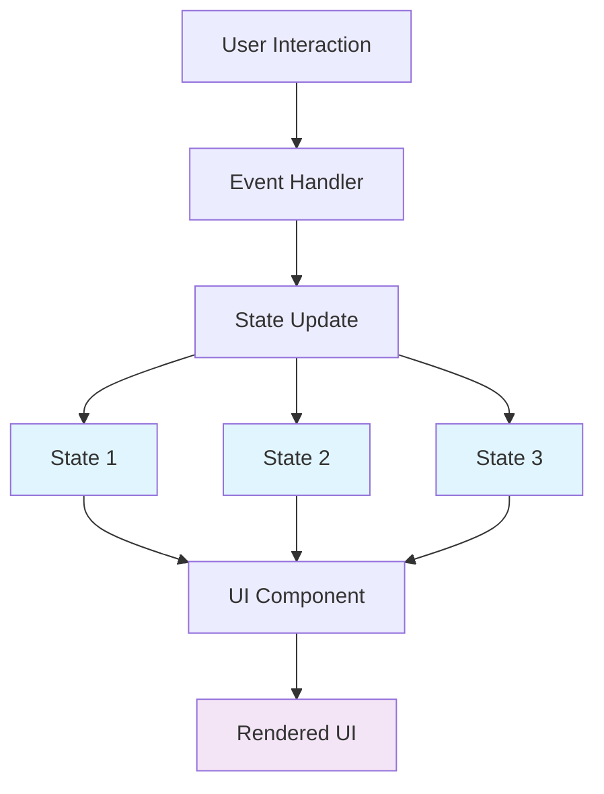
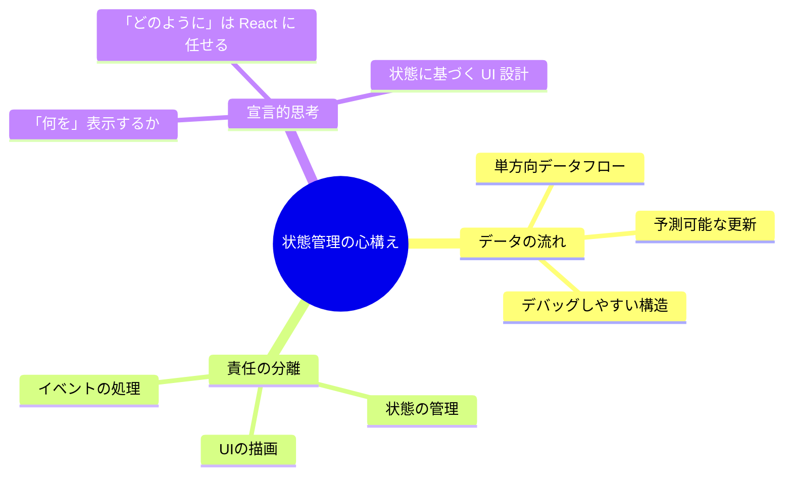
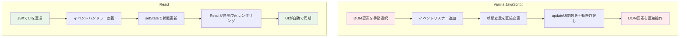
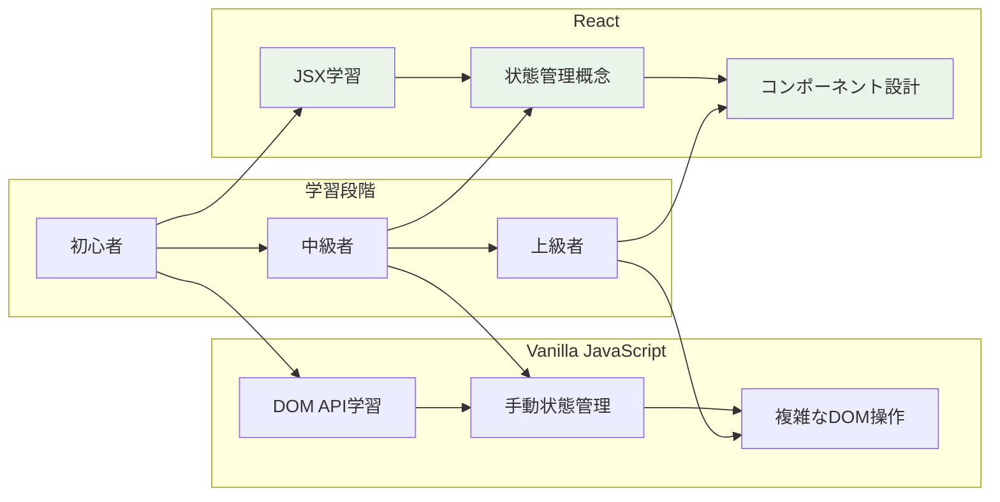
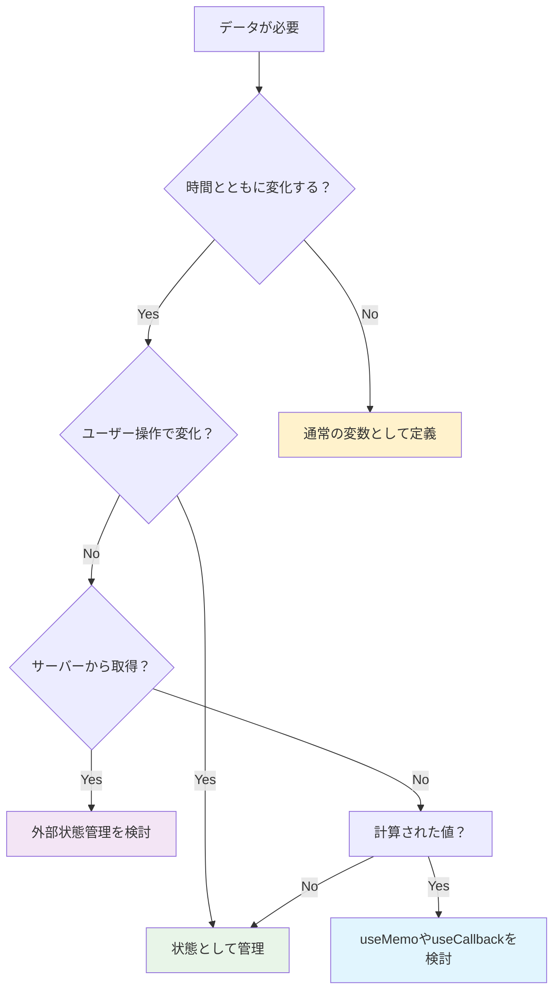

# Session4: 状態管理ベストプラクティス

## セクション概要

このセッションでは、これまでの学習を統合し、React状態管理の実践的なガイドラインとベストプラクティスを学習します。状態管理はReactを学ぶ上で最も重要で難しい部分の一つですが、正しい理解と実践により、React開発の扉が開かれます。

実際のアプリケーション開発では、いつ状態が必要で、いつ不要なのかを適切に判断することが重要です。また、状態をどのように設計し、どのように更新するかについても、一貫したアプローチが必要です。このセッションを通じて、プロフェッショナルなReact開発者として必要な状態管理の知識を身につけましょう。

---

## 状態に関するさらなる考察と状態ガイドライン

状態の基本を学習したので、さらに重要な概念とアイデアを紹介します。実践的なガイドラインも併せて解説します。

### 重要な技術的詳細

まず、重要な技術的詳細を1つ確認しておきましょう。当然のことのように思えるかもしれませんが、重要なポイントです。

**各コンポーネントは独自の状態を持ち、それを管理します**。同じコンポーネントを複数回レンダリングした場合、ページ上の各コンポーネントインスタンスは、他のコンポーネントから完全に独立して動作します。

### コンポーネントの独立性の実例

例えば、3つのカウンターコンポーネントがすべて「Score」という状態を持ち、初期値はゼロに設定されているとします。いずれかのボタンをクリックすると、クリックごとにスコアが1つ増加しますが、**そのコンポーネント内でのみ**変化します。他のコンポーネントの状態は変わりません。

### コンポーネントの独立性の具体的な動作

同じCounterコンポーネントを3つ表示した場合の動作を詳しく説明します：

**画面の構成：**
```
┌─────────────────────────────────────┐
│ Player 1                            │
│ Score: 0                            │
│ [+1] [Reset]                        │
└─────────────────────────────────────┘

┌─────────────────────────────────────┐
│ Player 2                            │
│ Score: 0                            │
│ [+1] [Reset]                        │
└─────────────────────────────────────┘

┌─────────────────────────────────────┐
│ Player 3                            │
│ Score: 0                            │
│ [+1] [Reset]                        │
└─────────────────────────────────────┘
```

**独立した動作の例：**

1. **初期状態**：すべて「Score: 0」から開始
2. **Player 1の+1ボタンを3回クリック**：
   - Player 1：「Score: 3」に変更
   - Player 2：「Score: 0」のまま（変化なし）
   - Player 3：「Score: 0」のまま（変化なし）
3. **Player 2の+1ボタンを1回クリック**：
   - Player 1：「Score: 3」のまま（変化なし）
   - Player 2：「Score: 1」に変更
   - Player 3：「Score: 0」のまま（変化なし）

**React Developer Toolsでの確認：**
```
▼ App
  ▼ Counter (Player 1)
    hooks: [3]  ← score=3
  ▼ Counter (Player 2)  
    hooks: [1]  ← score=1
  ▼ Counter (Player 3)
    hooks: [0]  ← score=0
```

このように、同じコンポーネントでも、それぞれが独自の状態を持ち、他のインスタンスに影響を与えることなく動作します。

```jsx
function Counter({ name }) {
  const [score, setScore] = useState(0);
  
  return (
    <div style={{ margin: '10px', padding: '10px', border: '1px solid #ccc' }}>
      <h3>{name}</h3>
      <p>Score: {score}</p>
      <button onClick={() => setScore(s => s + 1)}>+1</button>
      <button onClick={() => setScore(0)}>Reset</button>
    </div>
  );
}

function App() {
  return (
    <div>
      <Counter name="Player 1" />
      <Counter name="Player 2" />
      <Counter name="Player 3" />
    </div>
  );
}
```

**1つのコンポーネントの状態を変更しても、他のコンポーネントには全く影響しません**。他のボタンをクリックした場合や、コンポーネントがUIから完全に削除された場合でも同様です。

**状態は各コンポーネント内に本当に孤立しています。**

### UIは状態の関数

私たちが学んだすべてを分析すると、全体的なアプリケーションビュー、つまり、**ユーザーインターフェース全体を状態の関数と考えることができる**という結論に達することができます。

言い換えれば、**UI全体はすべてのコンポーネントのすべての現在の状態の表現**です。

#### 状態管理の全体像

React アプリケーションにおける状態管理の流れを図で表すと以下のようになります：

```
[ユーザー操作] → [イベント発生] → [ハンドラー実行] → [状態更新]
                                                        ↓
[画面更新] ← [DOM更新] ← [仮想DOM比較] ← [再レンダリング]
```

各段階の詳細：
1. **ユーザー操作**：ボタンクリック、入力など
2. **イベント発生**：ブラウザがイベントを検知
3. **ハンドラー実行**：onClick などで定義した関数が実行
4. **状態更新**：setState 関数が呼ばれる
5. **再レンダリング**：コンポーネント関数が再実行される
6. **仮想DOM比較**：前回との差分を計算
7. **DOM更新**：実際に変更が必要な部分のみ更新
8. **画面更新**：ユーザーに新しいUIが表示される

#### 数学的な表現



**UI = f(state)**

この数式は、UIが状態の関数であることを表しています。状態が変わると、UIも自動的に更新されます。

#### 実践的な例

```jsx
function AppStateExample() {
  const [user, setUser] = useState(null);
  const [isLoading, setIsLoading] = useState(false);
  const [error, setError] = useState(null);
  
  // UI = f(user, isLoading, error)
  // 状態の組み合わせによってUIが決定される
  
  if (isLoading) {
    return <div>読み込み中...</div>;
  }
  
  if (error) {
    return <div>エラー: {error.message}</div>;
  }
  
  if (!user) {
    return <LoginForm onLogin={setUser} />;
  }
  
  return <UserDashboard user={user} />;
}
```

このアイデアをさらに一歩進めると、**Reactアプリケーションは基本的に時間とともに状態を変更し、もちろん、また、常にその状態を正しく表示すること**です。

これが**宣言的なアプローチ**です。ユーザーインターフェースを構築すること。UIを明示的なDOM操作として見るのではなく、状態を使用すると、**UIを時間とともに変化するデータの反映と見なすことができます**。

#### 宣言的 vs 命令的アプローチ

```jsx
// 命令的アプローチ（Vanilla JavaScript）
function updateCounterImperative(count) {
  const counterElement = document.getElementById('counter');
  counterElement.textContent = `Count: ${count}`;
  
  const button = document.getElementById('increment-btn');
  if (count >= 10) {
    button.disabled = true;
    button.textContent = 'Max reached';
  } else {
    button.disabled = false;
    button.textContent = 'Increment';
  }
}

// 宣言的アプローチ（React）
function Counter() {
  const [count, setCount] = useState(0);
  
  return (
    <div>
      <p>Count: {count}</p>
      <button
        onClick={() => setCount(count + 1)}
        disabled={count >= 10}
      >
        {count >= 10 ? 'Max reached' : 'Increment'}
      </button>
    </div>
  );
}
```

すでに知っているように、私たちはそのデータの反映を状態、イベントハンドラー、そしてJSXで記述します。**UIを記述します。Reactは残りを処理します。**

### 哲学的な理解

これはあなたの旅のこの時点では、すべてが少し哲学的に聞こえるかもしれませんが、私を信じてください。Reactアプリの構築と状態の操作に慣れてくると、私が今言ったすべてを本当に深く理解するでしょう。

#### 状態管理の心構え



## 実践的な状態ガイドライン

最後に、状態に関するいくつかのガイドラインを紹介します。**実践的なガイドラインは学習者に最も喜ばれる内容**です。これらは状態の要約としても機能し、参考資料として活用できます。

### 1. いつ状態を作成するか

**コンポーネントが時間とともに追跡する必要があるあらゆるデータに対して新しい状態変数を作成する必要があります。**

それを見つける簡単な方法は、**将来のある時点で変更する必要がある変数について考えること**です。

Vanilla JavaScriptでアプリを構築することに慣れている場合、それらは「let」または「var」で定義された変数、またはアプリケーションのライフサイクル中に変更する配列またはオブジェクトになります。**Reactではそれらのために状態を使用します。**

### 2. 動的な要素の判断

状態が必要かどうかを判断するもう1つの方法があります。**コンポーネント内で何かを動的に変化させたい場合**、その要素に関連する状態を作成し、変化させたいタイミングで状態を更新します。

「何か」という表現は抽象的なので、具体例として**開閉できるモーダルウィンドウ**を考えてみましょう。

モーダルウィンドウの場合、「isOpen」という状態変数を作成できます。それは、モーダルが現在開いているかどうかを追跡します。

```jsx
function Modal() {
  const [isOpen, setIsOpen] = useState(false);
  
  return (
    <>
      <button onClick={() => setIsOpen(true)}>
        モーダルを開く
      </button>
      
      {isOpen && (
        <div className="modal">
          <div className="modal-content">
            <h2>モーダルの内容</h2>
            <button onClick={() => setIsOpen(false)}>
              閉じる
            </button>
          </div>
        </div>
      )}
    </>
  );
}
```

「isOpen」がtrueの場合はウィンドウを画面に表示し、falseの場合は非表示にします。シンプルですね。

### 3. 状態更新のタイミング

**コンポーネントの外観や表示するデータを変更したい場合は、状態を更新するだけです。通常はイベントハンドラー関数内で行います。**

```jsx
function UserProfile() {
  const [user, setUser] = useState(null);
  const [isEditing, setIsEditing] = useState(false);
  
  const handleEdit = () => {
    setIsEditing(true); // 編集モードに切り替え
  };
  
  const handleSave = (userData) => {
    setUser(userData);   // ユーザーデータを更新
    setIsEditing(false); // 編集モードを終了
  };
  
  return (
    <div>
      {isEditing ? (
        <EditForm user={user} onSave={handleSave} />
      ) : (
        <UserDisplay user={user} onEdit={handleEdit} />
      )}
    </div>
  );
}
```

### 4. 状態としてのコンポーネントビュー

コンポーネントを構築する際は、**画面にレンダリングされるコンポーネントのビューを、時間とともに変化し進化する状態の反映として捉える**と理解しやすくなります。

```jsx
function WeatherApp() {
  const [weather, setWeather] = useState(null);
  const [loading, setLoading] = useState(false);
  const [error, setError] = useState(null);
  
  // 状態の組み合わせによってUIが決定される
  if (loading) return <div>天気情報を読み込み中...</div>;
  if (error) return <div>エラー: {error.message}</div>;
  if (!weather) return <div>天気情報がありません</div>;
  
  return (
    <div>
      <h2>{weather.city}の天気</h2>
      <p>気温: {weather.temperature}°C</p>
      <p>天候: {weather.description}</p>
    </div>
  );
}
```

## 一般的な間違いと注意点

### 状態の過度な使用を避ける

**多くの初心者が犯しがちな間違い**があります。それは、**コンポーネントで必要なすべての変数を状態として管理すること**です。しかし、これは必要ありません。

**再レンダリングを引き起こす必要のない変数には状態を使用しないでください。**不必要な再レンダリングが発生し、パフォーマンスの問題を引き起こす可能性があります。

```jsx
function ProductList() {
  // ❌ 悪い例：定数データを状態として管理
  // const [categories, setCategories] = useState(['電子機器', '本', '衣類']);
  
  // ✅ 良い例：定数は通常の変数として定義
  const categories = ['電子機器', '本', '衣類'];
```

## Vanilla JavaScriptとの実装比較

このパートの締めくくりとして、Reactコードと同じ機能を持つVanilla JavaScript実装を比較してみましょう。

### 同じ機能の実装方法比較：ステップ更新処理

同じ「ステップを1つ進める」機能を、Vanilla JavaScriptとReactで実装した場合の違いを詳しく比較します：

**Vanilla JavaScript（命令的アプローチ）：**

```jsx
// 1. 状態を手動で更新
let step = 1;
step = step + 1; // step = 2

// 2. DOM要素を個別に手動更新（忘れやすい！）
document.querySelector('.message').textContent = `Step ${step}: ${messages[step - 1]}`;

// 3. ステップ番号の見た目を個別に更新
document.querySelector('.step-1').classList.remove('active');
document.querySelector('.step-2').classList.add('active');

// 4. ボタンの状態も個別に更新
if (step === 3) {
  document.querySelector('.btn-next').disabled = true;
}
```

**React（宣言的アプローチ）：**
```jsx
// 1. 状態のみ更新（UIは自動で同期される）
setStep(step + 1);

// 2. JSXで「あるべき状態」を宣言（自動で適用される）
return (
  <div>
    <p>Step {step}: {messages[step - 1]}</p>
    <div className={step >= 2 ? "active" : ""}>2</div>
    <button disabled={step === 3}>Next</button>
  </div>
);
```

**作業量の比較：**
- **Vanilla JavaScript**：4つの個別作業が必要
- **React**：1つの状態更新のみ

**エラーの可能性：**
- **Vanilla JavaScript**：DOM更新を忘れる、要素選択ミスなど
- **React**：状態とUIが自動同期されるため、エラーが少ない

**保守性：**
- **Vanilla JavaScript**：変更時に複数箇所の修正が必要
- **React**：JSXの宣言を変更するだけ

### 同じ機能の異なる実装方法

#### Vanilla JavaScript実装

```html
<!DOCTYPE html>
<html>
<head>
    <title>Steps App - Vanilla JS</title>
    <style>
        .steps {
            width: 600px;
            background-color: #f7f7f7;
            border-radius: 7px;
            padding: 25px 100px;
            margin: 100px auto;
        }
        .numbers {
            display: flex;
            justify-content: space-between;
        }
        .numbers > div {
            height: 40px;
            width: 40px;
            background-color: #e7e7e7;
            border-radius: 50%;
            display: flex;
            align-items: center;
            justify-content: center;
            font-weight: bold;
        }
        .active {
            background-color: #7950f2;
            color: #fff;
        }
    </style>
</head>
<body>
    <div class="steps">
        <div class="numbers">
            <div class="step-1">1</div>
            <div class="step-2">2</div>
            <div class="step-3">3</div>
        </div>
        <p class="message">Step 1: Learn React ⚛️</p>
        <div class="buttons">
            <button class="btn-previous">Previous</button>
            <button class="btn-next">Next</button>
        </div>
    </div>

    <script>
        // 状態管理
        let step = 1;
        const messages = [
            "Learn React ⚛️",
            "Apply for jobs 💼", 
            "Invest your new income 🤑"
        ];

        // DOM要素の取得
        const messageEl = document.querySelector('.message');
        const btnPrevious = document.querySelector('.btn-previous');
        const btnNext = document.querySelector('.btn-next');
        const step1 = document.querySelector('.step-1');
        const step2 = document.querySelector('.step-2');
        const step3 = document.querySelector('.step-3');

        // UI更新関数
        function updateUI() {
            // メッセージの更新
            messageEl.textContent = `Step ${step}: ${messages[step - 1]}`;
            
            // ステップ番号のスタイル更新
            step1.classList.toggle('active', step >= 1);
            step2.classList.toggle('active', step >= 2);
            step3.classList.toggle('active', step >= 3);
            
            // ボタンの状態更新
            btnPrevious.disabled = step === 1;
            btnNext.disabled = step === 3;
        }

        // イベントリスナー
        btnPrevious.addEventListener('click', function() {
            if (step > 1) {
                step--;
                updateUI(); // 手動でUI更新
            }
        });

        btnNext.addEventListener('click', function() {
            if (step < 3) {
                step++;
                updateUI(); // 手動でUI更新
            }
        });

        // 初期化
        updateUI();
    </script>
</body>
</html>
```

#### React実装

```jsx
import { useState } from 'react';

const messages = [
  "Learn React ⚛️",
  "Apply for jobs 💼", 
  "Invest your new income 🤑"
];

function Steps() {
  const [step, setStep] = useState(1);

  function handlePrevious() {
    if (step > 1) setStep(s => s - 1);
  }

  function handleNext() {
    if (step < 3) setStep(s => s + 1);
  }

  return (
    <div className="steps">
      <div className="numbers">
        <div className={step >= 1 ? "active" : ""}>1</div>
        <div className={step >= 2 ? "active" : ""}>2</div>
        <div className={step >= 3 ? "active" : ""}>3</div>
      </div>

      <p className="message">
        Step {step}: {messages[step - 1]}
      </p>

      <div className="buttons">
        <button onClick={handlePrevious} disabled={step === 1}>
          Previous
        </button>
        <button onClick={handleNext} disabled={step === 3}>
          Next
        </button>
      </div>
    </div>
  );
}

export default Steps;
```

### 実装方法の比較分析



### 主な違いの詳細

#### 1. 状態管理の方法

**Vanilla JavaScript:**
```jsx
// 手動での状態管理
let step = 1;

// 状態更新時に手動でUI同期が必要
function updateStep(newStep) {
    step = newStep;
    updateUI(); // 忘れやすい！
}
```

**React:**
```jsx
// Reactが管理する状態
const [step, setStep] = useState(1);

// 状態更新時に自動でUI同期
setStep(2); // UIは自動で更新される
```

#### 2. DOM操作の方法

**Vanilla JavaScript（命令的）:**
```jsx
// 何をどのように変更するかを詳細に指示
function updateUI() {
    messageEl.textContent = `Step ${step}: ${messages[step - 1]}`;
    step1.classList.toggle('active', step >= 1);
    step2.classList.toggle('active', step >= 2);
    step3.classList.toggle('active', step >= 3);
    btnPrevious.disabled = step === 1;
    btnNext.disabled = step === 3;
}
```

**React（宣言的）:**
```jsx
// 現在の状態に基づいてUIがどうあるべきかを宣言
return (
    <div className="steps">
        <div className={step >= 1 ? "active" : ""}>1</div>
        <div className={step >= 2 ? "active" : ""}>2</div>
        <div className={step >= 3 ? "active" : ""}>3</div>
        <p>Step {step}: {messages[step - 1]}</p>
        <button disabled={step === 1}>Previous</button>
        <button disabled={step === 3}>Next</button>
    </div>
);
```

#### 3. コードの保守性

| 観点 | Vanilla JavaScript | React |
|------|-------------------|-------|
| **状態とUIの同期** | 手動で管理（エラーが起きやすい） | 自動で同期（安全） |
| **コードの複雑さ** | DOM操作が複雑 | 宣言的で理解しやすい |
| **バグの発生率** | UI更新忘れなどのバグが多い | 状態管理が自動化されバグが少ない |
| **スケーラビリティ** | 大規模になると管理困難 | コンポーネント化で管理しやすい |
| **テスタビリティ** | DOM依存でテストが困難 | 純粋関数的でテストしやすい |

### パフォーマンスの考慮

```javascript
// Vanilla JavaScript: 全てのDOM要素を毎回更新
function updateUI() {
    // 変更が必要ない要素も毎回更新
    messageEl.textContent = `Step ${step}: ${messages[step - 1]}`;
    step1.classList.toggle('active', step >= 1);
    step2.classList.toggle('active', step >= 2);
    step3.classList.toggle('active', step >= 3);
}

// React: 仮想DOMで差分のみ更新
// Reactが自動的に最適化を行い、
// 実際に変更が必要な部分のみDOMを更新
```

### 学習コストと開発効率



**結論:**
- **短期的**: Vanilla JavaScriptの方が学習コストが低い
- **長期的**: Reactの方が開発効率と保守性が高い
- **チーム開発**: Reactの方が一貫性を保ちやすい

## 実践演習

### 演習1: 状態設計の判断

以下のシナリオで、どの情報を状態として管理すべきか判断してください：

```javascript
function BlogPost() {
  // 以下のうち、どれを状態として管理すべきでしょうか？
  
  const postTitle = "React状態管理入門";           // A
  const postContent = "状態管理は重要です...";      // B
  const publishDate = "2024-01-15";              // C
  const viewCount = 1250;                        // D
  const isLiked = false;                         // E
  const likeCount = 45;                          // F
  const comments = [];                           // G
  const isCommentsVisible = true;                // H
  const currentUser = { id: 1, name: "田中" };   // I
  const isEditing = false;                       // J
  
  return (
    <article>
      <h1>{postTitle}</h1>
      <p>公開日: {publishDate}</p>
      <p>閲覧数: {viewCount}</p>
      <div>
        <button>👍 {likeCount}</button>
        <button>コメント表示/非表示</button>
      </div>
      {isCommentsVisible && (
        <div>
          {comments.map(comment => (
            <div key={comment.id}>{comment.text}</div>
          ))}
        </div>
      )}
    </article>
  );
}
```

### 演習2: 状態更新パターンの修正

以下のコードの問題点を見つけて修正してください：

```javascript
function ProblematicTodoApp() {
  const [todos, setTodos] = useState([]);
  const [completedCount, setCompletedCount] = useState(0);
  const [totalCount, setTotalCount] = useState(0);
  
  const addTodo = (text) => {
    const newTodo = { id: Date.now(), text, completed: false };
    // ❌ 問題のあるコード
    todos.push(newTodo);
    setTodos(todos);
    setTotalCount(totalCount + 1);
  };
  
  const toggleTodo = (id) => {
    // ❌ 問題のあるコード
    const todo = todos.find(t => t.id === id);
    todo.completed = !todo.completed;
    setTodos(todos);
    
    if (todo.completed) {
      setCompletedCount(completedCount + 1);
    } else {
      setCompletedCount(completedCount - 1);
    }
  };
  
  const deleteTodo = (id) => {
    // ❌ 問題のあるコード
    const index = todos.findIndex(t => t.id === id);
    const wasCompleted = todos[index].completed;
    todos.splice(index, 1);
    setTodos(todos);
    setTotalCount(totalCount - 1);
    if (wasCompleted) {
      setCompletedCount(completedCount - 1);
    }
  };
  
  return (
    <div>
      <p>合計: {totalCount}, 完了: {completedCount}</p>
      {/* UI部分 */}
    </div>
  );
}
```

### 演習3: 複雑な状態管理

以下の要件を満たすユーザー管理コンポーネントを作成してください：

**要件:**
1. ユーザーリストの表示
2. ユーザーの追加・編集・削除
3. フィルタリング機能（アクティブ/非アクティブ）
4. ソート機能（名前/登録日）
5. 検索機能
6. 一括操作（全選択/全削除）

```javascript
function UserManagement() {
  // 必要な状態を設計してください
  
  // 実装すべき機能：
  // - addUser(userData)
  // - editUser(id, userData)
  // - deleteUser(id)
  // - toggleUserStatus(id)
  // - filterUsers(filter)
  // - sortUsers(sortBy)
  // - searchUsers(query)
  // - selectAll()
  // - deleteSelected()
  
  return (
    <div>
      {/* UIを実装してください */}
    </div>
  );
}
```

### 演習4: パフォーマンス最適化

以下のコンポーネントのパフォーマンス問題を特定し、最適化してください：

```javascript
function ExpensiveComponent() {
  const [count, setCount] = useState(0);
  const [users, setUsers] = useState([]);
  const [filter, setFilter] = useState('all');
  
  // ❌ パフォーマンス問題あり
  const expensiveCalculation = () => {
    console.log('重い計算実行中...');
    let result = 0;
    for (let i = 0; i < 1000000; i++) {
      result += Math.random();
    }
    return result;
  };
  
  const filteredUsers = users.filter(user => {
    if (filter === 'active') return user.active;
    if (filter === 'inactive') return !user.active;
    return true;
  });
  
  return (
    <div>
      <h1>Count: {count}</h1>
      <p>計算結果: {expensiveCalculation()}</p>
      <button onClick={() => setCount(count + 1)}>
        カウント増加
      </button>
      
      <select onChange={(e) => setFilter(e.target.value)}>
        <option value="all">全て</option>
        <option value="active">アクティブ</option>
        <option value="inactive">非アクティブ</option>
      </select>
      
      <ul>
        {filteredUsers.map(user => (
          <li key={user.id}>{user.name}</li>
        ))}
      </ul>
    </div>
  );
}
```

### 解答例とポイント

#### 演習1の解答

```javascript
function BlogPost() {
  // 状態として管理すべきもの：
  const [isLiked, setIsLiked] = useState(false);        // E: ユーザーの操作で変化
  const [likeCount, setLikeCount] = useState(45);       // F: いいね数は変化する
  const [comments, setComments] = useState([]);         // G: コメントは追加/削除される
  const [isCommentsVisible, setIsCommentsVisible] = useState(true); // H: 表示状態の切り替え
  const [isEditing, setIsEditing] = useState(false);    // J: 編集モードの切り替え
  
  // 状態として管理しないもの：
  const postTitle = "React状態管理入門";           // A: 固定値
  const postContent = "状態管理は重要です...";      // B: 固定値（編集機能があれば状態）
  const publishDate = "2024-01-15";              // C: 固定値
  const viewCount = 1250;                        // D: サーバーから取得する値
  const currentUser = { id: 1, name: "田中" };   // I: 認証情報（別の場所で管理）
}
```

**判断基準:**
- ✅ **状態にする**: ユーザーの操作で変化する値
- ❌ **状態にしない**: 固定値、計算で求められる値、外部から提供される値

## まとめ

このセッションでは、React状態管理の核心概念と実践的なガイドラインを学習しました：

### 重要な概念の再確認

1. **UI = f(state)**: UIは状態の関数として表現される
2. **宣言的アプローチ**: 状態を記述し、ReactがUIを同期させる
3. **コンポーネントの独立性**: 各コンポーネントは独自の状態を持つ
4. **状態の適切な設計**: 何を状態にし、何を状態にしないかの判断

### 実践的ガイドライン



### 開発者としての成長

状態管理をマスターすることで：
- **効率的な開発**: 宣言的なアプローチによる開発速度向上
- **保守性の向上**: 予測可能で理解しやすいコード
- **バグの削減**: 自動化された状態同期によるエラー防止
- **チーム開発**: 一貫したパターンによる協働の促進

### 次のステップ

1. **実践を重ねる**: 小さなプロジェクトから始めて経験を積む
2. **パターンを学ぶ**: 一般的な状態管理パターンの習得
3. **ツールを活用**: React Developer Toolsでのデバッグスキル向上
4. **発展的な概念**: Context API、カスタムフック、状態管理ライブラリの学習

React開発の旅はここから本格的に始まります。状態管理の基礎をしっかりと身につけ、次のレベルへと進んでいきましょう。継続的な実践を通じて、これらの概念を自分のものにしていくことが重要です。

  // ✅ 良い例：変化するデータのみ状態として管理
  const [selectedCategory, setSelectedCategory] = useState('電子機器');
  const [products, setProducts] = useState([]);

  return (
    <div>
      <select 
        value={selectedCategory} 
        onChange={(e) => setSelectedCategory(e.target.value)}
      >
        {categories.map(category => (
          <option key={category} value={category}>
            {category}
          </option>
        ))}
      </select>
      {/* 商品リストの表示 */}
    </div>
  );
}
```

**状態ではない変数を必要とすることは非常に一般的です。**それらのために、あなたは単に「const」で定義された通常の変数を使用できます。

### 計算された値は状態にしない

```javascript
function ShoppingCart() {
  const [items, setItems] = useState([]);
  
  // ❌ 悪い例：計算された値を状態として管理
  // const [totalPrice, setTotalPrice] = useState(0);
  // const [itemCount, setItemCount] = useState(0);
  
  // ✅ 良い例：計算された値は通常の変数として定義
  const totalPrice = items.reduce((sum, item) => sum + item.price * item.quantity, 0);
  const itemCount = items.reduce((sum, item) => sum + item.quantity, 0);
  
  const addItem = (newItem) => {
    setItems(prev => [...prev, newItem]);
    // totalPriceとitemCountは自動的に再計算される
  };
  
  return (
    <div>
      <h2>ショッピングカート</h2>
      <p>商品数: {itemCount}</p>
      <p>合計金額: ¥{totalPrice}</p>
      {/* カートの内容 */}
    </div>
  );
}
```

## 状態管理の要約

これで、状態に関する基本的なガイドラインは十分に説明できました。**これらの概念を真に理解できれば、将来のReactアプリケーション構築がずっと簡単になります。**

**状態の習得はReact学習において最も困難な部分**だと考えています。しかし、このハードルを乗り越え、いつ状態が必要で、どのように機能するかを真に理解できれば、**React開発の扉が開かれます。**

そのため、状態の動作原理について詳しく時間をかけて説明しました。

## 実践への準備

状態を何度か使用してきたので、**今度は実際のコーディングチャレンジで状態を練習する段階に入りました。**

### 練習のポイント

1. **小さなコンポーネントから始める**
   - 単一の状態変数を持つシンプルなコンポーネント
   - ボタンクリックで状態を変更する基本的な操作

2. **複数状態の管理に挑戦**
   - 独立した複数の状態変数
   - 状態間の相互作用の理解

3. **条件付きレンダリングの活用**
   - 状態に基づくUI要素の表示/非表示
   - 複雑な条件ロジックの実装

4. **現在の状態に基づく更新の実践**
   - コールバック関数を使用した安全な状態更新
   - 複数回の状態更新における正しいパターン

### 学習の継続

状態管理の理解は、実際にコードを書くことで深まります。理論的な知識だけでなく、実践を通じて以下を身につけましょう：

- **直感的な状態設計**：どの情報を状態として管理すべきかの判断力
- **効率的な状態更新**：パフォーマンスを考慮した更新パターン
- **デバッグスキル**：React Developer Toolsを活用した状態の検査と問題解決

## まとめ

このセッションでは、React状態管理の核心概念と実践的なガイドラインを学習しました：

### 重要な概念
1. **コンポーネントの独立性**：各コンポーネントは独自の状態を持つ
2. **UI = f(state)**：UIは状態の関数として表現される
3. **宣言的アプローチ**：状態を記述し、ReactがUIを同期させる

### 実践的ガイドライン
1. **状態を作成すべき場面**：時間とともに変化するデータ
2. **状態を避けるべき場面**：定数データや計算された値
3. **安全な状態更新**：現在の状態に基づく更新時のコールバック関数使用

### 開発者としての成長
状態管理をマスターすることで、Reactの真の力を理解し、効率的で保守性の高いアプリケーションを構築できるようになります。継続的な実践を通じて、これらの概念を自分のものにしていきましょう。

React開発の旅はここから本格的に始まります。状態管理の基礎をしっかりと身につけ、次のレベルへと進んでいきましょう。