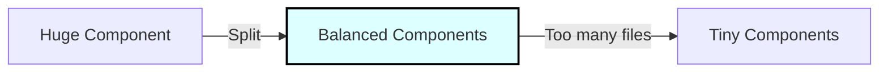
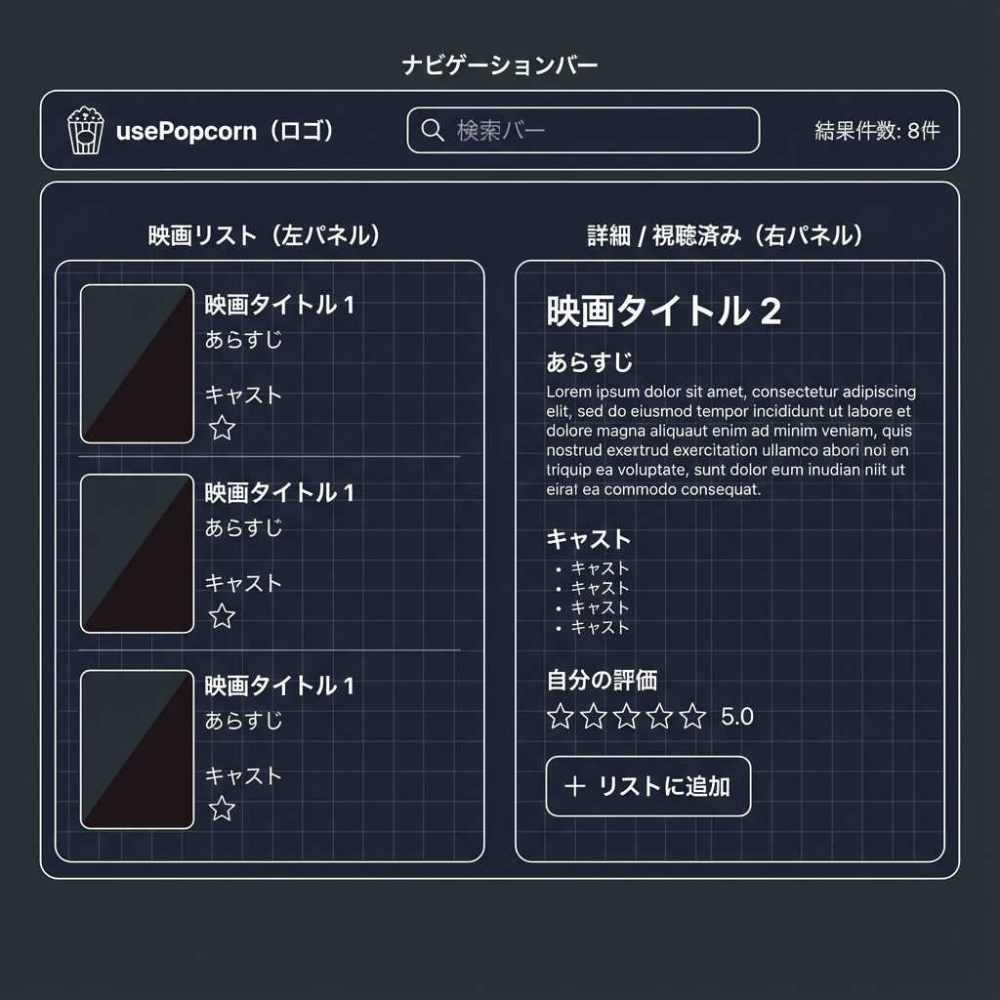

# Session 1: コンポーネント分割とプロジェクトセットアップ

## 学習目標

このセッションでは、React アプリケーション開発における最も重要なスキルの一つ、「コンポーネントの分割」について学びます。
新しいプロジェクト「usePopcorn」を開始し、以下のトピックを習得します：

- **UI をコンポーネントに分割するための 4 つの基準**
- **コンポーネントの適切なサイズと責任範囲**
- **3 つの主要なコンポーネントカテゴリ**
- **巨大なコンポーネントをリファクタリングする実践的な手法**

## プロジェクトの準備：「usePopcorn」

Part 2 へようこそ！ここからは React の仕組みをより深く理解し、実践的なアプリケーション「usePopcorn」を構築していきます。
このアプリは映画の検索、評価、ウォッチリスト管理を行うアプリケーションです。

### 1. プロジェクトの作成

ターミナルを開き、プロジェクトを作成したいディレクトリで以下のコマンドを実行してください。

```bash
npx create-react-app@5 usepopcorn
```

### 2. スターターファイルの適用

プロジェクトの準備ができたら、今回使用するスターターファイルを適用します。
`STEP04_プロジェクト/starter` フォルダにある以下のファイルを、作成したプロジェクトの `src` フォルダにコピー（上書き）してください。

- `App.js`: 初期状態の巨大なコンポーネントが含まれています。
- `index.css`: アプリケーション全体のスタイリングが含まれています。

`index.js` はデフォルトのままで構いませんが、不要なファイル（`App.test.js`, `logo.svg` など）は削除して整理しておくと良いでしょう。

### 3. アプリケーションの確認

```bash
npm start
```

ブラウザでアプリを開いてみましょう。映画データの表示（静的データ）、ウォッチリストの表示などが既に実装されていますが、コードを見ると `App.js` という一つのファイルに全てが詰め込まれていることがわかります。

## コンポーネント分割の理論：UI をどう分割するか？

「いつ新しいコンポーネントを作るべきか？」「コンポーネントはどれくらいの大きさであるべきか？」
これらは React 開発者が常に直面する問いです。

### コンポーネントサイズのバランス

- **巨大すぎるコンポーネント**:
  - 責任が多すぎる（機能が多すぎる）。
  - Props が多すぎて管理が困難。
  - 再利用が難しい。
  - コードが複雑で読みにくい。

- **小さすぎるコンポーネント**:
  - 抽象化されすぎて、全体の流れを追うのが面倒になる。
  - ファイル数が膨大になり、管理コストが増える。

目指すべきは、この両極端の中間にある「バランスの取れたコンポーネント」です。



### 分割のための 4 つの基準

コンポーネントを分割するタイミングを見極めるための、4 つの指針を紹介します

1.  **論理的な分割 (Logical Separation)**
    - UI の特定の区画や、機能的にまとまっている部分（例: ヘッダー、サイドバー、リスト表示エリア）は、別のコンポーネントにする良い候補です。
    - 「このコードとこのコードは関係ないな」と感じたら、分けるタイミングです。

2.  **再利用性 (Reusability)**
    - UI の一部を他の場所でも使いたい場合、それは間違いなく新しいコンポーネントにすべきです（例: ボタン、星評価、汎用的なカード表示）。

3.  **責任と複雑さ (Responsibilities & Complexity)**
    - コンポーネントが「あれもこれも」やっていて、ステートや副作用（Effect）がたくさんある場合、それは責任を持ちすぎています。
    - 1 つのコンポーネントには 1 つの明確な役割を持たせる（単一責任の原則）のが理想です。

4.  **コーディングスタイル (Personal Coding Style)**
    - 最後に、あなた自身が開発しやすいと感じる粒度も重要です。
    - 小さい関数を組み合わせて書くのが好きか、ある程度まとまっている方が好きか。チームの規約にもよりますが、個人の生産性も無視できない要素です。

### 実践的な分割フレームワーク

迷ったときは、以下の手順で進めると良いでしょう。

1. **まずは大きめに作る**: 最初から細かく分割しすぎず、必要な機能を実装します。
2. **必要になったら分割する**: コードが長くなったり、再利用したくなったり、複雑になってきたら分割します。

## コンポーネントのカテゴリ

多くの React アプリケーションでは、コンポーネントは自然と以下の 3 つのカテゴリに分類されます。

1.  **ステートレス / プレゼンテーションコンポーネント (Stateless / Presentational)**
    - **特徴**: 状態（State）を持たない。Props を受け取って UI を表示するだけ。
    - **例**: Logo、Movie（個々の映画表示）、NumResults（結果件数表示）。
    - **役割**: 純粋にデータを表示することに集中する。再利用性が高いことが多い。

2.  **ステートフルコンポーネント (Stateful)**
    - **特徴**: 状態（State）を持つ。
    - **例**: Search（入力状態を持つ）、StarRating（評価状態を持つ）。
    - **役割**: ユーザーの操作やデータの変化を管理する。これらも再利用可能になり得ます。

3.  **構造コンポーネント (Structural)**
    - **特徴**: ページ全体のレイアウトや、大きな区画（スクリーン）を定義する。
    - **例**: Page, App, Main, Navbar。
    - **役割**: 他のコンポーネントを配置し、構成する「枠組み」を提供する。アプリ特有の構造であることが多く、再利用性は低い傾向にあります。

## 実践演習：コンポーネントのリファクタリング

さあ、理論を実践に移しましょう。手元の `App.js` は現在、すべての機能が 1 つのコンポーネントに含まれています。これを論理的な部分に分割してください。

### 目標とする構造

`App` コンポーネントの中に、以下のようなコンポーネント構造を作ってみましょう。



<br>

コンポーネントツリー全体像は以下の通りです。

-   `NavBar`: 上部のナビゲーションバー全体
    -   `Logo`: アプリのロゴ
    -   `Search`: 検索バー
    -   `NumResults`: 検索結果の件数表示
-   `Main`: アプリのメインエリア
    -   `ListBox`: 左側の映画リスト表示ボックス
        -   `MovieList`: 映画のリスト（`Movie` コンポーネントを使う）
            -   `Movie`: 個々の映画アイテム
    -   `WatchedBox`: 右側のウォッチリスト表示ボックス
        -   `WatchedSummary`: 統計情報のサマリー
        -   `WatchedMovieList`: ウォッチリスト（`WatchedMovie` コンポーネントを使う）
            -   `WatchedMovie`: 個々のウォッチリストアイテム

### 手順

1.  `App` コンポーネント内の JSX を確認し、上記の各部分に該当するコードブロックを特定します。
2.  新しい関数コンポーネント（例: `function NavBar() { ... }`）を `App.js` 内に作成します（学習のため、まずは同一ファイル内で構いません）。
3.  特定した JSX を新しいコンポーネントに移動します。
4.  必要なデータ（映画データなど）を **Props** として親から子へ渡します。

> **注意**: コンポーネントの中に別のコンポーネントを定義してはいけません（ネストした定義）。必ず `App` コンポーネントの外側（同一ファイル内の並列）に定義してください。

このリファクタリングを行うことで、コードの見通しが劇的に良くなり、各パーツの再利用やメンテナンスが容易になります。次のセッションでは、この分割したコンポーネントをさらに効率的に扱うための「コンポーネントの合成（Composition）」について学びます。

<br>
<br>
<br>

## 解答例：リファクタリング後の構成

作業に迷った場合は、以下の構成を参考にしてください。現時点では「Prop Drilling」の状態（Propsをバケツリレーしている状態）で正解です。

```jsx
// App.js の構造例

export default function App() {
  const [movies, setMovies] = useState(tempMovieData);
  const [watched, setWatched] = useState(tempWatchedData);

  return (
    <>
      <NavBar movies={movies} />
      <Main movies={movies} watched={watched} />
    </>
  );
}

function NavBar({ movies }) {
  return (
    <nav className="nav-bar">
      <Logo />
      <Search />
      <NumResults movies={movies} />
    </nav>
  );
}

function Main({ movies, watched }) {
  return (
    <main className="main">
      <ListBox movies={movies} />
      <WatchedBox watched={watched} />
    </main>
  );
}

// ... その他のコンポーネント (Logo, Search, NumResults, ListBox, MovieList, WatchedBox, WatchedSummary, WatchedMoviesList)
// これらも関数コンポーネントとして定義し、必要なPropsを受け取ります。
```

