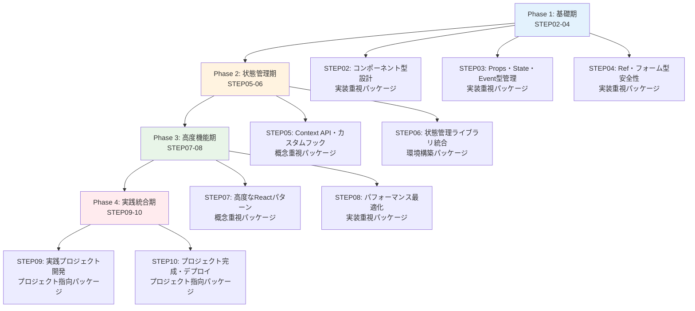
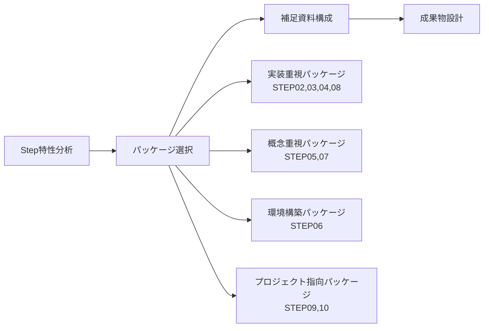
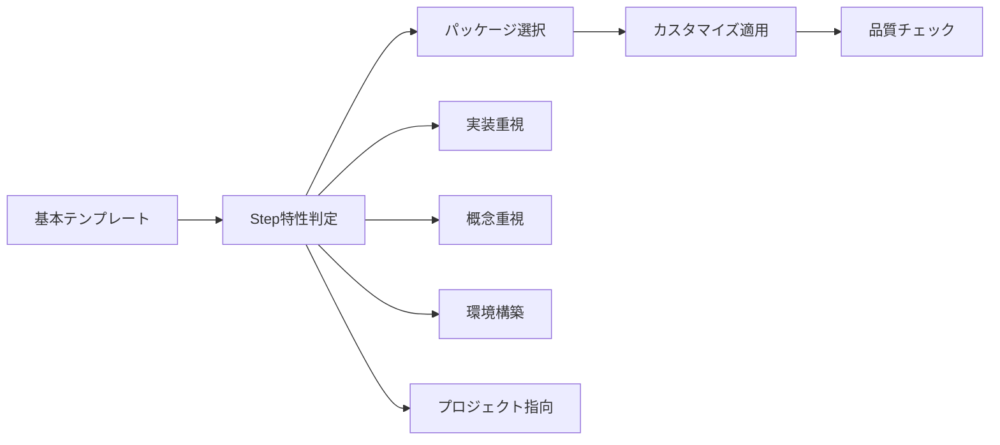

# STEP02以降作成プロンプト - Phase2 TypeScript×React完全習得

> 🐰 **このプロンプトについて**: STEP01の成功パターンを分析し、STEP02-10を同等レベルまで充実化するための包括的な作業指示書です。段階的実装アプローチを採用し、各Stepの特性に応じた最適な構成を実現します。

## 📖 目次

- [プロジェクト概要](#プロジェクト概要)
- [STEP01成功パターン分析](#step01成功パターン分析)
- [段階的実装計画](#段階的実装計画)
- [Step特性別カスタマイズガイド](#step特性別カスタマイズガイド)
- [包括的テンプレート集](#包括的テンプレート集)
- [品質保証チェックリスト](#品質保証チェックリスト)
- [実装効率化ツール](#実装効率化ツール)

---

## プロジェクト概要

### 🎯 目標

**Phase2のSTEP02-10（9つのStep）を段階的にSTEP01と同等レベルまで充実化する**

- 各Stepの特性に応じた最適な構成の実現
- 学習者にとって価値の高い補足資料の提供
- 一貫性のある学習体験の構築
- TypeScript上級者向けReact初心者への最適化

### 📊 実装アプローチ

**段階的実装**: 基礎期→状態管理期→高度機能期→実践統合期



---

## STEP01成功パターン分析

### ✅ STEP01で実現した成果

#### 1. メインファイルの充実化（1,672行）
- **補足資料リンク**: 6つの補足資料への明確な導線
- **段階的学習構造**: Phase 1-5、Step 0-7の体系的な構成
- **詳細解説**: 💡なぜ重要か、🎯どういう場面で使うか、📝コードの詳細解説
- **TypeScript上級者向け配慮**: React特有の型システムに特化した解説

#### 2. 包括的補足資料システム（6ファイル、合計2,587行）
- **📖 専門用語集**（485行）: JSX型システム、Props型定義パターン等
- **🛠️ 開発環境ガイド**（516行）: React 19 + TypeScript環境構築
- **⚙️ 設定ファイル解説**（318行）: tsconfig.json、vite.config.ts等
- **💻 実践コード例**（434行）: 段階的なコンポーネント作成例集
- **🚨 トラブルシューティング**（516行）: よくあるエラーと解決方法
- **📚 参考リソース**（318行）: 学習に役立つリンク集

#### 3. 実践重視の成果物設計
- **具体的課題**: ソーシャルメディア風プロフィールアプリ
- **段階的実装手順**: Phase 1-3、40分の時間配分
- **明確な評価基準**: 技術要件、機能要件、Reactパターン要件
- **完成例提供**: LikeButton.tsx、CommentForm.tsx

### 📈 成功要因

1. **詳細解説**: 「なぜ重要か」「どういう場面で使うか」の明確化
2. **実践重視**: 動作するコード例の豊富な提供（30-50個）
3. **問題解決**: よくあるエラーと解決方法の網羅
4. **継続支援**: 参考リソースによる長期学習サポート
5. **型安全性**: TypeScript上級者向けの高度な型活用

---

## 段階的実装計画

### Phase 1: 基礎期（STEP02-04）

#### 🎯 実装優先順位
1. **STEP02**: コンポーネント型設計（最重要）
2. **STEP03**: Props・State・Event型管理
3. **STEP04**: Ref・フォーム型安全性

#### 📋 共通実装要素
- メインファイル拡充（補足資料リンク、詳細解説）
- 6つの補足資料作成（各400-500行）
- 実践的成果物設計
- STEP01との一貫性確保

#### 🔧 特化要素
- **STEP02**: Generic Components、Props型設計、Component Composition
- **STEP03**: useState/useEffect型活用、Event Handler型安全性
- **STEP04**: useRef型安全活用、フォーム処理型管理

### Phase 2: 状態管理期（STEP05-06）

#### 🎯 実装優先順位
1. **STEP05**: Context API・カスタムフック（概念重要）
2. **STEP06**: 状態管理ライブラリ統合（環境重要）

#### 🔧 特化要素
- **STEP05**: Context型安全実装、カスタムフック設計パターン
- **STEP06**: Zustand、TanStack Query統合、非同期状態管理

### Phase 3: 高度機能期（STEP07-08）

#### 🎯 実装優先順位
1. **STEP07**: 高度なReactパターン（理論重要）
2. **STEP08**: パフォーマンス最適化（実装重要）

#### 🔧 特化要素
- **STEP07**: HOC、Render Props、Compound Components
- **STEP08**: React.memo、useMemo、useCallback、仮想化

### Phase 4: 実践統合期（STEP09-10）

#### 🎯 実装優先順位
1. **STEP09**: 実践プロジェクト開発
2. **STEP10**: プロジェクト完成・デプロイ

#### 🔧 特化要素
- **STEP09**: タスク管理アプリ設計、認証システム実装
- **STEP10**: CI/CD構築、デプロイ、ポートフォリオ作成

---

## Step特性別カスタマイズガイド

### 🧩 パッケージ分類システム



### A. 実装重視パッケージ（STEP02, 03, 04, 08）

#### 重点領域
- 実践コード例の充実（Level 1-4の段階的実装）
- トラブルシューティングの詳細化
- 型安全なパターン集の提供

#### 補足資料構成
- ✅ **実践コード例**（500行）: 段階的実装、実用コンポーネント
- ✅ **トラブルシューティング**（500行）: エラーパターン、解決方法
- ✅ **専門用語集**（400行）: 実装関連用語
- 📚 **参考リソース**（300行）: 実装パターン、ライブラリ
- 🛠️ **開発環境ガイド**（300行）: 開発ツール設定
- ⚙️ **設定ファイル解説**（300行）: TypeScript設定

### B. 概念重視パッケージ（STEP05, 07）

#### 重点領域
- 専門用語集の詳細化
- 理論的背景の解説
- 設計パターンの体系化

#### 補足資料構成
- ✅ **専門用語集**（500行）: 概念詳細解説、関係性
- ✅ **参考リソース**（500行）: 理論資料、設計パターン
- ✅ **実践コード例**（400行）: パターン実装例
- 🚨 **トラブルシューティング**（300行）: 概念理解の問題
- 🛠️ **開発環境ガイド**（300行）: 開発効率化
- ⚙️ **設定ファイル解説**（300行）: 高度設定

### C. 環境構築パッケージ（STEP06）

#### 重点領域
- 開発環境ガイドの詳細化
- 設定ファイル解説の充実
- ツール連携方法の解説

#### 補足資料構成
- ✅ **開発環境ガイド**（500行）: 環境構築、ツール設定
- ✅ **設定ファイル解説**（500行）: 詳細設定、カスタマイズ
- ✅ **実践コード例**（400行）: ライブラリ統合実装
- 🚨 **トラブルシューティング**（400行）: 環境問題解決
- 📖 **専門用語集**（300行）: 環境・ツール用語
- 📚 **参考リソース**（300行）: 公式ドキュメント

### D. プロジェクト指向パッケージ（STEP09, 10）

#### 重点領域
- プロジェクト実装例の提供
- 開発プロセスの解説
- 運用考慮事項の説明

#### 補足資料構成
- ✅ **実践コード例**（500行）: プロジェクト実装例
- ✅ **開発環境ガイド**（500行）: プロジェクト環境構築
- ✅ **設定ファイル解説**（400行）: プロジェクト設定
- 🚨 **トラブルシューティング**（400行）: 開発・デプロイ問題
- 📖 **専門用語集**（300行）: プロジェクト開発用語
- 📚 **参考リソース**（300行）: プロジェクト管理ツール

---

## 包括的テンプレート集

### 🎨 メインファイル拡充テンプレート

#### 1. 補足資料リンクセクション
```markdown
> 💡 **補足資料**: 詳細な解説は以下の補足資料を見てね 🐰
>
> - 📖 [専門用語集](./Step0X_補足_専門用語集.md) - [Step特有の概念]と用語の詳細解説
> - 🛠️ [開発環境ガイド](./Step0X_補足_開発環境ガイド.md) - [Step特有の環境]構築と設定方法
> - ⚙️ [設定ファイル解説](./Step0X_補足_設定ファイル解説.md) - [Step特有の設定]ファイルの詳細解説
> - 💻 [実践コード例](./Step0X_補足_実践コード例.md) - [Step特有の実装]の段階的学習用コード集
> - 🚨 [トラブルシューティング](./Step0X_補足_トラブルシューティング.md) - [Step特有の問題]のエラーと解決方法
> - 📚 [参考リソース](./Step0X_補足_参考リソース.md) - [Step特有の学習]に役立つリンク集
```

#### 2. 詳細解説強化テンプレート
```markdown
### [概念名]

**💡 なぜこの概念が重要なのか**
[重要性と背景の説明]
- TypeScript上級者にとっての価値
- React開発での必要性
- 実際の開発現場での活用場面

**🎯 どういう場面で使うのか**
[具体的な使用場面とシナリオ]
- 典型的な使用パターン
- 問題解決のアプローチ
- 実際のプロジェクトでの適用例

**📝 コードの詳細解説**
[実装の詳細と注意点]
```typescript
// 段階的なコード例
// Level 1: 基本実装
// Level 2: 型安全な実装
// Level 3: 実用的な実装
// Level 4: 高度な実装
```

**⚠️ よくある間違いと注意点**
[典型的なエラーパターンと対策]
- 初心者がハマりやすいポイント
- TypeScriptエラーの解決方法
- パフォーマンス上の注意点

**🚀 TypeScript での改善点**
[型安全性による向上点]
- 従来のJavaScriptとの比較
- 型システムによる恩恵
- 開発効率の向上

> 💡 **詳細解説**: [概念名]の詳細は [Step0X_補足_専門用語集.md#概念名](./Step0X_補足_専門用語集.md#概念名) を見てね 🐰
```

### 📚 補足資料テンプレート集

#### 1. 専門用語集テンプレート
```markdown
# Step0X_補足_専門用語集.md

# Step X: [タイトル] - 専門用語集

> 🐰 **このファイルについて**: [Step特有の領域] で重要な概念と用語を初心者にもわかりやすく解説します。

## 📖 目次

- [重要概念1](#重要概念1)
- [重要概念2](#重要概念2)
- [重要概念3](#重要概念3)
- [重要概念4](#重要概念4)
- [重要概念5](#重要概念5)

---

## [重要概念1]

### [具体的な用語・概念]

**定義**: [明確で簡潔な定義]

**特徴**:
- [特徴1]
- [特徴2]
- [特徴3]

**TypeScript での型定義**:
```typescript
// 型定義例
```

**使用例**:
```typescript
// 実際の使用例
```

**いつ使うか**:
- [使用場面1]
- [使用場面2]
- [使用場面3]

**関連概念**:
- [関連概念1]: [関係性の説明]
- [関連概念2]: [関係性の説明]

**よくある間違い**:
```typescript
// ❌ 間違った使用例
// ✅ 正しい使用例
```

---

[目標行数: 400-500行]
```

#### 2. 実践コード例テンプレート
```markdown
# Step0X_補足_実践コード例.md

# Step X: [タイトル] - 実践コード例

> 🐰 **このファイルについて**: [Step特有の実装] を段階的に学習できる実用的なコード例集です。

## 📖 目次

- [Level 1: 基本実装](#level-1-基本実装)
- [Level 2: 型安全な実装](#level-2-型安全な実装)
- [Level 3: 実用的な実装](#level-3-実用的な実装)
- [Level 4: 高度な実装](#level-4-高度な実装)
- [実際のプロジェクトでの活用例](#実際のプロジェクトでの活用例)

---

## Level 1: 基本実装

### [基本的な実装例1]

**学習目標**: [何を学ぶか]

**実装例**:
```typescript
// 基本的な実装
```

**解説**:
- [ポイント1]
- [ポイント2]
- [ポイント3]

**次のステップ**: Level 2で型安全性を向上させます

---

## Level 2: 型安全な実装

### [型安全な実装例1]

**学習目標**: [型安全性の向上点]

**実装例**:
```typescript
// 型安全な実装
```

**改善点**:
- [改善点1]
- [改善点2]
- [改善点3]

**TypeScript の恩恵**:
- [恩恵1]
- [恩恵2]

---

[目標行数: 400-500行]
```

#### 3. トラブルシューティングテンプレート
```markdown
# Step0X_補足_トラブルシューティング.md

# Step X: [タイトル] - トラブルシューティング

> 🐰 **このファイルについて**: [Step特有の問題] でよくあるエラーと解決方法を網羅的に解説します。

## 📖 目次

- [TypeScript エラー](#typescript-エラー)
- [React エラー](#react-エラー)
- [開発環境の問題](#開発環境の問題)
- [パフォーマンスの問題](#パフォーマンスの問題)
- [予防策とベストプラクティス](#予防策とベストプラクティス)

---

## TypeScript エラー

### エラー1: [具体的なエラーメッセージ]

**症状**:
```
[実際のエラーメッセージ]
```

**原因**:
[エラーの根本原因]

**解決方法**:
```typescript
// ❌ 問題のあるコード
// ✅ 修正されたコード
```

**解説**:
[なぜこの修正で解決するのか]

**予防策**:
- [予防策1]
- [予防策2]

---

[目標行数: 400-500行]
```

### 🎯 成果物設計テンプレート

#### 実践的課題設計フレームワーク
```markdown
# Step0X 成果物：[課題名]

## 🎯 課題の目的

**あなたが作成するもの**: [具体的な成果物]

**なぜ作るのか**: Step0X で学習した [学習内容] を実際のコードに適用し、**[習得すべきスキル]** を身につけるため

**学習目標**:
- [目標1]
- [目標2]
- [目標3]
- [目標4]

## 📋 必須提出物

以下の [数] つのファイルを提出してください：

```
📁 提出物/
├── [ファイル1].tsx      # [説明]（必須）
└── [ファイル2].tsx     # [説明]（必須）
```

## ⏰ 作成手順（推奨時間配分：合計 [時間] 分）

### Phase 1: [フェーズ名]（[時間] 分）
[詳細な手順]

### Phase 2: [フェーズ名]（[時間] 分）
[詳細な手順]

### Phase 3: [フェーズ名]（[時間] 分）
[詳細な手順]

## ✅ 最低合格要件

### 🔧 技術要件
- [ ] [要件1]
- [ ] [要件2]
- [ ] [要件3]

### 🎯 機能要件
- [ ] [要件1]
- [ ] [要件2]
- [ ] [要件3]

### 💭 [Step特有] パターン要件
- [ ] [要件1]
- [ ] [要件2]
- [ ] [要件3]

## 📊 評価基準

| 項目 | 配点 | 評価ポイント |
|------|------|-------------|
| **[評価軸1]** | 40点 | [詳細] |
| **[評価軸2]** | 35点 | [詳細] |
| **[評価軸3]** | 25点 | [詳細] |

**合格ライン**: 70点以上
```

---

## 品質保証チェックリスト

### 📋 STEP01準拠チェックリスト

#### ✅ メインファイル要件
- [ ] **補足資料リンク**: 6つの補足資料への明確なリンク追加済み
- [ ] **詳細解説**: 💡🎯📝⚠️🚀の5つの観点で解説追加済み
- [ ] **段階的学習構造**: Phase/Step構造で体系化済み
- [ ] **TypeScript上級者向け配慮**: React特有の型システム解説済み
- [ ] **実践重視**: 動作するコード例を豊富に提供済み

#### ✅ 補足資料要件
- [ ] **専門用語集**: 400-500行、Step特有の重要概念5-10個解説済み
- [ ] **実践コード例**: 400-500行、Level 1-4の段階的実装例済み
- [ ] **トラブルシューティング**: 400-500行、よくあるエラーと解決方法済み
- [ ] **開発環境ガイド**: 400-500行、環境構築と設定方法済み
- [ ] **設定ファイル解説**: 300-400行、設定ファイルの詳細解説済み
- [ ] **参考リソース**: 300-400行、学習リソースとリンク集済み

#### ✅ 成果物要件
- [ ] **実践的課題**: Step学習内容を活用した具体的な課題設計済み
- [ ] **段階的実装手順**: Phase分割された明確な作業手順済み
- [ ] **明確な評価基準**: 技術・機能・パターンの3軸評価済み
- [ ] **完成例提供**: 実装に困った場合の参考例提供済み

### 🔍 一貫性チェックリスト

#### ファイル命名規則
```
Step0X_[メインタイトル].md
Step0X_補足_専門用語集.md
Step0X_補足_開発環境ガイド.md
Step0X_補足_設定ファイル解説.md
Step0X_補足_実践コード例.md
Step0X_補足_トラブルシューティング.md
Step0X_補足_参考リソース.md
Step0X_成果物.md
```

#### 表記統一
- **絵文字**: 💡🎯📝⚠️🚀🐰 の統一使用
- **見出し構造**: ## ### #### の階層統一
- **リンク形式**: `[テキスト](./ファイル名.md#セクション)` 形式統一
- **コードブロック**: ```typescript ``` の言語指定統一

#### 品質レベル統一
- **各補足資料**: 300-500行の目標行数
- **コード例**: 動作確認済みの実用的な例
- **解説**: 初心者にも理解できる丁寧な説明

---

## 実装効率化ツール

### 🚀 作業効率化戦略

#### 1. テンプレート活用システム


#### 2. モジュラー式構築
- **基本モジュール**: 全Step共通の必須要素
- **選択モジュール**: Step特性に応じた追加要素
- **カスタマイズモジュール**: 個別Step固有要素

#### 3. 品質保証自動化
- **チェックリスト**: 各段階での品質確認
- **テンプレート**: 一貫性のある構造保証
- **レビューポイント**: STEP01との整合性確認

### 📊 進捗管理システム

#### Phase別進捗トラッキング
```markdown
## Phase 1: 基礎期（STEP02-04）進捗

### STEP02: コンポーネント型設計
- [ ] メインファイル拡充完了
- [ ] 専門用語集作成完了
- [ ] 実践コード例作成完了
- [ ] トラブルシューティング作成完了
- [ ] 開発環境ガイド作成完了
- [ ] 設定ファイル解説作成完了
- [ ] 参考リソース作成完了
- [ ] 成果物設計完了
- [ ] 品質チェック完了

### STEP03: Props・State・Event型管理
- [ ] [同様のチェックリスト]

### STEP04: Ref・フォーム型安全性
- [ ] [同様のチェックリスト]
```

### 🔧 実装支援ツール

#### 1. 自動生成スクリプト（概念）
```bash
# Step基本構造生成
generate-step-structure.sh STEP02 "コンポーネント型設計" "実装重視"

# 補足資料テンプレート生成
generate-supplement.sh STEP02 "専門用語集" 500

# 品質チェック実行
quality-check.sh STEP02
```

#### 2. 一貫性チェックツール（概念）
```bash
# ファイル命名規則チェック
check-naming-convention.sh Phase2/

# 表記統一チェック
check-notation-consistency.sh STEP02

# リンク整合性チェック
check-link-integrity.sh Phase2/
```

---

## 実装開始ガイド

### 🎯 Phase 1: 基礎期（STEP02-04）から開始

#### 推奨実装順序
1. **STEP02**: コンポーネント型設計（最重要・最優先）
2. **STEP03**: Props・State・Event型管理
3. **STEP04**: Ref・フォーム型安全性

#### 各Stepの実装手順
1. **Step特性分析**: 実装重視/概念重視/環境構築/プ