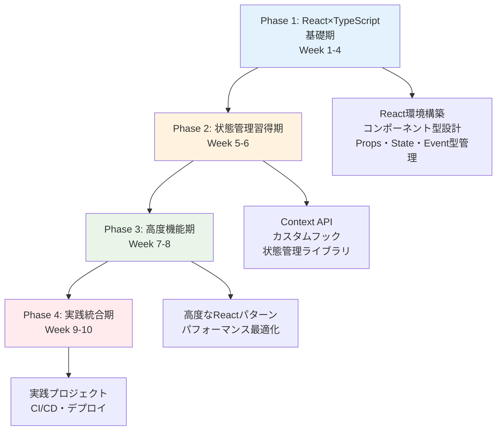

# TypeScript×React完全学習プラン（TypeScript経験者対応版）

## 🎯 学習プラン概要

### 対象者
- **TypeScript基礎習得済み**（Phase1完了者）
- React初心者〜中級者
- 型安全なフロントエンド開発を習得したい方

### 学習期間・時間
- **期間**: 10週間（2.5ヶ月）
- **総学習時間**: 120時間（週12時間）
- **学習スタイル**: 理論20% + 実践コード50% + 演習30%

### 最終到達目標
- TypeScript×Reactの完全統合理解
- 型安全なコンポーネント設計スキル
- 実用的なWebアプリケーション開発能力
- プロダクションレベルの品質管理

## 📚 学習フェーズ構成



## 📅 週次学習スケジュール

| Week | フェーズ | 学習内容 | 主要トピック | 成果物 |
|------|---------|----------|-------------|--------|
| **1** | React×TypeScript基礎期 | React基礎とTypeScript統合 | 環境構築、JSX型、基本コンポーネント | 開発環境、基本アプリ |
| **2** | React×TypeScript基礎期 | コンポーネント型設計 | Props型、Generic Components | 型安全コンポーネント集 |
| **3** | React×TypeScript基礎期 | Props・State・Event型管理 | useState、useEffect、イベント型 | 状態管理アプリ |
| **4** | React×TypeScript基礎期 | Ref・フォーム型安全性 | useRef、フォーム処理、バリデーション | フォームライブラリ |
| **5** | 状態管理習得期 | Context API・カスタムフック | Context型、カスタムフック設計 | 状態管理システム |
| **6** | 状態管理習得期 | 状態管理ライブラリ統合 | Zustand、TanStack Query | データフェッチアプリ |
| **7** | 高度機能期 | 高度なReactパターン | HOC、Render Props、Compound Components | パターンライブラリ |
| **8** | 高度機能期 | パフォーマンス最適化 | メモ化、仮想化、コード分割 | 最適化実装例 |
| **9** | 実践統合期 | 実践プロジェクト開発 | タスク管理アプリ開発 | フルスタックアプリ |
| **10** | 実践統合期 | プロジェクト完成・デプロイ | CI/CD、デプロイ、ポートフォリオ | 完成ポートフォリオ |

## 🔧 TypeScript経験者向け特別配慮

### React特有の型システム
各週で以下のReact型システムを重点学習：
- **JSX.Element vs ReactNode vs ReactElement**: 戻り値型の使い分け
- **Component Props の型設計**: interface vs type、継承パターン
- **Event Handler の型安全性**: 各種イベント型の活用
- **Ref の型管理**: useRefとforwardRefの型安全な実装

### 実践重視のアプローチ
- **理論説明**: 20%（React概念の理解）
- **実際のコード例**: 50%（豊富な実装例）
- **実践演習**: 30%（手を動かす学習）

### 段階的複雑化
```typescript
// Week 1: 基本
function Welcome({ name }: { name: string }): JSX.Element {
  return <h1>Hello, {name}!</h1>;
}

// Week 4: 中級
interface FormProps<T> {
  initialValues: T;
  onSubmit: (values: T) => void;
  validationSchema?: ValidationSchema<T>;
}

// Week 7: 応用
function withAuth<P extends object>(
  Component: ComponentType<P>
): ComponentType<Omit<P, 'user'>> {
  // HOC実装
}

// Week 10: 高度
type DeepReadonly<T> = {
  readonly [P in keyof T]: T[P] extends object ? DeepReadonly<T[P]> : T[P];
};
```

## 📊 学習成果評価システム

### 週次評価基準
各週で以下の項目を評価：
- **理解度**: React概念の理解（25%）
- **実装力**: コンポーネントを書く能力（35%）
- **型設計力**: 型安全な設計能力（25%）
- **問題解決力**: エラーや課題を解決する能力（15%）

### 成果物チェックリスト
- [ ] **Week 1-4**: 型安全なReactコンポーネントライブラリ
- [ ] **Week 5-6**: 状態管理システムとデータフェッチアプリ
- [ ] **Week 7-8**: 高度なパターンとパフォーマンス最適化例
- [ ] **Week 9-10**: フルスタックタスク管理アプリケーション

### 最終認定要件
- 全週の課題完了率 80% 以上
- 実践プロジェクト完成
- ポートフォリオサイト完成
- TypeScript×React Expert基礎レベル認定

## 🛠️ 学習環境・ツール

### 必須環境
```bash
# Node.js (LTS版)
node --version  # v20.x.x以上

# React 19 + TypeScript
npm create vite@latest my-react-app -- --template react-ts
cd my-react-app
npm install

# TypeScript設定確認
tsc --version   # 5.x.x以上
```

### 推奨ツール
- **Vite**: 高速開発環境
- **React DevTools**: デバッグツール
- **ESLint + Prettier**: コード品質管理
- **Vitest**: テストフレームワーク
- **Storybook**: コンポーネント開発

### 学習リソース
- **React公式ドキュメント**: [React.dev](https://react.dev/)
- **TypeScript Handbook**: [TypeScript公式](https://www.typescriptlang.org/docs/)
- **React TypeScript Cheatsheet**: [実践的パターン集](https://react-typescript-cheatsheet.netlify.app/)

## 📝 各週の詳細プラン

### Phase 1: React×TypeScript基礎期（Week 1-4）

#### [Week 1: React基礎とTypeScript統合](./Week01_React基礎とTypeScript統合.md)
- React 19 + TypeScript環境構築
- JSXの型システム理解
- 基本コンポーネントの型設計
- 開発ツールの設定

#### [Week 2: コンポーネント型設計](./Week02_コンポーネント型設計.md)
- Props型の設計パターン
- Generic Componentsの実装
- Component Compositionの型安全性
- 再利用可能コンポーネント設計

#### [Week 3: Props・State・Event型管理](./Week03_Props・State・Event型管理.md)
- useState/useEffectの型活用
- Event Handlerの型安全性
- 条件付きレンダリングの型管理
- State更新パターン

#### [Week 4: Ref・フォーム型安全性](./Week04_Ref・フォーム型安全性.md)
- useRefの型安全な活用
- フォーム処理の型管理
- バリデーションシステム
- Controlled/Uncontrolled Components

### Phase 2: 状態管理習得期（Week 5-6）

#### [Week 5: Context API・カスタムフック](./Week05_Context API・カスタムフック.md)
- Context APIの型安全な実装
- カスタムフックの設計パターン
- 状態ロジックの抽象化
- Provider パターン

#### [Week 6: 状態管理ライブラリ統合](./Week06_状態管理ライブラリ統合.md)
- Zustandの型安全な活用
- TanStack Queryとの統合
- 非同期状態管理
- キャッシュ戦略

### Phase 3: 高度機能期（Week 7-8）

#### [Week 7: 高度なReactパターン](./Week07_高度なReactパターン.md)
- Higher-Order Components (HOC)
- Render Props パターン
- Compound Components
- パターンの使い分け

#### [Week 8: パフォーマンス最適化](./Week08_パフォーマンス最適化.md)
- React.memo、useMemo、useCallback
- 仮想化とレイジーローディング
- コード分割とSuspense
- パフォーマンス測定

### Phase 4: 実践統合期（Week 9-10）

#### [Week 9: 実践プロジェクト開発](./Week09_実践プロジェクト開発.md)
- タスク管理アプリケーション設計
- 認証システムの実装
- リアルタイム機能の追加
- データベース統合

#### [Week 10: プロジェクト完成・デプロイ](./Week10_プロジェクト完成・デプロイ.md)
- アプリケーション完成
- テスト実装
- CI/CD パイプライン構築
- デプロイとポートフォリオ作成

## 🚀 学習継続・発展計画

### Phase 3 への準備
このプラン完了後は、以下のステップに進むことができます：
- **TypeScript設計手法**: 大規模アプリケーション設計
- **アーキテクチャパターン**: Clean Architecture、DDD
- **チーム開発**: コードレビュー、品質管理
- **OSS貢献**: React/TypeScriptエコシステムへの貢献

### 継続学習リソース
- **Weekly Practice**: 毎週の新機能実装
- **Community Contribution**: OSS プロジェクトへの貢献
- **Technical Writing**: 学習内容のブログ記事化
- **Mentoring**: 他の学習者のサポート

## 📞 サポート・質問

### 学習サポート
- **GitHub Discussions**: リアルタイム質問・議論
- **Weekly Review**: 進捗確認とフィードバック
- **Code Review**: コード品質向上

### よくある質問
1. **Q**: TypeScript基礎が不安な場合は？
   **A**: Phase1の復習を推奨、基礎固めが重要

2. **Q**: React経験がない場合は？
   **A**: Week1で基礎から丁寧に学習、段階的に進行

3. **Q**: 学習時間が確保できない場合は？
   **A**: 週8時間版のプランも用意可能

## 🛠️ 技術スタック詳細

### フロントエンド
- **React**: 19.x（最新安定版）
- **TypeScript**: 5.x
- **ビルドツール**: Vite
- **スタイリング**: Tailwind CSS
- **状態管理**: Zustand + TanStack Query
- **ルーティング**: React Router v7
- **テスト**: Vitest + Testing Library

### 開発ツール
- **ESLint**: コード品質管理
- **Prettier**: コードフォーマット
- **Husky**: Git hooks
- **Storybook**: コンポーネント開発
- **React DevTools**: デバッグ

### デプロイ・CI/CD
- **Vercel**: フロントエンドデプロイ
- **GitHub Actions**: CI/CD パイプライン
- **Docker**: コンテナ化（オプション）

---

**🌟 TypeScript×React Expert への道のりを始めましょう！**

このプランを通じて、TypeScriptとReactを組み合わせた型安全で実用的なWebアプリケーション開発スキルを習得できます。Phase1で培ったTypeScript基礎知識を活かし、Reactの世界で型安全な開発を実践していきましょう。

**📌 重要**: 各週の詳細プランには、豊富な実際のコード例（30-50個）と段階的な実践演習が含まれています。理論だけでなく、手を動かしながら学習することで、確実にスキルを身につけることができます。