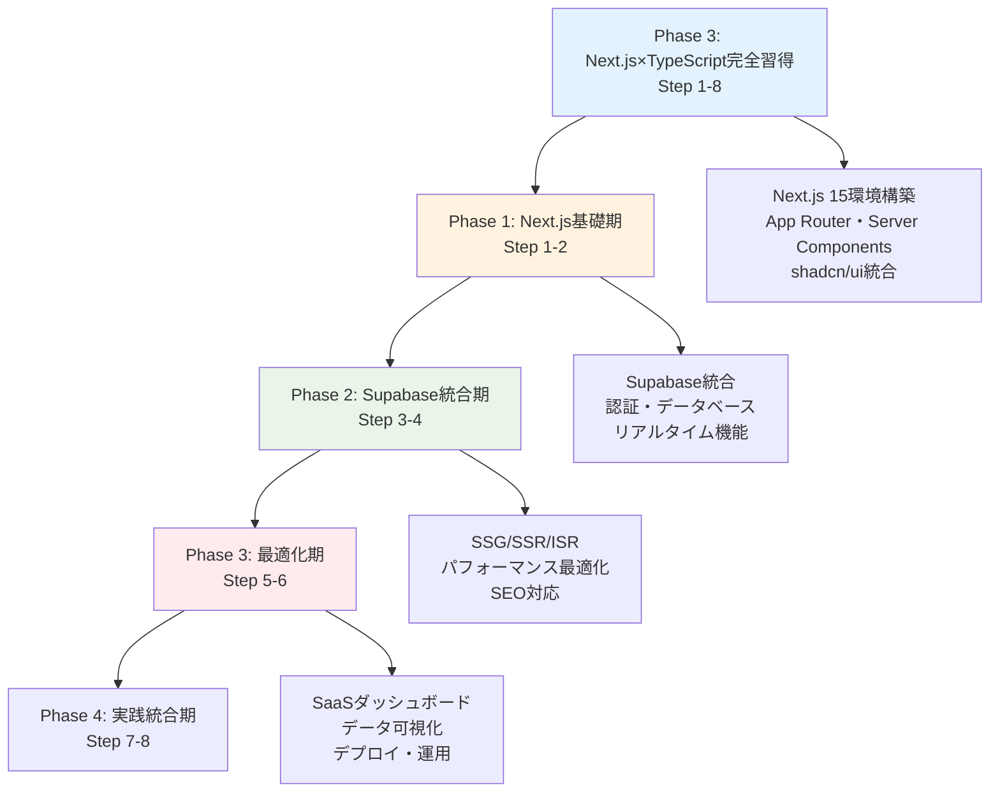

# TypeScript×Next.js完全学習プラン（React経験者対応版）

## 🎯 学習プラン概要

### 対象者
- **TypeScript基礎習得済み**（Phase1完了者）
- **React習得済み**（Phase2完了者）
- Next.jsでフルスタック開発を習得したい方

### 学習期間・時間
- **期間**: 8週間（2ヶ月）
- **総学習時間**: 96時間（週12時間）
- **学習スタイル**: 理論20% + 実践コード50% + 演習30%

### 最終到達目標
- Next.js 15 + TypeScriptの完全統合理解
- モダンフルスタック開発スキル
- Supabase統合によるBaaS活用
- プロダクションレベルのSaaSアプリケーション開発

## 📚 学習フェーズ構成



## 📅 週次学習スケジュール

| Week | フェーズ | 学習内容 | 主要トピック | 成果物 |
|------|---------|----------|-------------|--------|
| **1** | Next.js基礎期 | Next.js環境構築・App Router | Next.js 15、App Router、Server Components | 基本アプリ構築 |
| **2** | Next.js基礎期 | ルーティング・UI構築 | 動的ルーティング、Layouts、shadcn/ui | UIコンポーネント集 |
| **3** | Supabase統合期 | Supabase統合・認証 | Supabase Setup、Auth、Prisma統合 | 認証システム |
| **4** | Supabase統合期 | API Routes・リアルタイム | API Routes、Realtime、Edge Functions | データ管理システム |
| **5** | 最適化期 | レンダリング戦略・SEO | SSG/SSR/ISR、Metadata API、SEO | 最適化実装例 |
| **6** | 最適化期 | パフォーマンス・監視 | Image最適化、Core Web Vitals、分析 | パフォーマンス改善 |
| **7** | 実践統合期 | SaaSダッシュボード開発 | データ可視化、チャート、管理画面 | ダッシュボードアプリ |
| **8** | 実践統合期 | 完成・デプロイ・運用 | Vercel、監視、CI/CD、ポートフォリオ | 完成ポートフォリオ |

## 🔧 React経験者向け特別配慮

### Next.js特有の概念
各週で以下のNext.js特有の概念を重点学習：
- **Server Components vs Client Components**: レンダリング戦略の理解
- **App Router**: ファイルベースルーティングの活用
- **API Routes**: フルスタック開発の実践
- **レンダリング戦略**: SSG/SSR/ISRの使い分け

### 実践重視のアプローチ
- **理論説明**: 20%（Next.js概念の理解）
- **実際のコード例**: 50%（豊富な実装例）
- **実践演習**: 30%（手を動かす学習）

### 段階的複雑化
```typescript
// Step 1: 基本
export default function HomePage(): JSX.Element {
  return <h1>Hello Next.js!</h1>;
}

// Step 3: 中級
interface UserPageProps {
  params: { id: string };
}

export default async function UserPage({ params }: UserPageProps) {
  const user = await getUser(params.id);
  return <UserProfile user={user} />;
}

// Step 5: 応用
export async function generateStaticParams() {
  const users = await getUsers();
  return users.map((user) => ({ id: user.id }));
}

// Step 8: 高度
export const metadata: Metadata = {
  title: 'DataFlow - SaaS Dashboard',
  description: 'Modern SaaS dashboard built with Next.js 15',
  openGraph: {
    title: 'DataFlow Dashboard',
    description: 'Real-time analytics and data visualization',
  },
};
```

## 📊 学習成果評価システム

### 週次評価基準
各週で以下の項目を評価：
- **Next.js理解度**: フレームワーク機能の理解（25%）
- **フルスタック実装力**: API・DB統合能力（35%）
- **最適化スキル**: パフォーマンス・SEO対応（25%）
- **問題解決力**: 実践的な課題解決（15%）

### 成果物チェックリスト
- [ ] **Step 1-2**: Next.js基本アプリとUIコンポーネント集
- [ ] **Step 3-4**: Supabase統合認証・データ管理システム
- [ ] **Step 5-6**: 最適化実装例とパフォーマンス改善
- [ ] **Step 7-8**: SaaSダッシュボード「DataFlow」完成

### 最終認定要件
- 全週の課題完了率 80% 以上
- SaaSダッシュボード完成
- パフォーマンススコア 90+ 達成
- TypeScript×Next.js Expert認定

## 🛠️ 学習環境・ツール

### 必須環境
```bash
# Node.js (LTS版)
node --version  # v20.x.x以上

# Next.js 15 + TypeScript
npx create-next-app@latest my-nextjs-app --typescript --tailwind --eslint --app
cd my-nextjs-app
npm run dev

# TypeScript設定確認
tsc --version   # 5.x.x以上
```

### モダンスタック構成
```typescript
interface TechStack {
  core: {
    framework: 'Next.js 15';
    language: 'TypeScript 5.x';
    runtime: 'Node.js 20+';
  };
  
  frontend: {
    styling: 'Tailwind CSS + shadcn/ui';
    stateManagement: 'Zustand + TanStack Query';
    charts: 'Recharts + Chart.js';
    forms: 'React Hook Form + Zod';
  };
  
  backend: {
    database: 'Supabase PostgreSQL';
    orm: 'Prisma';
    authentication: 'Supabase Auth';
    storage: 'Supabase Storage';
    realtime: 'Supabase Realtime';
  };
  
  deployment: {
    hosting: 'Vercel';
    monitoring: 'Sentry + Vercel Analytics';
    cicd: 'GitHub Actions';
  };
}
```

### 推奨ツール
- **Vercel**: Next.js最適化デプロイ
- **Supabase**: BaaS統合プラットフォーム
- **Prisma Studio**: データベース管理
- **shadcn/ui**: モダンUIコンポーネント
- **React DevTools**: デバッグツール

## 📝 各週の詳細プラン

### Phase 1: Next.js基礎期（Step 1-2）

#### [Step 1: Next.js環境構築・App Router](./Week01_Next.js環境構築・App Router.md)
- Next.js 15 + TypeScript環境構築
- App Routerの理解と活用
- Server Components vs Client Components
- 基本的なページ・レイアウト作成

#### [Step 2: ルーティング・UI構築](./Week02_ルーティング・UI構築.md)
- 動的ルーティングとパラメータ
- Layouts・Templates・Loading UI
- shadcn/ui統合とコンポーネント設計
- フォーム処理とバリデーション

### Phase 2: Supabase統合期（Step 3-4）

#### [Step 3: Supabase統合・認証](./Week03_Supabase統合・認証.md)
- Supabaseプロジェクト設定
- Prisma + Supabase統合
- Supabase Auth実装
- Row Level Security設定

#### [Step 4: API Routes・リアルタイム](./Week04_API Routes・リアルタイム.md)
- API Routes実装
- Supabase Realtime統合
- Edge Functions活用
- ファイルアップロード・ストレージ

### Phase 3: 最適化期（Step 5-6）

#### [Step 5: レンダリング戦略・SEO](./Week05_レンダリング戦略・SEO.md)
- SSG/SSR/ISRの実装
- Metadata API活用
- SEO最適化
- 動的OGP生成

#### [Step 6: パフォーマンス・監視](./Week06_パフォーマンス・監視.md)
- Image最適化とNext.js Image
- Core Web Vitals改善
- バンドル最適化
- 監視・分析システム

### Phase 4: 実践統合期（Step 7-8）

#### [Step 7: SaaSダッシュボード開発](./Week07_SaaSダッシュボード開発.md)
- ダッシュボード設計・実装
- データ可視化（チャート・グラフ）
- リアルタイム更新機能
- 管理画面・ユーザー管理

#### [Step 8: 完成・デプロイ・運用](./Week08_完成・デプロイ・運用.md)
- アプリケーション完成
- Vercelデプロイ最適化
- CI/CD パイプライン構築
- 監視・運用・ポートフォリオ作成

## 🚀 最終成果物: SaaSダッシュボード「DataFlow」

### アプリケーション概要
**DataFlow**は、Next.js 15 + Supabaseで構築される本格的なSaaSダッシュボードアプリケーションです。

### 主要機能
```typescript
interface DataFlowFeatures {
  authentication: {
    providers: ['Email/Password', 'OAuth (Google, GitHub)', 'Magic Links'];
    security: ['Row Level Security', 'JWT Tokens', 'Session Management'];
  };
  
  dashboard: {
    analytics: 'Real-time KPI metrics and charts';
    visualization: 'Interactive data visualization';
    reporting: 'Custom reports and exports';
  };
  
  userManagement: {
    profiles: 'User profiles and preferences';
    roles: 'Role-based access control';
    teams: 'Team management and collaboration';
  };
  
  dataIntegration: {
    apis: 'External API integrations';
    webhooks: 'Real-time data synchronization';
    imports: 'CSV/JSON data imports';
  };
  
  realtime: {
    updates: 'Live data updates';
    notifications: 'Real-time notifications';
    collaboration: 'Multi-user collaboration';
  };
}
```

### 技術的ハイライト
- **型安全性**: TypeScript + Prismaによる完全な型安全性
- **リアルタイム**: Supabase Realtimeによるライブ更新
- **パフォーマンス**: SSG/SSR/ISRの最適な使い分け
- **スケーラビリティ**: Supabaseによるサーバーレス構成
- **モダンUI**: shadcn/ui + Tailwind CSSによる美しいUI

## 🔄 Phase2からの発展

### React知識の活用
```typescript
// Phase2で学んだスキルの発展
interface Phase2ToPhase3Evolution {
  reactSkills: {
    components: 'React Components → Server/Client Components';
    stateManagement: 'Zustand → Zustand + Server State';
    routing: 'React Router → Next.js App Router';
    optimization: 'Manual → Built-in + Manual';
  };
  
  newSkills: {
    serverSide: 'Server Components + API Routes';
    rendering: 'SSG/SSR/ISR strategies';
    fullStack: 'Database + Authentication + Storage';
    deployment: 'Vercel + Edge Functions';
    baas: 'Backend as a Service integration';
  };
}
```

### 学習の連続性
- **Phase1**: TypeScript基礎 → **Phase2**: React習得 → **Phase3**: Next.jsフルスタック
- 既習知識を最大限活用しながら、新しい概念を段階的に学習
- 実践的なプロジェクトを通じて、統合的なスキルを習得

## 🚀 学習継続・発展計画

### Phase 4 への準備
このプラン完了後は、以下のステップに進むことができます：
- **TypeScript設計手法**: エンタープライズレベルの設計パターン
- **マイクロサービス**: Next.js + tRPCによる分散システム
- **DevOps**: Docker + Kubernetes + CI/CD
- **OSS貢献**: Next.js/Supabaseエコシステムへの貢献

### 継続学習リソース
- **Weekly Practice**: 毎週の新機能実装
- **Community Contribution**: Next.js/Supabase コミュニティ参加
- **Technical Writing**: 学習内容のブログ記事化
- **Mentoring**: 他の学習者のサポート

## 📞 サポート・質問

### 学習サポート
- **GitHub Discussions**: リアルタイム質問・議論
- **Weekly Review**: 進捗確認とフィードバック
- **Code Review**: コード品質向上

### よくある質問
1. **Q**: React経験が浅い場合は？
   **A**: Phase2の復習を推奨、React基礎の確実な理解が重要

2. **Q**: Supabaseが初めての場合は？
   **A**: Week3で基礎から丁寧に学習、段階的に進行

3. **Q**: 学習時間が確保できない場合は？
   **A**: 週8時間版のプランも用意可能

## 🛠️ 技術スタック詳細

### フロントエンド
- **Next.js**: 15.x（最新安定版）
- **TypeScript**: 5.x
- **React**: 19.x
- **Tailwind CSS**: 3.x
- **shadcn/ui**: モダンUIコンポーネント
- **Framer Motion**: アニメーション

### バックエンド・データベース
- **Supabase**: BaaS統合プラットフォーム
- **PostgreSQL**: Supabaseマネージドデータベース
- **Prisma**: 型安全ORM
- **Edge Functions**: サーバーレス関数

### 開発・デプロイ
- **Vercel**: Next.js最適化ホスティング
- **GitHub Actions**: CI/CD パイプライン
- **Sentry**: エラー監視
- **Vercel Analytics**: パフォーマンス分析

---

**🌟 TypeScript×Next.js Expert への道のりを始めましょう！**

このプランを通じて、TypeScriptとNext.jsを組み合わせた現代的なフルスタック開発スキルを習得できます。Phase2で培ったReact知識を活かし、Next.jsの世界でプロダクションレベルのアプリケーション開発を実践していきましょう。

**📌 重要**: 各週の詳細プランには、豊富な実際のコード例（30-50個）と段階的な実践演習が含まれています。理論だけでなく、手を動かしながら学習することで、確実にフルスタック開発スキルを身につけることができます。