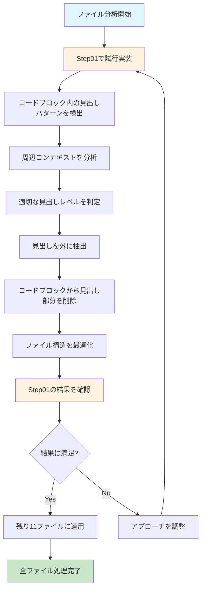

# 📋 学習ファイル構造改善計画

## 🎯 目標
Phase1_TypeScript完全習得フォルダ内の全Stepファイルのコードブロック内にある見出しコメントを、適切なマークダウン見出しとして外に出し、学習しやすい構造に改善する。

## 📊 現状分析
- **対象ファイル**: Step01〜Step12の12ファイル
- **問題**: コードブロック内に `// 1. 動的型付けの特徴` のような見出しが300個以上存在
- **影響**: 学習時の視認性が悪く、目次機能も活用できない

## 🔄 改善プロセス



## 🛠️ Phase 1: Step01ファイルでの試行実装

### ステップ1: 事前準備
1. **バックアップ作成**: `Step01_JavaScript復習とTypeScript導入.md` のコピーを作成
2. **構造分析**: 現在の見出し階層とコードブロック内見出しの詳細分析

### ステップ2: 試行実装
1. **パターン検出**: `// \d+\. [^\n]+` パターンの見出しを特定
2. **コンテキスト分析**: 各見出しの周辺構造を分析
3. **見出しレベル判定**: 適切な階層レベルを決定
4. **構造変更**: 見出しを外に抽出し、コードブロックを調整

### ステップ3: 結果検証
1. **構造確認**: マークダウンの階層が正しく表示されるか
2. **リンク確認**: 補足資料へのリンクが正常に動作するか
3. **学習効果確認**: 目次機能や視認性が改善されたか

## 🎨 改善例（Step01での想定）

### 変更前:
```markdown
#### 🔍 多言語経験者向け JavaScript 特徴

```javascript
// 1. 動的型付けの特徴（他言語との比較）
// Java/C#: コンパイル時型チェック
// Python: 実行時型チェック
// JavaScript: 型チェックなし

let value = 42; // number
value = "hello"; // string (型変更可能)
```

### 変更後:
```markdown
#### 🔍 多言語経験者向け JavaScript 特徴

##### 1. 動的型付けの特徴（他言語との比較）

```javascript
// Java/C#: コンパイル時型チェック
// Python: 実行時型チェック
// JavaScript: 型チェックなし

let value = 42; // number
value = "hello"; // string (型変更可能)
```

## 📝 技術的アプローチ

### パターン検出ロジック
```regex
// \d+\. [^\n]+  # 基本パターン: // 1. 見出しテキスト
```

### コンテキスト分析基準
- **現在のセクションレベル**: `###` → 新しい見出しは `####`
- **親セクションの内容**: 理論学習 vs 実践演習 vs その他
- **番号の連続性**: 1, 2, 3... の順序性を維持

### 見出しレベル判定ルール
```
現在のセクション構造:
# Step X: タイトル (レベル1)
## 📚 理論学習内容 (レベル2)  
### Day X-Y: サブセクション (レベル3)
#### 🔍 詳細トピック (レベル4) ← 既存
##### 新しい見出し (レベル5) ← 抽出した見出し
```

## 🚀 Phase 2: 全体展開（Step01成功後）

### 実装順序
1. **Step02-04**: 基礎ファイル処理
2. **Step05-08**: 中級ファイル処理  
3. **Step09-12**: 上級ファイル処理

### 品質確認項目
- [ ] 見出し階層の一貫性
- [ ] リンク参照の整合性
- [ ] 学習フローの論理性
- [ ] 目次機能の動作確認

## 📈 期待される効果

### 1. 学習効率向上
- 目次による素早いナビゲーション
- セクション単位での学習進捗管理

### 2. 視認性改善
- 明確な情報階層
- コードと説明の分離

### 3. 保守性向上
- 一貫した文書構造
- 将来の拡張・修正の容易さ

## ⚠️ 注意事項

### 安全対策
- **バックアップ**: 変更前に全ファイルのバックアップを作成
- **段階的実行**: 1ファイルずつ処理して結果を確認
- **リンク整合性**: 補足資料へのリンクが正しく動作することを確認

### 品質基準
- マークダウンの構文エラーがないこと
- 見出し階層が論理的であること
- 学習の流れが自然であること

## 📅 実装スケジュール

### Phase 1: 試行実装（60分）
- Step01ファイルでの実装とテスト

### Phase 2: 全体展開（120分）
- 残り11ファイルの処理

### Phase 3: 最終確認（30分）
- 全体の品質確認と調整

---

**作成日**: 2025年5月25日  
**対象**: Phase1_TypeScript完全習得フォルダ  
**実装者**: Roo (Architect Mode)