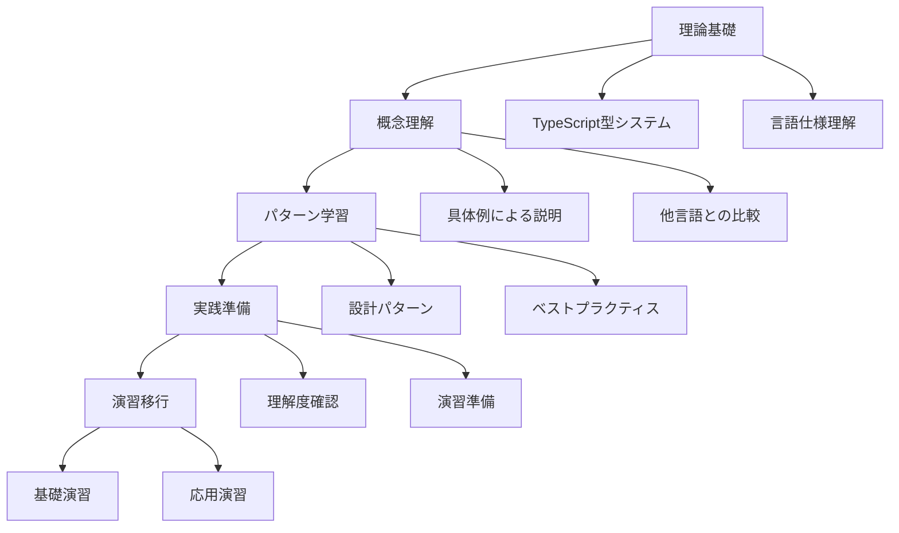

# Phase 1: TypeScript 完全習得 理論学習詳細化プラン

## 🎯 理論学習の設計方針

### 段階的学習アプローチ



## 📚 Week 1-2: 基礎固め理論学習コンテンツ

### 1. TypeScript 型システム基礎理論.md

#### 🎯 学習目標

- TypeScript 型システムの根本原理を理解する
- 構造的型付けの概念を完全に把握する
- 型推論メカニズムの動作を説明できる
- 型の互換性ルールを実践で活用できる
- 型階層の概念を設計に応用できる

#### 📚 理論基礎

**TypeScript 型システムの特徴**

- 構造的型付け（Structural Typing）
- 漸進的型付け（Gradual Typing）
- 型推論（Type Inference）
- 型の互換性（Type Compatibility）

**構造的型付け vs 名目的型付け**

```typescript
// 構造的型付け（TypeScript）
interface Point2D {
  x: number;
  y: number;
}
interface Vector2D {
  x: number;
  y: number;
}

const point: Point2D = { x: 1, y: 2 };
const vector: Vector2D = point; // OK: 構造が同じなら互換性あり

// 名目的型付け（Java, C#など）
// class Point2D { x: number; y: number; }
// class Vector2D { x: number; y: number; }
// Point2D point = new Point2D(1, 2);
// Vector2D vector = point; // Error: 異なる型
```

#### 🔍 詳細解説

**パターン 1: 型推論の動作メカニズム**

```typescript
// 基本的な型推論
let message = "Hello"; // string型として推論
let count = 42; // number型として推論

// 関数の戻り値型推論
function add(a: number, b: number) {
  return a + b; // number型として推論
}

// 複雑な型推論
const users = [
  { id: 1, name: "Alice", active: true },
  { id: 2, name: "Bob", active: false },
]; // { id: number; name: string; active: boolean; }[] として推論

// 条件付き型推論
function process<T>(value: T): T extends string ? string : number {
  // 実装詳細
  return value as any;
}
```

**パターン 2: 型の互換性ルール**

```typescript
// 基本的な互換性
interface Animal {
  name: string;
}

interface Dog extends Animal {
  breed: string;
}

let animal: Animal;
let dog: Dog = { name: "Buddy", breed: "Golden Retriever" };

animal = dog; // OK: DogはAnimalのスーパーセット
// dog = animal; // Error: Animalにはbreedプロパティがない

// 関数の互換性
type Handler1 = (event: MouseEvent) => void;
type Handler2 = (event: Event) => void;

let h1: Handler1;
let h2: Handler2;

h2 = h1; // OK: MouseEventはEventのサブタイプ
// h1 = h2; // Error: EventはMouseEventより広い
```

**パターン 3: 型階層の理解**

```typescript
// TypeScriptの型階層
// unknown (最上位型)
//   ├── any (型チェック無効化)
//   ├── object
//   │   ├── Function
//   │   ├── Array<T>
//   │   └── Record<K, V>
//   ├── primitive types
//   │   ├── string
//   │   ├── number
//   │   ├── boolean
//   │   ├── symbol
//   │   └── bigint
//   ├── null
//   ├── undefined
//   └── never (最下位型)

// 実践例
function processValue(value: unknown): string {
  if (typeof value === "string") {
    return value.toUpperCase(); // string型として扱える
  }
  if (typeof value === "number") {
    return value.toString(); // number型として扱える
  }
  return "unknown";
}
```

#### ⚠️ 注意点・落とし穴

**よくある間違い**

1. **any 型の乱用**

```typescript
// 悪い例
function processData(data: any): any {
  return data.someProperty.anotherProperty;
}

// 良い例
function processData<T extends { someProperty: { anotherProperty: unknown } }>(
  data: T
): T["someProperty"]["anotherProperty"] {
  return data.someProperty.anotherProperty;
}
```

2. **型アサーションの誤用**

```typescript
// 悪い例
const element = document.getElementById("myButton") as HTMLButtonElement;
element.click(); // elementがnullの場合エラー

// 良い例
const element = document.getElementById("myButton");
if (element instanceof HTMLButtonElement) {
  element.click();
}
```

#### 🛠️ 実践準備

**基礎確認問題**

1. 構造的型付けと名目的型付けの違いを説明せよ
2. 型推論が働く場面と働かない場面を区別せよ
3. unknown 型と any 型の使い分けを説明せよ

**理解度チェック**

```typescript
// 以下のコードの型推論結果を予測せよ
const config = {
  api: {
    baseUrl: "https://api.example.com",
    timeout: 5000,
    retries: 3,
  },
  features: {
    darkMode: true,
    notifications: false,
  },
};

// この関数の型シグネチャを推論せよ
function updateConfig(updates) {
  return { ...config, ...updates };
}
```

### 2. 型エラー診断・解決パターン集.md

#### 🎯 学習目標

- 20 種類以上の型エラーパターンを識別できる
- エラーメッセージから根本原因を特定できる
- 効率的なデバッグ手法を身につける
- 予防的な型設計ができる

#### 📚 既存資料の拡張

**既存の[`type error の見方.md`](typescript/type error の見方.md)を基盤として以下を追加:**

#### 🔍 詳細解説

**エラーパターン 1: 型の不一致エラー**

```typescript
// TS2322: Type 'string' is not assignable to type 'number'
let count: number = "42"; // Error

// 解決法1: 型変換
let count: number = parseInt("42");

// 解決法2: 型定義の修正
let count: string | number = "42"; // OK

// 解決法3: 型アサーション（注意深く使用）
let count: number = "42" as unknown as number; // 危険
```

**エラーパターン 2: プロパティ不存在エラー**

```typescript
// TS2339: Property 'name' does not exist on type '{}'
const user = {};
console.log(user.name); // Error

// 解決法1: 型定義の追加
interface User {
  name: string;
}
const user: User = { name: "Alice" };

// 解決法2: オプショナルプロパティ
interface User {
  name?: string;
}
const user: User = {};
if (user.name) {
  console.log(user.name);
}

// 解決法3: 型ガード
function hasName(obj: any): obj is { name: string } {
  return typeof obj.name === "string";
}

if (hasName(user)) {
  console.log(user.name); // OK
}
```

**エラーパターン 3: null/undefined エラー**

```typescript
// TS2531: Object is possibly 'null'
const element = document.getElementById("myButton");
element.click(); // Error

// 解決法1: null チェック
if (element) {
  element.click();
}

// 解決法2: 非null アサーション演算子（確実な場合のみ）
element!.click();

// 解決法3: オプショナルチェーニング
element?.click();
```

**エラーパターン 4: 関数型の不一致**

```typescript
// TS2345: Argument of type '(x: string) => void' is not assignable to parameter of type '(x: number) => void'
function processNumbers(callback: (x: number) => void) {
  callback(42);
}

processNumbers((x: string) => console.log(x)); // Error

// 解決法1: 正しい型の関数を渡す
processNumbers((x: number) => console.log(x.toString()));

// 解決法2: ジェネリクスを使用
function process<T>(callback: (x: T) => void, value: T) {
  callback(value);
}

process((x: string) => console.log(x), "hello");
process((x: number) => console.log(x), 42);
```

**エラーパターン 5: インデックスシグネチャエラー**

```typescript
// TS7053: Element implicitly has an 'any' type because expression of type 'string' can't be used to index type
const config = {
  development: "dev-config",
  production: "prod-config",
};

function getConfig(env: string) {
  return config[env]; // Error
}

// 解決法1: keyof演算子を使用
function getConfig(env: keyof typeof config) {
  return config[env]; // OK
}

// 解決法2: インデックスシグネチャを追加
interface Config {
  [key: string]: string;
  development: string;
  production: string;
}

// 解決法3: 型アサーション
function getConfig(env: string) {
  return config[env as keyof typeof config];
}
```

#### ⚠️ デバッグ手法とツール活用

**VS Code TypeScript 拡張機能の活用**

1. **型情報の表示**: Ctrl+K Ctrl+I
2. **定義へジャンプ**: F12
3. **参照の検索**: Shift+F12
4. **シンボルの名前変更**: F2

**TypeScript Compiler の詳細エラー**

```bash
# より詳細なエラー情報を表示
tsc --noEmit --pretty

# 特定のエラーコードの説明を表示
tsc --explainFiles
```

### 3. this 完全理解ガイド.md

#### 🎯 学習目標

- JavaScript/TypeScript における this の動作を完全理解する
- アロー関数と通常関数の this 束縛の違いを説明できる
- クラス・オブジェクトでの this 制御を実践できる
- TypeScript での this 型注釈を活用できる

#### 📚 既存資料の拡張

**既存の[`thisについて.md`](typescript/thisについて.md)を基盤として以下を追加:**

#### 🔍 詳細解説

**パターン 1: 関数呼び出しでの this**

```typescript
// グローバル関数でのthis
function globalFunction() {
  console.log(this); // strict mode: undefined, non-strict: window/global
}

// オブジェクトメソッドでのthis
const obj = {
  name: "MyObject",
  method() {
    console.log(this.name); // "MyObject"
  },
  arrowMethod: () => {
    console.log(this.name); // undefined (レキシカルスコープ)
  },
};

// メソッドの分離
const method = obj.method;
method(); // undefined (thisが失われる)

// bind, call, apply での制御
const boundMethod = obj.method.bind(obj);
boundMethod(); // "MyObject"
```

**パターン 2: クラスでの this 型注釈**

```typescript
class Calculator {
  private value: number = 0;

  // this型注釈で型安全性を確保
  add(this: Calculator, x: number): Calculator {
    this.value += x;
    return this;
  }

  // アロー関数でthisを束縛
  addAsync = (x: number): Promise<Calculator> => {
    return new Promise((resolve) => {
      setTimeout(() => {
        this.value += x;
        resolve(this);
      }, 100);
    });
  };

  getValue(this: Calculator): number {
    return this.value;
  }
}

// 使用例
const calc = new Calculator();
calc.add(5).add(3); // メソッドチェーン

// 分離されたメソッドでもthis型注釈により型安全
const addMethod = calc.add; // Error: this型が一致しない
```

**パターン 3: イベントハンドラでの this 制御**

```typescript
class ButtonHandler {
  private clickCount = 0;

  constructor(private element: HTMLButtonElement) {
    // 悪い例: thisが失われる
    // this.element.addEventListener('click', this.handleClick);

    // 良い例1: bind使用
    this.element.addEventListener("click", this.handleClick.bind(this));

    // 良い例2: アロー関数使用
    this.element.addEventListener("click", this.handleClickArrow);
  }

  handleClick(this: ButtonHandler, event: Event) {
    this.clickCount++;
    console.log(`Clicked ${this.clickCount} times`);
  }

  handleClickArrow = (event: Event) => {
    this.clickCount++;
    console.log(`Clicked ${this.clickCount} times`);
  };
}
```

## 📚 Week 3-4: 中級理論学習コンテンツ

### 4. ジェネリクス設計理論.md

#### 🎯 学習目標

- ジェネリクスの設計原則を理解する
- 型制約の効果的な活用法を身につける
- 共変・反変・不変の概念を実践で応用する
- 高度なジェネリクスパターンを実装できる

#### 📚 理論基礎

**ジェネリクスの基本概念**

- 型パラメータ（Type Parameters）
- 型制約（Type Constraints）
- デフォルト型パラメータ（Default Type Parameters）
- 条件付き型（Conditional Types）

#### 🔍 詳細解説

**パターン 1: 基本的なジェネリクス設計**

```typescript
// 基本的なジェネリック関数
function identity<T>(arg: T): T {
  return arg;
}

// 複数の型パラメータ
function pair<T, U>(first: T, second: U): [T, U] {
  return [first, second];
}

// 型制約の使用
interface Lengthwise {
  length: number;
}

function logLength<T extends Lengthwise>(arg: T): T {
  console.log(arg.length);
  return arg;
}

// 使用例
logLength("hello"); // OK: string has length
logLength([1, 2, 3]); // OK: array has length
logLength({ length: 10 }); // OK: object has length
// logLength(123);         // Error: number doesn't have length
```

**パターン 2: 高度な型制約**

```typescript
// keyof制約
function getProperty<T, K extends keyof T>(obj: T, key: K): T[K] {
  return obj[key];
}

const person = { name: "Alice", age: 30, city: "Tokyo" };
const name = getProperty(person, "name"); // string
const age = getProperty(person, "age"); // number
// const invalid = getProperty(person, "invalid"); // Error

// 条件付き制約
type NonNullable<T> = T extends null | undefined ? never : T;

function processValue<T>(value: NonNullable<T>): T {
  // valueはnullでもundefinedでもない
  return value;
}

// 複雑な制約の組み合わせ
interface Constructable {
  new (...args: any[]): any;
}

function createInstance<T extends Constructable>(
  ctor: T,
  ...args: any[]
): InstanceType<T> {
  return new ctor(...args);
}

class User {
  constructor(public name: string) {}
}

const user = createInstance(User, "Alice"); // User型として推論
```

**パターン 3: 共変・反変・不変の理解**

```typescript
// 共変（Covariance）: T extends U なら Container<T> extends Container<U>
interface ReadonlyContainer<out T> {
  readonly value: T;
}

let stringContainer: ReadonlyContainer<string>;
let objectContainer: ReadonlyContainer<object>;

objectContainer = stringContainer; // OK: string extends object

// 反変（Contravariance）: T extends U なら Container<U> extends Container<T>
interface WriteableContainer<in T> {
  setValue(value: T): void;
}

let stringWriter: WriteableContainer<string>;
let objectWriter: WriteableContainer<object>;

stringWriter = objectWriter; // OK: objectWriterはstringも受け入れる

// 不変（Invariance）: 読み書き両方可能な場合
interface Container<T> {
  value: T;
  setValue(value: T): void;
}

let stringContainer2: Container<string>;
let objectContainer2: Container<object>;

// stringContainer2 = objectContainer2; // Error: 不変
// objectContainer2 = stringContainer2; // Error: 不変
```

### 5. ユーティリティ型活用マスター.md

#### 🎯 学習目標

- 組み込みユーティリティ型の内部実装を理解する
- カスタムユーティリティ型を設計できる
- 型変換パターンを実践で活用する
- 複雑な型操作を効率的に行える

#### 🔍 詳細解説

**パターン 1: 組み込みユーティリティ型の内部実装**

```typescript
// Partial<T>の実装
type MyPartial<T> = {
  [P in keyof T]?: T[P];
};

// Required<T>の実装
type MyRequired<T> = {
  [P in keyof T]-?: T[P];
};

// Pick<T, K>の実装
type MyPick<T, K extends keyof T> = {
  [P in K]: T[P];
};

// Omit<T, K>の実装
type MyOmit<T, K extends keyof any> = Pick<T, Exclude<keyof T, K>>;

// Record<K, T>の実装
type MyRecord<K extends keyof any, T> = {
  [P in K]: T;
};

// Exclude<T, U>の実装
type MyExclude<T, U> = T extends U ? never : T;

// Extract<T, U>の実装
type MyExtract<T, U> = T extends U ? T : never;
```

**パターン 2: 高度なユーティリティ型の作成**

```typescript
// DeepPartial: ネストしたオブジェクトも含めてPartialにする
type DeepPartial<T> = {
  [P in keyof T]?: T[P] extends object ? DeepPartial<T[P]> : T[P];
};

// DeepRequired: ネストしたオブジェクトも含めてRequiredにする
type DeepRequired<T> = {
  [P in keyof T]-?: T[P] extends object ? DeepRequired<T[P]> : T[P];
};

// PathsToProperty: オブジェクト内の特定型プロパティへのパスを取得
type PathsToProperty<T, U> = {
  [K in keyof T]: T[K] extends U
    ? K
    : T[K] extends object
    ? `${K & string}.${PathsToProperty<T[K], U> & string}`
    : never;
}[keyof T];

// GetByPath: パス文字列でネストしたプロパティの型を取得
type GetByPath<T, P extends string> = P extends `${infer K}.${infer Rest}`
  ? K extends keyof T
    ? GetByPath<T[K], Rest>
    : never
  : P extends keyof T
  ? T[P]
  : never;

// 使用例
interface User {
  profile: {
    personal: {
      name: string;
      age: number;
    };
    contact: {
      email: string;
      phone: string;
    };
  };
  settings: {
    theme: string;
    notifications: boolean;
  };
}

type StringPaths = PathsToProperty<User, string>;
// "profile.personal.name" | "profile.contact.email" | "profile.contact.phone" | "settings.theme"

type NameType = GetByPath<User, "profile.personal.name">; // string
type EmailType = GetByPath<User, "profile.contact.email">; // string
```

**パターン 3: 関数型のユーティリティ**

```typescript
// Parameters<T>: 関数の引数型をタプルとして取得
type MyParameters<T extends (...args: any) => any> = T extends (
  ...args: infer P
) => any
  ? P
  : never;

// ReturnType<T>: 関数の戻り値型を取得
type MyReturnType<T extends (...args: any) => any> = T extends (
  ...args: any
) => infer R
  ? R
  : any;

// ConstructorParameters<T>: コンストラクタの引数型を取得
type MyConstructorParameters<T extends abstract new (...args: any) => any> =
  T extends abstract new (...args: infer P) => any ? P : never;

// InstanceType<T>: コンストラクタのインスタンス型を取得
type MyInstanceType<T extends abstract new (...args: any) => any> =
  T extends abstract new (...args: any) => infer R ? R : any;

// 高度な関数型操作
type AsyncReturnType<T extends (...args: any) => Promise<any>> = T extends (
  ...args: any
) => Promise<infer R>
  ? R
  : never;

type CurriedFunction<T extends (...args: any) => any> = T extends (
  arg: infer A,
  ...rest: infer R
) => infer Return
  ? R extends []
    ? (arg: A) => Return
    : (arg: A) => CurriedFunction<(...args: R) => Return>
  : never;

// 使用例
function add(a: number, b: number, c: number): number {
  return a + b + c;
}

type AddParams = MyParameters<typeof add>; // [number, number, number]
type AddReturn = MyReturnType<typeof add>; // number
type CurriedAdd = CurriedFunction<typeof add>; // (arg: number) => (arg: number) => (arg: number) => number
```

## 🛠️ 実践準備・理解度確認

### 統合理解度チェック

```typescript
// 課題1: 以下の型定義を完成させよ
interface ApiResponse<T> {
    data: T;
    status: number;
    message?: string;
}

// ユーザー情報の型
interface User {
    id: number;
    name: string;
    email: string;
    profile?: {
        bio: string;
        avatar: string;
    };
}

// 課題: 以下の関数の型を正しく定義せよ
function fetchUser(id: number): Promise<ApiResponse<User>> {
    // 実装は省略
    return Promise.resolve({} as any);
}

// 課題2: エラーを修正せよ
class UserManager {
    private users: User[] = [];

    // このメソッドの型エラーを修正せよ
    addUser(userData) { // Error: Parameter 'userData' implicitly has an 'any' type
        const user = {
            id: this.generateId(),
            name: userData.name,
            email: userData.email,
            profile: userData.profile
        };
        this.users.push(user);
        return user;
    }

    // このメソッドの型エラーを修正せよ
    findUser(predicate) { // Error: Parameter 'predicate' implicitly has an 'any' type
        return this.users.find(predicate);
    }

    private generateId(): number {
        return Math.floor(Math.random() * 1000);
    }
}

// 課題3: 高度なユーティリティ型を実装せよ
// RequireAtLeastOne<T>: 最低1つのプロパティが必須の型
type RequireAtLeastOne<T> = /* 実装 */;

// 使用例
type UserUpdate = RequireAtLeastOne<{
    name?: string;
    email?: string;
    profile?: User['profile'];
}>;

// 以下はOK
const update1: UserUpdate = { name: "Alice" };
const update2: UserUpdate = { email: "alice@example.com" };
const update3: UserUpdate = { name: "Alice", email: "alice@example.com" };

// 以下はError
// const update4: UserUpdate = {}; // Error: 最低1つは必要
```

### 次週への準備

**Week 3-4 で学習する内容の予習**

1. 条件付き型の基本概念
2. マップ型の応用パターン
3. テンプレートリテラル型の基礎

**推奨する追加学習**

1. TypeScript Handbook の再読
2. type-challenges の基礎問題（Easy レベル）
3. 実際のプロジェクトでの型定義練習

## 📖 参考資料

### 公式ドキュメント

- [TypeScript Handbook](https://www.typescriptlang.org/docs/)
- [TypeScript Deep Dive](https://basarat.gitbook.io/typescript/)

### 推奨記事・書籍

- "Effective TypeScript" by Dan Vanderkam
- "Programming TypeScript" by Boris Cherny

### 関連ツール

- [TypeScript Playground](https://www.typescriptlang.org/play)
- [type-challenges](https://github.com/type-challenges/type-challenges)
- [TypeScript AST Viewer](https://ts-ast-viewer.com/)
