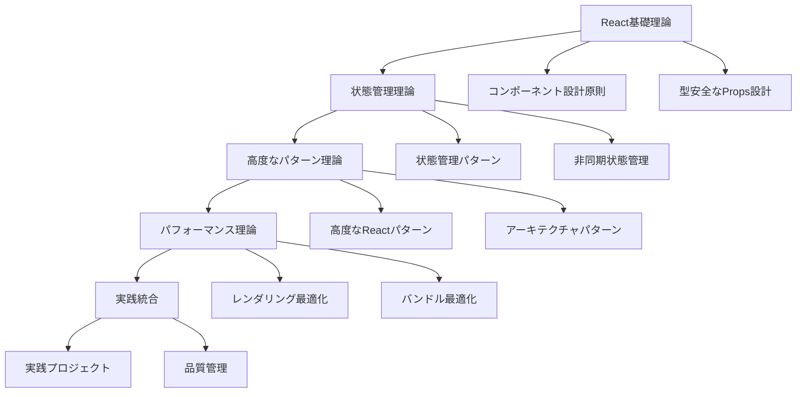

# Phase 2: TypeScript × React 理論学習詳細化プラン

## 🎯 理論学習の設計方針

### 段階的学習アプローチ



## 📚 Week 1-2: React 基礎理論学習コンテンツ

### 1. React + TypeScript 基礎理論.md

#### 🎯 学習目標

- React コンポーネントの型安全な設計原則を理解する
- Props と State の型定義パターンを完全に把握する
- Event Handler の型安全な実装を身につける
- Ref と DOM 操作の型安全性を確保する
- React の型システムとの統合を実践できる

#### 📚 理論基礎

**React コンポーネントの型定義パターン**

```typescript
// 1. Function Component の型定義方法
// 方法1: React.FC (非推奨)
const Component1: React.FC<Props> = ({ children, ...props }) => {
  // children が自動的に含まれるが、型安全性に問題
  return <div>{children}</div>;
};

// 方法2: 直接関数定義 (推奨)
function Component2({ title, onClick }: Props): JSX.Element {
  // 明示的な型定義で完全な型安全性
  return <button onClick={onClick}>{title}</button>;
}

// 方法3: アロー関数 + 型注釈
const Component3 = ({ data }: Props): JSX.Element => {
  return (
    <div>
      {data.map((item) => (
        <span key={item.id}>{item.name}</span>
      ))}
    </div>
  );
};
```

**Props 型設計の原則**

```typescript
// 2. Props の型設計パターン
// 基本的な Props 型
interface BasicProps {
  title: string;
  description?: string;
  isVisible: boolean;
  onClick: () => void;
}

// HTMLAttributes の継承
interface ButtonProps extends React.ButtonHTMLAttributes<HTMLButtonElement> {
  variant: 'primary' | 'secondary';
  size: 'sm' | 'md' | 'lg';
  loading?: boolean;
}

// Generic Props
interface ListProps<T> {
  items: T[];
  renderItem: (item: T, index: number) => React.ReactNode;
  keyExtractor?: (item: T) => string | number;
}

// 条件付き Props
type ConditionalProps<T extends boolean> = T extends true
  ? { required: true; value: string }
  : { required?: false; value?: string };

interface FormFieldProps<T extends boolean = false> {
  label: string;
  name: string;
} & ConditionalProps<T>;

// Union Props (排他的な Props)
type InputProps =
  | { type: 'text'; value: string; onChange: (value: string) => void }
  | { type: 'number'; value: number; onChange: (value: number) => void }
  | { type: 'checkbox'; checked: boolean; onChange: (checked: boolean) => void };
```

#### 🔍 詳細解説

**パターン 1: コンポーネント合成パターン**

```typescript
// 3. Compound Components の理論
// Context を使った状態共有
interface TabsContextType {
  activeTab: string;
  setActiveTab: (tab: string) => void;
}

const TabsContext = React.createContext<TabsContextType | undefined>(undefined);

// カスタムフック for Context
function useTabs(): TabsContextType {
  const context = React.useContext(TabsContext);
  if (!context) {
    throw new Error("useTabs must be used within Tabs");
  }
  return context;
}

// 親コンポーネント
interface TabsProps {
  defaultTab?: string;
  children: React.ReactNode;
  onChange?: (tab: string) => void;
}

function Tabs({ defaultTab = "", children, onChange }: TabsProps): JSX.Element {
  const [activeTab, setActiveTab] = React.useState(defaultTab);

  const handleTabChange = React.useCallback(
    (tab: string) => {
      setActiveTab(tab);
      onChange?.(tab);
    },
    [onChange]
  );

  const value = React.useMemo<TabsContextType>(
    () => ({
      activeTab,
      setActiveTab: handleTabChange,
    }),
    [activeTab, handleTabChange]
  );

  return <TabsContext.Provider value={value}>{children}</TabsContext.Provider>;
}

// 子コンポーネント
interface TabProps {
  value: string;
  children: React.ReactNode;
  disabled?: boolean;
}

function Tab({ value, children, disabled = false }: TabProps): JSX.Element {
  const { activeTab, setActiveTab } = useTabs();
  const isActive = activeTab === value;

  return (
    <button
      role="tab"
      aria-selected={isActive}
      disabled={disabled}
      onClick={() => !disabled && setActiveTab(value)}
    >
      {children}
    </button>
  );
}

// 使用例
function App(): JSX.Element {
  return (
    <Tabs defaultTab="tab1">
      <Tab value="tab1">Tab 1</Tab>
      <Tab value="tab2">Tab 2</Tab>
      <Tab value="tab3" disabled>
        Tab 3
      </Tab>
    </Tabs>
  );
}
```

**パターン 2: Render Props パターン**

```typescript
// 4. Render Props の理論と実装
interface RenderPropsPattern<T> {
  children: (data: T) => React.ReactNode;
}

// データフェッチング Render Props
interface DataFetcherProps<T>
  extends RenderPropsPattern<{
    data: T | null;
    loading: boolean;
    error: Error | null;
    refetch: () => void;
  }> {
  url: string;
}

function DataFetcher<T>({ url, children }: DataFetcherProps<T>): JSX.Element {
  const [data, setData] = React.useState<T | null>(null);
  const [loading, setLoading] = React.useState(true);
  const [error, setError] = React.useState<Error | null>(null);

  const fetchData = React.useCallback(async () => {
    try {
      setLoading(true);
      setError(null);
      const response = await fetch(url);
      if (!response.ok) throw new Error("Fetch failed");
      const result = (await response.json()) as T;
      setData(result);
    } catch (err) {
      setError(err instanceof Error ? err : new Error("Unknown error"));
    } finally {
      setLoading(false);
    }
  }, [url]);

  React.useEffect(() => {
    void fetchData();
  }, [fetchData]);

  return <>{children({ data, loading, error, refetch: fetchData })}</>;
}

// 使用例
function UserProfile({ userId }: { userId: number }): JSX.Element {
  return (
    <DataFetcher<User> url={`/api/users/${userId}`}>
      {({ data: user, loading, error, refetch }) => {
        if (loading) return <div>Loading...</div>;
        if (error) return <div>Error: {error.message}</div>;
        if (!user) return <div>No user found</div>;

        return (
          <div>
            <h1>{user.name}</h1>
            <p>{user.email}</p>
            <button onClick={refetch}>Refresh</button>
          </div>
        );
      }}
    </DataFetcher>
  );
}
```

**パターン 3: Higher-Order Components (HOC)**

```typescript
// 5. HOC の理論と型安全な実装
type HOCProps = {
  loading: boolean;
};

// HOC の型定義
function withLoading<P extends object>(
  Component: React.ComponentType<P>
): React.ComponentType<P & HOCProps> {
  return function WithLoadingComponent(props: P & HOCProps) {
    const { loading, ...restProps } = props;

    if (loading) {
      return <div>Loading...</div>;
    }

    return <Component {...(restProps as P)} />;
  };
}

// 認証 HOC
interface AuthProps {
  user: User | null;
  isAuthenticated: boolean;
}

function withAuth<P extends object>(
  Component: React.ComponentType<P & AuthProps>,
  options: { requiredRole?: string } = {}
): React.ComponentType<Omit<P, keyof AuthProps>> {
  return function WithAuthComponent(props: Omit<P, keyof AuthProps>) {
    const { user, isAuthenticated } = useAuth();

    if (!isAuthenticated) {
      return <div>Please log in</div>;
    }

    if (options.requiredRole && user?.role !== options.requiredRole) {
      return <div>Access denied</div>;
    }

    return (
      <Component
        {...(props as P)}
        user={user}
        isAuthenticated={isAuthenticated}
      />
    );
  };
}
```

#### ⚠️ 注意点・ベストプラクティス

**型安全性の確保**

```typescript
// 6. 型安全性のベストプラクティス
// 悪い例: any の使用
function BadComponent({ data }: { data: any }) {
  return <div>{data.someProperty}</div>; // 型安全性なし
}

// 良い例: 適切な型定義
interface ComponentData {
  someProperty: string;
  optionalProperty?: number;
}

function GoodComponent({ data }: { data: ComponentData }) {
  return (
    <div>
      {data.someProperty}
      {data.optionalProperty && <span>{data.optionalProperty}</span>}
    </div>
  );
}

// Event Handler の型安全性
interface FormProps {
  onSubmit: (data: FormData) => void;
}

function Form({ onSubmit }: FormProps): JSX.Element {
  const handleSubmit = (e: React.FormEvent<HTMLFormElement>): void => {
    e.preventDefault();
    const formData = new FormData(e.currentTarget);
    onSubmit(formData);
  };

  return (
    <form onSubmit={handleSubmit}>
      <input name="username" type="text" required />
      <button type="submit">Submit</button>
    </form>
  );
}
```

### 2. 状態管理パターン理論.md

#### 🎯 学習目標

- React の状態管理パターンを体系的に理解する
- Context API の適切な使用法を身につける
- カスタムフックによる状態ロジックの抽象化を実践する
- 外部状態管理ライブラリとの統合を理解する

#### 📚 理論基礎

**状態管理の設計原則**

```typescript
// 7. 状態管理の基本原則
// 単一責任の原則
interface UserState {
  user: User | null;
  loading: boolean;
  error: string | null;
}

interface UIState {
  sidebarOpen: boolean;
  theme: "light" | "dark";
  notifications: Notification[];
}

// 状態の正規化
interface NormalizedState<T> {
  byId: Record<string, T>;
  allIds: string[];
}

interface AppState {
  users: NormalizedState<User>;
  projects: NormalizedState<Project>;
  tasks: NormalizedState<Task>;
}

// 不変性の保持
function updateUser(
  state: AppState,
  userId: string,
  updates: Partial<User>
): AppState {
  return {
    ...state,
    users: {
      ...state.users,
      byId: {
        ...state.users.byId,
        [userId]: {
          ...state.users.byId[userId],
          ...updates,
        },
      },
    },
  };
}
```

**Context API の高度な活用**

```typescript
// 8. 複数 Context の組み合わせ
// Theme Context
interface ThemeContextType {
  theme: "light" | "dark";
  toggleTheme: () => void;
}

const ThemeContext = React.createContext<ThemeContextType | undefined>(
  undefined
);

// Auth Context
interface AuthContextType {
  user: User | null;
  login: (credentials: LoginCredentials) => Promise<void>;
  logout: () => void;
  loading: boolean;
}

const AuthContext = React.createContext<AuthContextType | undefined>(undefined);

// Notification Context
interface NotificationContextType {
  notifications: Notification[];
  addNotification: (notification: Omit<Notification, "id">) => void;
  removeNotification: (id: string) => void;
}

const NotificationContext = React.createContext<
  NotificationContextType | undefined
>(undefined);

// Provider の組み合わせ
function AppProviders({
  children,
}: {
  children: React.ReactNode;
}): JSX.Element {
  return (
    <ThemeProvider>
      <AuthProvider>
        <NotificationProvider>{children}</NotificationProvider>
      </AuthProvider>
    </ThemeProvider>
  );
}

// 複数 Context を使用するカスタムフック
function useAppContext() {
  const theme = useTheme();
  const auth = useAuth();
  const notifications = useNotifications();

  return {
    theme,
    auth,
    notifications,
  };
}
```

## 📚 Week 3-4: 状態管理理論学習コンテンツ

### 3. 非同期状態管理理論.md

#### 🎯 学習目標

- 非同期処理の状態管理パターンを理解する
- TanStack Query の理論と実践を身につける
- 楽観的更新とエラーハンドリングを実装する
- キャッシュ戦略とデータ同期を最適化する

#### 📚 理論基礎

**非同期状態の管理パターン**

```typescript
// 9. 非同期状態の型定義
interface AsyncState<T> {
  data: T | null;
  loading: boolean;
  error: Error | null;
  lastFetch: Date | null;
}

// 非同期アクション
type AsyncAction<T> =
  | { type: "FETCH_START" }
  | { type: "FETCH_SUCCESS"; payload: T }
  | { type: "FETCH_ERROR"; payload: Error }
  | { type: "RESET" };

// 非同期 Reducer
function asyncReducer<T>(
  state: AsyncState<T>,
  action: AsyncAction<T>
): AsyncState<T> {
  switch (action.type) {
    case "FETCH_START":
      return {
        ...state,
        loading: true,
        error: null,
      };
    case "FETCH_SUCCESS":
      return {
        data: action.payload,
        loading: false,
        error: null,
        lastFetch: new Date(),
      };
    case "FETCH_ERROR":
      return {
        ...state,
        loading: false,
        error: action.payload,
      };
    case "RESET":
      return {
        data: null,
        loading: false,
        error: null,
        lastFetch: null,
      };
    default:
      return state;
  }
}

// カスタムフック
function useAsyncData<T>(
  fetcher: () => Promise<T>,
  dependencies: React.DependencyList = []
): AsyncState<T> & { refetch: () => Promise<void> } {
  const [state, dispatch] = React.useReducer(asyncReducer<T>, {
    data: null,
    loading: false,
    error: null,
    lastFetch: null,
  });

  const fetchData = React.useCallback(async () => {
    dispatch({ type: "FETCH_START" });
    try {
      const data = await fetcher();
      dispatch({ type: "FETCH_SUCCESS", payload: data });
    } catch (error) {
      dispatch({
        type: "FETCH_ERROR",
        payload: error instanceof Error ? error : new Error("Unknown error"),
      });
    }
  }, dependencies);

  React.useEffect(() => {
    void fetchData();
  }, [fetchData]);

  return {
    ...state,
    refetch: fetchData,
  };
}
```

## 📚 Week 5-6: 高度なパターン理論学習コンテンツ

### 4. React パフォーマンス最適化理論.md

#### 🎯 学習目標

- React のレンダリングメカニズムを深く理解する
- メモ化戦略の理論と実践を身につける
- 仮想化技術の原理と実装を理解する
- バンドル最適化の手法を習得する

#### 📚 理論基礎

**レンダリング最適化の原理**

```typescript
// 10. React のレンダリングサイクル
// Reconciliation の理解
interface VirtualNode {
  type: string | React.ComponentType;
  props: Record<string, any>;
  children: VirtualNode[];
  key?: string | number;
}

// Fiber アーキテクチャの概念
interface FiberNode {
  type: string | React.ComponentType;
  props: Record<string, any>;
  state: any;
  child: FiberNode | null;
  sibling: FiberNode | null;
  parent: FiberNode | null;
  alternate: FiberNode | null;
  effectTag: number;
}

// メモ化の理論
// React.memo の内部実装概念
function memo<P extends object>(
  Component: React.ComponentType<P>,
  areEqual?: (prevProps: P, nextProps: P) => boolean
): React.ComponentType<P> {
  return function MemoizedComponent(props: P) {
    const prevPropsRef = React.useRef<P>();
    const memoizedComponentRef = React.useRef<React.ReactElement>();

    if (
      !prevPropsRef.current ||
      (areEqual
        ? !areEqual(prevPropsRef.current, props)
        : !shallowEqual(prevPropsRef.current, props))
    ) {
      memoizedComponentRef.current = React.createElement(Component, props);
      prevPropsRef.current = props;
    }

    return memoizedComponentRef.current!;
  };
}

// useMemo の最適化パターン
function useOptimizedMemo<T>(
  factory: () => T,
  deps: React.DependencyList,
  isEqual?: (a: T, b: T) => boolean
): T {
  const [memoizedValue, setMemoizedValue] = React.useState<T>(factory);
  const prevDepsRef = React.useRef<React.DependencyList>(deps);

  React.useEffect(() => {
    const hasChanged = deps.some(
      (dep, index) => !Object.is(dep, prevDepsRef.current[index])
    );

    if (hasChanged) {
      const newValue = factory();
      if (!isEqual || !isEqual(memoizedValue, newValue)) {
        setMemoizedValue(newValue);
      }
      prevDepsRef.current = deps;
    }
  }, deps);

  return memoizedValue;
}
```

## 🛠️ 実践準備・統合演習

### Week 1-10 統合課題

```typescript
// 課題: 型安全な React アプリケーションアーキテクチャの設計
// 以下の要件を満たすアーキテクチャを設計・実装せよ

// 1. コンポーネント設計
interface ComponentArchitecture {
  // Atomic Design の実装
  atoms: "Button" | "Input" | "Label" | "Icon";
  molecules: "FormField" | "SearchBox" | "Card";
  organisms: "Header" | "Sidebar" | "DataTable";
  templates: "PageLayout" | "FormLayout";
  pages: "HomePage" | "UserPage" | "SettingsPage";
}

// 2. 状態管理アーキテクチャ
interface StateArchitecture {
  // レイヤー分離
  domain: "User" | "Project" | "Task";
  application: "UserService" | "ProjectService";
  infrastructure: "ApiClient" | "LocalStorage";
  presentation: "UserStore" | "UIStore";
}

// 3. 型安全性の確保
interface TypeSafetyStrategy {
  // 型定義の階層化
  entities: "User" | "Project" | "Task";
  valueObjects: "Email" | "Password" | "UserId";
  apiTypes: "CreateUserRequest" | "UpdateProjectResponse";
  componentTypes: "UserListProps" | "TaskCardProps";
}

// 4. パフォーマンス最適化
interface PerformanceStrategy {
  // 最適化手法
  memoization: "React.memo" | "useMemo" | "useCallback";
  virtualization: "VirtualList" | "InfiniteScroll";
  codesplitting: "React.lazy" | "Dynamic Import";
  bundleOptimization: "Tree Shaking" | "Code Splitting";
}

// 実装要件:
// - 完全な型安全性
// - スケーラブルなアーキテクチャ
// - 高いパフォーマンス
// - 保守性の確保
// - テスタビリティ
```

### 理解度確認テスト

```typescript
// テスト1: 以下のコンポーネントの問題点を特定し修正せよ
function ProblematicComponent({
  users,
  onUserSelect,
}: {
  users: any[];
  onUserSelect: (user: any) => void;
}) {
  const [selectedUser, setSelectedUser] = React.useState(null);

  const handleUserClick = (user: any) => {
    setSelectedUser(user);
    onUserSelect(user);
  };

  return (
    <div>
      {users.map((user) => (
        <div key={user.id} onClick={() => handleUserClick(user)}>
          {user.name}
        </div>
      ))}
    </div>
  );
}

// テスト2: 以下の状態管理の問題点を特定し最適化せよ
function IneffientComponent() {
  const [users, setUsers] = React.useState([]);
  const [filter, setFilter] = React.useState("");

  const filteredUsers = users.filter((user) =>
    user.name.toLowerCase().includes(filter.toLowerCase())
  );

  React.useEffect(() => {
    fetch("/api/users")
      .then((response) => response.json())
      .then((data) => setUsers(data));
  }, []);

  return (
    <div>
      <input value={filter} onChange={(e) => setFilter(e.target.value)} />
      {filteredUsers.map((user) => (
        <UserCard key={user.id} user={user} />
      ))}
    </div>
  );
}

// テスト3: パフォーマンスを考慮して以下のコンポーネントを最適化せよ
function SlowComponent({ items }: { items: LargeDataItem[] }) {
  return (
    <div style={{ height: "400px", overflow: "auto" }}>
      {items.map((item, index) => (
        <ExpensiveItemComponent key={item.id} item={item} index={index} />
      ))}
    </div>
  );
}
```

## 📖 参考資料・次週への準備

### 推奨学習リソース

- [React TypeScript Cheatsheet](https://react-typescript-cheatsheet.netlify.app/)
- [React Patterns](https://reactpatterns.com/)
- [React Performance](https://react.dev/learn/render-and-commit)

### Phase 3 予習内容

- TypeScript 設計手法の基礎
- ドメイン駆動設計の概念
- アーキテクチャパターンの理論
- 大規模アプリケーション設計

### 実践プロジェクト準備

Phase 3 で取り組む「大規模アプリケーション設計」プロジェクトの準備として、以下を検討しておく：

1. 設計したいアプリケーションのドメイン選択
2. アーキテクチャパターンの調査
3. 技術選定の方針
4. 品質管理の目標設定
