# Phase 2: TypeScript × React 総合評価・統合プラン

## 📊 Phase 2 学習成果総括

### 🎯 達成目標の確認

**期間**: 10 週間（2.5 ヶ月）  
**総学習時間**: 200 時間  
**最終到達レベル**: TypeScript × React Expert 基礎完成

#### ✅ 習得技術スキル

- [ ] **React 基礎**: 型安全なコンポーネント設計、Props・State 管理
- [ ] **状態管理**: Context API、カスタムフック、Zustand、TanStack Query
- [ ] **高度なパターン**: HOC、Render Props、Compound Components
- [ ] **パフォーマンス最適化**: メモ化、仮想化、コード分割
- [ ] **実践応用**: フルスタックアプリケーション開発、CI/CD 構築

## 📈 週次進捗評価マトリックス

| Week | 学習内容             | 理論理解   | 実践力     | 成果物     | 総合評価            |
| ---- | -------------------- | ---------- | ---------- | ---------- | ------------------- |
| 1-2  | React 基礎           | ⭐⭐⭐⭐⭐ | ⭐⭐⭐⭐   | ⭐⭐⭐⭐   | 🔰 React 基礎完成   |
| 3-4  | 状態管理             | ⭐⭐⭐⭐⭐ | ⭐⭐⭐⭐⭐ | ⭐⭐⭐⭐   | 🔶 状態管理習得     |
| 5-6  | 高度な React         | ⭐⭐⭐⭐⭐ | ⭐⭐⭐⭐⭐ | ⭐⭐⭐⭐⭐ | 🔥 高度パターン習得 |
| 7-8  | パフォーマンス最適化 | ⭐⭐⭐⭐⭐ | ⭐⭐⭐⭐⭐ | ⭐⭐⭐⭐⭐ | 🔥 最適化技術習得   |
| 9-10 | 実践プロジェクト     | ⭐⭐⭐⭐⭐ | ⭐⭐⭐⭐⭐ | ⭐⭐⭐⭐⭐ | 💎 Expert 基礎完成  |

## 🏆 成果物ポートフォリオ

### 📚 理論・知識系成果物

#### 1. React + TypeScript 設計パターン集

```typescript
// コンポーネント設計パターンの体系化
interface ComponentPatterns {
  basicPatterns: {
    functionComponent: "Props型定義とJSX.Element戻り値";
    genericComponent: "ジェネリクスを活用した再利用可能コンポーネント";
    conditionalProps: "条件付きProps型の実装";
    unionProps: "排他的Props型の設計";
  };

  advancedPatterns: {
    compoundComponents: "Context APIを活用した複合コンポーネント";
    renderProps: "関数子パターンによる柔軟な描画制御";
    higherOrderComponents: "高階コンポーネントによる機能拡張";
    customHooks: "状態ロジックの抽象化と再利用";
  };

  performancePatterns: {
    memoization: "React.memo、useMemo、useCallbackの効果的活用";
    virtualization: "大量データの効率的表示";
    codeSplitting: "動的インポートによるバンドル最適化";
    lazyLoading: "遅延読み込みによるパフォーマンス向上";
  };
}
```

#### 2. 状態管理アーキテクチャ設計指針

```typescript
interface StateManagementArchitecture {
  localState: {
    useState: "単純な状態管理";
    useReducer: "複雑な状態ロジック";
    customHooks: "状態ロジックの抽象化";
  };

  globalState: {
    contextAPI: "軽量なグローバル状態";
    zustand: "中規模アプリケーション向け状態管理";
    redux: "大規模アプリケーション向け状態管理";
  };

  serverState: {
    tanstackQuery: "非同期データの効率的管理";
    swr: "データフェッチングとキャッシュ";
    apolloClient: "GraphQL統合状態管理";
  };

  designPrinciples: {
    singleResponsibility: "単一責任の原則";
    immutability: "不変性の保持";
    normalization: "状態の正規化";
    separation: "関心の分離";
  };
}
```

### 🛠️ 実装・プロジェクト系成果物

#### 3. 再利用可能コンポーネントライブラリ

```typescript
// UIコンポーネントライブラリの構成
interface ComponentLibrary {
  atoms: {
    Button: "型安全なボタンコンポーネント（variant、size、loading対応）";
    Input: "ジェネリック対応入力コンポーネント";
    Icon: "SVGアイコンシステム";
    Badge: "ステータス表示コンポーネント";
  };

  molecules: {
    FormField: "ラベル、入力、エラー表示の統合";
    SearchBox: "検索機能付き入力コンポーネント";
    Card: "コンテンツ表示カードコンポーネント";
    Modal: "型安全なモーダルシステム";
  };

  organisms: {
    DataTable: "ジェネリック対応データテーブル";
    Navigation: "ルーティング統合ナビゲーション";
    Form: "型安全なフォームシステム";
    InfiniteList: "無限スクロール対応リスト";
  };

  templates: {
    PageLayout: "ページレイアウトテンプレート";
    DashboardLayout: "ダッシュボードレイアウト";
    FormLayout: "フォームレイアウト";
  };
}
```

#### 4. カスタムフックライブラリ

```typescript
interface CustomHooksLibrary {
  dataFetching: {
    useApi: "型安全なAPIデータフェッチング";
    useInfiniteScroll: "無限スクロール実装";
    useDebounce: "デバウンス処理";
    useLocalStorage: "ローカルストレージ同期";
  };

  uiInteraction: {
    useModal: "モーダル状態管理";
    useToggle: "トグル状態管理";
    useClickOutside: "外部クリック検出";
    useDragAndDrop: "ドラッグ&ドロップ機能";
  };

  performance: {
    useVirtualization: "仮想化リスト実装";
    useMemoizedCallback: "最適化されたコールバック";
    useThrottle: "スロットリング処理";
    useIntersectionObserver: "交差監視";
  };

  utilities: {
    useEventListener: "イベントリスナー管理";
    useInterval: "インターバル処理";
    useTimeout: "タイムアウト処理";
    useMediaQuery: "レスポンシブ対応";
  };
}
```

#### 5. フルスタックアプリケーション

```typescript
// タスク管理・プロジェクト管理アプリケーション
interface FullStackApplication {
  frontend: {
    framework: "React 18 + TypeScript 5.x";
    stateManagement: "Zustand + TanStack Query";
    styling: "CSS Modules + Tailwind CSS";
    routing: "React Router v6";
    testing: "Vitest + Testing Library + Playwright";
  };

  features: {
    authentication: "JWT認証システム";
    projectManagement: "プロジェクト作成・管理・アーカイブ";
    taskManagement: "タスクCRUD・ステータス管理・アサイン";
    realTimeUpdates: "WebSocketによるリアルタイム更新";
    fileUpload: "ファイルアップロード・管理";
    notifications: "リアルタイム通知システム";
    dataVisualization: "プロジェクト進捗の可視化";
    responsiveDesign: "モバイル対応レスポンシブUI";
  };

  architecture: {
    componentDesign: "Atomic Design + Compound Components";
    stateArchitecture: "レイヤー分離 + ドメイン駆動設計";
    apiDesign: "RESTful API + 型安全なエンドポイント";
    errorHandling: "包括的エラーハンドリング";
    performance: "仮想化・メモ化・コード分割";
    accessibility: "WCAG 2.1 AA準拠";
  };
}
```

### 🧩 最適化・品質系成果物

#### 6. パフォーマンス最適化実装例

```typescript
interface PerformanceOptimizations {
  renderingOptimization: {
    memoization: "React.memo + カスタム比較関数";
    virtualization: "10,000件データの効率表示";
    lazyLoading: "画像・コンポーネントの遅延読み込み";
    suspense: "Suspenseによる非同期UI";
  };

  bundleOptimization: {
    codeSplitting: "ルートベース + コンポーネントベース分割";
    treeShaking: "未使用コードの除去";
    dynamicImports: "条件付き動的インポート";
    preloading: "リソースのプリロード戦略";
  };

  memoryOptimization: {
    eventListenerCleanup: "イベントリスナーの適切な削除";
    timerManagement: "タイマーのメモリリーク防止";
    weakMapUsage: "WeakMapによる効率的キャッシュ";
    componentUnmounting: "コンポーネントアンマウント時の処理";
  };

  networkOptimization: {
    requestDeduplication: "リクエストの重複排除";
    caching: "効率的なキャッシュ戦略";
    compression: "データ圧縮";
    cdn: "CDN活用による配信最適化";
  };
}
```

## 📋 最終評価基準

### 🎯 技術的評価項目

#### A. React + TypeScript 基礎 (25%)

- [ ] **コンポーネント設計**: 型安全で再利用可能なコンポーネント作成
- [ ] **Props・State 管理**: 適切な型定義と状態管理
- [ ] **Event 処理**: 型安全なイベントハンドリング
- [ ] **Ref・DOM 操作**: 型安全な DOM 操作と Ref 活用

**評価基準**:

- 🥇 Expert (90-100%): 全ての概念を完全理解し、実践活用
- 🥈 Advanced (80-89%): 高度な概念を理解し、適切に活用
- 🥉 Intermediate (70-79%): 基本概念を理解し、実装可能
- 📚 Beginner (60-69%): 基礎的な概念を理解

#### B. 状態管理・アーキテクチャ (30%)

- [ ] **ローカル状態管理**: useState、useReducer、カスタムフック
- [ ] **グローバル状態管理**: Context API、Zustand 活用
- [ ] **非同期状態管理**: TanStack Query、データフェッチング
- [ ] **状態設計**: 正規化、不変性、関心の分離

#### C. 高度なパターン・最適化 (25%)

- [ ] **デザインパターン**: HOC、Render Props、Compound Components
- [ ] **パフォーマンス最適化**: メモ化、仮想化、コード分割
- [ ] **メモリ管理**: リーク防止、効率的リソース管理
- [ ] **バンドル最適化**: Tree Shaking、動的インポート

#### D. 実践・品質管理 (20%)

- [ ] **プロジェクト開発**: フルスタックアプリケーション構築
- [ ] **品質保証**: テスト実装、CI/CD 構築
- [ ] **ユーザー体験**: アクセシビリティ、レスポンシブ対応
- [ ] **保守性**: 可読性、拡張性、ドキュメント

### 🏅 認定レベル

#### TypeScript × React Expert 基礎認定要件

- [ ] 全評価項目で 80% 以上達成
- [ ] 成果物 6 項目すべて完成
- [ ] フルスタックアプリケーションの完全動作
- [ ] パフォーマンス最適化の実測改善結果

#### 認定特典

- Phase 3 への進級資格
- TypeScript × React Expert 基礎認定証
- ポートフォリオ掲載権
- 技術コミュニティ参加資格

## 🔄 Phase 3 準備・移行計画

### 📅 移行スケジュール

```mermaid
gantt
    title Phase 2 → Phase 3 移行スケジュール
    dateFormat  X
    axisFormat %d日

    section Phase 2 完了
    最終評価・レビュー     :1, 3
    成果物ブラッシュアップ :2, 5
    ポートフォリオ更新     :4, 6

    section Phase 3 準備
    設計手法学習準備      :5, 7
    アーキテクチャ調査    :6, 8
    大規模開発手法研究    :7, 9

    section 移行実行
    Phase 3 開始         :10, 10
```



### 🛠️ Phase 3 準備チェックリスト

#### 技術基盤準備

- [ ] ドメイン駆動設計の基礎学習
- [ ] アーキテクチャパターンの調査
- [ ] 大規模システム設計の研究
- [ ] 設計ツール・手法の準備

#### 学習準備

- [ ] Phase 2 知識の定着確認
- [ ] 設計理論の基礎復習
- [ ] Phase 3 学習計画の詳細確認
- [ ] 学習時間の再配分

#### プロジェクト準備

- [ ] Phase 3 設計プロジェクトの企画
- [ ] 設計対象ドメインの選定
- [ ] 技術選定の事前検討
- [ ] 品質目標の設定

## 📚 継続学習・復習計画

### 🔄 Phase 2 知識の定着

#### 週次復習スケジュール（Phase 3 並行）

- **Week 1**: React 基礎・コンポーネント設計の復習
- **Week 2**: 状態管理パターンの復習
- **Week 3**: 高度な React パターンの復習
- **Week 4**: パフォーマンス最適化の復習

#### 実践的復習方法

- [ ] **Daily Practice**: 毎日 30 分のコンポーネント実装
- [ ] **Weekly Review**: 週 1 回の成果物レビュー
- [ ] **Monthly Update**: 月 1 回のライブラリ更新
- [ ] **Community Share**: 学習内容の技術記事化

### 📖 推奨継続学習リソース

#### 公式リソース

- [React Documentation](https://react.dev/) - 継続的な参照
- [TypeScript Handbook](https://www.typescriptlang.org/docs/) - 型システムの深掘り
- [React TypeScript Cheatsheet](https://react-typescript-cheatsheet.netlify.app/) - 実践的パターン集

#### コミュニティリソース

- [React Discord](https://discord.gg/react) - コミュニティ参加
- [TypeScript Discord](https://discord.gg/typescript) - 型システム議論
- [React Newsletter](https://react.statuscode.com/) - 最新情報収集

## 🌟 Phase 2 完了メッセージ

### 🎉 おめでとうございます！

**TypeScript × React Expert への重要なマイルストーンを達成しました！**

あなたは 10 週間の集中学習を通じて、以下の重要な成果を達成しました：

#### ✨ 技術的成長

- React と TypeScript の完全統合理解
- 実践的な状態管理アーキテクチャの習得
- 高度なコンポーネントパターンの実装
- プロダクションレベルのパフォーマンス最適化

#### 🚀 実践的スキル

- フルスタックアプリケーションの完全開発
- 型安全なコンポーネントライブラリの構築
- CI/CD パイプラインの構築・運用
- 品質管理とテスト戦略の実装

#### 💡 問題解決力

- 複雑な状態管理問題の解決
- パフォーマンスボトルネックの特定・改善
- スケーラブルなアーキテクチャの設計
- ユーザー体験の最適化

### 🎯 次のステップ

Phase 3 では、これまでに習得した実装スキルを基盤として、**大規模システムの設計手法**を学んでいきます。

**Phase 3: TypeScript 設計手法で、さらなる高みを目指しましょう！**

---

**📌 重要**: Phase 2 で習得した実践的な開発スキルは、Phase 3 以降の高度な設計手法学習の基盤となります。定期的な実践と継続的な改善を通じて、これらのスキルを確実に定着させてください。

**🌟 あなたの TypeScript × React Expert への旅は、まだ始まったばかりです！**
