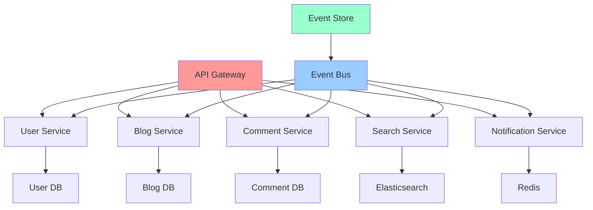

# Phase 3: Week 7-8 実践プロジェクト - ブログプラットフォーム完全実装

## 📅 学習期間・目標

**期間**: Week 7-8（2 週間）  
**総学習時間**: 40 時間（週 10 時間）

### 🎯 Week 7-8 到達目標

- [ ] 複雑なドメインモデリングの実践
- [ ] イベントソーシング・CQRS の完全実装
- [ ] マイクロサービス設計パターンの適用
- [ ] パフォーマンス最適化とスケーリング対応
- [ ] 統合テスト・E2E テストの実装
- [ ] 本格的なプロダクション品質システムの構築

## 📖 最終プロジェクト: ブログプラットフォーム

### 🎯 プロジェクト概要

**システム名**: TypeScript Blog Platform  
**アーキテクチャ**: Event-Driven Microservices with CQRS  
**技術スタック**: TypeScript, Node.js, PostgreSQL, Redis, Docker

### 📋 機能要件

#### 1. 記事管理機能

- 記事の作成・編集・公開・下書き保存
- マークダウン対応
- 画像アップロード・管理
- タグ・カテゴリ管理
- SEO 最適化（メタデータ管理）

#### 2. ユーザー管理機能

- 著者登録・認証・認可
- プロフィール管理
- ロール管理（管理者・編集者・著者・読者）
- フォロー・フォロワー機能

#### 3. コメント・インタラクション機能

- コメント投稿・返信
- いいね・ブックマーク
- 記事共有機能
- 通知システム

#### 4. 検索・発見機能

- 全文検索
- タグ・カテゴリ検索
- 人気記事・トレンド表示
- レコメンデーション

## 🏗️ システムアーキテクチャ設計

### マイクロサービス構成



### CQRS + Event Sourcing アーキテクチャ

```typescript
// Event Sourcing 基盤
interface DomainEvent {
  eventId: string;
  aggregateId: string;
  aggregateType: string;
  eventType: string;
  eventData: any;
  eventVersion: number;
  occurredAt: Date;
  causationId?: string;
  correlationId?: string;
}

interface EventStore {
  saveEvents(
    aggregateId: string,
    events: DomainEvent[],
    expectedVersion: number
  ): Promise<Result<void, EventStoreError>>;

  getEvents(
    aggregateId: string,
    fromVersion?: number
  ): Promise<Result<DomainEvent[], EventStoreError>>;

  getAllEvents(
    fromPosition?: number,
    maxCount?: number
  ): Promise<Result<DomainEvent[], EventStoreError>>;
}

// Event Store 実装
class PostgresEventStore implements EventStore {
  constructor(private db: DatabaseConnection) {}

  async saveEvents(
    aggregateId: string,
    events: DomainEvent[],
    expectedVersion: number
  ): Promise<Result<void, EventStoreError>> {
    try {
      await this.db.transaction(async (trx) => {
        // 楽観的ロック
        const currentVersion = await this.getCurrentVersion(aggregateId, trx);
        if (currentVersion !== expectedVersion) {
          throw new ConcurrencyError(
            `Expected version ${expectedVersion}, but current version is ${currentVersion}`
          );
        }

        // イベント保存
        for (const event of events) {
          await trx("events").insert({
            event_id: event.eventId,
            aggregate_id: event.aggregateId,
            aggregate_type: event.aggregateType,
            event_type: event.eventType,
            event_data: JSON.stringify(event.eventData),
            event_version: event.eventVersion,
            occurred_at: event.occurredAt,
            causation_id: event.causationId,
            correlation_id: event.correlationId,
          });
        }
      });

      return Result.ok(undefined);
    } catch (error) {
      return Result.err(
        new EventStoreError(`Failed to save events: ${error.message}`)
      );
    }
  }

  async getEvents(
    aggregateId: string,
    fromVersion: number = 0
  ): Promise<Result<DomainEvent[], EventStoreError>> {
    try {
      const rows = await this.db("events")
        .where("aggregate_id", aggregateId)
        .where("event_version", ">", fromVersion)
        .orderBy("event_version", "asc");

      const events = rows.map((row) => ({
        eventId: row.event_id,
        aggregateId: row.aggregate_id,
        aggregateType: row.aggregate_type,
        eventType: row.event_type,
        eventData: JSON.parse(row.event_data),
        eventVersion: row.event_version,
        occurredAt: row.occurred_at,
        causationId: row.causation_id,
        correlationId: row.correlation_id,
      }));

      return Result.ok(events);
    } catch (error) {
      return Result.err(
        new EventStoreError(`Failed to get events: ${error.message}`)
      );
    }
  }

  private async getCurrentVersion(
    aggregateId: string,
    trx: any
  ): Promise<number> {
    const result = await trx("events")
      .where("aggregate_id", aggregateId)
      .max("event_version as max_version")
      .first();

    return result?.max_version || 0;
  }
}
```

## 📝 ドメインモデル実装

### Blog Aggregate

````typescript
// Blog Post Events
interface BlogPostCreatedEvent extends DomainEvent {
  eventType: 'BlogPostCreated';
  eventData: {
    title: string;
    content: string;
    authorId: string;
    tags: string[];
    category: string;
  };
}

interface BlogPostPublishedEvent extends DomainEvent {
  eventType: 'BlogPostPublished';
  eventData: {
    publishedAt: Date;
    slug: string;
  };
}

interface BlogPostContentUpdatedEvent extends DomainEvent {
  eventType: 'BlogPostContentUpdated';
  eventData: {
    title: string;
    content: string;
    updatedAt: Date;
  };
}

// Blog Post Aggregate
class BlogPost extends EventSourcedAggregateRoot {
  private _id: BlogPostId;
  private _title: string;
  private _content: string;
  private _authorId: UserId;
  private _status: BlogPostStatus;
  private _tags: string[];
  private _category: string;
  private _slug?: string;
  private _publishedAt?: Date;
  private _createdAt: Date;
  private _updatedAt: Date;

  private constructor() {
    super();
  }

  static create(
    title: string,
    content: string,
    authorId: UserId,
    tags: string[],
    category: string
  ): Result<BlogPost, BlogPostError> {
    // バリデーション
    if (!title.trim()) {
      return Result.err(new BlogPostError('Title cannot be empty'));
    }
    if (!content.trim()) {
      return Result.err(new BlogPostError('Content cannot be empty'));
    }
    if (tags.length === 0) {
      return Result.err(new BlogPostError('At least one tag is required'));
    }

    const blogPost = new BlogPost();
    const event: BlogPostCreatedEvent = {
      eventId: crypto.randomUUID(),
      aggregateId: BlogPostId.generate().toString(),
      aggregateType: 'BlogPost',
      eventType: 'BlogPostCreated',
      eventData: {
        title,
        content,
        authorId: authorId.toString(),
        tags,
        category
      },
      eventVersion: 1,
      occurredAt: new Date()
    };

    blogPost.addEvent(event);
    return Result.ok(blogPost);
  }

  publish(): Result<void, BlogPostError> {
    if (this._status === BlogPostStatus.Published) {
      return Result.err(new BlogPostError('Blog post is already published'));
    }

    const slug = this.generateSlug(this._title);
    const event: BlogPostPublishedEvent = {
      eventId: crypto.randomUUID(),
      aggregateId: this._id.toString(),
      aggregateType: 'BlogPost',
      eventType: 'BlogPostPublished',
      eventData: {
        publishedAt: new Date(),
        slug
      },
      eventVersion: this.version + 1,
      occurredAt: new Date()
    };

    this.addEvent(event);
    return Result.ok(undefined);
  }

  updateContent(title: string, content: string): Result<void, BlogPostError> {
    if (this._status === BlogPostStatus.Published) {
      return Result.err(new BlogPostError('Cannot update published blog post'));
    }

    if (!title.trim() || !content.trim()) {
      return Result.err(new BlogPostError('Title and content cannot be empty'));
    }

### Comment Aggregate

```typescript
// Comment Events
interface CommentAddedEvent extends DomainEvent {
  eventType: 'CommentAdded';
  eventData: {
    blogPostId: string;
    authorId: string;
    content: string;
    parentCommentId?: string;
  };
}

interface CommentApprovedEvent extends DomainEvent {
  eventType: 'CommentApproved';
  eventData: {
    approvedBy: string;
    approvedAt: Date;
  };
}

// Comment Aggregate
class Comment extends EventSourcedAggregateRoot {
  private _id: CommentId;
  private _blogPostId: BlogPostId;
  private _authorId: UserId;
  private _content: string;
  private _status: CommentStatus;
  private _parentCommentId?: CommentId;
  private _createdAt: Date;
  private _approvedAt?: Date;
  private _approvedBy?: UserId;

  private constructor() {
    super();
  }

  static create(
    blogPostId: BlogPostId,
    authorId: UserId,
    content: string,
    parentCommentId?: CommentId
  ): Result<Comment, CommentError> {
    if (!content.trim()) {
      return Result.err(new CommentError('Comment content cannot be empty'));
    }
    if (content.length > 1000) {
      return Result.err(new CommentError('Comment content too long'));
    }

    const comment = new Comment();
    const event: CommentAddedEvent = {
      eventId: crypto.randomUUID(),
      aggregateId: CommentId.generate().toString(),
      aggregateType: 'Comment',
      eventType: 'CommentAdded',
      eventData: {
        blogPostId: blogPostId.toString(),
        authorId: authorId.toString(),
        content,
        parentCommentId: parentCommentId?.toString()
      },
      eventVersion: 1,
      occurredAt: new Date()
    };

    comment.addEvent(event);
    return Result.ok(comment);
  }

  approve(approvedBy: UserId): Result<void, CommentError> {
    if (this._status === CommentStatus.Approved) {
      return Result.err(new CommentError('Comment is already approved'));
    }

    const event: CommentApprovedEvent = {
      eventId: crypto.randomUUID(),
      aggregateId: this._id.toString(),
      aggregateType: 'Comment',
      eventType: 'CommentApproved',
      eventData: {
        approvedBy: approvedBy.toString(),
        approvedAt: new Date()
      },
      eventVersion: this.version + 1,
      occurredAt: new Date()
    };

    this.addEvent(event);
    return Result.ok(undefined);
  }

  apply(event: DomainEvent): void {
    switch (event.eventType) {
      case 'CommentAdded':
        this.applyCommentAdded(event as CommentAddedEvent);
        break;
      case 'CommentApproved':
        this.applyCommentApproved(event as CommentApprovedEvent);
        break;
    }
    this.version = event.eventVersion;
  }

  private applyCommentAdded(event: CommentAddedEvent): void {
    this._id = CommentId.create(event.aggregateId);
    this._blogPostId = BlogPostId.create(event.eventData.blogPostId);
    this._authorId = UserId.create(event.eventData.authorId);
    this._content = event.eventData.content;
    this._status = CommentStatus.Pending;
    this._parentCommentId = event.eventData.parentCommentId
      ? CommentId.create(event.eventData.parentCommentId)
      : undefined;
    this._createdAt = event.occurredAt;
  }

  private applyCommentApproved(event: CommentApprovedEvent): void {
    this._status = CommentStatus.Approved;
    this._approvedBy = UserId.create(event.eventData.approvedBy);
    this._approvedAt = event.eventData.approvedAt;
  }

  // Getters
  get id(): CommentId { return this._id; }
  get blogPostId(): BlogPostId { return this._blogPostId; }
  get authorId(): UserId { return this._authorId; }
  get content(): string { return this._content; }
  get status(): CommentStatus { return this._status; }
  get parentCommentId(): CommentId | undefined { return this._parentCommentId; }
  get createdAt(): Date { return this._createdAt; }
  get approvedAt(): Date | undefined { return this._approvedAt; }
  get approvedBy(): UserId | undefined { return this._approvedBy; }
}

enum CommentStatus {
  Pending = 'pending',
  Approved = 'approved',
  Rejected = 'rejected'
}

class CommentError extends Error {
  constructor(message: string) {
    super(message);
    this.name = 'CommentError';
  }
}
````

## 🔄 CQRS 実装

### Command Side

```typescript
// Commands
interface CreateBlogPostCommand {
  commandId: string;
  title: string;
  content: string;
  authorId: string;
  tags: string[];
  category: string;
}

interface PublishBlogPostCommand {
  commandId: string;
  blogPostId: string;
  publisherId: string;
}

// Command Handlers
class CreateBlogPostCommandHandler
  implements CommandHandler<CreateBlogPostCommand>
{
  constructor(
    private blogPostRepository: EventSourcedRepository<BlogPost>,
    private eventBus: EventBus,
    private logger: Logger
  ) {}

  async handle(
    command: CreateBlogPostCommand
  ): Promise<Result<void, CommandError>> {
    try {
      const authorId = UserId.create(command.authorId);

      const blogPostResult = BlogPost.create(
        command.title,
        command.content,
        authorId,
        command.tags,
        command.category
      );

      if (blogPostResult.isErr()) {
        return Result.err(new CommandError(blogPostResult.error.message));
      }

      const saveResult = await this.blogPostRepository.save(
        blogPostResult.value
      );
      if (saveResult.isErr()) {
        return Result.err(
          new CommandError(
            `Failed to save blog post: ${saveResult.error.message}`
          )
        );
      }

      // イベント発行
      const events = blogPostResult.value.getUncommittedEvents();
      for (const event of events) {
        await this.eventBus.publish(event);
      }

      this.logger.info("Blog post created successfully", {
        commandId: command.commandId,
        blogPostId: blogPostResult.value.id.toString(),
      });

      return Result.ok(undefined);
    } catch (error) {
      this.logger.error("Error handling CreateBlogPostCommand", error);
      return Result.err(new CommandError("An unexpected error occurred"));
    }
  }
}
```

### Query Side

```typescript
// Read Models (Projections)
interface BlogPostProjection {
  id: string;
  title: string;
  content: string;
  excerpt: string;
  authorId: string;
  authorName: string;
  authorAvatar: string;
  status: string;
  tags: string[];
  category: string;
  slug: string;
  publishedAt: Date | null;
  createdAt: Date;
  updatedAt: Date;
  commentCount: number;
  likeCount: number;
  viewCount: number;
}

// Queries
interface GetBlogPostQuery {
  queryId: string;
  blogPostId: string;
}

interface GetBlogPostsQuery {
  queryId: string;
  authorId?: string;
  category?: string;
  tags?: string[];
  status?: string;
  page: number;
  pageSize: number;
  sortBy: "createdAt" | "publishedAt" | "viewCount" | "likeCount";
  sortOrder: "asc" | "desc";
}

// Query Handlers
class GetBlogPostQueryHandler
  implements QueryHandler<GetBlogPostQuery, BlogPostProjection>
{
  constructor(
    private blogPostReadRepository: BlogPostReadRepository,
    private logger: Logger
  ) {}

  async handle(
    query: GetBlogPostQuery
  ): Promise<Result<BlogPostProjection, QueryError>> {
    try {
      const blogPost = await this.blogPostReadRepository.findById(
        query.blogPostId
      );

      if (!blogPost) {
        return Result.err(
          new QueryError(`Blog post not found: ${query.blogPostId}`)
        );
      }

      return Result.ok(blogPost);
    } catch (error) {
      this.logger.error("Error handling GetBlogPostQuery", error);
      return Result.err(new QueryError("An unexpected error occurred"));
    }
  }
}
```

## 🎯 実践演習

### 演習 7-1: イベントソーシング完全実装 🔥

**目標**: Event Sourcing + CQRS の完全な実装

```typescript
// 以下の要件を満たすイベントソーシングシステムを実装せよ

// 要件:
// 1. User Aggregate の Event Sourcing 実装
// 2. イベントストアの楽観的ロック
// 3. スナップショット機能
// 4. イベントリプレイ機能
// 5. プロジェクション更新の冪等性

// User Events
interface UserRegisteredEvent extends DomainEvent {
  eventType: "UserRegistered";
  eventData: {
    email: string;
    name: string;
    hashedPassword: string;
  };
}

interface UserProfileUpdatedEvent extends DomainEvent {
  eventType: "UserProfileUpdated";
  eventData: {
    name: string;
    bio: string;
    avatar: string;
  };
}

interface UserFollowedEvent extends DomainEvent {
  eventType: "UserFollowed";
  eventData: {
    followerId: string;
    followedId: string;
  };
}

// User Aggregate
class User extends EventSourcedAggregateRoot {
  private _id: UserId;
  private _email: Email;
  private _name: string;
  private _hashedPassword: string;
  private _bio: string;
  private _avatar: string;
  private _followers: Set<UserId>;
  private _following: Set<UserId>;
  private _createdAt: Date;
  private _updatedAt: Date;

  // 実装要件:
  // - 全てのイベントに対するapplyメソッド
  // - ビジネスルールの検証
  // - スナップショット作成・復元
  // - イベントリプレイ機能
}

// スナップショット機能
interface Snapshot {
  aggregateId: string;
  aggregateType: string;
  data: any;
  version: number;
  createdAt: Date;
}

interface SnapshotStore {
  saveSnapshot(snapshot: Snapshot): Promise<Result<void, SnapshotError>>;
  getSnapshot(
    aggregateId: string
  ): Promise<Result<Maybe<Snapshot>, SnapshotError>>;
}

// イベントリプレイ機能
class EventReplayService {
  constructor(
    private eventStore: EventStore,
    private snapshotStore: SnapshotStore
  ) {}

  async replayEvents<T extends EventSourcedAggregateRoot>(
    aggregateId: string,
    aggregateType: new () => T
  ): Promise<Result<T, ReplayError>> {
    // 実装要件:
    // 1. スナップショットから復元
    // 2. スナップショット以降のイベントを適用
    // 3. 現在の状態を再構築
  }
}
```

### 演習 7-2: マイクロサービス統合テスト 🔶

**目標**: マイクロサービス間の統合テスト実装

```typescript
// 以下の統合テストシナリオを実装せよ

// テストシナリオ:
// 1. ユーザー登録 → ブログ投稿作成 → コメント追加 → 通知送信
// 2. 複数サービス間のイベント連携テスト
// 3. 障害時の復旧テスト
// 4. パフォーマンステスト

describe("Blog Platform Integration Tests", () => {
  let testContainer: TestContainer;
  let userService: UserService;
  let blogService: BlogService;
  let commentService: CommentService;
  let notificationService: NotificationService;

  beforeEach(async () => {
    testContainer = await TestContainer.create();
    // サービス初期化
  });

  it("should handle complete blog workflow", async () => {
    // 1. ユーザー登録
    const userResult = await userService.registerUser({
      email: "test@example.com",
      name: "Test User",
      password: "password123",
    });
    expect(userResult.isOk()).toBe(true);

    // 2. ブログ投稿作成
    const blogPostResult = await blogService.createBlogPost({
      title: "Test Post",
      content: "Test content",
      authorId: userResult.value.id,
      tags: ["test"],
      category: "technology",
    });
    expect(blogPostResult.isOk()).toBe(true);

    // 3. ブログ投稿公開
    const publishResult = await blogService.publishBlogPost({
      blogPostId: blogPostResult.value.id,
      publisherId: userResult.value.id,
    });
    expect(publishResult.isOk()).toBe(true);

    // 4. コメント追加
    const commentResult = await commentService.addComment({
      blogPostId: blogPostResult.value.id,
      authorId: userResult.value.id,
      content: "Great post!",
    });
    expect(commentResult.isOk()).toBe(true);

    // 5. 通知確認
    await waitForEventProcessing();
    const notifications = await notificationService.getNotifications(
      userResult.value.id
    );
    expect(notifications.length).toBeGreaterThan(0);
  });

  it("should handle service failures gracefully", async () => {
    // 障害シミュレーション
    await testContainer.stopService("notification-service");

    // ブログ投稿は成功するが、通知は失敗する
    const result = await blogService.createBlogPost({
      title: "Test Post",
      content: "Test content",
      authorId: "user-123",
      tags: ["test"],
      category: "technology",
    });

    expect(result.isOk()).toBe(true);

    // サービス復旧後、通知が送信される
    await testContainer.startService("notification-service");
    await waitForEventProcessing();

    const notifications = await notificationService.getNotifications(
      "user-123"
    );
    expect(notifications.length).toBeGreaterThan(0);
  });
});
```

## 📊 Week 7-8 評価基準

### 理解度チェックリスト

#### イベントソーシング・CQRS (40%)

- [ ] イベントストアを適切に実装できる
- [ ] 楽観的ロックを理解し実装できる
- [ ] Command/Query 分離を実践できる
- [ ] プロジェクション更新を設計できる
- [ ] イベントリプレイ機能を実装できる

#### マイクロサービス設計 (30%)

- [ ] サービス境界を適切に設計できる
- [ ] サービス間通信を実装できる
- [ ] 障害耐性を考慮した設計ができる
- [ ] 分散トランザクションを理解している
- [ ] API Gateway パターンを実装できる

#### パフォーマンス・スケーラビリティ (20%)

- [ ] 読み書き分離による最適化を実装できる
- [ ] キャッシュ戦略を適切に設計できる
- [ ] 非同期処理を効果的に活用できる
- [ ] データベース最適化を実践できる

#### テスト・品質保証 (10%)

- [ ] 統合テストを包括的に実装できる
- [ ] E2E テストシナリオを設計できる
- [ ] パフォーマンステストを実装できる
- [ ] 障害テストを設計・実行できる

### 成果物チェックリスト

- [ ] **ブログプラットフォーム**: 完全動作するシステム
- [ ] **イベントソーシング実装**: Event Store + CQRS
- [ ] **マイクロサービス**: 5 つのサービス実装
- [ ] **統合テストスイート**: 包括的なテストカバレッジ
- [ ] **パフォーマンス最適化**: スケーラブルな実装
- [ ] **ドキュメンテーション**: アーキテクチャ・API 仕様

## 🔄 Phase3 完了への準備

### 最終成果物の統合

```typescript
// Phase3で習得したすべての技術の統合例

// 1. DDD + Value Object (Week 1-2)
const email = Email.create("user@example.com").getValue();
const money = Money.create(100, "USD").getValue();

// 2. Repository + Use Case (Week 3-4)
const createUserUseCase = new CreateUserUseCase(userRepository, domainService);
const result = await createUserUseCase.execute(request);

// 3. Clean Architecture + FP (Week 5-6)
const processedData = flow(
  validateInput,
  transformData,
  applyBusinessRules,
  saveToRepository
)(rawData);

// 4. Event Sourcing + CQRS (Week 7-8)
const blogPost = BlogPost.create(title, content, authorId, tags, category);
await eventStore.saveEvents(blogPost.id, blogPost.getUncommittedEvents(), 0);
```

### Phase4 への移行準備

- [ ] 開発体験向上ツールの調査
- [ ] TypeScript 5.x 新機能の学習
- [ ] パフォーマンス測定ツールの準備
- [ ] CI/CD パイプラインの最適化

---

**📌 重要**: Week 7-8 は Phase3 の集大成として、これまで学習したすべての技術を統合した実践的なシステムを構築します。単なる技術実装だけでなく、実際のプロダクション環境で求められる品質・パフォーマンス・保守性を意識した開発を行いましょう。
const event: BlogPostContentUpdatedEvent = {
eventId: crypto.randomUUID(),
aggregateId: this.\_id.toString(),
aggregateType: 'BlogPost',
eventType: 'BlogPostContentUpdated',
eventData: {
title,
content,
updatedAt: new Date()
},
eventVersion: this.version + 1,
occurredAt: new Date()
};

    this.addEvent(event);
    return Result.ok(undefined);

}

apply(event: DomainEvent): void {
switch (event.eventType) {
case 'BlogPostCreated':
this.applyBlogPostCreated(event as BlogPostCreatedEvent);
break;
case 'BlogPostPublished':
this.applyBlogPostPublished(event as BlogPostPublishedEvent);
break;
case 'BlogPostContentUpdated':
this.applyBlogPostContentUpdated(event as BlogPostContentUpdatedEvent);
break;
}
this.version = event.eventVersion;
}

private applyBlogPostCreated(event: BlogPostCreatedEvent): void {
this.\_id = BlogPostId.create(event.aggregateId);
this.\_title = event.eventData.title;
this.\_content = event.eventData.content;
this.\_authorId = UserId.create(event.eventData.authorId);
this.\_tags = event.eventData.tags;
this.\_category = event.eventData.category;
this.\_status = BlogPostStatus.Draft;
this.\_createdAt = event.occurredAt;
this.\_updatedAt = event.occurredAt;
}

private applyBlogPostPublished(event: BlogPostPublishedEvent): void {
this.\_status = BlogPostStatus.Published;
this.\_publishedAt = event.eventData.publishedAt;
this.\_slug = event.eventData.slug;
this.\_updatedAt = event.occurredAt;
}

private applyBlogPostContentUpdated(event: BlogPostContentUpdatedEvent): void {
this.\_title = event.eventData.title;
this.\_content = event.eventData.content;
this.\_updatedAt = event.eventData.updatedAt;
}

private generateSlug(title: string): string {
return title
.toLowerCase()
.replace(/[^a-z0-9\s-]/g, '')
.replace(/\s+/g, '-')
.replace(/-+/g, '-')
.trim('-');
}

// Getters
get id(): BlogPostId { return this.\_id; }
get title(): string { return this.\_title; }
get content(): string { return this.\_content; }
get authorId(): UserId { return this.\_authorId; }
get status(): BlogPostStatus { return this.\_status; }
get tags(): readonly string[] { return [...this._tags]; }
get category(): string { return this.\_category; }
get slug(): string | undefined { return this.\_slug; }
get publishedAt(): Date | undefined { return this.\_publishedAt; }
get createdAt(): Date { return this.\_createdAt; }
get updatedAt(): Date { return this.\_updatedAt; }
}

enum BlogPostStatus {
Draft = 'draft',
Published = 'published',
Archived = 'archived'
}

class BlogPostError extends Error {
constructor(message: string) {
super(message);
this.name = 'BlogPostError';
}
}
