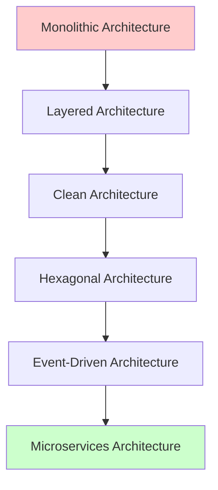

# Phase 3: 上級設計理論学習プラン - 高度なアーキテクチャパターンとTypeScript活用

## 🎯 上級理論学習の目的

### 📚 学習目標

Phase3の上級理論学習では、現代的なソフトウェアアーキテクチャの高度なパターンと、TypeScript 5.x の最新機能を活用した設計手法を習得します。

- **高度なアーキテクチャパターン**: Hexagonal、Event-Driven、Microservices
- **TypeScript 5.x 活用設計**: 最新機能を使った型安全な設計
- **分散システム設計**: スケーラビリティとレジリエンス
- **パフォーマンス指向設計**: 高性能システムの設計原則

### 🏗️ アーキテクチャ進化の理解



## 📋 高度なアーキテクチャパターン

### 🔷 Hexagonal Architecture (Ports and Adapters)

#### 理論的基礎

**ポートとアダプターによる完全な分離**

Hexagonal Architecture は、アプリケーションコアを外部の詳細から完全に分離します。

```typescript
// Port（インターフェース）の定義
interface Port<TInput, TOutput> {
  execute(input: TInput): Promise<TOutput>;
}

// Primary Port（駆動ポート）- アプリケーションが提供するサービス
interface OrderManagementPort extends Port<OrderCommand, OrderResult> {
  createOrder(command: CreateOrderCommand): Promise<Result<Order, OrderError>>;
  updateOrder(command: UpdateOrderCommand): Promise<Result<Order, OrderError>>;
  cancelOrder(command: CancelOrderCommand): Promise<Result<void, OrderError>>;
}

// Secondary Port（被駆動ポート）- アプリケーションが必要とするサービス
interface OrderRepositoryPort extends Port<OrderQuery, OrderData> {
  findById(id: OrderId): Promise<Option<Order>>;
  save(order: Order): Promise<Result<void, RepositoryError>>;
}

interface PaymentServicePort extends Port<PaymentRequest, PaymentResponse> {
  processPayment(request: PaymentRequest): Promise<Result<PaymentResponse, PaymentError>>;
}

// Application Core（六角形の中心）
class OrderManagementService implements OrderManagementPort {
  constructor(
    private orderRepository: OrderRepositoryPort,
    private paymentService: PaymentServicePort,
    private notificationService: NotificationServicePort,
    private logger: Logger
  ) {}

  async createOrder(command: CreateOrderCommand): Promise<Result<Order, OrderError>> {
    try {
      // 1. ドメインオブジェクト作成
      const orderResult = Order.create(
        command.customerId,
        command.items,
        command.shippingAddress
      );
      
      if (orderResult.isErr()) {
        return Result.err(orderResult.error);
      }

      const order = orderResult.value;

      // 2. 支払い処理（Secondary Port使用）
      const paymentResult = await this.paymentService.processPayment({
        amount: order.totalAmount,
        paymentMethod: command.paymentMethod,
        orderId: order.id
      });

      if (paymentResult.isErr()) {
        return Result.err(new OrderError(`Payment failed: ${paymentResult.error.message}`));
      }

      // 3. 注文保存（Secondary Port使用）
      const saveResult = await this.orderRepository.save(order);
      if (saveResult.isErr()) {
        return Result.err(new OrderError(`Failed to save order: ${saveResult.error.message}`));
      }

      return Result.ok(order);

    } catch (error) {
      this.logger.error('Unexpected error in createOrder', error);
      return Result.err(new OrderError('An unexpected error occurred'));
    }
  }
}
```

### 🌊 Event-Driven Architecture

#### イベント駆動システムの理論

**非同期メッセージングによる疎結合**

Event-Driven Architecture では、コンポーネント間の通信をイベントを通じて行います。

```typescript
// Event-Driven Architecture の基盤
interface DomainEvent {
  eventId: string;
  eventType: string;
  aggregateId: string;
  aggregateType: string;
  eventData: any;
  eventVersion: number;
  occurredAt: Date;
  correlationId?: string;
  causationId?: string;
}

// Event Bus インターフェース
interface EventBus {
  publish(event: DomainEvent): Promise<void>;
  subscribe<T extends DomainEvent>(
    eventType: string,
    handler: EventHandler<T>
  ): void;
  unsubscribe(eventType: string, handler: EventHandler<any>): void;
}

// Event Handler インターフェース
interface EventHandler<T extends DomainEvent> {
  handle(event: T): Promise<void>;
  canHandle(event: DomainEvent): boolean;
  getEventType(): string;
}

// 具体的なイベント定義
interface OrderCreatedEvent extends DomainEvent {
  eventType: 'OrderCreated';
  eventData: {
    orderId: string;
    customerId: string;
    totalAmount: number;
    currency: string;
    items: Array<{
      productId: string;
      quantity: number;
      unitPrice: number;
    }>;
  };
}

// Event Handler の実装例
class InventoryUpdateHandler implements EventHandler<OrderCreatedEvent> {
  constructor(
    private inventoryService: InventoryService,
    private logger: Logger
  ) {}

  getEventType(): string {
    return 'OrderCreated';
  }

  canHandle(event: DomainEvent): boolean {
    return event.eventType === this.getEventType();
  }

  async handle(event: OrderCreatedEvent): Promise<void> {
    try {
      this.logger.info('Processing inventory update for order', {
        orderId: event.eventData.orderId,
        eventId: event.eventId
      });

      // 在庫の減算処理
      for (const item of event.eventData.items) {
        await this.inventoryService.reserveStock(
          item.productId,
          item.quantity
        );
      }

      this.logger.info('Inventory updated successfully', {
        orderId: event.eventData.orderId
      });

    } catch (error) {
      this.logger.error('Failed to update inventory', {
        orderId: event.eventData.orderId,
        error: error.message
      });
      
      // 補償トランザクションの実行
      await this.handleInventoryUpdateFailure(event);
    }
  }

  private async handleInventoryUpdateFailure(event: OrderCreatedEvent): Promise<void> {
    // 在庫予約の失敗を通知するイベントを発行
    const inventoryUpdateFailedEvent: DomainEvent = {
      eventId: crypto.randomUUID(),
      eventType: 'InventoryUpdateFailed',
      aggregateId: event.eventData.orderId,
      aggregateType: 'Order',
      eventData: {
        orderId: event.eventData.orderId,
        reason: 'Insufficient stock',
        originalEventId: event.eventId
      },
      eventVersion: 1,
      occurredAt: new Date(),
      correlationId: event.correlationId,
      causationId: event.eventId
    };

    // イベントバスに失敗イベントを発行
    // これにより他のハンドラーが補償処理を実行できる
  }
}
```

## 📋 TypeScript 5.x 活用設計

### 🔧 最新機能を活用した型安全設計

#### Const Assertions と Template Literal Types

**コンパイル時の型安全性向上**

```typescript
// Const Assertions による厳密な型定義
const ORDER_STATUSES = ['pending', 'confirmed', 'shipped', 'delivered', 'cancelled'] as const;
type OrderStatus = typeof ORDER_STATUSES[number];

const EVENT_TYPES = {
  ORDER_CREATED: 'OrderCreated',
  ORDER_UPDATED: 'OrderUpdated',
  ORDER_CANCELLED: 'OrderCancelled',
  PAYMENT_PROCESSED: 'PaymentProcessed'
} as const;

type EventType = typeof EVENT_TYPES[keyof typeof EVENT_TYPES];

// Template Literal Types による動的型生成
type EventHandlerName<T extends string> = `handle${Capitalize<T>}Event`;
type EventValidatorName<T extends string> = `validate${Capitalize<T>}Event`;

// 使用例
type OrderCreatedHandlerName = EventHandlerName<'orderCreated'>; // "handleOrderCreatedEvent"
type PaymentProcessedValidatorName = EventValidatorName<'paymentProcessed'>; // "validatePaymentProcessedEvent"

// 条件型による高度な型操作
type ExtractEventData<T> = T extends { eventData: infer U } ? U : never;
type EventDataMap = {
  [K in EventType]: ExtractEventData<Extract<DomainEvent, { eventType: K }>>
};

// Mapped Types による型安全なイベントハンドラー
type EventHandlerMap = {
  [K in EventType]: (event: Extract<DomainEvent, { eventType: K }>) => Promise<void>
};

class TypeSafeEventBus {
  private handlers: Partial<EventHandlerMap> = {};

  // 型安全なハンドラー登録
  subscribe<T extends EventType>(
    eventType: T,
    handler: EventHandlerMap[T]
  ): void {
    this.handlers[eventType] = handler;
  }

  // 型安全なイベント発行
  async publish<T extends EventType>(
    event: Extract<DomainEvent, { eventType: T }>
  ): Promise<void> {
    const handler = this.handlers[event.eventType];
    if (handler) {
      await handler(event);
    }
  }
}
```

#### Branded Types と Satisfies Operator

**より厳密な型チェック**

```typescript
// Branded Types による型安全性の向上
type Brand<T, B> = T & { readonly __brand: B };

type UserId = Brand<string, 'UserId'>;
type ProductId = Brand<string, 'ProductId'>;
type OrderId = Brand<string, 'OrderId'>;

// ID生成関数
function createUserId(value: string): UserId {
  if (!value || value.length < 3) {
    throw new Error('Invalid user ID');
  }
  return value as UserId;
}

function createProductId(value: string): ProductId {
  if (!value || !value.startsWith('prod_')) {
    throw new Error('Invalid product ID format');
  }
  return value as ProductId;
}

// Satisfies Operator による型推論の改善
const API_ENDPOINTS = {
  users: '/api/users',
  products: '/api/products',
  orders: '/api/orders'
} satisfies Record<string, string>;

// 型推論が正確に働く
type EndpointKey = keyof typeof API_ENDPOINTS; // 'users' | 'products' | 'orders'
```

## 📋 分散システム設計理論

### 🌐 マイクロサービスアーキテクチャ

#### サービス分割の原則

**ビジネス能力による分割**

```typescript
// ドメイン境界に基づくサービス分割
interface ServiceBoundary {
  serviceName: string;
  businessCapability: string;
  dataOwnership: string[];
  apis: ServiceAPI[];
  events: DomainEvent[];
}

// User Service
const userServiceBoundary: ServiceBoundary = {
  serviceName: 'user-service',
  businessCapability: 'User Management',
  dataOwnership: ['users', 'user_profiles', 'user_preferences'],
  apis: [
    {
      endpoint: '/users',
      methods: ['GET', 'POST', 'PUT', 'DELETE'],
      description: 'User CRUD operations'
    }
  ],
  events: [
    { eventType: 'UserRegistered', description: 'User account created' },
    { eventType: 'UserProfileUpdated', description: 'User profile modified' }
  ]
};
```

## 📋 パフォーマンス指向設計

### ⚡ 高性能システムの設計原則

#### キャッシュ戦略

**多層キャッシュアーキテクチャ**

```typescript
// キャッシュ戦略の設計
interface CacheStrategy {
  level: 'L1' | 'L2' | 'L3';
  type: 'Memory' | 'Redis' | 'CDN';
  ttl: number;
  evictionPolicy: 'LRU' | 'LFU' | 'FIFO';
}

const cacheHierarchy: CacheStrategy[] = [
  {
    level: 'L1',
    type: 'Memory',
    ttl: 300, // 5分
    evictionPolicy: 'LRU'
  },
  {
    level: 'L2',
    type: 'Redis',
    ttl: 3600, // 1時間
    evictionPolicy: 'LRU'
  },
  {
    level: 'L3',
    type: 'CDN',
    ttl: 86400, // 24時間
    evictionPolicy: 'LFU'
  }
];
```

## 🎯 学習リソースと実践指針

### 📚 推奨学習リソース

#### 書籍
- Building Microservices (Sam Newman)
- Designing Data-Intensive Applications (Martin Kleppmann)
- TypeScript Deep Dive

#### 技術文献
- Hexagonal Architecture 論文
- Event Sourcing パターン
- CQRS 実装ガイド

#### 実践プロジェクト
- マイクロサービス実装
- イベント駆動システム構築
- 高性能API設計

### 🔄 継続学習のアプローチ

1. **理論学習**: 基礎概念の理解
2. **パターン実装**: 設計パターンの実践
3. **システム設計**: 実際のシステム構築
4. **パフォーマンス最適化**: 性能改善の実践

---

**📌 重要**: 上級設計理論は実践と密接に結びついています。理論で学んだ概念を実際のプロジェクトで適用し、継続的に改善していくことが重要です。
