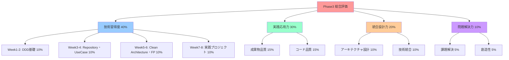

# Phase 3: 総合評価・統合プラン - TypeScript設計手法の習得完了評価

## 📊 Phase3 総合評価システム

### 🎯 評価の目的と構成

Phase3の総合評価は、TypeScript設計手法の習得度を多角的に評価し、実践的なスキルレベルを客観的に測定することを目的とします。

- **技術習得度評価**: 各週の学習内容の理解度測定
- **実践応用力評価**: 実際のプロジェクトでの適用能力
- **統合設計力評価**: 複数技術の組み合わせ能力
- **問題解決力評価**: 複雑な課題への対応力

### 📈 評価フレームワーク



## 📋 Week別詳細評価基準

### 🏗️ Week 1-2: DDD基礎・ValueObject (10%)

#### 理解度評価項目

**Value Object設計 (3%)**
- [ ] 不変性の実装 (1%)
- [ ] 等価性の正しい実装 (1%)
- [ ] ビジネスルールの適切な表現 (1%)

**Entity設計 (3%)**
- [ ] 同一性の適切な管理 (1%)
- [ ] ライフサイクルの理解 (1%)
- [ ] ビジネス不変条件の実装 (1%)

**Aggregate設計 (4%)**
- [ ] 一貫性境界の適切な設定 (1.5%)
- [ ] ドメインイベントの活用 (1.5%)
- [ ] ビジネスルールの集約 (1%)

#### 評価方法

```typescript
// 評価用実装例
interface Week12Evaluation {
  valueObjectScore: number; // 0-3
  entityScore: number; // 0-3
  aggregateScore: number; // 0-4
  totalScore: number; // 0-10
}

class Week12Evaluator {
  evaluate(submission: Week12Submission): Week12Evaluation {
    const valueObjectScore = this.evaluateValueObject(submission.valueObjects);
    const entityScore = this.evaluateEntity(submission.entities);
    const aggregateScore = this.evaluateAggregate(submission.aggregates);
    
    return {
      valueObjectScore,
      entityScore,
      aggregateScore,
      totalScore: valueObjectScore + entityScore + aggregateScore
    };
  }

  private evaluateValueObject(valueObjects: ValueObject[]): number {
    let score = 0;
    
    // 不変性チェック
    if (this.checkImmutability(valueObjects)) score += 1;
    
    // 等価性チェック
    if (this.checkEquality(valueObjects)) score += 1;
    
    // ビジネスルールチェック
    if (this.checkBusinessRules(valueObjects)) score += 1;
    
    return score;
  }

  private checkImmutability(valueObjects: ValueObject[]): boolean {
    return valueObjects.every(vo => {
      // readonly プロパティの確認
      // Object.freeze の使用確認
      // 変更メソッドの不存在確認
      return this.isImmutable(vo);
    });
  }

  private checkEquality(valueObjects: ValueObject[]): boolean {
    return valueObjects.every(vo => {
      // equals メソッドの実装確認
      // 構造的等価性の確認
      // hashCode の一貫性確認
      return this.hasCorrectEquality(vo);
    });
  }
}
```

### 🗄️ Week 3-4: Repository・UseCase (10%)

#### 理解度評価項目

**Repository パターン (4%)**
- [ ] インターフェース分離の実装 (1.5%)
- [ ] ドメイン中心設計の実践 (1.5%)
- [ ] 適切な抽象化レベル (1%)

**Use Case 設計 (4%)**
- [ ] 単一責任の原則遵守 (1.5%)
- [ ] 適切なエラーハンドリング (1.5%)
- [ ] トランザクション境界の管理 (1%)

**依存性注入 (2%)**
- [ ] 依存性逆転原則の実践 (1%)
- [ ] 適切なライフサイクル管理 (1%)

#### 評価基準

```typescript
interface Week34Evaluation {
  repositoryScore: number; // 0-4
  useCaseScore: number; // 0-4
  dependencyInjectionScore: number; // 0-2
  totalScore: number; // 0-10
}

class Week34Evaluator {
  evaluate(submission: Week34Submission): Week34Evaluation {
    const repositoryScore = this.evaluateRepository(submission.repositories);
    const useCaseScore = this.evaluateUseCase(submission.useCases);
    const diScore = this.evaluateDependencyInjection(submission.diContainer);
    
    return {
      repositoryScore,
      useCaseScore,
      dependencyInjectionScore: diScore,
      totalScore: repositoryScore + useCaseScore + diScore
    };
  }

  private evaluateRepository(repositories: Repository[]): number {
    let score = 0;
    
    // インターフェース分離
    if (this.checkInterfaceSegregation(repositories)) score += 1.5;
    
    // ドメイン中心設計
    if (this.checkDomainCentric(repositories)) score += 1.5;
    
    // 抽象化レベル
    if (this.checkAbstractionLevel(repositories)) score += 1;
    
    return score;
  }

  private evaluateUseCase(useCases: UseCase[]): number {
    let score = 0;
    
    // 単一責任原則
    if (this.checkSingleResponsibility(useCases)) score += 1.5;
    
    // エラーハンドリング
    if (this.checkErrorHandling(useCases)) score += 1.5;
    
    // トランザクション境界
    if (this.checkTransactionBoundary(useCases)) score += 1;
    
    return score;
  }
}
```

### 🏗️ Week 5-6: Clean Architecture・関数型プログラミング (10%)

#### 理解度評価項目

**Clean Architecture (5%)**
- [ ] 4層の適切な分離 (2%)
- [ ] 依存性の方向性 (1.5%)
- [ ] 境界の明確化 (1.5%)

**関数型プログラミング (5%)**
- [ ] Maybe/Either モナドの活用 (2%)
- [ ] 関数合成とパイプライン (1.5%)
- [ ] 不変性の実践 (1.5%)

#### 評価基準

```typescript
interface Week56Evaluation {
  cleanArchitectureScore: number; // 0-5
  functionalProgrammingScore: number; // 0-5
  totalScore: number; // 0-10
}

class Week56Evaluator {
  evaluate(submission: Week56Submission): Week56Evaluation {
    const caScore = this.evaluateCleanArchitecture(submission.architecture);
    const fpScore = this.evaluateFunctionalProgramming(submission.functionalCode);
    
    return {
      cleanArchitectureScore: caScore,
      functionalProgrammingScore: fpScore,
      totalScore: caScore + fpScore
    };
  }

  private evaluateCleanArchitecture(architecture: ArchitectureSubmission): number {
    let score = 0;
    
    // 4層分離
    if (this.checkLayerSeparation(architecture)) score += 2;
    
    // 依存性の方向性
    if (this.checkDependencyDirection(architecture)) score += 1.5;
    
    // 境界の明確化
    if (this.checkBoundaryClarity(architecture)) score += 1.5;
    
    return score;
  }

  private evaluateFunctionalProgramming(fpCode: FunctionalCodeSubmission): number {
    let score = 0;
    
    // モナドの活用
    if (this.checkMonadUsage(fpCode)) score += 2;
    
    // 関数合成
    if (this.checkFunctionComposition(fpCode)) score += 1.5;
    
    // 不変性
    if (this.checkImmutability(fpCode)) score += 1.5;
    
    return score;
  }
}
```

### 🚀 Week 7-8: 実践プロジェクト (10%)

#### 理解度評価項目

**イベントソーシング・CQRS (4%)**
- [ ] イベントストアの実装 (1.5%)
- [ ] Command/Query分離 (1.5%)
- [ ] プロジェクション更新 (1%)

**マイクロサービス設計 (3%)**
- [ ] サービス境界の設計 (1.5%)
- [ ] サービス間通信 (1.5%)

**統合テスト (3%)**
- [ ] E2Eテストの実装 (1.5%)
- [ ] パフォーマンステスト (1.5%)

#### 評価基準

```typescript
interface Week78Evaluation {
  eventSourcingScore: number; // 0-4
  microservicesScore: number; // 0-3
  integrationTestScore: number; // 0-3
  totalScore: number; // 0-10
}

class Week78Evaluator {
  evaluate(submission: Week78Submission): Week78Evaluation {
    const esScore = this.evaluateEventSourcing(submission.eventSourcing);
    const msScore = this.evaluateMicroservices(submission.microservices);
    const itScore = this.evaluateIntegrationTest(submission.tests);
    
    return {
      eventSourcingScore: esScore,
      microservicesScore: msScore,
      integrationTestScore: itScore,
      totalScore: esScore + msScore + itScore
    };
  }

  private evaluateEventSourcing(eventSourcing: EventSourcingSubmission): number {
    let score = 0;
    
    // イベントストア実装
    if (this.checkEventStore(eventSourcing)) score += 1.5;
    
    // CQRS実装
    if (this.checkCQRS(eventSourcing)) score += 1.5;
    
    // プロジェクション
    if (this.checkProjections(eventSourcing)) score += 1;
    
    return score;
  }
}
```

## 📊 実践応用力評価 (30%)

### 🎯 成果物品質評価 (15%)

#### 評価項目

**機能完成度 (5%)**
- [ ] 要求仕様の実装完了度
- [ ] 機能の正常動作確認
- [ ] エラーケースの適切な処理

**コード品質 (5%)**
- [ ] 可読性・保守性
- [ ] テストカバレッジ
- [ ] パフォーマンス

**ドキュメント品質 (5%)**
- [ ] API仕様書の完成度
- [ ] アーキテクチャ設計書
- [ ] 運用ガイド

#### 評価基準

```typescript
interface PracticalApplicationEvaluation {
  functionalityScore: number; // 0-5
  codeQualityScore: number; // 0-5
  documentationScore: number; // 0-5
  totalScore: number; // 0-15
}

class PracticalApplicationEvaluator {
  evaluate(submission: ProjectSubmission): PracticalApplicationEvaluation {
    const functionalityScore = this.evaluateFunctionality(submission);
    const codeQualityScore = this.evaluateCodeQuality(submission);
    const documentationScore = this.evaluateDocumentation(submission);
    
    return {
      functionalityScore,
      codeQualityScore,
      documentationScore,
      totalScore: functionalityScore + codeQualityScore + documentationScore
    };
  }

  private evaluateFunctionality(submission: ProjectSubmission): number {
    let score = 0;
    
    // 要求仕様実装完了度
    const completionRate = this.calculateCompletionRate(submission.features);
    score += Math.min(2, completionRate * 2);
    
    // 正常動作確認
    if (this.checkNormalOperation(submission)) score += 1.5;
    
    // エラーケース処理
    if (this.checkErrorHandling(submission)) score += 1.5;
    
    return score;
  }

  private evaluateCodeQuality(submission: ProjectSubmission): number {
    let score = 0;
    
    // 可読性・保守性
    const maintainabilityScore = this.calculateMaintainability(submission.codebase);
    score += Math.min(2, maintainabilityScore * 2);
    
    // テストカバレッジ
    const coverageScore = this.calculateTestCoverage(submission.tests);
    score += Math.min(1.5, coverageScore * 1.5);
    
    // パフォーマンス
    if (this.checkPerformance(submission)) score += 1.5;
    
    return score;
  }
}
```

### 🔧 コード品質評価 (15%)

#### 自動評価ツール

```typescript
class CodeQualityAnalyzer {
  async analyzeProject(projectPath: string): Promise<CodeQualityReport> {
    const eslintResults = await this.runESLint(projectPath);
    const prettierResults = await this.runPrettier(projectPath);
    const typeCheckResults = await this.runTypeCheck(projectPath);
    const testResults = await this.runTests(projectPath);
    const complexityResults = await this.analyzeComplexity(projectPath);
    
    return {
      linting: eslintResults,
      formatting: prettierResults,
      typeChecking: typeCheckResults,
      testing: testResults,
      complexity: complexityResults,
      overallScore: this.calculateOverallScore({
        eslintResults,
        prettierResults,
        typeCheckResults,
        testResults,
        complexityResults
      })
    };
  }

  private calculateOverallScore(results: QualityResults): number {
    const weights = {
      linting: 0.25,
      formatting: 0.15,
      typeChecking: 0.25,
      testing: 0.25,
      complexity: 0.10
    };

    return Object.entries(weights).reduce((total, [key, weight]) => {
      return total + (results[key].score * weight);
    }, 0);
  }
}
```

## 📊 統合設計力評価 (20%)

### 🏗️ アーキテクチャ設計評価 (10%)

#### 評価項目

**設計原則の適用 (4%)**
- [ ] SOLID原則の実践
- [ ] DRY原則の適用
- [ ] 適切な抽象化レベル

**パターンの活用 (3%)**
- [ ] 適切なデザインパターンの選択
- [ ] パターンの正しい実装
- [ ] パターン間の協調

**スケーラビリティ (3%)**
- [ ] 拡張性を考慮した設計
- [ ] パフォーマンス特性
- [ ] 運用性の考慮

### 🔄 技術統合評価 (10%)

#### 評価項目

**技術選択の妥当性 (4%)**
- [ ] 要件に適した技術選択
- [ ] 技術間の相性
- [ ] 将来性の考慮

**実装の一貫性 (3%)**
- [ ] 統一されたコーディングスタイル
- [ ] 一貫したエラーハンドリング
- [ ] 統合されたログ戦略

**保守性 (3%)**
- [ ] 変更容易性
- [ ] テスタビリティ
- [ ] デバッグ容易性

## 📊 問題解決力評価 (10%)

### 🎯 課題解決評価 (5%)

#### 評価項目

**問題分析力 (2%)**
- [ ] 問題の本質的理解
- [ ] 要因分析の深さ
- [ ] 解決策の妥当性

**実装力 (2%)**
- [ ] 効率的な実装アプローチ
- [ ] 制約条件への対応
- [ ] 品質の確保

**検証力 (1%)**
- [ ] 適切なテスト戦略
- [ ] 結果の検証方法
- [ ] 改善提案

### 💡 創造性評価 (5%)

#### 評価項目

**独創性 (2%)**
- [ ] 新しいアプローチの提案
- [ ] 既存手法の改良
- [ ] 創意工夫

**実用性 (2%)**
- [ ] 実際の問題解決への貢献
- [ ] 実装の現実性
- [ ] 効果の測定可能性

**発展性 (1%)**
- [ ] 他分野への応用可能性
- [ ] 拡張性
- [ ] 汎用性

## 🎯 最終評価・認定基準

### 📊 総合スコア計算

```typescript
interface Phase3FinalEvaluation {
  technicalMasteryScore: number; // 0-40
  practicalApplicationScore: number; // 0-30
  integratedDesignScore: number; // 0-20
  problemSolvingScore: number; // 0-10
  totalScore: number; // 0-100
  grade: 'A+' | 'A' | 'B+' | 'B' | 'C+' | 'C' | 'F';
  certification: boolean;
}

class Phase3FinalEvaluator {
  evaluate(
    week12: Week12Evaluation,
    week34: Week34Evaluation,
    week56: Week56Evaluation,
    week78: Week78Evaluation,
    practical: PracticalApplicationEvaluation,
    integrated: IntegratedDesignEvaluation,
    problemSolving: ProblemSolvingEvaluation
  ): Phase3FinalEvaluation {
    
    const technicalMasteryScore = 
      week12.totalScore + week34.totalScore + 
      week56.totalScore + week78.totalScore;
    
    const practicalApplicationScore = practical.totalScore;
    const integratedDesignScore = integrated.totalScore;
    const problemSolvingScore = problemSolving.totalScore;
    
    const totalScore = 
      technicalMasteryScore + practicalApplicationScore + 
      integratedDesignScore + problemSolvingScore;
    
    const grade = this.calculateGrade(totalScore);
    const certification = totalScore >= 85; // 85%以上で認定
    
    return {
      technicalMasteryScore,
      practicalApplicationScore,
      integratedDesignScore,
      problemSolvingScore,
      totalScore,
      grade,
      certification
    };
  }

  private calculateGrade(score: number): 'A+' | 'A' | 'B+' | 'B' | 'C+' | 'C' | 'F' {
    if (score >= 95) return 'A+';
    if (score >= 90) return 'A';
    if (score >= 85) return 'B+';
    if (score >= 80) return 'B';
    if (score >= 75) return 'C+';
    if (score >= 70) return 'C';
    return 'F';
  }
}
```

### 🏆 認定レベル

**TypeScript設計手法マスター認定**
- 総合スコア85%以上
- 全週で70%以上の達成
- 実践プロジェクトの完成

**認定特典**
- Phase4への進級資格
- TypeScript設計手法認定証
- 上級学習リソースへのアクセス

## 🔄 継続学習・改善計画

### 📈 弱点分野の特定と改善

```typescript
interface ImprovementPlan {
  weakAreas: string[];
  recommendedActions: RecommendedAction[];
  additionalResources: LearningResource[];
  timeframe: string;
}

class ImprovementPlanGenerator {
  generatePlan(evaluation: Phase3FinalEvaluation): ImprovementPlan {
    const weakAreas = this.identifyWeakAreas(evaluation);
    const recommendedActions = this.generateRecommendedActions(weakAreas);
    const additionalResources = this.selectAdditionalResources(weakAreas);
    
    return {
      weakAreas,
      recommendedActions,
      additionalResources,
      timeframe: this.calculateTimeframe(weakAreas.length)
    };
  }

  private identifyWeakAreas(evaluation: Phase3FinalEvaluation): string[] {
    const areas: string[] = [];
    
    if (evaluation.technicalMasteryScore < 32) { // 80%未満
      areas.push('Technical Mastery');
    }
    if (evaluation.practicalApplicationScore < 24) { // 80%未満
      areas.push('Practical Application');
    }
    if (evaluation.integratedDesignScore < 16) { // 80%未満
      areas.push('Integrated Design');
    }
    if (evaluation.problemSolvingScore < 8) { // 80%未満
      areas.push('Problem Solving');
    }
    
    return areas;
  }
}
```

### 🎯 Phase4移行準備

**移行条件**
- Phase3認定の取得
- 実践プロジェクトの完成
- ポートフォリオの整備

**Phase4予習内容**
- TypeScript×開発体験向上
- 最新ツールチェーンの調査
- パフォーマンス最適化手法

---

**📌 重要**: Phase3の総合評価は、単なる知識の確認ではなく、実践的なTypeScript設計手法の習得度を測定します。継続的な学習と実践を通じて、より高いレベルの技術者を目指しましょう。