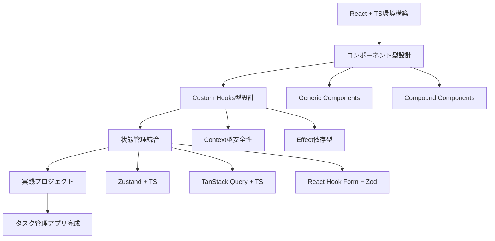
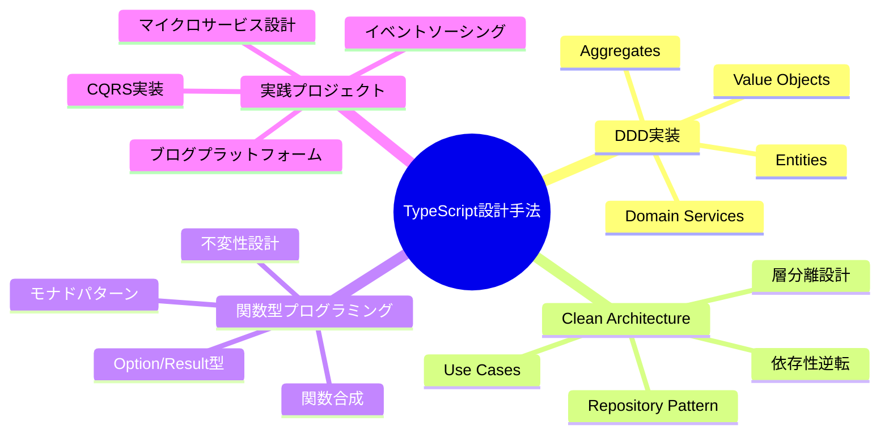
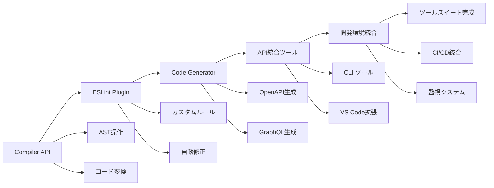
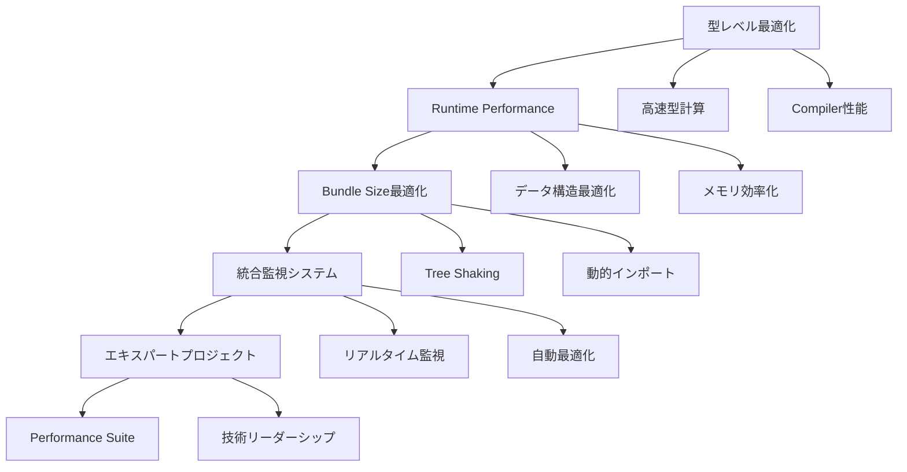
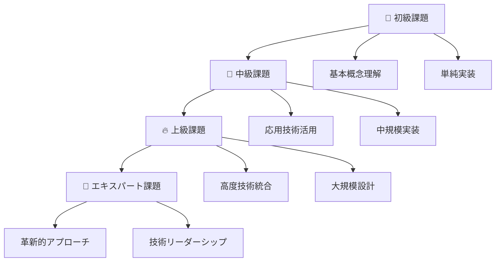

# 2025 年フロントエンドエンジニア育成プラン 統合実行ガイド

## 📋 プロジェクト概要

本プロジェクトは、JavaScript(ES6+) + jQuery + Slim PHP 経験者（2 年）、Angular + TypeScript 基礎経験者（3 ヶ月）を対象とした、**TypeScript Expert レベルのフロントエンドエンジニア**への 12 ヶ月育成プランです。

## 🎯 最終到達目標

### TypeScript Expert として

- 型レベルプログラミングの完全習得
- TypeScript Compiler API の実践活用
- 大規模アプリケーションの型安全設計
- パフォーマンス最適化の専門知識

### フロントエンド技術リーダーとして

- React 生態系の深い理解と実践
- アーキテクチャ設計のリーダーシップ
- 開発体験向上のツール開発
- 技術コミュニティへの貢献

## 📚 学習プラン構成

### 📁 作成済みドキュメント

```
planning/
├── 2025年フロントエンドエンジニア育成プラン_TypeScript重点版.md  # メイン計画
├── Phase1_TypeScript完全習得_詳細学習プラン.md                    # 1-3ヶ月
├── Phase2_TypeScript×React_詳細学習プラン.md                     # 2-4ヶ月
├── Phase3_TypeScript設計手法_詳細学習プラン.md                   # 3-5ヶ月
├── Phase4_TypeScript×開発体験_詳細学習プラン.md                  # 4-6ヶ月
├── Phase5_TypeScript×パフォーマンス_詳細学習プラン.md             # 5-7ヶ月
├── 学習課題・評価システム_統合版.md                              # 課題・評価
└── 統合学習プラン_実行ガイド.md                                  # 本ファイル
```

### 🗂️ 既存 TypeScript 資料の活用

```
typescript/
├── type errorの見方.md          # Phase1で重点活用
├── thisについて.md              # Phase1で深掘り学習
├── Enumのベストプラクティス.md   # Phase1で実践応用
└── type-errorの見方.ts         # 実践演習用
```

## 🚀 実行ロードマップ

### Phase 1: TypeScript 完全習得（1-3 ヶ月）

```mermaid
gantt
    title Phase 1 実行スケジュール
    dateFormat  X
    axisFormat %d週

    section 基礎固め
    型エラー完全理解         :1, 3
    thisキーワード詳細       :2, 4
    Enumベストプラクティス   :3, 5

    section 中級TypeScript
    ジェネリクス完全理解     :4, 6
    ユーティリティ型活用     :5, 7
    条件付き型・マップ型     :6, 8

    section 上級TypeScript
    テンプレートリテラル型   :7, 9
    型レベルプログラミング   :8, 10
    Compiler API            :9, 11

    section 実践応用
    ライブラリ型定義作成     :10, 12
    型パズル解決            :11, 12
```



**重要マイルストーン**:

- Week 4: ジェネリクス完全習得
- Week 8: 型レベルプログラミング実装
- Week 12: TypeScript Expert 基礎完成

### Phase 2: TypeScript × React（2-4 ヶ月）



**重要マイルストーン**:

- Week 2: Generic Components 実装
- Week 4: 状態管理統合完了
- Week 8: 実践プロジェクト完成

### Phase 3: TypeScript 設計手法（3-5 ヶ月）



**重要マイルストーン**:

- Week 2: DDD 基礎実装完了
- Week 4: Clean Architecture 適用
- Week 8: 実践プロジェクト完成

### Phase 4: TypeScript × 開発体験（4-6 ヶ月）



**重要マイルストーン**:

- Week 2: AST 操作基礎習得
- Week 4: ESLint プラグイン完成
- Week 6: API 生成ツール完成
- Week 8: 統合ツールスイート完成

### Phase 5: TypeScript × パフォーマンス（5-7 ヶ月）



**重要マイルストーン**:

- Week 2: 型計算最適化完了
- Week 4: Runtime 最適化実装
- Week 6: Bundle 最適化システム
- Week 8: 統合パフォーマンススイート完成

## 📊 学習進捗管理

### 週次チェックリスト

```typescript
interface WeeklyProgress {
  // 学習進捗
  theoreticalLearning: {
    completed: string[];
    inProgress: string[];
    planned: string[];
  };

  // 実践演習
  practicalExercises: {
    completed: Exercise[];
    currentChallenge: Exercise | null;
    upcomingChallenges: Exercise[];
  };

  // プロジェクト進捗
  projectMilestones: {
    achieved: Milestone[];
    current: Milestone | null;
    upcoming: Milestone[];
  };

  // 自己評価
  selfAssessment: {
    understanding: 1 | 2 | 3 | 4 | 5;
    confidence: 1 | 2 | 3 | 4 | 5;
    practicalApplication: 1 | 2 | 3 | 4 | 5;
  };

  // 次週目標
  nextWeekObjectives: string[];
}
```

### 月次レビュー項目

- **技術スキル評価**: 各 Phase の習得度確認
- **プロジェクト成果物**: 品質と完成度の評価
- **学習効率分析**: 時間配分と学習方法の最適化
- **目標調整**: 進捗に応じた計画の微調整

## 🎯 課題・評価システム

### 段階別課題構成



### 評価基準

| 項目             | 重み | 評価観点                                         |
| ---------------- | ---- | ------------------------------------------------ |
| **技術的正確性** | 30%  | コードの正確性、型安全性、ベストプラクティス準拠 |
| **設計品質**     | 25%  | アーキテクチャ、保守性、拡張性、テスタビリティ   |
| **実装効率**     | 20%  | パフォーマンス、最適化、リソース効率             |
| **完成度**       | 15%  | 要件充足、テスト網羅、ドキュメント品質           |
| **創造性**       | 10%  | 独創的解決策、技術革新、応用力                   |

## 🏆 成果物・ポートフォリオ

### Phase 別主要成果物

#### Phase 1: TypeScript 基礎

- [ ] 型エラー解決パターン集（20 パターン以上）
- [ ] TypeScript 設定ベストプラクティス集
- [ ] 型パズル 50 問完全解決
- [ ] ESLint カスタムルール 3 個以上
- [ ] TypeScript 変換ツール

#### Phase 2: React 統合

- [ ] 型安全 React コンポーネントライブラリ（20 コンポーネント）
- [ ] カスタム Hooks 集（15 個以上）
- [ ] 状態管理パターン実装集
- [ ] フォームバリデーション型安全システム
- [ ] タスク管理アプリ（実践プロジェクト）

#### Phase 3: 設計手法

- [ ] DDD + TypeScript 実装例（3 ドメイン以上）
- [ ] Clean Architecture テンプレート
- [ ] 関数型プログラミングライブラリ
- [ ] 型安全エラーハンドリングシステム
- [ ] ブログプラットフォーム（実践プロジェクト）

#### Phase 4: 開発体験

- [ ] TypeScript ESLint プラグイン（5 ルール以上）
- [ ] TypeScript Transformer（3 種類以上）
- [ ] API クライアント自動生成ツール
- [ ] コードジェネレータツール
- [ ] 統合開発ツールスイート

#### Phase 5: パフォーマンス

- [ ] 高性能型計算ライブラリ
- [ ] TypeScript performance benchmark ツール
- [ ] Bundle size analyzer
- [ ] 大規模プロジェクト向け型最適化ガイド
- [ ] 統合パフォーマンススイート

### 最終ポートフォリオ要件

1. **技術ブログサイト** (TypeScript + React)
2. **開発者向けツールスイート** (npm 公開)
3. **オープンソースライブラリ** (GitHub Star 100 以上)
4. **技術記事・発表** (20 本以上 + カンファレンス発表)

## 🔄 継続学習・キャッチアップ

### 2025 年以降のトレンド対応

- **WebAssembly + TypeScript 統合**
- **Edge Computing integration**
- **AI/ML + TypeScript** (TensorFlow.js、Vercel AI SDK)
- **Web3 + TypeScript** (ethers.js、wagmi)

### コミュニティ参画

- **TypeScript Community**参加
- **React Community**貢献
- **技術カンファレンス**発表（年 2 回以上）
- **OSS Maintainer**を目指す

## 📈 成功指標・KPI

### 技術的成長指標

- **TypeScript Expert 認定**: 全 Phase 課題 80%以上完了
- **GitHub 貢献度**: 年間コミット 500 以上
- **技術記事執筆**: 月 2 本以上
- **OSS 貢献**: 月 1PR 以上

### キャリア成長指標

- **技術リーダーシップ**: チーム内 TypeScript 技術指導
- **外部評価**: カンファレンス採択、技術記事バズ
- **ネットワーク構築**: 技術コミュニティでの認知度向上
- **市場価値**: フロントエンド技術リーダーとしての評価

## 🛠️ 実行支援ツール

### 学習管理ツール

- **進捗トラッキング**: GitHub Projects + Issues
- **時間管理**: VS Code 拡張による学習時間測定
- **知識管理**: Obsidian/Notion による学習ノート
- **コード管理**: GitHub リポジトリでの成果物管理

### 開発環境

- **エディタ**: VS Code + TypeScript 拡張
- **実行環境**: Node.js + TypeScript
- **テスト**: Vitest + Testing Library
- **ビルド**: Vite + TypeScript
- **CI/CD**: GitHub Actions

### コミュニティ・メンタリング

- **技術相談**: TypeScript Discord/Slack
- **コードレビュー**: GitHub PR レビュー
- **学習仲間**: 勉強会・もくもく会参加
- **メンター**: 経験豊富な TypeScript 開発者との定期面談

## 🎉 プラン実行開始

### 開始前準備チェックリスト

- [ ] 開発環境セットアップ完了
- [ ] GitHub リポジトリ作成
- [ ] 学習時間確保（週 20 時間以上）
- [ ] メンター・学習仲間の確保
- [ ] 目標設定と動機の明確化

### Phase 1 開始アクション

1. **Week 1 Day 1**: `typescript/type errorの見方.md` の完全理解
2. **Week 1 Day 3**: 最初の型エラー解決演習開始
3. **Week 1 Day 5**: 学習進捗の初回記録
4. **Week 1 Day 7**: 週次振り返りと次週計画

### 成功のための心構え

- **継続性**: 毎日の学習習慣化
- **実践重視**: 理論と実装のバランス
- **コミュニティ活用**: 積極的な情報共有と質問
- **アウトプット**: 学んだことの継続的発信
- **柔軟性**: 進捗に応じた計画調整

---

## 🌟 最終メッセージ

このプランは、単なる技術習得を超えて、**TypeScript エコシステム全体に価値を提供できる真のエキスパートエンジニア**への成長を目指しています。

12 ヶ月後、あなたは：

- TypeScript の深い理解と実践力を持つ
- React 生態系での技術リーダーシップを発揮する
- 開発体験向上に貢献するツールを作成する
- パフォーマンス最適化の専門知識を活用する
- 技術コミュニティで認知される存在になる

**今日から始めて、TypeScript Expert への道のりを歩み始めましょう！**

---

_このプランは 2025 年のフロントエンド技術トレンドと市場ニーズを反映して設計されています。継続的な更新と改善により、常に最新の技術動向に対応していきます。_
